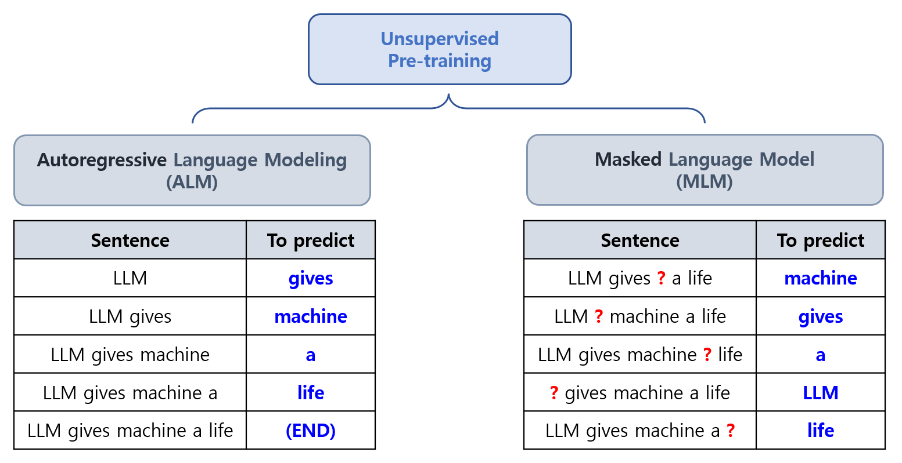
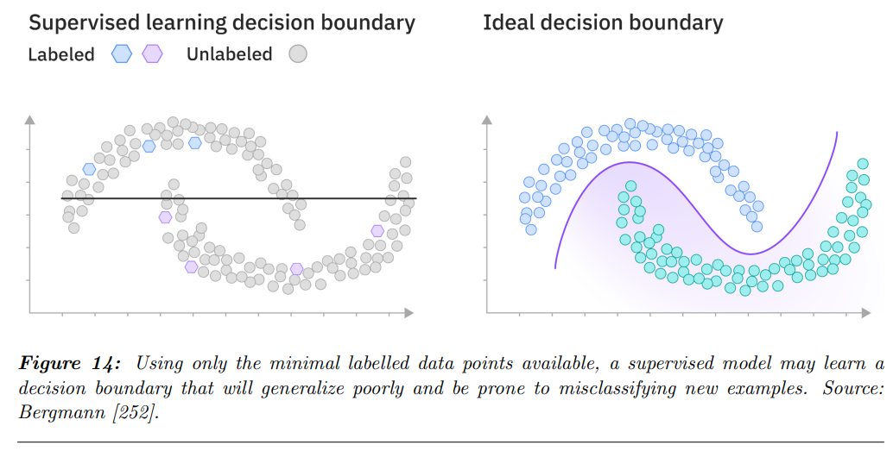
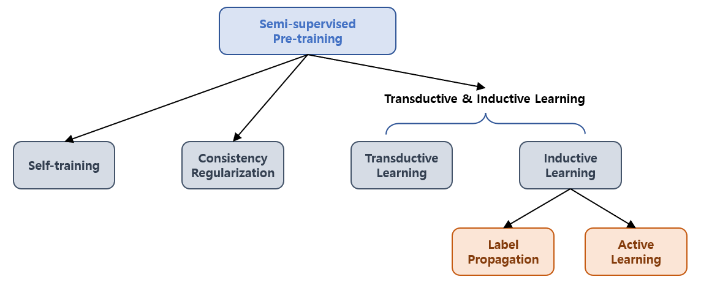
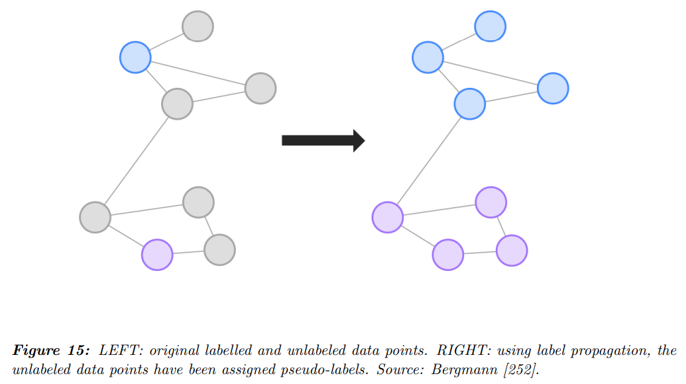

## 목차

* [1. (Part 3.1.) Pre-training](#1-part-31-pre-training)
  * [1-1. Unsupervised pre-training](#1-1-unsupervised-pre-training)
  * [1-2. Supervised pre-training](#1-2-supervised-pre-training)
  * [1-3. Semi-supervised pre-training](#1-3-semi-supervised-pre-training)
* [2. (Part 3.3.) Data preprocessing](#2-part-33-data-preprocessing)
  * [2-1. Quality Filtering](#2-1-quality-filtering)
  * [2-2. Deduplication](#2-2-deduplication)
  * [2-3. Privacy reduction](#2-3-privacy-reduction)
  * [2-4. Tokenization](#2-4-tokenization)

## 논문 소개

* Andrea Matarazzo and Riccardo Torlone, "A Survey on Large Language Models with some Insights on their Capabilities and Limitations", 2025
* [arXiv Link](https://arxiv.org/pdf/2501.04040)
* 이 문서에서 다룰 파트
  * "3. Foundations of Large Language Models" 중, 
    * 3.1. Pre-Training
    * 3.3. Data preprocessing

## 1. (Part 3.1.) Pre-training

여기서는 **LLM 개발의 핵심이 되는 기술들** 중 **[Pre-training](../../AI%20Basics/Deep%20Learning%20Basics/딥러닝_기초_Transfer_Learning.md#3-1-사전-학습-pre-training)** 에 대해 소개한다. LLM 의 Pre-training 은 다음과 같은 효과가 있다.

* 모델이 각 단어 간의 관계를 파악할 수 있게 한다.
* 모델이 자연스러운 문장을 생성할 수 있게 한다.
* 아주 넓은 범위에 대해 적용할 수 있는, 방대한 기본 지식을 학습하게 한다.

LLM 의 Pre-training 은 일반적으로 다음과 같이 진행된다.

* 아주 많은 양의 다양한 분야의 텍스트를 학습
* 환경적 제약이 문제가 될 정도로 연산량과 메모리를 많이 사용함
  * 이를 극복하기 위해 [Quantization (양자화)](../../AI%20Basics/LLM%20Basics/LLM_기초_Quantization.md) 와 같은 기술이 많이 사용됨 

LLM 의 Pre-training 은 다음과 같이 3가지로 구분된다.

| 구분                           | 설명                                                                                                       |
|------------------------------|----------------------------------------------------------------------------------------------------------|
| Unsupervised pre-training    | 비지도학습 방식의 LLM Pre-training - 일반적으로, **문장에서 다음 단어 또는 특정 위치의 단어를 예측** 하도록 학습하는 방식                       |
| Supervised pre-training      | 지도학습 방식의 LLM Pre-training - 학습 데이터에 **Label 또는 Annotation** 을 추가하여, 이를 바탕으로 한 지도학습                    |
| Semi-supervised pre-training | Semi-supervised Learning 방식의 LLM Pre-training - Supervised + Unsupervised Pre-Training 방법의 **장점을 결합** |

### 1-1. Unsupervised pre-training

Unsupervised Pre-Traning 은 **비지도학습 방식으로 LLM을 Pre-training 시키는 것** 을 말한다. 그 방법은 다음과 같다.

| 방법론                                        | 설명                                                           | 실제 모델                                                                                                                   |
|--------------------------------------------|--------------------------------------------------------------|-------------------------------------------------------------------------------------------------------------------------|
| **Autoregressive** Language Modeling (ALM) | 문장에서 이전 단어 (지금까지의 단어들) 가 주어졌을 때 다음 단어를 예측하는 방식의 학습           | [GPT](../../Natural%20Language%20Processing/Basics_트랜스포머%20모델.md#5-gpt-generative-pre-trained-transformer) 계열 (GPT-3 등) |
| **Masked** Language Modeling (MLM)         | 문장에서 **랜덤한 위치의 단어** 만 가려지고, 그 외의 단어를 이용하여 해당 단어를 예측하는 방식의 학습 | [BERT](../../Natural%20Language%20Processing/Basics_BERT,%20SBERT%20모델.md) 계열                                           |

**1. Autoregressive Language Modeling (ALM)**

이 방법은 **문장의 처음 단어들이 주어졌을 때, 그 다음 단어를 예측** 하는 식의 학습 방법이다.

* 이때 **다음 단어 (token) 에 대한 확률분포** 를 이용한다.
* 이때 다음 단어만을 예측하므로, 이것을 **단방향 (uni-directional)** 학습이라고 한다.

Decoding (Next token generation) 과정은 다음과 같다.

* 확률분포에 기반하여 token 을 샘플링
* 해당 token 을 기존 문장의 맨 끝에 추가
* 새로운 token 이 추가된 문장을 기준으로, 해당 문장에 대해서 위 과정을 반복

이 방법의 가장 크리티컬한 한계점은 **예측 단어보다 뒤에 오는 단어에 대한 정보를 사용할 수 없어서, 관련된 맥락 정보를 활용할 수 없다** 는 것이다.

**2. Masked Language Modeling (ALM)**

이 방법은 **문장에서 랜덤한 지점의 단어를 masking 처리하고, 그 단어를 예측** 하는 식의 학습 방법이다.

* 이를 통해 Autoregressive Language Modeling 의 가장 큰 한계인 **예측 단어의 뒤에 오는 단어의 맥락 정보를 활용할 수 없다** 는 것을 해결한다.
* 즉, 이전 단어 및 다음 단어의 맥락 정보를 모두 활용하여 예측하므로, **양방향 (bi-directional)** 이라고 할 수 있다.

### 1-2. Supervised pre-training

이 방법은 LLM 을 거대한 텍스트 데이터셋을 이용하여 Pre-training 할 때 **Label 또는 Annotation이 있는 지도 학습** 으로 Pre-training 시키는 것이다.

* Label 이 없는 Unsupervised Pre-training 과 달리, Label 을 이용하여 **원하는 task 에 LLM을 더 최적화할 수 있도록 Pre-training** 할 수 있다.
* 이를 통해 LLM 의 성능 및 효율성을 끌어올릴 수 있다.

**1. Supervised Pre-training 의 학습 방법**

* 지도학습을 통해 **주어진 텍스트 입력에 대해 알맞은 output** 이 나오도록 학습한다.
* 이를 통해 LLM 에게 다음을 학습시킨다.
  * 일반적인 언어 표현 방식
  * 특정 domain 에 대한 지식

**2. Supervised Pre-training 의 장점**

* **Pre-training 에 사용된 데이터와 유사한 domain 의 데이터를 이용하여 Fine-Tuning** 시킬 때 효과를 볼 수 있다.
* 특히, **특정 task 에 사용하기 위해 LLM 을 Fine-Tuning 하는 데 필요한 학습 데이터의 양을 크게 줄일** 수 있다.
* 또한, **LLM 의 일반화 성능** (원래 학습 범위를 벗어난 unseen data 의 처리 능력 등) 을 올릴 수도 있다.

**3. Supervised Pre-training 에서의 [Overfitting](../../AI%20Basics/Deep%20Learning%20Basics/딥러닝_기초_Overfitting_Dropout.md#2-딥러닝에서의-오버피팅-overfitting)**

다른 머신러닝/딥러닝 모델과 마찬가지로, LLM Supervised Pre-training 에서 역시 **학습 시 Overfitting 에 주의** 해야 한다.

[(출처)](https://arxiv.org/pdf/2501.04040) : Andrea Matarazzo and Riccardo Torlone, "A Survey on Large Language Models with some Insights on their Capabilities and Limitations"

위 그림이 설명하는 바는 다음과 같다.

* 소수의 데이터만을 이용하여 Supervised Pre-training 된 모델은 **새로운 데이터를 mis-classify** 할 위험이 있다.
* 즉, LLM 의 **Decision Boundary 가 의도한 바와 다르게** 만들어질 수 있다.

### 1-3. Semi-supervised pre-training

Semi-supervised Pre-training 은 **Supervised + Unsupervised Pre-Training 방법의 장점을 결합** 한 것이다. 그 특징은 다음과 같다.

* 라벨링된 데이터와 그렇지 않은 데이터를 모두 사용
* 각 데이터의 역할은 다음과 같음

| 데이터                        | 사용 단계                                                                     | 역할                                          |
|----------------------------|---------------------------------------------------------------------------|---------------------------------------------|
| Labeled Data (지도학습과 유사)    | [LLM 의 Fine-Tuning](../../AI%20Basics/LLM%20Basics/LLM_기초_Fine_Tuning.md) | **특정 task 에 최적화된 지식** 을 Fine-Tuning 을 통해 학습 |
| Unlabeled Data (비지도학습과 유사) | LLM 의 초기 학습                                                               | LLM 이 **언어의 전반적인 구조, 패턴** 등을 학습하게 함         |

**1. Semi-supervised Pre-training 에서 사용되는 기술**

다음과 같이 다양한 기술들이 사용된다.

| 기술                                | 설명                                                                                  |
|-----------------------------------|-------------------------------------------------------------------------------------|
| Self-training                     | - Labeled Data 로 학습된 LLM 을 이용하여 Unlabeled Data 에 대해 라벨 생성 - 이 생성된 라벨들은 이후 학습에 활용 |
| Consistency Regularization        | - 모델이 특정 input data에 대해, **변형된 데이터에 대해서도 유사한 output 을 생성** 하도록 학습                   |
| Transductive & inductive learning | - Label propagation, Active Learning 등의 기술 사용                                       |

**2. Transductive & Inductive Learning**

| 기술                    | 설명                                                                                                                                                                                                                                 |
|-----------------------|------------------------------------------------------------------------------------------------------------------------------------------------------------------------------------------------------------------------------------|
| Transductive Learning | 학습 데이터셋의 **특정 sample 들에 대해서만 그 출력을 예측** 하는 컨셉 - 새로운 데이터셋에 적용 가능한 일반적인 패턴보다는 **특정 sample 들에만 집중** 하는 것이 핵심 아이디어 - [SVM (Support Vector Machine)](../../AI%20Basics/Machine%20Learning%20Models/머신러닝_모델_SVM.md) 이 그 대표적인 응용 사례 |
| Inductive Learning    | **새로운 데이터셋에 적용 가능한 일반적인 패턴** 을 학습하는, **일반화가 잘 된 모델** 을 학습하는 컨셉 - Label Propagation - Active Learning                                                                                                                         |

* Inductive Learning 의 세부 기술

| Inductive Learning 기술 | 설명                                                                                                                                                                                                     |
|-----------------------|--------------------------------------------------------------------------------------------------------------------------------------------------------------------------------------------------------|
| Label Propagation     | 모델이 Unlabeled Data 에 대해 **이웃한 data point 의 label** 을 이용하여 그 label 을 예측 - [kNN (k-Nearest Neighbors)](../../AI%20Basics/Machine%20Learning%20Models/머신러닝_모델_KNN.md) 과 유사하지만, 이를 **Graph 에 적용** 하는 컨셉 |
| Active Learning       | **최소한의 Labeled Data** 를 이용하여, **가장 정보력이 높은 데이터를 선택하여 라벨링하는 것을 반복** 하는 방법 - 정보력은, 정보력이 높은 데이터일수록 **모델 성능 향상에 도움이 됨** 을 의미 - 이를 통해 최소한의 라벨링된 데이터만으로 모델 성능 최적화                                      |

[(출처)](https://arxiv.org/pdf/2501.04040) : Andrea Matarazzo and Riccardo Torlone, "A Survey on Large Language Models with some Insights on their Capabilities and Limitations"

위 그림은 **Label Propagation** 의 개념을 나타낸 것이다.

**3. Semi-Supervised Learning 에서 사용되는 가정들**

Semi-Supervised Learning 에서는 다음과 같은 기본 가정들이 사용된다.

| 가정                                 | 설명                                                                                                           |
|------------------------------------|--------------------------------------------------------------------------------------------------------------|
| Cluster Assumption                 | 같은 Cluster 에 있는 데이터는 같은 Label 을 갖는다.                                                                         |
| Continuity (Smoothness) Assumption | 서로 가까이 있는 2개의 data point 에 대해, 그 output 역시 유사하다.                                                             |
| Manifold Assumption                | 고차원으로 Embedding 된 데이터는 **저차원의 Manifold 로 변환할** 수 있다. - 즉, **데이터를 저차원으로 mapping 하여 학습에 사용되는 자원을 줄일** 수 있다. |
| Low-Density Separation Assumption  | 각 Label (Class) 간의 경계에서는 data point 의 밀도가 낮다.                                                                |

## 2. (Part 3.3.) Data preprocessing

### 2-1. Quality Filtering

### 2-2. Deduplication

### 2-3. Privacy reduction

### 2-4. Tokenization