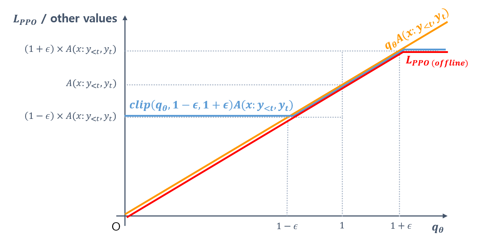
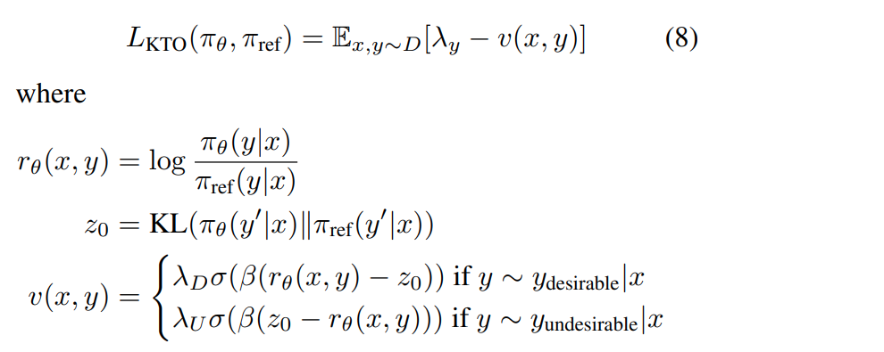
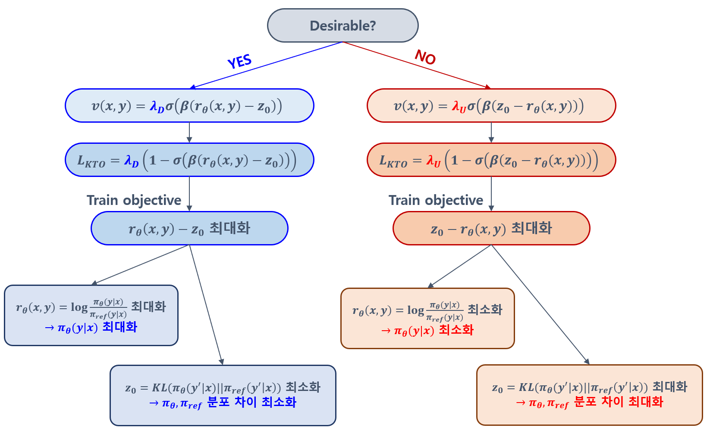

## 목차

* [1. 핵심 아이디어](#1-핵심-아이디어)
  * [1-1. Offline PPO](#1-1-offline-ppo)
* [2. Loss Function](#2-loss-function)
  * [2-1. 수식 및 그 구조](#2-1-수식-및-그-구조) 
  * [2-2. KL Estimate](#2-2-kl-estimate)
  * [2-3. Alignment Data 관련](#2-3-alignment-data-관련)
* [3. HALO 에 대한 연구](#3-halo-에-대한-연구)
  * [3-1. HALO 의 개념 및 설명](#3-1-halo-의-개념-및-설명)
  * [3-2. HALO 의 유용성](#3-2-halo-의-유용성)
* [4. 실험 설정 및 결과](#4-실험-설정-및-결과)
  * [4-1. 하이퍼파라미터 설정](#4-1-하이퍼파라미터-설정) 
  * [4-2. 실험 결과 (KTO > DPO)](#4-2-실험-결과-kto--dpo)
  * [4-3. 실험 결과에 대한 이유 분석](#4-3-실험-결과에-대한-이유-분석)

## 논문 소개

* Kawin Ethayarajh and Winnie Xu et al., "KTO: Model Alignment as Prospect Theoretic Optimization", 2024
* [arXiv Link](https://arxiv.org/pdf/2402.01306)

## 1. 핵심 아이디어

**Kahneman-Tversky Optimization (KTO)** 는 offline PPO 와 같이 **학습 데이터에서 LLM 의 답변에 대해 good / bad 의 binary signal** 을 주는 방법을 응용한 것이다.

* Offline PPO 의 방법으로 [DPO (Direct Preference Optimization)](../../AI%20Basics/LLM%20Basics/LLM_기초_Fine_Tuning_DPO_ORPO.md#2-dpo-direct-preference-optimization) 수준의 성능을 달성했다.

### 1-1. Offline PPO

**PPO (Proximal Policy Optimization)** 은 **강화학습 (Reinforcement Learning)** 방법론의 일종으로, **강화 학습 시 주어진 데이터를 이용하여 정책을 최대한 효율적으로 빠르게 개선** 하기 위한 방법 중 하나이다.

* 새로운 정책과 기존 정책에 따른 **action 실행의 확률 비율** 과, 해당 action 실행 시의 **추가적인 advantage** 를 이용한 Loss Function 을 이용하여 학습한다.

Offline PPO 의 [Loss Function](../../AI%20Basics/Deep%20Learning%20Basics/딥러닝_기초_Loss_function.md) 은 다음과 같다.

* 수식
  * $L_{PPO (offline)} = -E_{x,y,t \sim D}[min(q_\theta A(x:y_{<t},y_t)), clip(q_\theta, 1-\epsilon, 1+\epsilon) A(x:y_{<t},y_t)]$
* 수식 설명 (LLM 기준)

| notation                                                            | 설명                                                                                                                                                                    |
|---------------------------------------------------------------------|-----------------------------------------------------------------------------------------------------------------------------------------------------------------------|
| $q_\theta$                                                          | 새로운 정책과 기존 정책에 따른 action 실행 (특정 next token prediction) 의 확률 비율 - $\displaystyle q_\theta = \frac{\pi_\theta (y_t \vert x:y_{<t})}{\pi_{old} (y_t \vert x:y_{<t})}$ |
| $\pi_\theta (y_t \vert x:y_{<t})$, $\pi_{old} (y_t \vert x:y_{<t})$ | 각각 새로운 정책과 기존 정책에 따른 next token $y_t$ 에 대한 prediction 의 확률                                                                                                            |
| $x$                                                                 | LLM 학습 데이터의 입력 데이터                                                                                                                                                    |
| $y_{<t}$                                                            | LLM 학습 데이터의 출력 데이터의 직전 token 까지의 내용                                                                                                                                   |
| $A(x:y_{<t},y_t)$                                                   | token $y_t$ 를 next token 으로 예측함에 따른 Advantage                                                                                                                         |
| $\epsilon$                                                          | 새로운 정책의 이전 정책에 비한 발전 정도를 나타내는 small const.                                                                                                                            |

* Reward (LLM 기준)
  * +1 과 -1 의 **Binary Reward** 를 이용한다.

| 좋은 답변 | 나쁜 답변 |
|-------|-------|
| +1    | -1    |

## 2. Loss Function

KTO 의 Loss Function 의 핵심 아이디어는 다음과 같다.

* 사람이 심리적으로 느끼는 이익 및 손해의 값을 **이론적으로** 나타내는 **value function** 을 이용
  * 예를 들어, 1만 원을 잃은 것은 1만 원을 얻은 것에 비해 더 강하게 느껴지므로, **1만 원을 잃은 것의 value 는 약 -2 정도, 1만 원을 얻은 것의 value 는 약 +1 정도** 라고 할 수 있다. 
* 이 함수는 원래 지수함수 형태인데, 이때 학습이 불안정하기 때문에 지수함수 대신 **[로지스틱 함수 $\sigma$](../../AI%20Basics/Machine%20Learning%20Models/머신러닝_모델_Linear_Logistic_Regression.md#3-logistic-regression) 로 수정**

### 2-1. 수식 및 그 구조

KTO 의 Loss Function 의 수식은 다음과 같다.

* 수식
  * $L_{KTO}(\pi_\theta, \pi_{ref}) = E_{x,y \sim D}[\lambda_y - v(x, y)]$
  * LLM answer 가 **Desirable 한지의 여부** 에 따른 목표 value function 값과 실제 value function 값의 오차
* 수식 설명
  * $\pi_\theta$, $\pi_{ref}$ : 각각 학습 대상 모델 및 reference model
  * $v(x, y)$ : value function
  * $\lambda_y$ : $\lambda_y = \lambda_D$ (for **Desirable** LLM answer), $\lambda_y = \lambda_U$ (for **Undesirable** LLM answer)
  * $\lambda_D$ : Desirable LLM answer 에 대한 하이퍼파라미터 값
  * $\lambda_U$ : Undesirable LLM answer 에 대한 하이퍼파라미터 값

----

**1. Value Function $v(x, y)$ 에 대한 Deep Dive**

[(출처)](https://arxiv.org/pdf/2402.01306) : Kawin Ethayarajh and Winnie Xu et al., "KTO: Model Alignment as Prospect Theoretic Optimization"

* value function 값과 그 목표 값의 오차를 줄이기 위해, **Desirable, Undesirable 모두** 의 경우에서 **Logistic 함수의 값이 1에 가까워지도록 LLM을 학습** 시킨다.

|                            | **Desirable** LLM answer            | **Undesirable** LLM answer          |
|----------------------------|-------------------------------------|-------------------------------------|
| value function 값 $v(x, y)$ | $\lambda_D \times$ (Logistic 함수의 값) | $\lambda_U \times$ (Logistic 함수의 값) |
| value function 목표 값        | $\lambda_D$                         | $\lambda_U$                         |
| 학습 방법                      | Logistic 함수의 값이 1에 가까워지도록 학습        | Logistic 함수의 값이 1에 가까워지도록 학습        |

**2. Logistic 함수 값을 1에 가깝게 하는 학습의 의미**

* Logistic 함수의 값이 1에 가까워지도록 학습 **(= Logistic 함수 입력값을 최대화)** 한다는 것은 다음을 의미한다.

|                 | **Desirable** LLM answer                                                                 | **Undesirable** LLM answer                                                                |
|-----------------|------------------------------------------------------------------------------------------|-------------------------------------------------------------------------------------------|
| Logistic 함수 입력값 | $\beta (r_\theta(x, y) - z_0)$                                                           | $\beta (z_0 - r_\theta(x, y))$                                                            |
| 입력값의 의미         | - 학습할 LLM 이 $y$ 를 생성할 확률을 최대한 **높임** - 학습할 LLM 의 출력값 분포를 reference model 에 **가깝게** 학습 | - 학습할 LLM 이 $y$ 를 생성할 확률을 최대한 **낮춤** - 학습할 LLM 의 출력값 분포를 reference model 과 **멀어지게** 학습 |

* $r_\theta(x, y)$
  * 학습된 model 과 reference model 의 출력 $y$ 를 생성할 확률의 비율
* $z_0$
  * 학습된 model 과 reference model 의 입력 $x$ 에 대한 출력값 분포의 KL Divergence
    * 학습된 model 의 출력값 분포 : $\pi_\theta (y'|x)$
    * reference model 의 출력값 분포 : $\pi_{ref} (y'|x)$

### 2-2. KL Estimate

$\pi_\theta$ 로부터의 sampling 을 통해 $z_0$ 의 값을 구하는 것은 어려우므로, 다음과 같이 **동일한 microbatch 의 출력값을 1칸 shift** 하는 방식을 사용한다.

* 즉, microbatch 를 다음과 같이 구성한다.
  * $\lbrace (x_1, y_2), (x_2, y_3), ..., (x_m, y_0) \rbrace$
* 이후, 다음 수식과 같은 **shared reference point $\hat{z}_0$ 으로 $z_0$ 을 계산** 한다.
  * $\displaystyle max(0, \frac{1}{m} \Sigma_{1 \le i < m} log \frac{\pi_\theta (y_j|x_i)}{\pi_{ref} (y_j|x_i)} )$
  * 이때 $j = (i + 1)$ mod $m$
* 이 방법은 bias 가 있지만 편리하다는 장점이 더 크기 때문에 사용한다.

### 2-3. Alignment Data 관련

이론적으로는 $y_w$ 가 desirable distribution 으로부터, $y_l$ 이 undesirable distribution 으로부터 생성되어야 하지만, **실제 데이터셋은 preference format 으로 구성되어 있기 때문에 원하는 데이터셋을 찾기 어렵다.**

* KTO 가 non-preference data 에서도 쓰이려면, **one-y-per-x 방법 (1개의 입력에 대해 정확히 1개의 출력만 sampling)** 을 이용할 수 있다.
* 또한 인간의 피드백이 점수 또는 평점 형태이면, weighting function 을 이용하는 등의 방법이 있다.

## 3. HALO 에 대한 연구

### 3-1. HALO 의 개념 및 설명

### 3-2. HALO 의 유용성

## 4. 실험 설정 및 결과

### 4-1. 하이퍼파라미터 설정

### 4-2. 실험 결과 (KTO > DPO)

### 4-3. 실험 결과에 대한 이유 분석
