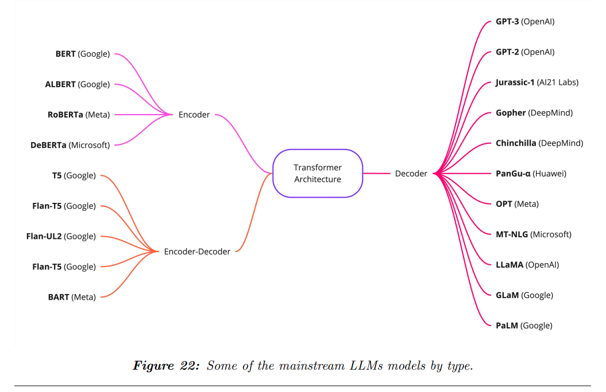
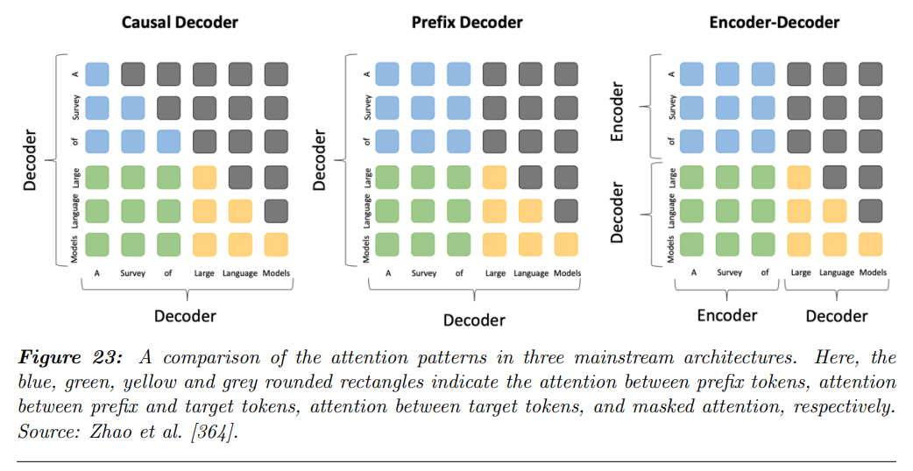
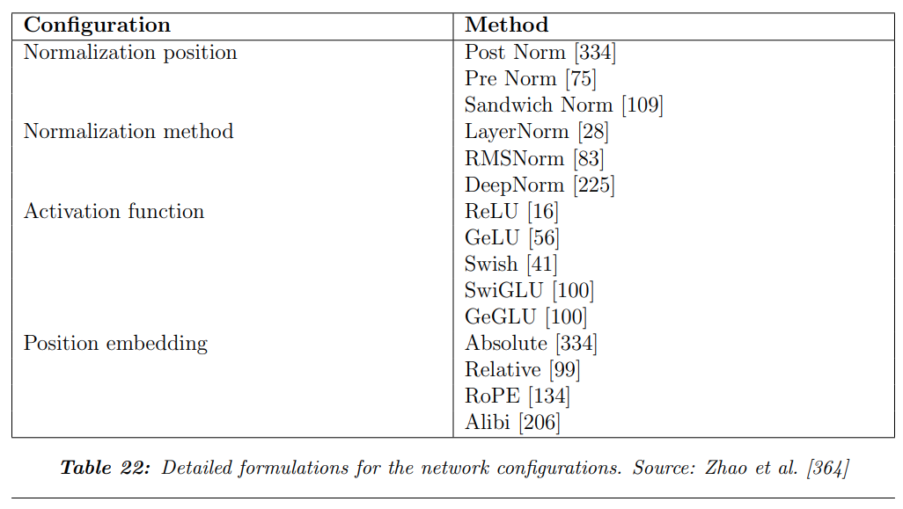
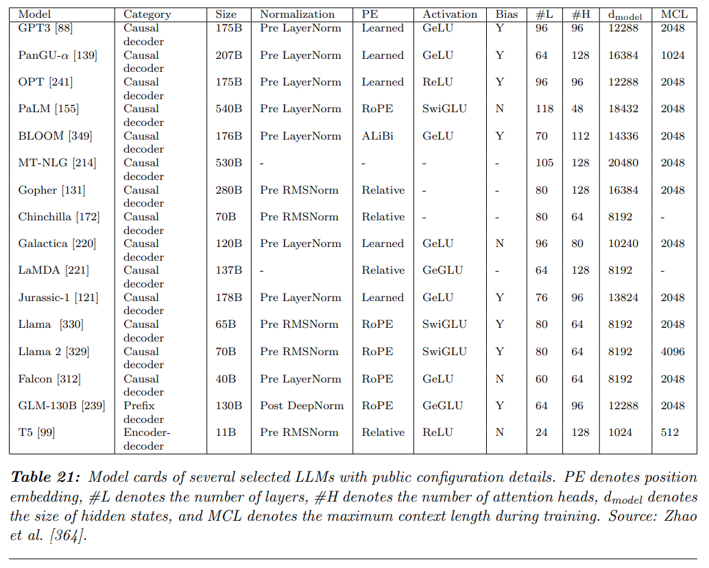
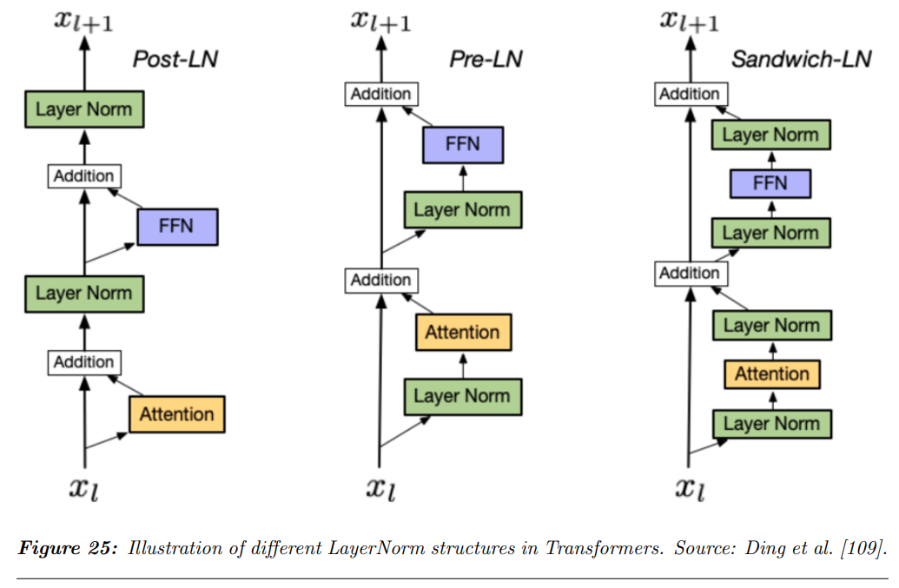
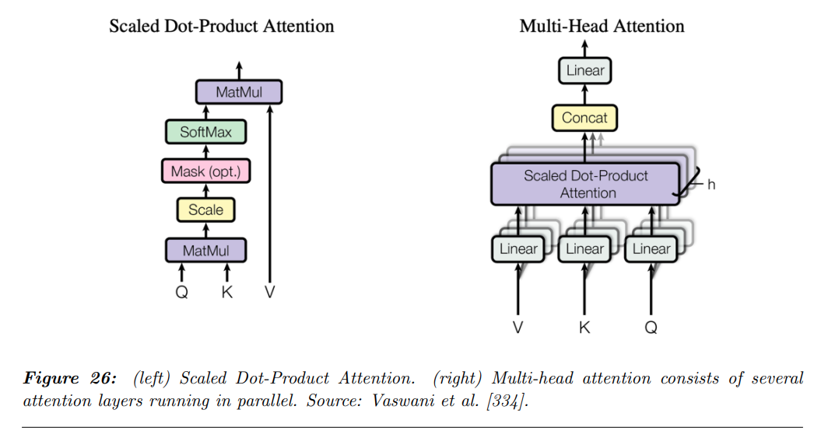

## 목차

* [1. LLM Architecture Overview](#1-llm-architecture-overview)
* [2. Encoder-Decoder](#2-encoder-decoder)
* [3. Causal Decoder](#3-causal-decoder)
* [4. Prefix Decoder](#4-prefix-decoder)
* [5. Transformer Architecture](#5-transformer-architecture)
  * [5-1. Position-wise Feed Forward 구조](#5-1-position-wise-feed-forward-구조) 
  * [5-2. Normalization](#5-2-normalization)
  * [5-3. Activation Function](#5-3-activation-function)
  * [5-4. Position Embeddings](#5-4-position-embeddings)
  * [5-5. Attention 메커니즘](#5-5-attention-메커니즘)
* [6. Emerging architectures](#6-emerging-architectures)

## 논문 소개

* Andrea Matarazzo and Riccardo Torlone, "A Survey on Large Language Models with some Insights on their Capabilities and Limitations", 2025
* [arXiv Link](https://arxiv.org/pdf/2501.04040)
* 이 문서에서 다룰 파트
  * "3. Foundations of Large Language Models" 중 **3-5. Architecture**
* 참고하면 좋은 문서
  * [Transformer 모델 설명](../../Natural%20Language%20Processing/Basics_트랜스포머%20모델.md) 

## 1. LLM Architecture Overview

거대 언어 모델 (LLM) 의 구조에는 다음과 같은 5가지가 있다.

| 구조              | 설명                                                                                                                                                |
|-----------------|---------------------------------------------------------------------------------------------------------------------------------------------------|
| Encoder-Decoder | - Encoder 는 문장을 LLM 이 해석할 수 있는, 그 문장의 **특징을 나타내는 representation (tensor) 으로 변환** 한다. - Decoder 는 **이 representation 으로부터 문장을 생성** 한다.          |
| Causal Decoder  | - 이전 token 들에 기반하여 next token 을 예측한다.                                                                                                             |
| Prefix Decoder  | - Causal Decoder 구조의 **masking 메커니즘** 에 착안하여, **생성된 문장에 대해 'partial conditioning'** 을 한다.                                                         |
| Transformer 구조  | - 현재 LLM 에서 가장 많이 쓰이는 구조이다. (참고: [Transformer 모델 설명](../../Natural%20Language%20Processing/Basics_트랜스포머%20모델.md)) - **Attention 메커니즘** 을 사용한다. |
| 기타 새로운 구조       | - 기본적인 Transformer 구조의 연산량이 token 개수의 제곱에 비례하는 **비효율성 해결** 등의 목적으로 새로운 구조들이 제안되고 있다.                                                              |

[(출처)](https://arxiv.org/pdf/2501.04040) : Andrea Matarazzo and Riccardo Torlone, "A Survey on Large Language Models with some Insights on their Capabilities and Limitations"

## 2. Encoder-Decoder

Encoder-Decoder 구조는 **문장을 representation (tensor) 으로 변환하는 Encoder** 와 **이 representation 으로부터 문장을 생성하는 Decoder** 로 구성된 구조이다.

| 구조      | 설명                                                                   |
|---------|----------------------------------------------------------------------|
| Encoder | 문장을 LLM 이 해석할 수 있는, 그 문장의 **특징을 나타내는 representation (tensor) 으로 변환** |
| Decoder | Encoder 에 의해 인코딩된 **representation 으로부터 문장을 생성**                     |

* Transformer 구조의 기반
  * [Transformer 구조](#5-transformer-architecture) 를 이루는 기반은 이 Encoder-Decoder 구조이다.
* Decoder 의 문장 생성
  * Decoder 는 이전에 생성된 token 을 조건으로 하여 **다음에 등장할 token 을 예측** 하는 방식으로 작동한다.
* 유연한 활용성
  * Encoder-Decoder 구조는 NLP 관련 다양한 task 에서 사용될 수 있다. 

## 3. Causal Decoder

[(출처)](https://arxiv.org/pdf/2501.04040) : Andrea Matarazzo and Riccardo Torlone, "A Survey on Large Language Models with some Insights on their Capabilities and Limitations"

Causal Decoder 는 **이전의 token 에 기반하여 다음 token 을 예측하는 Decoder** 이다. 이것은 다음이 보장됨을 의미한다.

* 문장 생성 과정이 **단방향 (uni-directional)** 이다.
* 이로 인해 **향후 등장할 미래의 token 에 대한 정보** 를 이용하여 next token prediction 을 하는 것을 원천 방지한다.

Causal Decoder 의 상세 구성은 다음과 같다.

* [Self-Attention 메커니즘](../../Natural%20Language%20Processing/Basics_트랜스포머%20모델.md#3-2-masked-decoder-self-attention) 을 이용하여 미래의 token 에 해당하는 부분을 masking 처리한다.
* Text Completion, Text Generation 과 같은 task 에 유용한 구조이다.

Causal Decoder 의 널리 알려진 예시로는 [OpenAI의 GPT 시리즈](../../Natural%20Language%20Processing/Basics_트랜스포머%20모델.md#5-gpt-generative-pre-trained-transformer) 가 있다.

## 4. Prefix Decoder

Prefix Decoder 는 **생성된 문장에 대해 'Partial Conditioning'이라는 메커니즘** 을 적용하는 컨셉의 Decoder 이다. 이를 통해 다음과 같이 **부분적인 양방향 (bidirectional) 생성** 을 가능하게 한다.

| token 의 종류                           | 문장 생성 방향              |
|--------------------------------------|-----------------------|
| prefix token (input & target prefix) | 양방향 (bi-directional)  |
| generated token                      | 단뱡향 (uni-directional) |

* Prefix token 은 **특정한 조건에 맞는 문장을 생성할 수 있게 하는 지시 token** 의 역할을 하며, **input prefix** 와 **target prefix** 로 구분된다.

## 5. Transformer Architecture

[Transformer 구조](../../Natural%20Language%20Processing/Basics_트랜스포머%20모델.md) 는 GPT 시리즈 등 **현대 LLM 의 사실상 표준 구조** 라고 해도 무방하다. 핵심 장점은 다음과 같다.

* 문장 내에서 **멀리 떨어져 있는 token 간의 상관관계** 및 의존성 (Long-range dependency) 이 많이 보존된다.
  * 이로 인해 **GPT 시리즈 모델이 아주 큰 Context Length** 를 가질 수 있는 것이다.
* 이로 인해 수십억 개 이상의 파라미터로 LLM 을 학습시킬 수 있다.

**1. Transformer 구조 요약**

* Transformer 구조는 **여러 개의 Transformer 레이어가 쌓여서** 구성된다.
* 각 Transformer 레이어는 다음과 같이 구성된다.
  * [Multi-head Self-Attention](../../Natural%20Language%20Processing/Basics_트랜스포머%20모델.md#3-1-encoder-self-attention) sub-layer 들
  * position-wise Fully-Connected Feed-Forward 신경망

[(출처)](https://arxiv.org/pdf/2501.04040) : Andrea Matarazzo and Riccardo Torlone, "A Survey on Large Language Models with some Insights on their Capabilities and Limitations"

**2. 다양한 Transformer 구조**

* 다음과 같이 다양한 형태의 Transformer 구조가 있다.

[(출처)](https://arxiv.org/pdf/2501.04040) : Andrea Matarazzo and Riccardo Torlone, "A Survey on Large Language Models with some Insights on their Capabilities and Limitations"

[(출처)](https://arxiv.org/pdf/2501.04040) : Andrea Matarazzo and Riccardo Torlone, "A Survey on Large Language Models with some Insights on their Capabilities and Limitations"

* Normalization 방법 설명 문서
  * [LayerNorm](../../AI%20Basics/Deep%20Learning%20Basics/딥러닝_기초_Regularization.md#4-2-layer-normalization) 
* 활성화 함수 설명 문서
  * [ReLU](../../AI%20Basics/Deep%20Learning%20Basics/딥러닝_기초_활성화_함수.md#2-2-relu-함수) 
  * [Swish (SiLU)](../../AI%20Basics/Deep%20Learning%20Basics/딥러닝_기초_활성화_함수.md#2-6-silu-swish-함수)
  * [SwiGLU](%5B2025.03.12%5D%20LLaMA%20-%20Open%20and%20Efficient%20Foundation%20Language%20Models.md#2-2-swiglu) (LLaMA 논문 스터디 문서)

### 5-1. Position-wise Feed Forward 구조

Transformer 모델의 Position-wise Feed Forward 구조는 다음과 같다.

* 2개의 Fully-Connected Layer 로 구성된 간단한 구조
* 각 레이어 간 [활성화 함수](../../AI%20Basics/Deep%20Learning%20Basics/딥러닝_기초_활성화_함수.md) 로 [ReLU](../../AI%20Basics/Deep%20Learning%20Basics/딥러닝_기초_활성화_함수.md#2-2-relu-함수) 함수 사용

이를 수식으로 나타내면 다음과 같다.

* 수식
  * $FFN(h_i) = ReLU(h_iW^1 + b^1)W^2 + b^2$
* 수식 설명
  * $h_i (i=1,2,...,n)$ : vector sequence
  * $W^1$, $W^2$, $b^1$, $b^2$ : FFN Sub-layer 의 학습 가능한 파라미터

### 5-2. Normalization

다른 딥러닝 모델처럼 LLM 에서도 [Normalization](../../AI%20Basics/Deep%20Learning%20Basics/딥러닝_기초_Regularization.md#4-batchlayer-normalization) 은 **모델을 안정적으로 학습하는 데 중요한 요소** 이다.

* 기본적인 Transformer 구조에서는 [LayerNorm (Layer Normalization)](../../AI%20Basics/Deep%20Learning%20Basics/딥러닝_기초_Regularization.md#4-2-layer-normalization) 이 많이 쓰이고 있다.
* Layer Normalization 이전에는 [BatchNorm (Batch Normalization)](../../AI%20Basics/Deep%20Learning%20Basics/딥러닝_기초_Regularization.md#4-batchlayer-normalization) 이 많이 쓰였다.
* 언어 모델의 학습 데이터 특성상 Batch Size 와 **학습 데이터의 Sequence 의 길이 (token 개수)** 가 다르기 때문에, Batch Normalization 의 단점을 보완하기 위해 **Layer Normalization** 이 많이 사용되고 있다.

**1. LayerNorm, BatchNorm 외의 Normalization 방법**

LayerNorm, BatchNorm 이외에도 LLM 학습을 위해 다음과 같은 Normalization 방법이 사용된다.

| Normalization 방법 | 설명                                                                                             | 사용 LLM               |
|------------------|------------------------------------------------------------------------------------------------|----------------------|
| RMSNorm          | - LayerNorm 의 학습 속도 향상 목적 - Hidden State 를 **Root Mean Square** 를 이용하여 정규화                  | ChinchiLLa, Gopher 등 |
| DeepNorm         | - LayerNorm 에 **학습 가능한 scaling factor 를 결합** - 추가적인 Normalization Layer 없이도 LLM 이 scaling 됨 | GLM-130B 등           |

**2. Normalization 부분의 모델에서의 위치**

Transformer 구조에서 **Normalization 이 이루어지는 모델 구조상의 위치는 LLM 의 성능에 큰 영향** 을 미친다.

* 다음의 3가지 configuration 이 대표적으로 알려져 있다.

| 모델에서의 위치    | 설명                                                                                 |
|-------------|------------------------------------------------------------------------------------|
| Pre-LN      | - Normalization Layer 가 **Residual Block 의 안** 에 위치                                |
| Post-LN     | - Normalization Layer 가 **Residual Block 의 앞과 뒤에 각각** 위치                           |
| Sandwich-LN | - Normalization Layer 가 **Residual Block 의 사이** 에 위치 - 기본적인 Transformer 구조에서 사용 |

[(출처)](https://arxiv.org/pdf/2501.04040) : Andrea Matarazzo and Riccardo Torlone, "A Survey on Large Language Models with some Insights on their Capabilities and Limitations"

### 5-3. Activation Function

LLM 에서 사용되는 활성화 함수로는 **[ReLU](../../AI%20Basics/Deep%20Learning%20Basics/딥러닝_기초_활성화_함수.md#2-2-relu-함수), GeLU, [Swish (SiLU)](../../AI%20Basics/Deep%20Learning%20Basics/딥러닝_기초_활성화_함수.md#2-6-silu-swish-함수), [SwiGLU](%5B2025.03.12%5D%20LLaMA%20-%20Open%20and%20Efficient%20Foundation%20Language%20Models.md#2-2-swiglu), GeGLU 등** 이 있다.

| 활성화 함수 | 설명                                                                                                                               | 수식                                                                                                                                     |
|--------|----------------------------------------------------------------------------------------------------------------------------------|----------------------------------------------------------------------------------------------------------------------------------------|
| ReLU   | - [Vanishing Gradient](../../AI%20Basics/Deep%20Learning%20Basics/딥러닝_기초_Regularization.md#3-gradient-vanishing) 문제 해결을 위해 주로 사용 | $ReLU(x) = max(x, 0)$                                                                                                                  |
| GeLU   | - 입력에 대한 일종의 gating 메커니즘 사용 - GPT-3, BERT 모델에서도 사용                                                                            | $GELU(x) = x \times \sigma(1.702x)$ (근사 함수)                                                                                         |
| Swish  | - ReLU 와 달리 **곡선 형태** 이며, 또한 **단조 증가하는 함수가 아니고 함숫값이 감소하는 부분이 있다.**                                                               | $Swish(x) = x \times \sigma(x)$                                                                                                        |
| SwiGLU | - Swish 함수의 변형 - Swish + **Gated Linear Unit (GLU)** 를 통해 입력에 대한 gating 메커니즘 적용                                               | $SwiGLU(x, W, V, b, c, \beta) = Swish(xW+b) ⊗ (xV+c)$ ($W$, $V$ 는 가중치 행렬, $b$, $c$ 는 bias, $\beta$ 는 상수, ⊗ 는 행렬의 같은 위치에 있는 원소 간 곱셈) | 
| GeGLU  | - GeLU 함수의 변형 - GeLU + **Gated Linear Unit (GLU)**                                                                            | $GeGLU(x, W, V, b, c) = GeLU(xW + b) ⊗ (xV + c)$                                                                                       |

### 5-4. Position Embeddings

[Position Embedding](../../Natural%20Language%20Processing/Basics_트랜스포머%20모델.md#2-포지셔널-인코딩-positional-encoding) 은 Transformer 구조의 핵심 요소 중 하나로, **입력 sequence 내에서 특정 token 이 몇 번째로 오는지를 LLM 이 파악할 수 있도록 임베딩** 한 것이다.

* 널리 알려진 Positional Embedding 의 방법에는 **Absolute position embedding, Relative position embedding, RoPE (Rotary Embedding), ALiBi embedding** 의 4가지가 있다.

| Positional Embedding 방법              | 설명                                                                                                                                                                                                                                                             | 수식                                                                                                                                  |
|--------------------------------------|----------------------------------------------------------------------------------------------------------------------------------------------------------------------------------------------------------------------------------------------------------------|-------------------------------------------------------------------------------------------------------------------------------------|
| Absolute position embedding          | token 에 대한 embedding 의 벡터에 **position embedding 의 벡터를 단순히 element-wise 하게 더함**                                                                                                                                                                                 | $E_{total}(i) = E_{token}(i) + E_{position}(i)$                                                                                     |
| Relative position embedding          | 입력 sequence 에서의 **token 간의 상대적인 거리** 를 이용 - 이를 통해 LLM 의 **Long-range dependency 를 파악하는 능력 향상** - token 의 sequence 에서의 절대적인 위치 대신 **Attention Score** 를 이용                                                                                                | $\displaystyle Attention(Q, K, V) = softmax(\frac{Q(K+R)^T}{\sqrt{d_k}})V$ (R 은 token 간 상대적 거리를 임베딩한 행렬)                         |
| RoPE (Rotary Embedding)              | 입력 sequence 의 token 간 상대적 거리를 **삼각함수를 이용한 Rotational Matrix** 로 표현                                                                                                                                                                                             | $E_{rot}(x_i, p_i) = Rotate(x_i, p_i) = x_i cos(p_i) + (Wx_i) sin(p_i)$ ($x_i$, $p_i$ 는 각각 token embedding 과 position embedding) |
| ALiBi (Attention with Linear Biases) | Positional Dependency 를 표현하기 위해 **bias 를 Self-Attention 에 직접 적용** - Relative Positional Embedding 과 유사하게, **Key 와 Query 의 거리에 따라 Attention Score 계산** - [이 논문](https://arxiv.org/pdf/2108.12409) 에 따르면, **전통적인 Positional Embedding 보다 성능 및 학습 안전성이 좋음** | $\displaystyle Attention(Q, K, V) = softmax(\frac{QK^T}{\sqrt{d_k}} - bias(i,j))V$ (단, $bias(i,j) = b \vert i - j \vert$)        |        |

### 5-5. Attention 메커니즘

[Attention 메커니즘](../../Natural%20Language%20Processing/Basics_어텐션%20(Attention).md) 은 **Transformer 를 구성하는 핵심 요소** 이다. 간단히 설명하자면, **Query 를 {Key, Value} 의 쌍으로 mapping** 시키는 컨셉이다.

* 이때 Query, Key, Value 는 모두 벡터 형태로 나타낸다.
* Attention 의 출력값은 **Value 에 대한 weighted sum** 이다.

**1. Attention 의 종류**

Attention 의 대표적인 유형으로는 **Scaled Dot-product (Multiplicative) Attention, Multi-head Attention, Sparse Attention** 이 있다.

| Attention 함수 유형                        | 설명                                                                                                                         | 수식                                                                                                                                           |
|----------------------------------------|----------------------------------------------------------------------------------------------------------------------------|----------------------------------------------------------------------------------------------------------------------------------------------|
| Dot-product (Multiplicative) Attention | Query 와 Key 행렬을 곱한 다음, 여기에 Softmax 를 적용한 결과를 Value 행렬과 곱함                                                                  | $Attention(Q, K, V) = softmax(\frac{QK^T}{\sqrt{d_{k}}})$ ($d_k$ : Key Vector 의 차원)                                                       |
| Multi-head Attention                   | Query, Key, Value 를 **여러 개의 head 로 분리하고, 각 head 에서 Attention 함수를 병렬 연산** - 이 결과들은 나중에 concatenate 됨                     | $MultiHead(Q, K, V) = Concat(head_1, ..., head_h)W^O$ (단, $head_i = Attention(QW_i^Q, KW_i^K, VW_i^V)$ )                                      |
| Sparse Attention                       | 각 Token 은 **정해진 패턴에 따라 다른 Token 의 subset 에 등장** - 이를 통해 **Attention 의 연산량을 감소** 함 - 결과적으로 **모델이 더 긴 문장을 처리할 수 있게** 함 | $SparseAttention(Q, K, V) = softmax(\frac{QK^T \times M}{\sqrt{d_k}}) \times V$ ($M$ : token 간의 Attention 패턴을 정의하는 sparse attention mask) |

[(출처)](https://arxiv.org/pdf/2501.04040) : Andrea Matarazzo and Riccardo Torlone, "A Survey on Large Language Models with some Insights on their Capabilities and Limitations"

## 6. Emerging architectures

