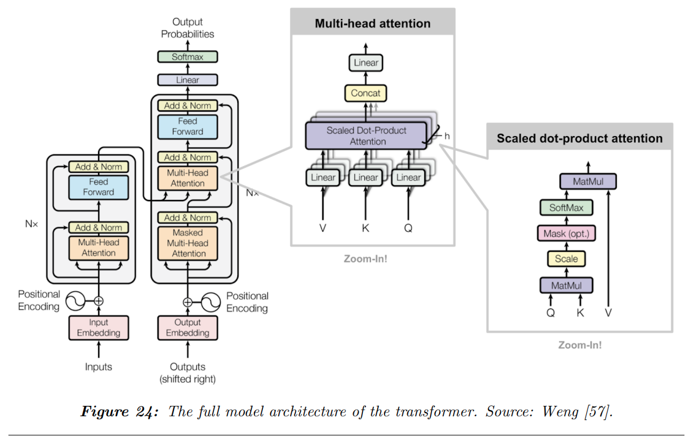

## 목차

* [1. LLM Architecture Overview](#1-llm-architecture-overview)
* [2. Encoder-Decoder](#2-encoder-decoder)
* [3. Causal Decoder](#3-causal-decoder)
* [4. Prefix Decoder](#4-prefix-decoder)
* [5. Transformer Architecture](#5-transformer-architecture)
  * [5-1. Position-wise Feed Forward 구조](#5-1-position-wise-feed-forward-구조) 
  * [5-2. Normalization](#5-2-normalization) 
  * [5-3. Position Embeddings](#5-3-position-embeddings)
  * [5-4. Attention 메커니즘](#5-4-attention-메커니즘)
* [6. Emerging architectures](#6-emerging-architectures)

## 논문 소개

* Andrea Matarazzo and Riccardo Torlone, "A Survey on Large Language Models with some Insights on their Capabilities and Limitations", 2025
* [arXiv Link](https://arxiv.org/pdf/2501.04040)
* 이 문서에서 다룰 파트
  * "3. Foundations of Large Language Models" 중 **3-5. Architecture**
* 참고하면 좋은 문서
  * [Transformer 모델 설명](../../Natural%20Language%20Processing/Basics_트랜스포머%20모델.md) 

## 1. LLM Architecture Overview

거대 언어 모델 (LLM) 의 구조에는 다음과 같은 5가지가 있다.

| 구조              | 설명                                                                                                                                                |
|-----------------|---------------------------------------------------------------------------------------------------------------------------------------------------|
| Encoder-Decoder | - Encoder 는 문장을 LLM 이 해석할 수 있는, 그 문장의 **특징을 나타내는 representation (tensor) 으로 변환** 한다. - Decoder 는 **이 representation 으로부터 문장을 생성** 한다.          |
| Causal Decoder  | - 이전 token 들에 기반하여 next token 을 예측한다.                                                                                                             |
| Prefix Decoder  | - Causal Decoder 구조의 **masking 메커니즘** 에 착안하여, **생성된 문장에 대해 'partial conditioning'** 을 한다.                                                         |
| Transformer 구조  | - 현재 LLM 에서 가장 많이 쓰이는 구조이다. (참고: [Transformer 모델 설명](../../Natural%20Language%20Processing/Basics_트랜스포머%20모델.md)) - **Attention 메커니즘** 을 사용한다. |
| 기타 새로운 구조       | - 기본적인 Transformer 구조의 연산량이 token 개수의 제곱에 비례하는 **비효율성 해결** 등의 목적으로 새로운 구조들이 제안되고 있다.                                                              |

[(출처)](https://arxiv.org/pdf/2501.04040) : Andrea Matarazzo and Riccardo Torlone, "A Survey on Large Language Models with some Insights on their Capabilities and Limitations"

## 2. Encoder-Decoder

Encoder-Decoder 구조는 **문장을 representation (tensor) 으로 변환하는 Encoder** 와 **이 representation 으로부터 문장을 생성하는 Decoder** 로 구성된 구조이다.

| 구조      | 설명                                                                   |
|---------|----------------------------------------------------------------------|
| Encoder | 문장을 LLM 이 해석할 수 있는, 그 문장의 **특징을 나타내는 representation (tensor) 으로 변환** |
| Decoder | Encoder 에 의해 인코딩된 **representation 으로부터 문장을 생성**                     |

* Transformer 구조의 기반
  * [Transformer 구조](#5-transformer-architecture) 를 이루는 기반은 이 Encoder-Decoder 구조이다.
* Decoder 의 문장 생성
  * Decoder 는 이전에 생성된 token 을 조건으로 하여 **다음에 등장할 token 을 예측** 하는 방식으로 작동한다.
* 유연한 활용성
  * Encoder-Decoder 구조는 NLP 관련 다양한 task 에서 사용될 수 있다. 

## 3. Causal Decoder

[(출처)](https://arxiv.org/pdf/2501.04040) : Andrea Matarazzo and Riccardo Torlone, "A Survey on Large Language Models with some Insights on their Capabilities and Limitations"

Causal Decoder 는 **이전의 token 에 기반하여 다음 token 을 예측하는 Decoder** 이다. 이것은 다음이 보장됨을 의미한다.

* 문장 생성 과정이 **단방향 (uni-directional)** 이다.
* 이로 인해 **향후 등장할 미래의 token 에 대한 정보** 를 이용하여 next token prediction 을 하는 것을 원천 방지한다.

Causal Decoder 의 상세 구성은 다음과 같다.

* [Self-Attention 메커니즘](../../Natural%20Language%20Processing/Basics_트랜스포머%20모델.md#3-2-masked-decoder-self-attention) 을 이용하여 미래의 token 에 해당하는 부분을 masking 처리한다.
* Text Completion, Text Generation 과 같은 task 에 유용한 구조이다.

Causal Decoder 의 널리 알려진 예시로는 [OpenAI의 GPT 시리즈](../../Natural%20Language%20Processing/Basics_트랜스포머%20모델.md#5-gpt-generative-pre-trained-transformer) 가 있다.

## 4. Prefix Decoder

Prefix Decoder 는 **생성된 문장에 대해 'Partial Conditioning'이라는 메커니즘** 을 적용하는 컨셉의 Decoder 이다. 이를 통해 다음과 같이 **부분적인 양방향 (bidirectional) 생성** 을 가능하게 한다.

| token 의 종류                           | 문장 생성 방향              |
|--------------------------------------|-----------------------|
| prefix token (input & target prefix) | 양방향 (bi-directional)  |
| generated token                      | 단뱡향 (uni-directional) |

* Prefix token 은 **특정한 조건에 맞는 문장을 생성할 수 있게 하는 지시 token** 의 역할을 하며, **input prefix** 와 **target prefix** 로 구분된다.

## 5. Transformer Architecture

[Transformer 구조](../../Natural%20Language%20Processing/Basics_트랜스포머%20모델.md) 는 GPT 시리즈 등 **현대 LLM 의 사실상 표준 구조** 라고 해도 무방하다. 핵심 장점은 다음과 같다.

* 문장 내에서 **멀리 떨어져 있는 token 간의 상관관계** 및 의존성 (Long-range dependency) 이 많이 보존된다.
  * 이로 인해 **GPT 시리즈 모델이 아주 큰 Context Length** 를 가질 수 있는 것이다.
* 이로 인해 수십억 개 이상의 파라미터로 LLM 을 학습시킬 수 있다.

**1. Transformer 구조 요약**

* Transformer 구조는 **여러 개의 Transformer 레이어가 쌓여서** 구성된다.
* 각 Transformer 레이어는 다음과 같이 구성된다.
  * [Multi-head Self-Attention](../../Natural%20Language%20Processing/Basics_트랜스포머%20모델.md#3-1-encoder-self-attention) sub-layer 들
  * position-wise Fully-Connected Feed-Forward 신경망

[(출처)](https://arxiv.org/pdf/2501.04040) : Andrea Matarazzo and Riccardo Torlone, "A Survey on Large Language Models with some Insights on their Capabilities and Limitations"

**2. 다양한 Transformer 구조**

* 다음과 같이 다양한 형태의 Transformer 구조가 있다.

[(출처)](https://arxiv.org/pdf/2501.04040) : Andrea Matarazzo and Riccardo Torlone, "A Survey on Large Language Models with some Insights on their Capabilities and Limitations"

[(출처)](https://arxiv.org/pdf/2501.04040) : Andrea Matarazzo and Riccardo Torlone, "A Survey on Large Language Models with some Insights on their Capabilities and Limitations"

* Normalization 방법 설명 문서
  * [LayerNorm](../../AI%20Basics/Deep%20Learning%20Basics/딥러닝_기초_Regularization.md#4-2-layer-normalization) 
* 활성화 함수 설명 문서
  * [ReLU](../../AI%20Basics/Deep%20Learning%20Basics/딥러닝_기초_활성화_함수.md#2-2-relu-함수) 
  * [Swish (SiLU)](../../AI%20Basics/Deep%20Learning%20Basics/딥러닝_기초_활성화_함수.md#2-6-silu-swish-함수)
  * [SwiGLU](%5B2025.03.12%5D%20LLaMA%20-%20Open%20and%20Efficient%20Foundation%20Language%20Models.md#2-2-swiglu) (LLaMA 논문 스터디 문서)

### 5-1. Position-wise Feed Forward 구조

Transformer 모델의 Position-wise Feed Forward 구조는 다음과 같다.

* 2개의 Fully-Connected Layer 로 구성된 간단한 구조
* 각 레이어 간 [활성화 함수](../../AI%20Basics/Deep%20Learning%20Basics/딥러닝_기초_활성화_함수.md) 로 [ReLU](../../AI%20Basics/Deep%20Learning%20Basics/딥러닝_기초_활성화_함수.md#2-2-relu-함수) 함수 사용

이를 수식으로 나타내면 다음과 같다.

* 수식
  * $FFN(h_i) = ReLU(h_iW^1 + b^1)W^2 + b^2$
* 수식 설명
  * $h_i (i=1,2,...,n)$ : vector sequence
  * $W^1$, $W^2$, $b^1$, $b^2$ : FFN Sub-layer 의 학습 가능한 파라미터

### 5-2. Normalization

### 5-3. Position Embeddings

### 5-4. Attention 메커니즘

## 6. Emerging architectures

