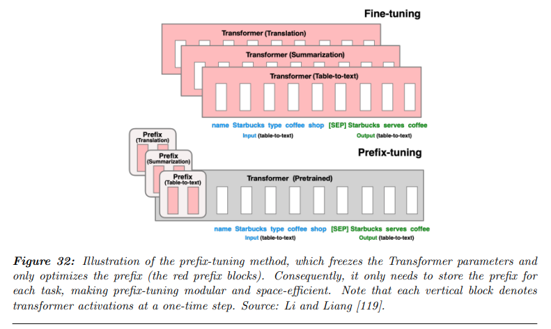

## 목차

* [1. Parameter-efficient Model Adaption](#1-parameter-efficient-model-adaption)
  * [1-1. Adapter Tuning](#1-1-adapter-tuning)
  * [1-2. Prefix Tuning](#1-2-prefix-tuning)
  * [1-3. Prompt Tuning](#1-3-prompt-tuning)
  * [1-4. LoRA (Low-Rank Adaption)](#1-4-lora-low-rank-adaption)
* [2. Memory-efficient Model Adaption](#2-memory-efficient-model-adaption)
  * [2-1. Quantization](#2-1-quantization)

## 논문 소개

* Andrea Matarazzo and Riccardo Torlone, "A Survey on Large Language Models with some Insights on their Capabilities and Limitations", 2025
* [arXiv Link](https://arxiv.org/pdf/2501.04040)
* 이 문서에서 다룰 파트
  * "3. Foundations of Large Language Models" 중 **3-6. Tuning and Optimization**
* 참고하면 좋은 문서
  * [LLM Fine-Tuning 방법 설명](../../AI%20Basics/LLM%20Basics/LLM_기초_Fine_Tuning.md)
  * [LLM Quantization 방법 설명](../../AI%20Basics/LLM%20Basics/LLM_기초_Quantization.md)

## 1. Parameter-efficient Model Adaption

Parameter-efficient Model Adaption 은 **LLM 을 Fine-Tuning 할 때, 그 성능 향상도는 최대한 유지하면서 학습하는 파라미터의 개수를 줄이는** 것이다.

* 이러한 Fine-Tuning 을 [PEFT (Parameter-Efficient Fine-Tuning)](../../AI%20Basics/LLM%20Basics/LLM_기초_Fine_Tuning_PEFT.md) 라고 한다.

그 방법으로는 대표적으로 **Adapter Tuning, Prefix Tuning, Prompt Tuning, LoRA (Low-Rank Adaption)** 의 4가지가 있다.

| 방법                       | 설명                                                                                                                              |
|--------------------------|---------------------------------------------------------------------------------------------------------------------------------|
| Adapter Tuning           | 'Adapter'라고 하는, 학습 가능한 작은 모듈을 layer 사이에 추가 - Fine-Tuning 대상인 새로운 task 가 **전체 모델을 재 학습 시켜야 하는 수준** 일 때의 Fine-Tuning 의 비효율성 해결 |
| Prefix Tuning            | 'prefix'라고 하는, task-specific vector 를 LLM 입력에 추가                                                                                |
| Prompt Tuning            | 'prompt token'이라는, 학습 가능한 vector 를 LLM 에 포함                                                                                     |
| LoRA (Low-Rank Adaption) | 원래 가중치 행렬 $W$ 를 **2개의 작은 행렬 $A$, $B$ 로 분해** 하여, **메모리 사용량 및 연산량을 드라마틱하게 감소**                                                    |

[(출처)](https://arxiv.org/pdf/2501.04040) : Andrea Matarazzo and Riccardo Torlone, "A Survey on Large Language Models with some Insights on their Capabilities and Limitations"

### 1-1. Adapter Tuning

**Adapter Tuning** 은 'Adapter'라고 하는, 학습 가능한 작은 모듈을 layer 사이에 추가하여 **해당 모듈을 추가 학습** 시키는 것이다.

* 기본 학습 방법
  * 학습 가능한 Adapter Layer 를 기존 Feed-Forward Layer 와 [Layer Normalization](../../AI%20Basics/Deep%20Learning%20Basics/딥러닝_기초_Regularization.md#4-2-layer-normalization) 사이에 추가한다.
  * 원래 모델에 있던 나머지 파라미터들은 모두 **Frozen 상태로 둔다.**
* 특히 유용한 경우
  * Fine-Tuning 대상인 새로운 task 를 학습하려면 **전체 모델을 재 학습 시켜야 하는 수준** 일 때, 이러한 비효율성을 해결하기 위한 것이다.
  * 즉, **기존 Pre-train 된 task와 다른 새로운 task 를 여러 개 학습** 할 때 유용한 방법이라고 할 수 있다.
* [참고 문서 (Adapter Layer 추가)](../../AI%20Basics/LLM%20Basics/LLM_기초_Fine_Tuning_PEFT.md#2-5-adapter-layer-추가)

**1. Adapter Tuning 의 레이어 구조**

[(출처)](https://arxiv.org/pdf/2501.04040) : Andrea Matarazzo and Riccardo Torlone, "A Survey on Large Language Models with some Insights on their Capabilities and Limitations"

**2. Feed-forward Down-project & Feed-forward Up-project 레이어**

Adapter Layer 는 다음과 같이 **Feed-forward Down-project** 와 **Feed-forward Up-project** 레이어로 구성된다.

| 레이어                       | 설명                                                                             | 수식                         |
|---------------------------|--------------------------------------------------------------------------------|----------------------------|
| Feed-forward Down-project | 입력 차원 $d$ 을 더 작은 중간 차원 $m$ 으로 mapping - ($x (dim: d)$ → $y (dim: m)$ )      | $y = \sigma (W_d x + b_d)$ |
| Feed-forward Up-project   | 중간 차원 $m$ 을 입력 차원과 동일한 출력 차원 $d$ 로 mapping - ($y (dim: m)$ → $z (dim: d)$ ) | $z = \sigma (W_u y + b_u)$ |

* 이때 출력 벡터 $z$ 는 **입력 벡터 $x$ 에 대한 reconstruction** 에 해당한다.

**3. Parallel Adapter**

Transformer 에서는 **Parallel Adapter** 라는 기법을 사용하는데, 그 컨셉은 다음과 같다.

* Adapter 가 Attention Layer 와 Feed-Forward Layer 각각에 대해 **병렬적으로 추가됨**
* LLM Fine-Tuning 에서의 학습 가능한 파라미터 개수를 효과적으로 줄일 수 있음

### 1-2. Prefix Tuning

Prefix Tuning은 다음과 같이 **'prefix'라고 하는, task-specific vector 를 LLM 입력에 추가** 하는 방법을 말한다.

* 전통적인 Fine-Tuning 은 각 task에 대해 **개별적으로 모델을 저장** 해야 하는 문제점이 있다.
* Prefix Tuning은 'prefix'라고 하는 일종의 파라미터 집합을 이용하여 이를 해결한다.
  * 이를 통해 **저장 공간 및 연산량을 크게 감소시킬** 수 있다. 
* [참고 문서 (Prefix Tuning)](../../AI%20Basics/LLM%20Basics/LLM_기초_Fine_Tuning_PEFT.md#2-3-prefix-tuning)

[(출처)](https://arxiv.org/pdf/2501.04040) : Andrea Matarazzo and Riccardo Torlone, "A Survey on Large Language Models with some Insights on their Capabilities and Limitations"

**Prefix vector 최적화 방법**

Prefix vector 를 이용하여 LLM을 Fine-Tuning 시키는 방법으로는 **Re-parameterization** 을 이용하는 것이 있다.

* Multi-Layer Perceptron (MLP) 을 이용하여, **Prefix 를 직접 최적화하는 대신 작은 크기의 행렬을 Prefix 의 Parameter 행렬로 mapping** 시키는 방법이다.
  * 이 방법은 학습을 안정화시키는 것으로 증명된 바 있다. 
* 이 방법은 [이 논문](https://arxiv.org/pdf/2101.00190) 에서 제안되었다.

### 1-3. Prompt Tuning

Prompt Tuning은 **'prompt token'이라는, 학습 가능한 vector 를 LLM 에 포함하여 Fine-Tuning** 하는 방법이다.

* Prompt Token 은 **task-specific embedding** 으로, LLM 의 입력 레이어에 포함된다.
* 입력 레이어에서는 **이 Prompt Token 이 원래 텍스트의 임베딩과 concatenate 되는 형태** 로 입력이 주어지고, LLM 이 그 입력을 처리한다.
* P-tuning 이라는 방법이 있는데, 이 방법은 **context, prompt, target 을 나타내는 token** 이 각각 있고, 이를 유연하게 합치는 형태의 방법론이다.
* [참고 문서 (Prompt Tuning)](../../AI%20Basics/LLM%20Basics/LLM_기초_Fine_Tuning_PEFT.md#2-4-prompt-tuning)

[(출처)](https://arxiv.org/pdf/2501.04040) : Andrea Matarazzo and Riccardo Torlone, "A Survey on Large Language Models with some Insights on their Capabilities and Limitations"

**P-tuning v2**

P-tuning v2 는 [해당 논문](https://arxiv.org/pdf/2110.07602) 에서 제안된 방법으로, **모든 레이어에 continuous prompt 를 적용** 하는 방식으로 Prompt Tuning 을 확장한다.

* 이는 input layer 에만 Prompt 가 추가되는 방법에서 발전시켜서, 기존 Prompt Tuning 의 단점을 해결한 것이다.
* P-Tuning v2 의 핵심 아이디어는 다음과 같다.
  * 모든 레이어에 'continuous prompt'를 적용하여 **전체 파라미터 개수를 크게 늘리지 않고도 학습 가능한 파라미터 개수 향상** 
  * **Prompt Token (vector) 와 LLM 간의 상호작용 메커니즘을 변경** 하여, 간단하고 복잡한 여러 가지 task 들에 대한 적용 가능성을 높임

### 1-4. LoRA (Low-Rank Adaption)

**LoRA (Low-Rank Adaption)** 는 **dense layer 의 weight matrix 를 2개로 분해** 하여, **적은 수의 학습 가능한 파라미터로 효율적으로 Fine-Tuning** 하는 방법론 중 하나이다. 그 핵심 아이디어는 다음과 같다.

* 기존 모델에 있는 큰 가중치 행렬인 $m \times n$ 크기의 행렬 $W$ 은 Freeze 시킨다.
* 이 행렬을 **2개로 분해한 $m \times k$ 크기의 행렬 $A$ 와 $k \times n$ 크기의 행렬 $B$** 를 학습 가능한 파라미터로 한다.
  * 이때 $k$ (= LoRA 의 **Rank**) 는 $m$ 이나 $n$ 보다 **훨씬 작은 값** 으로 한다.
  * 이를 통해 **메모리 사용량 및 연산량을 기존 행렬 $W$ 를 Fine-Tuning 할 때에 비해 훨씬 줄인다.**
* [참고 문서 (LoRA)](../../AI%20Basics/LLM%20Basics/LLM_기초_Fine_Tuning_LoRA_QLoRA.md)

**LoRA 의 장점** 은 다음과 같다.

* 서로 다른 Low-Rank Matrix 를 이용하여, 다양한 task 에 대해 LLM Fine-Tuning 가능
* 그러면서도 앞서 언급한 것처럼 **메모리 및 연산량 절약**

**LoRA 를 발전시킨 방법론** 에는 다음과 같은 것들이 있다.

| 방법론                                            | 핵심 아이디어                                                                                        |
|------------------------------------------------|------------------------------------------------------------------------------------------------|
| AdaLoRA (Adaptive LoRA)                        | **중요한 weight matrix** 에 대해 **학습 가능한 파라미터 개수 향상**                                               |
| DyLoRA (Dynamic Search-Free Low-Rank Adaption) | LoRA 를 적용함에 있어서 **최적의 Rank 값을 효율적으로 탐색** - **추가 학습 없이, 추론 단계에서** task 별 최적의 Rank Size 적용 가능 |

**1. AdaLoRA (Adaptive LoRA?)**

* 논문
  * [AdaLoRA: Adaptive Budget Allocation for Parameter-Efficient Fine-Tuning (2023.03)](https://arxiv.org/pdf/2303.10512) 

* 핵심 아이디어
  * LLM 에 있는 여러 개의 weight matrix 중 **중요한 weight matrix** 에 대해서는 **더욱 많은 학습 가능한 파라미터** 를 이용
    * 이를 통해 더 좋은 모델 성능 달성
  * 중요하지 않은 weight metrix 에 대해 학습 가능한 파라미터를 늘리는 경우, **모델 성능을 오히려 반감** 시킬 수 있음

* 중요한 가중치 탐색
  * 중요한 weight matrix 를 찾기 위해, AdaLoRA 에서는 다음과 같은 방법 사용
    * 가중치 행렬 $W$ 에 대해 그 중요도를 평가
    * 평가된 중요도에 따라, 중요하지 않은 weight update 에 대해 **Selective Pruning** 처리
    * weight update 시, **Singular Value Decomposition** (SVD, 직교 행렬 2개 & 대각행렬 1개로의 **특이값 분해**) 를 이용

* 수식
  * $W = W^0 + \delta = W^0 + PΛQ$
  * 수식 설명
    * $\delta$ : weight matrix update (= $PΛQ$)
    * $P$, $Q$ : left & right singular vector
    * $Λ$ : singular value matrix

**2. DyLoRA (Dynamic Search-Free Low-Rank Adaption)**

* 논문
  * [DyLoRA: Parameter-Efficient Tuning of Pretrained Models using Dynamic Search-Free Low Rank Adaptation (2022.10)](https://arxiv.org/pdf/2210.07558) 

* 핵심 아이디어
  * LoRA 적용에 있어서 **최적의 Rank 값을 찾음**
    * Low-Rank decomposition 을 위한 최적의 Rank 값은 **레이어와 task 에 따라 다름**
  * DyLoRA 에서는 **LLM 추가 학습 없이 추론 단계에서** 최적의 Rank size 를 적용
  * **학습 시 'LoRA block' 이라는 low-rank module 을 학습** 시켜서, **추론 시, 모델이 추가 비용 없이도 성능이 가장 좋은 Rank 값을 찾게 함**

* LoRA 와 비교한 장점

| 장점                   | 설명                                                                                 |
|----------------------|------------------------------------------------------------------------------------|
| Dynamic LoRA Blocks  | 표준 LoRA block 을 **Rank size 를 스스로 학습하도록** 개선                                       |
| Search-Free Adaption | 최적의 Rank size 를 brute-force 로 탐색하지 않고 **효율적으로 탐색** 하여, 학습 및 task adaption 시간 대폭 감소 |
| 모델 성능                | 다양한 NLP task 에서 전통적인 LoRA 방식보다 성능이 좋음                                              |

## 2. Memory-efficient Model Adaption

### 2-1. Quantization