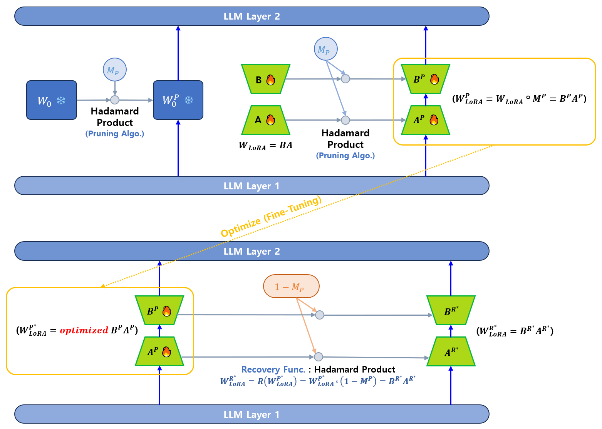

## 목차

* [1. LoRAM 의 핵심 아이디어](#1-loram-의-핵심-아이디어)
* [2. 학습 메커니즘](#2-학습-메커니즘)
  * [2-1. Pruned Full-Rank Weight Generation](#2-1-pruned-full-rank-weight-generation)
  * [2-2. Pruned Low-Rank Matrix Training](#2-2-pruned-low-rank-matrix-training)
  * [2-3. Recovered Low-Rank Matrix Generation](#2-3-recovered-low-rank-matrix-generation)
  * [2-4. Pruned Full-Rank Weight Alignment](#2-4-pruned-full-rank-weight-alignment)
* [3. Inference 메커니즘 (Recovered Low-Rank Matrix Inference)](#3-inference-메커니즘-recovered-low-rank-matrix-inference)
* [4. 양자화 메커니즘 (Pruned Full-Rank Weight Quantization)](#4-양자화-메커니즘-pruned-full-rank-weight-quantization)
* [5. 실험 결과](#5-실험-결과)
  * [5-1. 학습 대상 데이터셋](#5-1-학습-대상-데이터셋) 
  * [5-2. 실험 설정](#5-2-실험-설정)
  * [5-3. Fine-Tuning 실험 결과](#5-3-fine-tuning-실험-결과)
  * [5-4. Downstream Task 실험 결과](#5-4-downstream-task-실험-결과)
  * [5-5. LLaMA-3.1 실험 결과](#5-5-llama-31-실험-결과)
* [6. 논의 및 탐구](#6-논의-및-탐구)
  * [6-1. Recovery 및 Alignment 의 필요성](#6-1-recovery-및-alignment-의-필요성)
  * [6-2. LoRAM 의 Parameter Reduction 에 대한 스케일링 법칙](#6-2-loram-의-parameter-reduction-에-대한-스케일링-법칙)

## 논문 소개

* Jun Zhang, Jue Wang et al., "Train Small, Infer Large: Memory-Efficient LoRA Training for Large Language Models", 2025
* Memory-Efficient 한 [LoRA](../../AI%20Basics/LLM%20Basics/LLM_기초_Fine_Tuning_LoRA_QLoRA.md) 학습 방법인 **LoRAM** 에 대한 소개 논문
* [arXiv Link](https://arxiv.org/pdf/2502.13533)

## 1. LoRAM 의 핵심 아이디어

LoRAM 을 통해 해결해야 할 문제

* LoRAM 은 [LoRA (Low-Rank Optimization)](../../AI%20Basics/LLM%20Basics/LLM_기초_Fine_Tuning_LoRA_QLoRA.md) 를 통한 LLM Fine-Tuning 시, Pre-trained Weight Matrix **$W_0$ (LoRA 를 통해 2개의 행렬로 분해할 원래 행렬)** 로 인한 memory overhead 를 줄이면서도 그 성능을 유지하기 위한 방법이다.
* 즉, LoRA 를 **Memory-Efficient 하게 학습** 하기 위한 방법이다.

LoRAM 의 핵심 아이디어

* Low-Rank 행렬에 대한 **Pruning 및 복원** 메커니즘
  * LoRA 의 **Low-Rank 행렬들을 Pruning** 한 **Pruned Model** 을 학습한다.
  * Inference 시에는 **복원된 Low-Rank 행렬들을 원래 모델과 결합** 한다.
* 원래 모델과 Pruned Model 간의 **Knowledge Inconsistency 해결**
  * Pruned Model 을 적은 양의 일반적인 corpus 를 이용하여 학습하는 방법으로 Fine-Tuning
  * **One-shot offline process** 를 이용

## 2. 학습 메커니즘

여기서 LoRA 의 수식을 다음과 같다고 먼저 가정한다.

* 수식
  * $h = xW_0 + xW_{LoRA} = xW_0 + xBA$
* 수식 설명
  * $W_0$ 은 LoRA 를 적용하지 않은 원래의 High-Rank 행렬 
  * $A$, $B$ 는 LoRA 적용을 위한 Low-Rank 행렬 

LoRAM 의 기본적인 학습 메커니즘은 다음과 같다.

| 학습 메커니즘                              | 설명                                                                                                                                                                                                               |
|--------------------------------------|------------------------------------------------------------------------------------------------------------------------------------------------------------------------------------------------------------------|
| Pruned Full-Rank Weight Generation   | - Pruning 알고리즘을 이용하여 원래 행렬 $W_0$ 으로부터 Pruning 된 행렬 $W_0^P$ 를 얻음                                                                                                                                                  |
| Pruned Low-Rank Matrix Training      | - $W_0^P$ 를 frozen 시킨 채로 유지<br>- Low-Rank 행렬 $A$, $B$ 를 각각 Pruning 시킨 행렬을 각각 $A^P$, $B^P$ 이라 할 때,<br>- $A^P$, $B^P$ 를 이용하여, **Pruning 된 Low-Rank decomposition 행렬 $W^P_{LoRA} = W_{LoRA} ◦ M^P = B^P A^P$ 를 학습** |
| Recovered Low-Rank Matrix Generation | - 학습된 Low-Rank 행렬을 $W_{LoRA}^{P*}$ 라 할 때,<br>- $W_{LoRA}^{P*}$ 와 Pruning Mask $M^P$ 를 이용하여 **복원된 Low-Rank 행렬** $W_{LoRA}^{R*}$ 계산                                                                                |
| Pruned Full-Rank Weight Alignment    | - **Pruned weight** $W_0^P$ 와 **원래의 High-Rank 행렬** $W_0$ 간의 **Knowledge Mismatch 를 해결** 해야 함<br>- 이를 위해, Pruned weight $W_0^P$ 를 일반적인 corpus 인 $D_A$ 를 이용하여 추가 학습                                                |


[(출처)](https://arxiv.org/pdf/2502.13533) : Jun Zhang, Jue Wang et al., "Train Small, Infer Large: Memory-Efficient LoRA Training for Large Language Models"



### 2-1. Pruned Full-Rank Weight Generation

먼저, **Pruning 알고리즘 $P$** 를 통해, $W_0$ 에 대해 **Pruned weight matrix $W_0^P$** 를 계산한다.

* 수식
  * $W_0^P = P(W_0) = W_0 ◦ M^P$
* 수식 설명
  * $M^P \in {0,1}^{m \times n}$ : Pruning Mask
    * retained/pruned parameter 를 나타내는 binary mask 행렬
    * **1 성분은 대응되는 원본 성분을 유지, 0 성분은 원본 성분을 Pruning** 함을 의미
  * ◦ : 행렬 간의 Hadamard Product

### 2-2. Pruned Low-Rank Matrix Training

**1. 기본 설명**

* 원래의 LoRA 방식을 수정하여 **Pruned Low-Rank Decomposition Matrix $W_{LoRA}^P$** 를 학습
* 이때, Pruned weight matrix $W_0^P$ 를 이용

**2. 수식**

* Pruned Low-Rank Decomposition Matrix 계산
  * $W_{LoRA}^P = W_{LoRA} ◦ M^P = B^P A^P$
* Output Activation 계산
  * $h = xW_0^P + xW_{LoRA}^P = xW_0^P + x(B^P A^P)$ 

### 2-3. Recovered Low-Rank Matrix Generation

**1. 기본 설명**

* 먼저, Pruned Low-Rank Matrix $W_{LoRA}^{P*}$ 를 계산
  * 이때, Objective Function (Loss Function) 은 [LLM 의 Supervied Fune-Tuning](../../AI%20Basics/LLM%20Basics/LLM_기초_Fine_Tuning_SFT.md) 에서 사용하는 Loss 인 $L_{SFT}$ 를 사용 
* $W_{LoRA}^{P*}$ 를 이용하여, **Recovered Low-Rank Matrix** $W_{LoRA}^{R*}$ 를 계산
  * 이때, 원래의 weight 을 최대한 활용하여 **추론 성능을 최대한 향상** 시키기 위해, Pruning Mask $M^P$ 를 이용한 Recovery Function $R$ 을 이용

**2. 수식 및 설명**

* 수식
  * $W_{LoRA}^{R*}$ 계산
    * $W_{LoRA}^{R*} = B^{R*} A^{R*} = R(W_{LoRA}^{P*}) = W_{LoRA}^{P*} ◦ (1 - M^P)$ 
  * $W_0 + W_{LoRA}^{R*}$ 계산
    * $M^P [i, j] = 1$ (retain) 이면 → $(W_0 + W_{LoRA}^{R*})[i, j] = W_0[i, j]$
    * $M^P [i, j] = 0$ (pruned) 이면 → $(W_0 + W_{LoRA}^{R*})[i, j] = W_0[i, j] + W_{LoRA}^{R*}[i, j]$
* $W_0 + W_{LoRA}^{R*}$ 수식 설명
  * mask $M^P$ 의 값이 1인 위치 [i, j] → 원래 행렬 $W_0$ 의 값 유지
  * mask $M^P$ 의 값이 0인 위치 [i, j] → 원래 행렬 $W_0$ 의 값 + Recovered Low-Rank Matrix $W_{LoRA}^{R*}$ 의 해당 위치의 값

### 2-4. Pruned Full-Rank Weight Alignment

**1. 기본 설명 및 수식**

* 원래 행렬 $W_0$ 과 Pruning 된 행렬 $W_0^P$ 사이에 **Knowledge Mismatch** 발생
  * 그 원인은 Pruning function $P$ 에 의해 **원래 행렬 $W_0$ 의 weight 이 나타내는 지식이 일부 손상** 되었기 때문 
* 이러한 Knowledge Mismatch 해결을 위해, **Continual Pre-training** 이라는 방법 사용
  * Pruned weight $W_0^P$ 를 작은 규모의 general corpus $D_A$ 를 이용하여 추가 학습 
  * 이때, [Next Token Prediction Loss 컨셉](../../AI%20Basics/LLM%20Basics/LLM_기초_Fine_Tuning.md#5-llm-fine-tuning-의-loss-function) + [Log Likelihood](../../AI%20Basics/Data%20Science%20Basics/데이터_사이언스_기초_Probability_vs_Likelihood.md#3-1-log-likelihood-로그-가능도-로그-우도) 를 이용하는, 다음과 같은 **Alignment Loss $L_A$** 를 사용


[(출처)](https://arxiv.org/pdf/2502.13533) : Jun Zhang, Jue Wang et al., "Train Small, Infer Large: Memory-Efficient LoRA Training for Large Language Models"

**2. 학습된 Optimal Low-Rank Matrix 대응 비교**

| Weight matrix                       | Optimal Trained Low-Rank Matrix                     |
|-------------------------------------|-----------------------------------------------------|
| $W_0$, original pre-trained weights | $W_{LoRA}^*$, **Optimal Low-rank** matrix           |
| $W_0^P$, **Pruned** weights         | $W_{LoRA}^{P*}$, Pruned **optimal Low-Rank** matrix |

**3. Knowledge Mismatch 의 원인 상세**

* $W_0$ 과 $W_0^P$ 의 encoding 된 knowledge 가 **서로 가깝게 align 되어 있지 않음**
* 이로 인해, $W_{LoRA}^{P*}$ 에 align 된 knowledge 와 $W_{LoRA}^*$ 에 align 된 knowledge 가 **서로 다름**
* 결국, Recovered Matrix $W_{LoRA}^{R*}$ 와 $W_0$ 의 knowledge alignment 가 서로 맞지 않음


## 3. Inference 메커니즘 (Recovered Low-Rank Matrix Inference)

**1. 기본 설명**

* 학습된 모델을 이용하여 Inference 진행 시, Recovered Low-Rank Matrix $W_{LoRA}^{R*}$ 를 얻는다.
* $W_{LoRA}^{R*}$ 를 이용하여 Inference forward pass 출력을 계산한다.

**2. 수식 및 설명**

* 수식
  * $h = x(W_0 + W_{LoRA}^{R*}) = x(W_0 + B^{R*} A^{R*})$
* 수식 설명
  * $x$ : input feature
  * $h$ : forward pass 출력

## 4. 양자화 메커니즘 (Pruned Full-Rank Weight Quantization)

**1. 기본 설명**

* [LoRA](../../AI%20Basics/LLM%20Basics/LLM_기초_Fine_Tuning_LoRA_QLoRA.md#2-lora-low-rank-adaptation) 에 [양자화 (Quantization)](../../AI%20Basics/LLM%20Basics/LLM_기초_Quantization.md) 을 적용하면 [QLoRA (Quantized LoRA)](../../AI%20Basics/LLM%20Basics/LLM_기초_Fine_Tuning_LoRA_QLoRA.md#3-qlora-quantized-lora) 가 된다.
* 마찬가지로, LoRAM 에 양자화를 적용하면 **QLoRAM (Quantized LoRAM)** 이 된다.
  * 이때, **Pruned Full-Rank weight matrix 가 NF4 형태로 양자화** 된다.

**2. 수식 및 설명**

* 수식
  * $h = xQ(W_0^P) + xB^P A^P = xW_0^{P,Q} + xB^P A^P$
* 수식 설명
  * $Q$ : Quantization function
  * $W_0^{P,Q}$ : Full-Rank Weight matrix $W_0$ 에 Pruning function $P$ 와 Quantization function $Q$ 를 순서대로 적용한 것

**3. 참고 사항**

* 추론 시에는 추가적인 Quantization 이 필요 없다면 **QLoRAM 은 LoRAM 과 동일하게 작동** 한다.
* Online process vs. Offline process

| Process                                                     | 설명 (수식)                         |
|-------------------------------------------------------------|---------------------------------|
| **Frozen Full-Rank** 행렬 $W_0^*$ 에 대한 **Offline processing** |  |
| **학습된 Low-Rank** 행렬 $W_{LoRA}^*$ 에 의한 **Online generation** |  |

[(수식 이미지 출처)](https://arxiv.org/pdf/2502.13533) : Jun Zhang, Jue Wang et al., "Train Small, Infer Large: Memory-Efficient LoRA Training for Large Language Models"

## 5. 실험 결과

* 실험 방법 요약
  * Teacher-forcing 방법 [(논문)](https://openreview.net/forum?id=v9L38gCohh)
  * [Supervised Fine-Tuning (SFT)](../../AI%20Basics/LLM%20Basics/LLM_기초_Fine_Tuning_SFT.md)
* 실험 결과 요약

| 실험                                               | 실험 결과 요약                                                                                                                                              |
|--------------------------------------------------|-------------------------------------------------------------------------------------------------------------------------------------------------------|
| [Fine-Tuning 실험](#5-4-fine-tuning-실험-결과)         | - **Non-Structured LoRAM** 이 Structured LoRAM 보다 **In-Domain** 성능이 좋음<br>- **Non-Random LoRAM** 이 Random LoRAM 보다 **모델 크기가 커짐에 따른 성능 향상** 이 두드러지게 나타남 |
| [Downstream task 실험](#5-5-downstream-task-실험-결과) | - **LoRAM 적용** 모델이 그렇지 않은 모델에 비해 성능이 좋은 편                                                                                                             |
| [LLaMA-3.1 실험](#5-6-llama-31-실험-결과)              | - QLoRAM-Stru 는 **Out-of-domain** 과 **In-domain** 모두에서 **8B LoRA 와 70B LoRA 사이의 성능** 을 보임                                                             |

### 5-1. 학습 대상 데이터셋

**1. Corpus Pre-training (Continual Pre-training)**

* 학습 방법
  * Teacher-forcing 방법 [(논문)](https://openreview.net/forum?id=v9L38gCohh)
* 학습 데이터셋
  * 아래 데이터셋에서 **랜덤하게 102,400 개** 의 데이터를 sampling 
  * **FineWeb** (15TB+, Common Crawl 에서 가져온 영어 데이터셋)
  * **OpenWebMath** (200B+ HTML 파일, Common Crawl 에서 가져온 고품질의 수학 관련 내용)

**2. Fine-Tuning**

* 학습 방법
  * [Supervised Fine-Tuning (SFT)](../../AI%20Basics/LLM%20Basics/LLM_기초_Fine_Tuning_SFT.md) 
* 학습 및 테스트 데이터셋
  * OpenHermes-2.5 데이터셋을 이용하여 SFT 실시
  * OpenOrca 데이터셋을 이용하여 evaluation 실시

### 5-2. 실험 설정

* 총 2620 만 개 정도의 token 학습

| Batch Count (= Step Count) | Batch Size | Sequence Length |
|----------------------------|------------|-----------------|
| 400                        | 128        | 512             |

* 기타 하이퍼파라미터 설정

| 하이퍼파라미터                                                                             | 설정값                                                                                                                                                                   |
|-------------------------------------------------------------------------------------|-----------------------------------------------------------------------------------------------------------------------------------------------------------------------|
| Normalization 방법                                                                    | RMSNorm (Root Mean-Square Normalization)<br>- [Layer Normalization](../../AI%20Basics/Deep%20Learning%20Basics/딥러닝_기초_Regularization.md#4-2-layer-normalization) 의 변형 |
| [활성화 함수](../../AI%20Basics/Deep%20Learning%20Basics/딥러닝_기초_활성화_함수.md)               | [SwiGLU](%5B2025.03.12%5D%20LLaMA%20-%20Open%20and%20Efficient%20Foundation%20Language%20Models.md#2-2-swiglu) (LLaMA 논문 스터디 문서)                                      |
| 모델 파라미터 자료형                                                                         | BF16                                                                                                                                                                  |
| [Learning Rate](../../AI%20Basics/Deep%20Learning%20Basics/딥러닝_기초_Learning_Rate.md) | 0.001 (= 1e-3)<br>(단, OpenOrca 에 대한 downstream 성능 측정 시에는 ```[1e-5, 1e-3]``` 범위에서 튜닝)                                                                                  |
| LoRA 를 적용할 weight matrix                                                            | $W_q$, $W_k$, $W_v$, $W_o$, $W_{up}$, $W_{gate}$, $W_{down}$                                                                                                          |
| LoRA rank                                                                           | 8                                                                                                                                                                     |

* OpenOrca downstream 성능 측정 시의 Learning Rate

| 모델              | Learning Rate |
|-----------------|---------------|
| 7B LoRA         | 1e-5          |
| 13B & 70B LoRAM | 1e-5          |
| 13B LoRA        | 1e-4          |

* 시스템 설정

| 구분               | 설정값                                     |
|------------------|-----------------------------------------|
| GPU              | NVIDIA A100-80GB                        |
| CUDA             | CUDA 12.2                               |
| Python Libraries | - PyTorch 2.4.0<br>- Transformer 4.45.1 |

### 5-3. 실험 대상 모델 설명

**1. Structured & Non-structured Pruning**

| 구분                     | 설명                                                                                                                                                            |
|------------------------|---------------------------------------------------------------------------------------------------------------------------------------------------------------|
| Structured Pruning     | Layer, Block, Channel 등 모델의 **특정 구조를 통째로 제거** 하는 방법<br>- 특정한 행렬 연산 **자체가 사라지므로, 추론 속도가 향상됨**                                                                  |
| Non-structured Pruning | Layer, Block, Channel 등 모델을 구성하는 구조 내부의 **개별 weight 단위로, 기준에 따라 특정 weight 들을 0으로 만들어서 제거** 하는 방법<br>- 기준에 따라 상당히 많은 weight 을 pruning 하여 0으로 만들어도 좋은 성능을 유지 가능 |

**2. 실험 대상 모델**

| 모델              | Pruning 방법                 | 상세 설명                                                             |
|-----------------|----------------------------|-------------------------------------------------------------------|
| 7B LoRA         |                            |                                                                   |
| 13B LoRA        |                            |                                                                   |
| 13B LoRAM-Rand  | **Structured** Pruning     | LoRAM-Stru + **Randomly Remove Weights**                          |
| 13B LoRAM-Stru  | **Structured** Pruning     | Local Structured Pruning (Block-wise)                             |
| 13B LoRAM-Semi  | **Non-structured** Pruning | 모든 레이어에 대해, Semi-structured sparsity 를 이용하여 Pre-trained weight 제거 |
| 13B LoRAM-Unst  | **Non-structured** Pruning | unstructured SparseGPT 의 정해진 Pruning ratio 에 따라 개별 weight 제거      |
| 70B QLoRAM-Rand | **Structured** Pruning     | QLoRAM-Stru + **Randomly Remove Weights**                         |
| 70B QLoRAM-Stru | **Structured** Pruning     | Local Structured Pruning (Block-wise)                             |

### 5-4. Fine-Tuning 실험 결과

**1. 실험 결론**

* **Non-Structured LoRAM** 이 Structured LoRAM 보다 **In-Domain** 성능이 좋음
  * **Fig. 3 (a) (b)** 및 **Fig. 4 (a) (b)** 를 보면, Non-Structured LoRAM 인 **LoRAM-Semi 및 LoRAM-Unst** 의 Perplexity 가 더 낮다.
* **Non-Random LoRAM** 이 Random LoRAM 보다 **모델 크기가 커짐에 따른 성능 향상** 이 두드러지게 나타남
  * **Fig. 3 & Fig. 4 의 (a) (b)** 와 **Fig. 3 & Fig. 4 의 (c) (d)** 를 비교하면,
  * **LoRAM-Stru** 의 성능이 LoRAM-Rand 보다 좋은 정도가,
  * **70B LLM** 에서 13B LLM 에 비해 두드러지게 나타난다.

**2. 실험 결과 그래프**


[(출처)](https://arxiv.org/pdf/2502.13533) : Jun Zhang, Jue Wang et al., "Train Small, Infer Large: Memory-Efficient LoRA Training for Large Language Models"

**3. 참고**

* [Perplexity](../../AI%20Basics/LLM%20Basics/LLM_기초_LLM의_성능_평가.md#3-4-기타-metric) 는 **널리 알려진 LLM의 성능 평가 지표** 중 하나로, 다음을 의미한다.
  * 언어 모델이 next token prediction을 할 때의 **평균적인 '선택지'의 수**
  * 즉, 해당 값이 **작을수록 LLM 의 성능이 좋음** 을 의미한다.

### 5-5. Downstream Task 실험 결과

**1. 실험 결론**

* 대부분의 LoRAM 적용 모델이 대부분의 downstream task (OpenHermes, OpenOrca) 에서 그렇지 않은 모델들에 비해 우수하게 나타났다.
* 이와 같은 경향성은 **모델의 크기가 클수록 더 분명하게** 나타난다.

**2. 실험 결과 표**


[(출처)](https://arxiv.org/pdf/2502.13533) : Jun Zhang, Jue Wang et al., "Train Small, Infer Large: Memory-Efficient LoRA Training for Large Language Models"

### 5-6. LLaMA-3.1 실험 결과

**1. 실험 결론**

* QLoRAM-Stru 는 **Out-of-domain (Alpaca)** 와 **In-domain (OpenHermes)** 에서 모두 **8B LoRA 와 70B LoRA 사이의 성능** 을 보인다.

**2. 실험 결과 표 및 그래프**


[(출처)](https://arxiv.org/pdf/2502.13533) : Jun Zhang, Jue Wang et al., "Train Small, Infer Large: Memory-Efficient LoRA Training for Large Language Models"

## 6. 논의 및 탐구

본 논문에서의 논의 및 탐구 사항은 다음과 같다.

| 논의 및 탐구 사항                               | 설명                                                                                                                                                 |
|------------------------------------------|----------------------------------------------------------------------------------------------------------------------------------------------------|
| Recovery 및 Alignment 의 필요성               | - Recovery phase 가 있는 모델은 없는 모델보다 **Perplexity 가 확실히 낮다. (= 성능이 좋다.)**<br>- Alignment 가 적용된 모델은 그렇지 않은 모델에 비해 **Perplexity 가 확실히 낮다. (= 성능이 좋다.)** |
| LoRAM 의 Parameter Reduction 에 대한 스케일링 법칙 | - **Parameter reduction** ratio 에 따른 모델 성능 추이를 살펴본다.                                                                                               |

### 6-1. Recovery 및 Alignment 의 필요성

**1. Recovery 의 필요성**

* Recovery phase 가 **없는** 모델은, Recovery phase 가 **있는** 모델에 비해 **Perplexity 가 높다. (= 성능이 낮다.)**
* 이는 **[4개의 Pruning 전략](#5-3-실험-대상-모델-설명) (Random, Structured, Semi-structured, Unstructured) 에서 모두 동일** 하다.

**2. Alignment 의 필요성**

* Alignment 가 **적용되지 않은** 모델들은 Alignment 가 **적용된** 모델에 비해 **Perplexity 가 높다. (= 성능이 낮다.)**
* 이는 Recovery phase 의 존재 여부 및 [4개의 Pruning 전략](#5-3-실험-대상-모델-설명) (Random, Structured, Semi-structured, Unstructured) 과 **무관하게, 일관성 있게 이러한 경향** 이 나타난다.

**3. 실험 결과 그래프**


[(출처)](https://arxiv.org/pdf/2502.13533) : Jun Zhang, Jue Wang et al., "Train Small, Infer Large: Memory-Efficient LoRA Training for Large Language Models"

### 6-2. LoRAM 의 Parameter Reduction 에 대한 스케일링 법칙

**1. 스케일링 법칙**

* Parameter Reduction Ratio 가 높을수록 Perplexity 가 높은 편이다.
* Parameter Reduction Ratio 가 높을수록 더 많은 파라미터를 학습하게 되는데, 이것이 **특정 task 에서는 모델의 성능을 떨어뜨린다.**

**2. 실험 결과 그래프 1 (Parameter Reduction Ratio 에 따른 Alpaca 에서의 Perplexity)**

* Parameter Reduction Ratio 가 높을수록, Alpaca에서의 Perplexity 역시 대체로 높은 편이다.
* Fine-Tuning 없이 Naive Pruning 을 적용한 경우, LoRA 또는 QLoRAM 으로 Fine-Tuning 한 경우에 비해 Perplexity 가 높다.


[(출처)](https://arxiv.org/pdf/2502.13533) : Jun Zhang, Jue Wang et al., "Train Small, Infer Large: Memory-Efficient LoRA Training for Large Language Models"

**3. 실험 결과 그래프 2 (Parameter Reduction Ratio 에 따른 Downstream task 성능)**

* Parameter Reduction Ratio 가 높을수록, 아래 그래프에서의 **특정 task, 즉 (a) (c) (e) 에서는 모델의 성능이 감소하는 추세** 이다.


[(출처)](https://arxiv.org/pdf/2502.13533) : Jun Zhang, Jue Wang et al., "Train Small, Infer Large: Memory-Efficient LoRA Training for Large Language Models"

