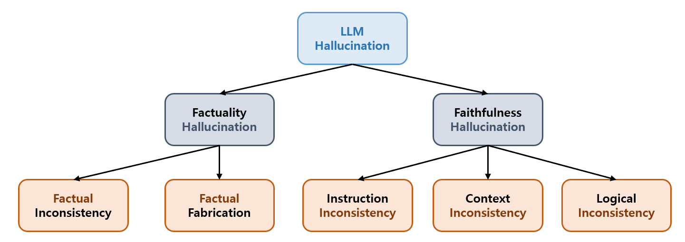
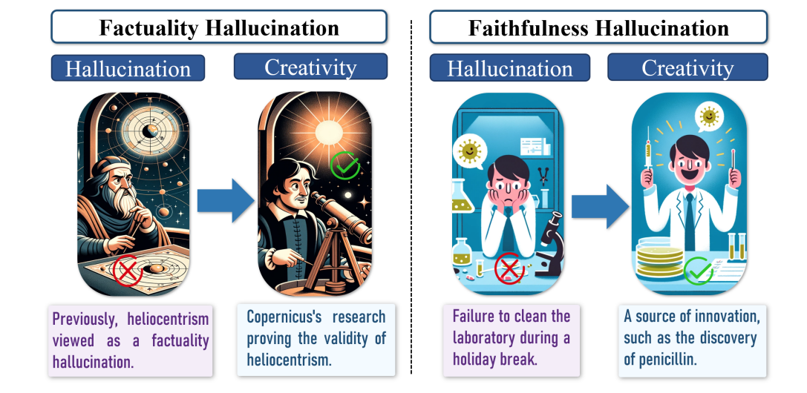
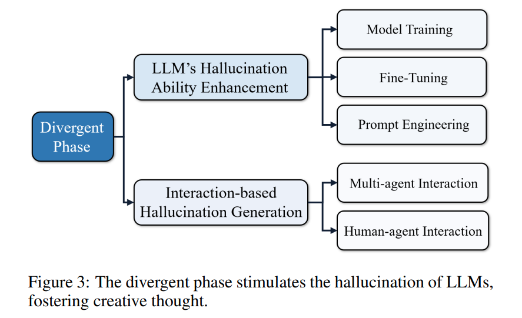
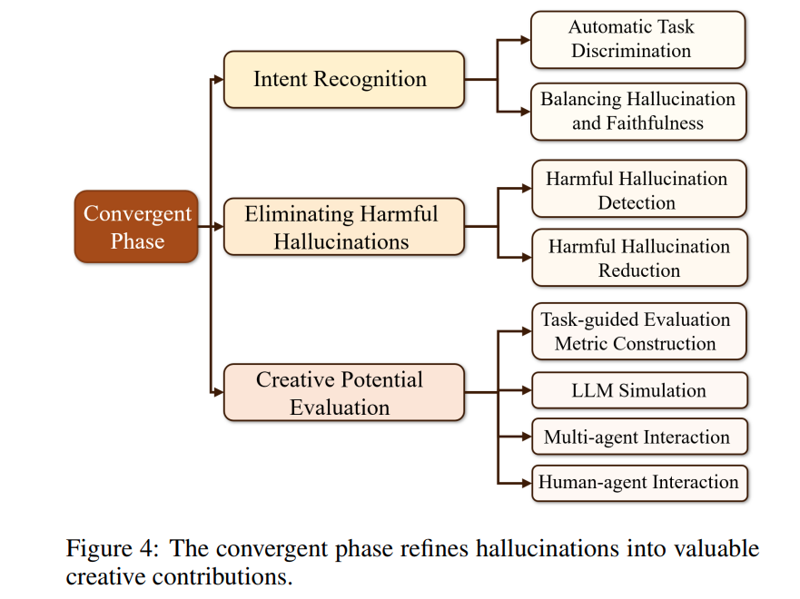

## 목차

* [1. LLM 의 Hallucination (환각 현상) 요약](#1-llm-의-hallucination-환각-현상-요약)
  * [1-1. Hallucination 의 분류](#1-1-hallucination-의-분류)
  * [1-2. Hallucination 의 탐지](#1-2-hallucination-의-탐지)
  * [1-3. Hallucination 의 제거](#1-3-hallucination-의-제거)
* [2. Hallucination 이 LLM 의 창의성을 나타내는 이유](#2-hallucination-이-llm-의-창의성을-나타내는-이유)
  * [2-1. LLM 의 환각 현상은 항상 나쁜가?](#2-1-llm-의-환각-현상은-항상-나쁜가)
  * [2-2. 창의성의 정의](#2-2-창의성의-정의)
  * [2-3. LLM 의 창의성의 평가 방법](#2-3-llm-의-창의성의-평가-방법)
* [3. LLM 의 Hallucination 을 창의적 도구로 이용하는 방법](#3-llm-의-hallucination-을-창의적-도구로-이용하는-방법)
  * [3-1. Divergent Phase](#3-1-divergent-phase)
  * [3-2. Convergent Phase](#3-2-convergent-phase)

## 논문 소개

* Xuhui Jiang, Yuxing Tian et al., "A Survey on Large Language Model Hallucination via a Creativity Perspective", 2024
* [arXiv Link](https://arxiv.org/pdf/2402.06647)

## 1. LLM 의 Hallucination (환각 현상) 요약

이 논문에서는 [환각 현상](../../AI%20Basics/LLM%20Basics/LLM_기초_환각_현상.md) 을 **LLM 이 잘못되거나 관련 없는 정보를 생성하는 현상** 으로 정의한다.

* 환각 현상의 원인
  * 잘못된 정보
  * Alignment process ([Fine Tuning](../../AI%20Basics/LLM%20Basics/LLM_기초_Fine_Tuning.md) 등) 의 오류
* 환각 현상의 심각성
  * LLM 이 대중화됨에 따라 환각 현상은 **반드시 해결해야 하는 문제 중 하나** 로 떠오르고 있다. 

| 구분        | 설명                                                                                                                                                                                                                                                                                                         |
|-----------|------------------------------------------------------------------------------------------------------------------------------------------------------------------------------------------------------------------------------------------------------------------------------------------------------------|
| 환각 현상의 분류 | - **factuality** hallucination 과 **faithfulness** hallucination 으로 구분 - **factuality** hallucination 은 factual **inconsistency** 와 factual **fabrication** 의 형태로 구분 - **faithfulness** hallucination 은 LLM 이 **사용자의 지시 또는 문맥에 맞지 않는** 내용을 생성하는 것                                                     |
| 환각 현상의 탐지 | - **factuality** hallucination 은 **외부 정보/지식** 을 활용하는 전략 사용 - **faithfulness** hallucination 은 **Classifier-based, QA-based, prompting-based metric** 을 이용하여 탐지                                                                                                                                          |
| 환각 현상의 제거 | - [RLHF (Reinforcement Learning from Human Feedback)](../../AI%20Basics/LLM%20Basics/LLM_기초_Fine_Tuning_DPO_ORPO.md#1-1-rlhf-reinforcement-learning-from-human-feedback) 의 학습 단계에서는, Hallucination 제거를 위한 reward score 를 사용 - inference 단계에서는, **외부 정보/지식을 추출하여 decoding (문장 생성) 에 적용** 하는 방법이 사용될 수 있음 |

### 1-1. Hallucination 의 분류

환각 현상은 다음과 같이 분류할 수 있다.

* 기본적인 분류

| 분류                             | 설명                                    |
|--------------------------------|---------------------------------------|
| **factuality** hallucination   | LLM 이 생성한 내용이 **실제 현실의 사실과 다름**       |
| **faithfulness** hallucination | LLM 이 **사용자의 지시 또는 문맥에 맞지 않는** 내용을 생성 |

* Factuality Hallucination 의 형태 분류

| Factuality Hallucination 의 형태 | 설명                                                                           |
|-------------------------------|------------------------------------------------------------------------------|
| factual **inconsistency**     | LLM 이 생성한 내용이 **실제 현실의 사실과 직접적으로 모순** 됨                                      |
| factual **fabrication**       | LLM 이 해당 내용에 대한 지식을 갖고 있지 않아서, 현실의 지식을 기반으로 생성할 수 없기에 **아무렇게나 정보를 생성** 하는 현상 |

* Faithfulness Hallucination 의 형태 분류

| Faithfulness Hallucination 의 형태 | 설명                                                                                   |
|---------------------------------|--------------------------------------------------------------------------------------|
| **instruction** inconsistency   | LLM 이 생성한 내용이 사용자의 특정한 지시와 맞지 않음                                                     |
| **context** inconsistency       | LLM 이 생성한 내용이 **주어진 상황** 을 고려할 때 **무관하거나 부적절** 함                                     |
| **logical** inconsistency       | LLM 이 추론 과정에 대한 내용을 생성할 때, 그 **추론 과정에 오류** 가 있거나, 또는 **추론 과정과 최종 출력에 mismatch 가 있음** |

**LLM 환각 현상의 분류 관련 추가 논문**

| 논문                                                                                                                              | 설명                                                            |
|---------------------------------------------------------------------------------------------------------------------------------|---------------------------------------------------------------|
| [Survey of Hallucination in Natural Language Generation (2022.02)](https://arxiv.org/pdf/2202.03629)                            | 환각 현상을 intrinsic / extrinsic 으로 분류                            |
| [Neural Path Hunter: Reducing Hallucination in Dialogue Systems via Path Grounding (2021.04)](https://arxiv.org/pdf/2104.08455) | 환각 현상을 intrinsic / extrinsic 으로 분류                            |
| [Siren's song in the ai ocean: A survey on hallucination in large language models (2023.09)](https://arxiv.org/pdf/2309.01219)  | 환각 현상을 conflict 에 따라 input / context / fact conflicting 으로 분류 |
| [Cognitive Mirage: A Review of Hallucinations in Large Language Models (2023.09)](https://arxiv.org/pdf/2309.06794)             | 다양한 LLM 응용 task (번역, 요약, 질문-답변 등) 에서의 환각 현상들을 요약              |
| [A Survey of Hallucination in "Large" Foundation Models (2023.09)](https://arxiv.org/pdf/2309.05922)                            | 각종 LLM (multilingual, domain-specific) 에서의 환각 현상을 분류          |

### 1-2. Hallucination 의 탐지

**1. 기본적인 환각 현상 탐지 전략**

* 환각 현상의 종류별로 기본적인 탐지 전략은 다음과 같이 알려져 있다.

| 환각 현상의 종류                      | 탐지 전략                                                                      |
|--------------------------------|----------------------------------------------------------------------------|
| **Factuality** Hallucination   | - 외부 정보를 추출하여 활용 - 정보의 불확실성을 파악하는 AI 를 구현                               |
| **Faithfulness** Hallucination | - Classifier-based Metric - QA-based Metric - Prompting-based Metric |

* Generation & Discrimination 을 이용한 탐지 전략은 다음과 같다.

| 구분             | 설명                                                                  |
|----------------|---------------------------------------------------------------------|
| Generation     | - 환각 현상을 LLM 의 문장 생성이 갖는 **일종의 특징** 으로 간주 - LLM 이 생성한 텍스트에 대해 평가 |
| Discrimination | - LLM 이 **진짜 정보와 환각 현상을 구분** 할 수 있는 성능을 평가                          |

**2. 환각 현상 탐지 관련 추가 방법론**

| 방법론               | 설명                                                                                                            |
|-------------------|---------------------------------------------------------------------------------------------------------------|
| HaluEval (2023)   | - 환각 현상에 해당하는 데이터셋을 이용하여 LLM의 환각 현상 탐지 성능 평가 - **외부 지식 또는 추론 과정** 을 추가하면 성능이 좋아짐                           |
| TruthfulQA (2022) | - 법률, 경제, 정치 등 다양한 분야에서의 환각 현상 평가                                                                             |
| Med-HALT (2023)   | - **Reasoning** Hallucination Tests (RHTs) & **Memory** Hallucination Tests (MHTs) 의 2가지 방법을 결합하여 환각 현상 여부 평가 |

### 1-3. Hallucination 의 제거

* 환각 현상의 제거 방법으로는 다음과 같은 것들이 알려져 있다.

| 논문                                                                                                                                   | 설명                                                                                                                                                                                                                                                                         |
|--------------------------------------------------------------------------------------------------------------------------------------|----------------------------------------------------------------------------------------------------------------------------------------------------------------------------------------------------------------------------------------------------------------------------|
| [Siren's song in the ai ocean: A survey on hallucination in large language models (2023.09)](https://arxiv.org/pdf/2309.01219)       | LLM 의 **Lifecycle 중 현재 시점** 에 따라 적절한 전략 적용 - 예를 들어, [RLHF (Reinforcement Learning from Human Feedback)](../../AI%20Basics/LLM%20Basics/LLM_기초_Fine_Tuning_DPO_ORPO.md#1-1-rlhf-reinforcement-learning-from-human-feedback) 에서 강화학습 중의 경우, 환각 현상을 탐지하는 reward score 를 적용 |
| [Cognitive Mirage: A Review of Hallucinations in Large Language Models (2023.09)](https://arxiv.org/pdf/2309.06794)                  | 다음을 포함한 5가지의 환각 현상 제거 방법 제안 - parameter adaption - 외부 정보 활용                                                                                                                                                                                                          |
| [A comprehensive survey of hallucination mitigation techniques in large language models (2024.01)](https://arxiv.org/pdf/2401.01313) | 다음 방법을 이용한 환각 현상 제거 - [프롬프트 엔지니어링](../../AI%20Basics/LLM%20Basics/LLM_기초_Prompt_Engineering.md) - [RAG (Retrieval Augmented Generation)](../../AI%20Basics/LLM%20Basics/LLM_기초_RAG.md)                                                                               |

* 위 논문에 제시된 것 외에도 다음과 같은 방법이 있다.
  * KG (Knowledge Graph) 를 활용한 외부 정보 retrieval

## 2. Hallucination 이 LLM 의 창의성을 나타내는 이유

* LLM 의 환각 현상은 **항상 나쁜 것만은 아니고, LLM의 창의성을 나타내는 부분** 이라는 견해가 있다.
* LLM 의 창의성을 평가하기 위해, **사람의 창의성에 대한 평가 방법을 LLM에 적용** 하는 연구와 **사람이 아닌 LLM의 창의성을 따로 평가하는 방법** 에 대한 연구가 있다.

### 2-1. LLM 의 환각 현상은 항상 나쁜가?

LLM 의 환각 현상은 일반적으로 방지해야 할 것으로 알려져 있지만, **환각 현상이 과연 항상 나쁜 것인가? 환각 현상이 LLM의 창의성을 드러내는 것은 아닐까?**

* 역사적으로 **실수를 통해 창의적인 발명/발견이 등장** 하는 사례가 여럿 있다.
  * 이는 Factuality Hallucination & Faithfulness Hallucination 의 **실제 사람의 예** 에 해당한다고 할 수 있다.

[(출처)](https://arxiv.org/pdf/2402.06647) : Xuhui Jiang, Yuxing Tian et al., "A Survey on Large Language Model Hallucination via a Creativity Perspective"

* 실제로도 **LLM 의 환각 현상과 LLM의 창의성 간의 상호 작용** 에 대한 연구가 이루어지고 있다.
  * OpenAI의 CEO 샘 올트먼은 **LLM의 환각 현상은 LLM이 창의성을 발현하는 기반** 이라고 주장하기도 했다.

| 연구 사례 (논문)                                                                                                                     | 설명                                    |
|--------------------------------------------------------------------------------------------------------------------------------|---------------------------------------|
| [A mathematical investigation of hallucination and creativity in gpt models (2023)](https://www.mdpi.com/2227-7390/11/10/2320) | LLM의 환각 현상과 창의성을 연결하는 이론적 근거 제시       |
| [LightHouse: A Survey of AGI Hallucination (2024.01)](https://arxiv.org/pdf/2401.06792)                                        | LLM의 환각 현상과 창의성 간 상호 작용은 도움이 됨        |
| [A Survey of Hallucination in "Large" Foundation Models (2023.09)](https://arxiv.org/pdf/2309.05922)                           | 환각 현상이 발생하는 LLM을 **창의적인 협업 파트너** 라고 함 |

### 2-2. 창의성의 정의

* 창의성은 **정의하기 위한 관점이 매우 다양** 하다.
* 이들 관점 중에서도 잘 알려진, 창의성에 대해 연구자들이 주장한 정의는 다음과 같다.

| 연구자                        | 창의성의 정의                                             |
|----------------------------|-----------------------------------------------------|
| Khatena and Torrance, 1973 | 아이디어, 생각 등을 일반적이지 않은 방법으로 구성하고, 상상력을 통해 이들을 연결하는 능력 |
| Gardner, 2011              | 새롭지만 적용 가능한 방법으로 문제를 해결하고, 새로운 질문을 창조하는 능력          |

### 2-3. LLM 의 창의성의 평가 방법

* LLM 의 '창의성'을 평가하는 방법이 다음과 같이 연구되고 있다. 
* 핵심 질문은 **인간의 창의성을 평가하는 방법을 어떻게 하면 LLM의 창의성 평가에 효과적으로 적용할 수 있는지** 이다.
* LLM 의 창의성 평가 방법을 크게 나누면 다음과 같다.
  * **인지과학에서 말하는, 사람의 창의성을 평가하는 방법** 을 LLM 에 적용한다.
  * **사람이 아닌 LLM 의 창의성을 평가하는 방법** 을 새롭게 정의, 설계하여 사용한다.

**1. 사람의 창의성을 평가하는 방법을 LLM 에 적용한 사례**

| 연구 사례 (논문)                                                                                                                                                                                   | 설명                                                                              |
|----------------------------------------------------------------------------------------------------------------------------------------------------------------------------------------------|---------------------------------------------------------------------------------|
| [Putting gpt-3’s creativity to the alternative uses test (2022.06)](https://arxiv.org/pdf/2206.08932)                                                                                        | - 사람과 GPT-3 이 새롭고 유용한 답변을 생성하도록 함 - **AI보다는 사람이 창의적인 답변을 더 잘 생성** 한다는 결론에 이름 |
| [Brainstorm, then select: a generative language model improves its creativity score (2023)](https://openreview.net/pdf?id=8HwKaJ1wvl)                                                        | - 미리 생성된 응답 중 **참신하고 유용한 응답을 선택** 하도록 하는 prompt 를 고안                            |
| [Large Language Models are Fixated by Red Herrings: Exploring Creative Problem Solving and Einstellung Effect with the OnlyConnect Wall Dataset (2023.06)](https://arxiv.org/pdf/2306.11167) | - 퀴즈 쇼에서 출제된 문제를 수집하여 **창의적 문제 해결력을 평가하는 데이터셋** 고안                              |
| [Is artificial intelligence more creative than humans? ChatGPT and the Divergent Association Task (2023.09)](https://learningletters.org/index.php/learn/article/view/13)                    | - **DAT (Divergent thinking tests) task** 를 이용하여 GPT-4 와 GPT-3.5 의 창의성을 인간과 비교  |
| [Pushing GPT’s Creativity to Its Limits: Alternative Uses and Torrance Tests (2023)](https://computationalcreativity.net/iccc23/papers/ICCC-2023_paper_90.pdf)                               | - **GPT-4 가 자동적으로 자신의 창의성을 향상** 시키는 혁신적인 상호 작용형 방법 고안                           |
| [The originality of machines: AI takes the Torrance Test (2023.12)](https://www.sciencedirect.com/science/article/pii/S2713374523000249)                                                     | - **Torrance Tests of Creative Thinking (TTCT)** 을 이용하여 GPT-4 의 창의성 평가          |

**2. 사람이 아닌 LLM 의 창의성을 평가하는 방법을 정의, 설계하여 적용한 사례**

| 연구 사례 (논문)                                                                                                                     | 설명                                                                                         |
|--------------------------------------------------------------------------------------------------------------------------------|--------------------------------------------------------------------------------------------|
| [LightHouse: A Survey of AGI Hallucination (2024.01)](https://arxiv.org/pdf/2401.06792)                                        | - **인간이 생성한 데이터에 LLM 을 적절히 fitting** 할 수 있는 경우를 가정 - 이때, LLM 은 인간만큼 창의력을 가질 수 있음        |
| [A mathematical investigation of hallucination and creativity in GPT models (2023)](https://www.mdpi.com/2227-7390/11/10/2320) | - LLM 의 창의성과 환각 현상 간의 **trade-off 를 수학적으로 표현** - LLM 의 환각 현상을 분석하는 **엄밀한 수학적 방법론** 을 개발 |

## 3. LLM 의 Hallucination 을 창의적 도구로 이용하는 방법

* 이 부분의 핵심 질문은 **어떻게 하면 LLM의 환각 현상을 위험을 최대한 줄이면서 창의적인 사고를 위한 도구로 활용할 수 있는지** 이다.
* 그 방법은 다음과 같이 크게 2가지로 구분된다.

| 방법               | 설명                                                                                                    |
|------------------|-------------------------------------------------------------------------------------------------------|
| Divergent Phase  | LLM의 환각 현상을 **사용자가 입맛에 맞게 창의적인 작업을 위해 사용** 할 수 있도록 **추가적인 작업** (Fine-Tuning, Prompt Engineering 등) 실시 |
| Convergent Phase | LLM의 환각 현상을 **혁신적이고 적용 가능한 아이디어로 변환**                                                                 |

### 3-1. Divergent Phase

[(출처)](https://arxiv.org/pdf/2402.06647) : Xuhui Jiang, Yuxing Tian et al., "A Survey on Large Language Model Hallucination via a Creativity Perspective"

* **Divergent Phase** 는 LLM의 환각 현상을 **창의적인 작업에 사용할 수 있도록 추가 작업** 을 하는 것을 말한다.
* Divergent Phase 의 방법론은 다음과 같다.
  * **환각 현상 성능 향상** 은 LLM 이 '도움이 되는' 환각 현상을 발생시키는 '능력'을 향상시키는 것을 의미한다.

| 방법론 분류           | 방법론                     | 설명                                                                                                       |
|------------------|-------------------------|----------------------------------------------------------------------------------------------------------|
| 환각 현상 성능 향상      | 모델 학습                   |                                                                                                          |
| 환각 현상 성능 향상      | Fine-Tuning             |                                                                                                          |
| 환각 현상 성능 향상      | 프롬프트 엔지니어링              |                                                                                                          |
| 상호작용 기반 환각 현상 생성 | Multi-agent Interaction | - **여러 개의 agent 간 상호 작용** 을 통해, LLM 이 다양하고 창의적인 답변을 생성하게 함                                               |
| 상호작용 기반 환각 현상 생성 | Human-agent Interaction | - 인간의 창의성이 **LLM 이 '도움이 되는 환각 현상'을 발생** 시킬 수 있도록 함 - 역으로, LLM의 '도움이 되는 환각 현상'이 인간의 창의성을 발현시키는 데 도움이 됨 |

### 3-2. Convergent Phase

[(출처)](https://arxiv.org/pdf/2402.06647) : Xuhui Jiang, Yuxing Tian et al., "A Survey on Large Language Model Hallucination via a Creativity Perspective"

* **Convergent Phase** 는 LLM의 환각 현상을 **혁신적이면서도 활용 가능한 아이디어로 변환** 시키는 것이다.
* Convergent Phase 의 방법론은 다음과 같다.
  * **Intent Recognition** 은 prompt 를 통해 사용자가 무엇을 원하는지 파악하는 것을 의미한다.

| 방법론 분류             | 방법론                           | 설명                                                                                                                                   |
|--------------------|-------------------------------|--------------------------------------------------------------------------------------------------------------------------------------|
| Intent Recognition | Automatic Task Discrimination | 비교적 긴급성이 높은 연구 분야                                                                                                                    |
| Intent Recognition | 환각 현상과 Faithfulness 를 밸런싱     |                                                                                                                                      |
| 해로운 환각 현상 제거       | 해로운 환각 현상 탐지                  | [이 부분](#1-2-hallucination-의-탐지) 에서 언급된 방법들은 **도움이 되는 환각 현상** 에 대한 고려가 부족함                                                            |
| 해로운 환각 현상 제거       | 해로운 환각 현상 제거                  | 상동                                                                                                                                   |
| 잠재된 창의성에 대한 평가     | Task 기반 LLM 평가 metric         |                                                                                                                                      |
| 잠재된 창의성에 대한 평가     | LLM 시뮬레이션                     | 참고 논문 : [Empowering agents with imagination for creative tasks (2023.12)](https://arxiv.org/pdf/2312.02519)                          |
| 잠재된 창의성에 대한 평가     | Multi-agent Interaction       | 참고 논문 : [Chateval: Towards better llm-based evaluators through multi-agent debate (2023.08)](https://arxiv.org/pdf/2308.07201)       |
| 잠재된 창의성에 대한 평가     | Human-agent Interaction       | 참고 논문 : [Supermind ideator: Exploring generative AI to support creative problem-solving (2023.11)](https://arxiv.org/pdf/2311.01937) |

