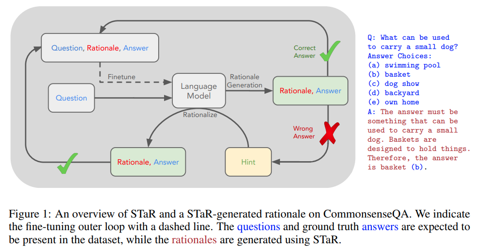

## 목차

* [1. 기존 Autoregressive LLM 의 도전 과제](#1-기존-autoregressive-llm-의-도전-과제)
  * [1-1. Next token prediction 의 기본 메커니즘](#1-1-next-token-prediction-의-기본-메커니즘)
  * [1-2. Next token prediction 에 의한 LLM 지능의 upper bound](#1-2-next-token-prediction-에-의한-llm-지능의-upper-bound) 
  * [1-3. LLM 의 O(n^2) 의 너무 큰 시간 복잡도](#1-3-llm-의-on2-의-너무-큰-시간-복잡도)
* [2. Markov Model 을 이용한 LLM 추론](#2-markov-model-을-이용한-llm-추론)
  * [2-1. LLM 추론 과정 상세](#2-1-llm-추론-과정-상세)
  * [2-2. Text Generation 과 추론의 관계](#2-2-text-generation-과-추론의-관계)
* [3. 실제 구현 방식](#3-실제-구현-방식)
  * [3-1. Reasoning step 의 자동 생성 (STaR)](#3-1-reasoning-step-의-자동-생성-star)
  * [3-2. Self-reinforced Training](#3-2-self-reinforced-training)
  * [3-3. Inference 시점에서의 연산](#3-3-inference-시점에서의-연산)
* [4. 실제 연구 사례](#4-실제-연구-사례)

## 논문 소개

* Jun Wang, "A Tutorial on LLM Reasoning: Relevant Methods behind ChatGPT o1", 2025
* [arXiv Link](https://arxiv.org/pdf/2502.10867)
* 참고하면 좋은 문서
  * [추론형 LLM](../../AI%20Basics/LLM%20Basics/LLM_기초_추론형_모델.md) 
  * [추론형 LLM 중 DeepSeek-R1 모델에 대한 논문 스터디 자료](%5B2025.03.13%5D%20DeepSeek-R1%20-%20Incentivizing%20Reasoning%20Capability%20in%20LLM%20via%20Reinforcement%20Learning.md)

## 1. 기존 Autoregressive LLM 의 도전 과제

* GPT 와 같은 LLM 에서는 기존 token 에 근거하여 next token 을 확률분포에서 샘플링하는 **Next token prediction** 을 사용한다.
* 그러나, 이는 다음과 같은 문제점이 있다.
  * LLM 의 지능을 일정 수준을 넘어서 올리기 어렵다. (upper bound)
  * 시간 복잡도가 $O(n^2)$ 으로 매우 크다.

### 1-1. Next token prediction 의 기본 메커니즘

GPT 와 같은 현대의 LLM 에서 많이 사용하는 방법인 **Next token prediction** 의 기본 메커니즘은 **이전 token 들에 기반한 확률분포에서 next token 을 sampling** 하는 것이다.

* token 집합 $X$ 에 대한 joint probability
  * $\displaystyle P(X) = P(x_1, x_2, ..., x_T) = \Pi_{t=1}^T P(x_t|x_1, x_2, ..., x_{t-1})$ 
  * 각 token $x_t$ 는 이전 토큰 $x_1, x_2, ..., x_{t-1}$ 에 근거하여 예측

* inference 시의 text generation
  * $P(X) = P(x_1) \times P(x_2|x_1) \times P(x_3|x_1, x_2) \times ...$ 
  * 각 step $t$ 에서, next token $x_t$ 를 $(x_1, x_2, ..., x_{t-1})$ 에 근거하여 예측 

### 1-2. Next token prediction 에 의한 LLM 지능의 upper bound

위와 같은 메커니즘을 통해서 **LLM 의 지능을 향상시키는 데에는 한계 (upper bound)** 가 있다.

* 이는 마치 체스의 다음 수를 next token prediction 처럼 학습하면, **일반적인 체스 플레이어의 실수도 next token prediction 방식의 model 이 학습** 하게 됨
  * 즉, 이 경우 **체스 실력 향상에 한계** 가 있음
* 따라서, 이를 극복하려면 **무엇인가 혁신적인 전략** 필요

### 1-3. LLM 의 O(n^2) 의 너무 큰 시간 복잡도

GPT 와 같이 Next token prediction 메커니즘을 사용하는 LLM 은 기본적으로 **$O(n^2)$ 의 너무 큰 시간 복잡도** 로 연산한다. 그 해결 방법으로 [CoT (Chain of Thought)](../../AI%20Basics/LLM%20Basics/LLM_기초_Chain_of_Thought.md) 가 있다.

* CoT 는 **LLM 의 답변에 추론 과정을 포함시키는** 것이다.
* 그러나 결국 **쓰기만 되고 덮어쓰기, 삭제는 안 되는 제한된 메모리** 로서만 기능하므로, fully dynamic memory 시스템에는 적용하기 어렵다.
* 따라서 CoT 를 대체하는 해결 방법인 **Monte Carlo Tree Search (MCTS)** 와 같은 것이 필요하다.

## 2. Markov Model 을 이용한 LLM 추론

Problem Solving 과 같은 task 에서 **Reasoning task 를 다음과 같이 **Q → {R} → A** 로 나타낼 수 있다.**

| Q                    | R                    | A                       |
|----------------------|----------------------|-------------------------|
| 추론 대상 **질문 또는 프롬프트** | 중간의 **추론 과정** (의 집합) | 추론 과정을 통해 도출된 **최종 답변** |

[(출처)](https://arxiv.org/pdf/2502.10867) : Jun Wang, "A Tutorial on LLM Reasoning: Relevant Methods behind ChatGPT o1"

* 모델 학습 및 추론
  * answer $a_0$, $a_1$,..., $a_{n-1}$ 은 **LLM 의 policy** 에 의해 선택되며, **process-reward model (PRM)** 에 의해 점수가 매겨진다.
  * **PRM 에 의한 reward 를 최대화** 하는 방향으로 학습된다.
* 위와 같은 추론 과정을 **Markov Decision Process (MDP)** 를 이용하여 정의할 수 있다.
  * MDP 는 **모델이 Autoregressive 하게 추론 과정을 생성** 할 수 있도록 한다.
  * MDP 를 이용하면, 또한 **tree 구조의 여러 갈래의 추론 과정** 생성도 가능하다.

### 2-1. LLM 추론 과정 상세

**1. notation 정의**

| notation            | 설명                                                                          |
|---------------------|-----------------------------------------------------------------------------|
| $s_t$               | - timestep $t$ 에서의 state - $s_t = (Q, R_1, ..., R_{t-1})$ - $s_0 = Q$ |
| $R_1, ..., R_{t-1}$ | - timestep $t$ 까지의 추론 과정의 step                                              |
| $a_t \in A$         | - timestep $t$ 에서의 action, 즉 **다음 추론 과정 선택**                                |
| $A$                 | - action space - 추론 과정 (R) 과 최종 답변 (A) 의 2가지 종류의 action 포함               |

**2. 추론을 위한 LLM policy**

* LLM policy $\pi$
  * 모델이 **현재 상태** 에서 **다음 action (추론 과정 또는 최종 답변) 을 선택** 하기 위한 전략
  * $\pi_{LLM}(a_t|s_t) = P(a_t|Q, R_1, ..., R_{t-1})$
  * 각 timestep 에 대해, 이 policy 에 기반하여 next action 을 선택한다.
* next state $s_{t+1}$
  * 현재 상태 $s_t$ 에 선택된 action $a_t$ 를 **단순히 append** 한다.
  * $s_{t+1} = s_t + a_t$

| 구분                | action                       | new state                             |
|-------------------|------------------------------|---------------------------------------|
| intermediate step | $a_t = R_t$                  | $s_{t+1} = s_t + R_t$                 |
| final step        | $a_T = A$ (**final** answer) | $s_T = s_{T-1} + A$ (**final** state) |

**3. 추론 과정의 생성**

위 방법을 이용하여 추론 과정을 생성하는 방법은 다음과 같다.

* next state $s_{t+1}$
  * $s_{t+1} = s_t + a_t$ (just append)
  * $s_{t+1}$ 은 결국 **현재까지의 token sequence 의 concatenation** 임
* reward feedback

| Reward              | 설명                                                                                     | Reward 수식                                 |
|---------------------|----------------------------------------------------------------------------------------|-------------------------------------------|
| Intermediate Reward | - **정답** 또는 **의미 있는 추론 과정** 생성 시 + (positive) - 오답 또는 의미 없는 추론 과정 생성 시 - (negative) | $v_t = v(R_t \vert Q, R_1, ..., R_{t-1})$ |
| Final Reward        | - 모델이 **최종 정답 $A$** 를 생성할 때, **가장 큰 reward** 를 적용                                      | $v_T = v(A \vert Q, R_1, ..., R_n)$       |

### 2-2. Text Generation 과 추론의 관계

**1. Text Generation 과 추론의 관계**

* LLM 은 다음과 같이 동작한다.

| Level              | LLM 동작                                                                                     | 관련 수식                                    |
|--------------------|--------------------------------------------------------------------------------------------|------------------------------------------|
| token generation   | next token generation 의 방식 사용                                                              | $P(x_t \vert x_1, x_2, ..., x_{t-1})$    |
| reasoning step (R) | 각 reasoning step $R_t$ 를 구성하는 token 은 **잘 짜인 추론 과정 (중간 결론 등)** 을 나타냄                       | $R_t = {x_{t_1}, x_{t_2}, ..., x_{t_k}}$ |
| final answer (A)   | token 들은 **최종 결론** 을 나타냄 - LLM 이 추론 과정을 충분히 거치면, 이후 **Autoregressive 방법으로 최종 결론을 도출** 함 |                                          |

**2. LLM 의 world model 의 정의**

* LLM 의 World Model 은 다음과 같이 정의된다.

| 구성 요소                                          | 정의 및 설명                                                                                | 관련 수식                 |
|------------------------------------------------|----------------------------------------------------------------------------------------|-----------------------|
| $T(s_t, a_t)$ : **Transition Model**           | next state $s_{t+1}$ 은 현재 상태 $s_t$ 와 action $a_t$ 를 이용하여 정의됨                           | $s_{t+1} = s_t + a_t$ |
| $V(s_t, a_t)$ : **Process-Reward Model (PRM)** | 현재 상태 $s_t$ 에 대해, action $a_t$ 에 대한 **품질 (생성된 reasoning step 이 최종 답변에 가까워지는 방향인지)** 평가 | $V(s_t, a_t) = v_t$   |

## 3. 실제 구현 방식

* 추론형 LLM 의 Fine-Tuning 을 위해 **일반적으로 {Q, A} pair 로 학습하고, 추론 과정 {R} 에 대한 ground truth 데이터는 잘 사용하지 않는다.**
* **{R} 을 사람이 직접 만드는** 경우도 있지만, LLM 에 의해 추론 과정을 자동 생성하는 효과적인 방법이 있다.

| 방법론 (모델)                    | 핵심 아이디어                                             |
|-----------------------------|-----------------------------------------------------|
| Self-Taught Reasoner (STaR) | 모델의 **자체 Policy** 를 이용하여 reasoning step 생성 및 정확도 평가 |
| Self-reinforced Training    |                                                     |

### 3-1. Reasoning step 의 자동 생성 (STaR)

**Self-Taught Reasoner (STaR)** 의 핵심 아이디어는 다음과 같다.

* LLM 의 자체 Policy $\pi_{LLM}$ 에 의해, intermediate reasoning step $\lbrace R_1, R_2, ..., R_n \rbrace$ 생성
* 생성된 reasoning step 에 대해, **모델의 자체 Policy 를 이용하여 정확도 평가**

[(출처)](https://arxiv.org/pdf/2203.14465) : Eric Zelikman and Yuhuai Wu et al., "STaR: Self-Taught Reasoner Bootstrapping Reasoning With Reasoning"

**1. Reasoning Step 생성**

* LLM 은 질문 $Q$, 답변 $A$ 에 대해 **자체 Policy $\pi_{LLM}$ 을 이용하여 Reasoning Step 을 생성** 한다.

| notation               | 설명                                                                                                                                                                                                                   |
|------------------------|----------------------------------------------------------------------------------------------------------------------------------------------------------------------------------------------------------------------|
| $\pi_{LLM}$            | **Reasoning step 생성** 을 위한, LLM 의 **Policy**                                                                                                                                                                         |
| $\lbrace R_1, R_2, ..., R_n \rbrace$ | intermediate reasoning steps - **질문 $Q$ 를 정답 $A$ 로 연결** 하는 것을 목표로 함 - **추론 과정을 단계적으로 분해** 하는 개념 ([CoT (Chain of Thought)](../../AI%20Basics/LLM%20Basics/LLM_기초_Chain_of_Thought.md) 와 유사) 으로, 복잡한 문제 해결에 필수적임 |

* 수식
  * $\lbrace R \rbrace \sim \pi_{LLM}(·|Q, A)$ 

**2. 생성된 Reasoning Step 의 정확도 평가**

* 핵심 아이디어
  * 마찬가지로 LLM 의 자체 Policy $\pi_{LLM}$ 을 이용
  * Reasoning steps $\lbrace R_1, R_2, ..., R_n \rbrace$ 가 **질문 $Q$ 와 결합했을 때 정답 $A$ 방향으로 이어지는지** 를 평가

* 수식 및 설명
  * 수식
    * $A' \sim \pi_{LLM}(·|Q, \lbrace R \rbrace)$
  * 수식 설명
    * $A'$ : $Q$ 와 $\lbrace R \rbrace$ 에 대한, LLM 의 answer prediction
    * $A'$ 와 정답 $A$ 가 **서로 매칭될 때 ${R}$ 이 유효** 하다고 판단

**3. Policy $\pi_{LLM}$ 의 갱신**

* 핵심 아이디어
  * 위 과정에 의해 생성된 정보 $\lbrace Q, \lbrace R \rbrace, A \rbrace$ 를 이용하여 Policy $\pi_{LLM}$ 를 업데이트
  * 이를 통해 **reasoning step 생성 능력을 향상** 시킴
* 수식
  * $\pi_{LLM} ← \pi_{LLM} + feedback from \lbrace Q, \lbrace R \rbrace, A \rbrace$

### 3-2. Self-reinforced Training

### 3-3. Inference 시점에서의 연산

## 4. 실제 연구 사례
