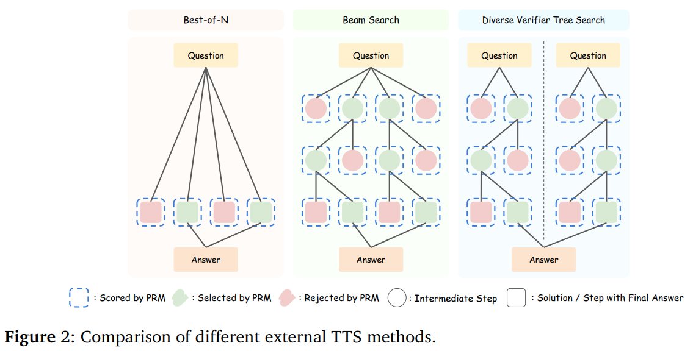
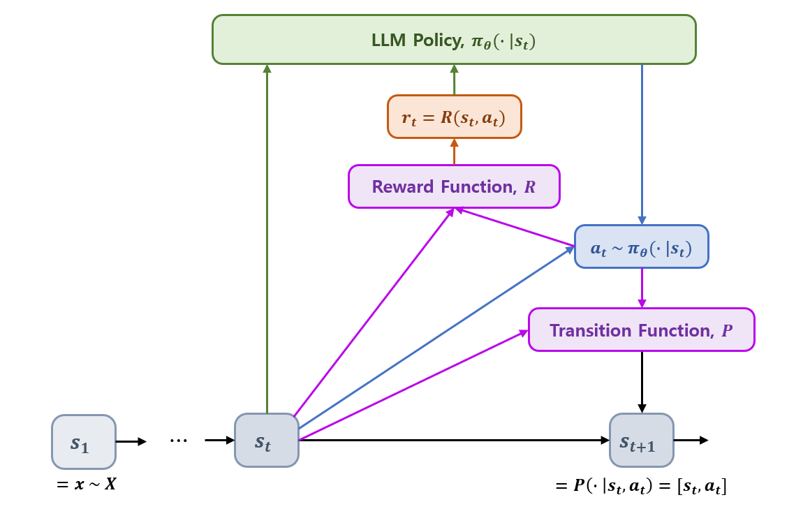
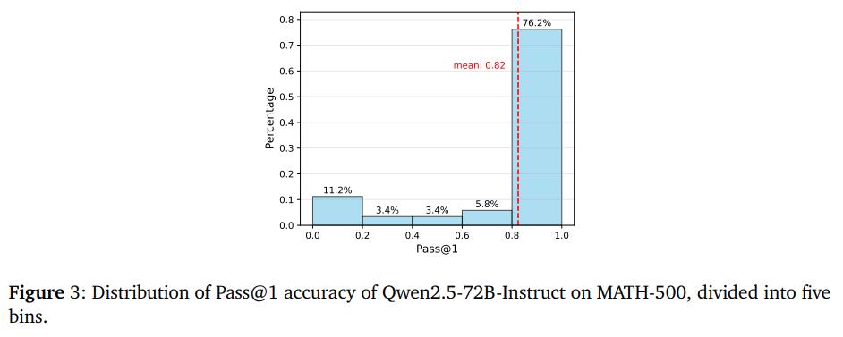

## 목차

* [1. Problem Definition](#1-problem-definition)
  * [1-1. Test-Time Scaling (TTS)](#1-1-test-time-scaling-tts)
  * [1-2. Reasoning (추론) Problem Formulation](#1-2-reasoning-추론-problem-formulation)
* [2. Compute-Optimal Test Time Scaling](#2-compute-optimal-test-time-scaling)
  * [2-1. Compute-Optimal Scaling 은 Reward-Aware 방식이어야 함](#2-1-compute-optimal-scaling-은-reward-aware-방식이어야-함)
  * [2-2. Problem 의 난이도 기준은 Quantile 보다는 Absolute Threshold 가 좋음](#2-2-problem-의-난이도-기준은-quantile-보다는-absolute-threshold-가-좋음)
* [3. Optimal 한 Test-Time Compute 방법론](#3-optimal-한-test-time-compute-방법론)
  * [3-1. 실험 설정](#3-1-실험-설정)
  * [3-2. TTS 와 Policy Model & PRM 간 상호작용](#3-2-tts-와-policy-model--prm-간-상호작용)
  * [3-3. TTS 를 통한 다양한 난이도의 문제 해결 능력 향상](#3-3-tts-를-통한-다양한-난이도의-문제-해결-능력-향상)
  * [3-4. PRM 은 답변 길이 또는 voting 방법에 민감한가?](#3-4-prm-은-답변-길이-또는-voting-방법에-민감한가)
* [4. 실험 결과](#4-실험-결과)
  * [4-1. 작은 Policy Model 이 TTS 전략으로 큰 모델보다 성능이 좋아질 수 있는가?](#4-1-작은-policy-model-이-tts-전략으로-큰-모델보다-성능이-좋아질-수-있는가)
  * [4-2. Compute-Optimal TTS 의 CoT & Majority Voting 대비 장점](#4-2-compute-optimal-tts-의-cot--majority-voting-대비-장점)
  * [4-3. TTS 는 long-CoT 기반 방법론보다 효과적인가?](#4-3-tts-는-long-cot-기반-방법론보다-효과적인가)

## 논문 소개

* Runze Liu and Junqi Gao et al., "Can 1B LLM Surpass 405B LLM? Rethinking Compute-Optimal Test-Time Scaling", 2025
* [arXiv Link](https://arxiv.org/pdf/2502.06703)

## 1. Problem Definition

* **Test-Time Scaling (TTS)**
  * inference 시 추가 연산을 통해 성능을 향상시키는 방법론을 의미
* **LLM 의 Reasoning Problem**
  * Markov Decision Process (MDP) 를 이용
  * 현재까지 생성된 내용 $s_t$ 및 추가로 생성되는 내용 $a_t$ 에 의한 reward 로 LLM 의 Policy 를 학습 

### 1-1. Test-Time Scaling (TTS)

**Test-Time Scaling (TTS)** 은 **inference 시 추가적인 연산을 적용하여 LLM 의 성능을 향상** 시키는 방법론을 의미한다.

* 대표적인 TTS 방법론은 다음과 같다.

| TTS 방법론                      | 설명                                                                                                                                                                                                                       | 논문                                                                                                      |
|------------------------------|--------------------------------------------------------------------------------------------------------------------------------------------------------------------------------------------------------------------------|---------------------------------------------------------------------------------------------------------|
| Best-of-N                    | - N 개의 답변 생성<br>- scoring & voting 알고리즘을 이용하여 최종 답변 선택                                                                                                                                                                   | [Brown et al., 2024](https://arxiv.org/pdf/2407.21787)                                                  |
| Beam Search                  | 다음 과정을 max depth 또는 ```<EOS>``` token에 도달할 때까지 반복<br>- 먼저, LLM 이 **N 개의 step** 을 생성<br>- 그 다음으로, verifier 가 이들 중 **상위 (N / M) 개의 step** 을 **탐색 후보** 로 선정<br>- Policy Model 은 이들 선택된 각 step 에 대해, **M 개의 step** 을 **샘플링** | [Snell et al., 2024](https://arxiv.org/pdf/2408.03314)                                                  |
| Diverse Verifier Tree Search | - **Beam Search** 의 확장 버전<br>- 탐색 프로세스를 **N / M 개의 subtree** 로 나누는 방법을 적용                                                                                                                                                | [Beeching et al., 2024](https://huggingface.co/spaces/HuggingFaceH4/blogpost-scaling-test-time-compute) |



[(출처)](https://arxiv.org/pdf/2502.06703) : Runze Liu and Junqi Gao et al., "Can 1B LLM Surpass 405B LLM? Rethinking Compute-Optimal Test-Time Scaling"

### 1-2. Reasoning (추론) Problem Formulation

여기서는 **Reasoning Problem (추론 문제)** 을 다음과 같이 정의한다.

* **Markov Decision Process (MDP)** 로 정의
* notations [(참고)](%5B2025.05.14%5D%20A%20Tutorial%20on%20LLM%20Reasoning%20-%20Relevant%20Methods%20behind%20ChatGPT%20o1.md#3-2-self-reinforced-training)

| notation     | 설명                                                      |
|--------------|---------------------------------------------------------|
| $S$          | state space                                             |
| $A$          | action space                                            |
| $P$          | transition function, $P : S \times A → S$               |
| $R$          | reward function, $R : S \times A → (scalar value)$      |
| $\gamma$     | discount factor, $0 \le \gamma \le 1$                   |
| $x$          | prompt, $x \sim X$                                      |
| $\theta$     | LLM parameters                                          |
| $\pi_\theta$ | LLM Policy                                              |
| $H$          | trajectory length                                       |
| $\tau$       | trajectory, $\tau = \lbrace a_1, a_2, ..., a_H \rbrace$ |



* 기본 동작 방식
  * initial state $s_1 = x$ 에서 **initial action** $a_1 \sim \pi_\theta(·|s_1)$ 을 생성
  * 해당 **policy** $\pi_\theta$ 는 $R(s_1, a_1)$ 의 **reward** 를 받음
  * $s_1$ → $s_2 = [s_1, a_1]$ 로의 **state transition** 이 이루어짐

| 구성 요소            | 수식                                           |
|------------------|----------------------------------------------|
| initial state    | $s_1 = x \sim X$                             |
| action           | $a_t \sim \pi_\theta (· \vert s_t)$          |
| state transition | $s_{t+1} = P(· \vert s_t, a_t) = [s_t, a_t]$ |
| reward           | $r_t = R(s_t, a_t)$                          |

## 2. Compute-Optimal Test Time Scaling

* **Compute-Optimal Scaling (TTS) 전략**
  * **Reward** 는 TTS 의 **성능 및 output token 에 큰 영향** 을 줌
  * 따라서, Compute-optimal TTS 전략에서는 [Loss Function](../../AI%20Basics/Deep%20Learning%20Basics/딥러닝_기초_Loss_function.md) 등을 통해 **reward 를 고려** 해야 함
* **추론 문제의 난이도 기준**
  * 상대평가 (Quantile) 보다는 **절대평가 (absolute threshold)** 가 적절
  * 이는 Policy Model 별로 **추론 능력이 서로 다르기** 때문

### 2-1. Compute-Optimal Scaling 은 Reward-Aware 방식이어야 함

* 배경
  * 기존 TTS 방식은 verifier 모델로 **Single PRM (Process Reward Model)** 을 사용했다.
  * PRM 중 offline PRM 은 **out-of-distribution (OOD)** 문제로 인해 **부정확한 reward 값을 도출** 한다.
  * 이를 방지하기 위해 **각 Policy Model 을 서로 다른 PRM 으로 학습** 하는 방법을 생각할 수 있는데, 이 방법은 **계산 비용** 이 너무 크다.
  * 따라서, 다음과 같은 방법을 적용한다.

| 방법                        | 설명                                       | reward 의 response selection 영향          |
|---------------------------|------------------------------------------|-----------------------------------------|
| **Search**-based method   | PRM 은 **각 response step 의 선택** 에 영향을 준다. | O (+ reward 는 **search process** 에도 영향) |
| **Sampling**-based method | PRM 은 **생성된 response 를 평가** 한다.          | O                                       |

* 실험
  * Policy Model 에 해당하는 LLM 과 PRM 에 해당하는 LLM 을 지정하여 실험
  * 실험 결과, **reward 는 답변 생성 프로세스 및 출력값에 큰 영향을 줌** 이 밝혀짐
  * 실험 대상 LLM

| 구분                         | LLM                                             |
|----------------------------|-------------------------------------------------|
| Policy Model               | LLaMA-3.1-8B-Instruct                           |
| PRM (Process Reward Model) | RLHFlow-PRM-Mistral-8B, RLHFlow-PRM-DeepSeek-8B |

* 실험 결과 및 결론
  * 실험 결론 
    * Reward 는 **TTS 의 성능 및 output token 에 큰 영향** 을 준다.
    * Compute-optimal TTS 전략에는 **reward 를 고려** 해야 한다. (reward 를 포함한 [Loss Function](../../AI%20Basics/Deep%20Learning%20Basics/딥러닝_기초_Loss_function.md) 등으로)
  * 상세 실험 결과

| PRM (Process Reward Model) | 답변 길이      | 정확도        |
|----------------------------|------------|------------|
| RLHFlow-PRM-Mistral-8B     | 비교적 **짧음** | 비교적 **낮음** |
| RLHFlow-PRM-DeepSeek-8B    | 비교적 **긺**  | 비교적 **높음** |

### 2-2. Problem 의 난이도 기준은 Quantile 보다는 Absolute Threshold 가 좋음



[(출처)](https://arxiv.org/pdf/2502.06703) : Runze Liu and Junqi Gao et al., "Can 1B LLM Surpass 405B LLM? Rethinking Compute-Optimal Test-Time Scaling"

* 추론 문제의 난이도를 구분할 때, Qunatile 보다는 **Pass@1 Accuracy** 에 따른 **absolute threshold** 를 이용해야 한다.
  * 상대적인 값인 Quantile 이 좋지 않은 이유는 **Policy Model 별로 추론 능력의 수준이 서로 다르기** 때문이다.
* 논문에서 제안한 난이도 기준

| 난이도          | 기준 (Pass@1 Accuracy) |
|--------------|----------------------|
| ```easy```   | 50% ~ 100%           |
| ```medium``` | 10% ~ 50%            |
| ```hard```   | 0% ~ 10%             |

## 3. Optimal 한 Test-Time Compute 방법론

* 핵심 정리

| 핵심 내용                           | 설명 |
|---------------------------------|----|
| TTS 와 Policy Model & PRM 간 상호작용 |    |
| TTS 를 통한 다양한 난이도의 문제 해결 능력 향상   |    |
| PRM 은 답변 길이 또는 voting 방법에 민감한가? |    |

### 3-1. 실험 설정

* 데이터셋
  * **MATH-500, AIME24**
* Policy Models
  * **LLaMA-3, Qwen-2.5** (test-time methods)
  * **Instruct** 라고 이름 붙은 버전 사용
* Process Reward Models (PRM)

| 구분                  | PRM 으로 사용할 LLM                                                                                                                                         |
|---------------------|--------------------------------------------------------------------------------------------------------------------------------------------------------|
| Math-Shepherd       | - **Math-Shepherd-PRM-7B** (trained on Mistral-7B)                                                                                                     |
| RLHFlow Series      | - **RLHFlow-PRM-Mistral-8B** (trained on Mistral-7B / fine-tuned on Meta-Math)<br>- **RLHFlow-PRM-DeepSeek-8B** (trained on DeepSeek-Math-7B-Instruct) |
| Skywork Series      | - **Skywork-PRM-1.5B** (trained on Qwen2.5-Math-7B-Instruct)<br>- **Skywork-PRM-7B** (trained on Qwen2.5-Math-7B-Instruct)                             |
| Qwen2.6-Math Series | - **Qwen2.5-Math-PRM-7B** (trained on Qwen2.5-Math-7B-Instruct)<br>- **Qwen2.5-Math-PRM-72B** (trained on Qwen2.5-Math-72B-Instruct)                   |

* Scoring & Voting

| 구분      | 방법                                                                                                                                                                          |
|---------|-----------------------------------------------------------------------------------------------------------------------------------------------------------------------------|
| Scoring | - PRM-Min: 각 추론 경로 (trajectory) 에 대해, **모든 추론 step 의 reward 중 최솟값** 적용<br>- PRM-Last: 각 추론 경로의 **마지막 step의 reward** 이용<br>- PRM-Avg: 각 추론 경로의 **모든 step 의 reward 의 평균값** 적용 |
| Voting  | - Majority Vote: 다수결<br>- PRM-Max: **score 가 가장 큰** answer 선택<br>- PRM-Vote: **동일한 답변에 대해 그 점수를 누적 합산** 후, score 가 가장 큰 answer 선택                                           |

### 3-2. TTS 와 Policy Model & PRM 간 상호작용

### 3-3. TTS 를 통한 다양한 난이도의 문제 해결 능력 향상

### 3-4. PRM 은 답변 길이 또는 voting 방법에 민감한가?

## 4. 실험 결과

### 4-1. 작은 Policy Model 이 TTS 전략으로 큰 모델보다 성능이 좋아질 수 있는가?

### 4-2. Compute-Optimal TTS 의 CoT & Majority Voting 대비 장점

### 4-3. TTS 는 long-CoT 기반 방법론보다 효과적인가?