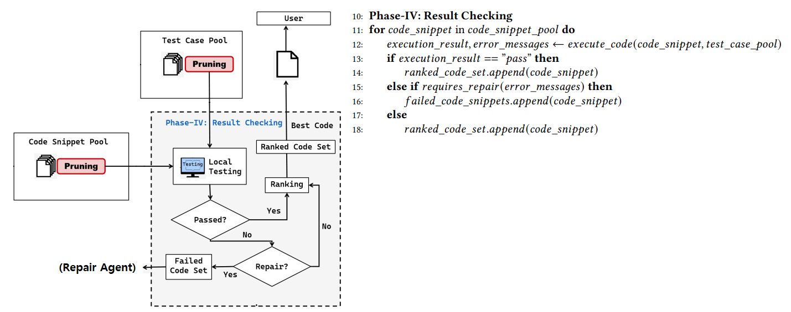
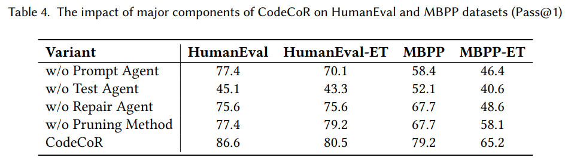

## 목차

* [1. 1개의 LLM 의 misunderstanding 이 미치는 영향](#1-1개의-llm-의-misunderstanding-이-미치는-영향)
* [2. CodeCoR Overview](#2-codecor-overview)
* [3. CodeCoR 의 Agents](#3-codecor-의-agents)
  * [3-1. Prompt Agent](#3-1-prompt-agent)
  * [3-2. Test Agent](#3-2-test-agent)
  * [3-3. Coding Agent](#3-3-coding-agent)
  * [3-4. Repair Agent](#3-4-repair-agent)
* [4. CodeCoR 의 알고리즘](#4-codecor-의-알고리즘)
  * [4-1. Pruning](#4-1-pruning)
  * [4-2. Result Checking](#4-2-result-checking)
  * [4-3. Code Repairing](#4-3-code-repairing)
* [5. 실험 결과](#5-실험-결과)
  * [5-1. 실험 설정](#5-1-실험-설정)
  * [5-2. CodeCoR 의 성능 수준](#5-2-codecor-의-성능-수준)
  * [5-3. CodeCoR 의 각 Component (Agent 등) 의 효과](#5-3-codecor-의-각-component-agent-등-의-효과)
  * [5-4. CodeCoR 의 추론 자원 소비 (시간, 메모리 등)](#5-4-codecor-의-추론-자원-소비-시간-메모리-등)
* [6. 논의 사항](#6-논의-사항)
  * [6-1. CodeCoR 은 다른 LLM 에서도 유효한가?](#6-1-codecor-은-다른-llm-에서도-유효한가)
  * [6-2. CodeCoR 은 왜 효과적으로 동작하는가?](#6-2-codecor-은-왜-효과적으로-동작하는가)
  * [6-3. Repair Round 의 횟수는 성능에 어떻게 영향을 미치는가?](#6-3-repair-round-의-횟수는-성능에-어떻게-영향을-미치는가)

## 논문 소개

* Ruwei Pan and Hongyu Zhang et al., "CodeCoR: An LLM-Based Self-Reflective Multi-Agent Framework for Code Generation", 2025
* [arXiv Link](https://arxiv.org/pdf/2501.07811)

## 1. 1개의 LLM 의 misunderstanding 이 미치는 영향


[(출처)](https://arxiv.org/pdf/2501.07811) : Ruwei Pan and Hongyu Zhang et al., "CodeCoR: An LLM-Based Self-Reflective Multi-Agent Framework for Code Generation"

* 위와 같이 **1개의 LLM 이 주어진 task 를 mis-understand** 하면, **이어지는 모든 프로세스에서 오류가 발생** 한다.
* 위 그림과 같은 경우,
  * (❌) **Prompt Agent** 가 ```a + b``` 가 아닌 ```a - b``` 를 계산하는 코드를 생성하도록 지시
  * (❌) **Coding Agent** 가 ```a - b``` 를 계산하는 코드 생성
  * (❌) **Test Agent** 가 잘못된 테스트 케이스 작성
  * Compiler 실행 결과 Runtime Error 없이 정상 동작
  * (❌) 최종 결과물은 ```a - b``` 를 계산하는 코드

## 2. CodeCoR Overview


[(출처)](https://arxiv.org/pdf/2501.07811) : Ruwei Pan and Hongyu Zhang et al., "CodeCoR: An LLM-Based Self-Reflective Multi-Agent Framework for Code Generation"

* CodeCoR = **Code Co**llaboration and **R**epair
* 핵심 아이디어
  * CodeCoR 은 **코딩 프롬프트 생성 → 테스트 케이스 생성 → 코드 생성 → 결과 검토 → 코드 수정** 의 **프로그래밍의 종합적인 과정** 을 LLM 을 이용하여 해결하는 시스템이다.
  * [LG CNS 의 **DevOn AI-Driven Development** 시스템](../../AI%20Trend/AI_Trend_May_2025.md#20250528-수) 과 컨셉이 유사하다.
* 프로세스 요약
  * Ranked Code Set 의 code snippet 들은 **repair round 횟수 & passed test case 개수를 종합적으로 고려** 하여 순위가 매겨짐

| 단계                      | 에이전트                              | 입력                              | 출력                                                                                                                                                  |
|-------------------------|-----------------------------------|---------------------------------|-----------------------------------------------------------------------------------------------------------------------------------------------------|
| 1. Prompt Generation    | [Prompt Agent](#3-1-prompt-agent) | task description                | [CoT (Chain-of-thought)](../../AI%20Basics/LLM%20Basics/LLM_기초_Chain_of_Thought.md) Prompts<br>(CoT Pool 에 저장)                                      |
| 2. Test Case Generation | [Test Agent](#3-2-test-agent)     | **selected** CoT Prompts        | **high-quality** test cases                                                                                                                         |
| 3. Code Generation      | [Coding Agent](#3-3-coding-agent) | **selected** CoT Prompts        | **selected** code snippets                                                                                                                          |
| 4. Result Checking      |                                   | code snippets + test cases      | - 모든 테스트 케이스를 통과한 code snippet + repair 가 완료된 code snippet 을 **Ranked Code Set** 에 저장<br>- 테스트 케이스를 통과하지 못한 code snippet 에 대해 **Code Repairing** 실시 |
| 5. Code Repairing       | [Repair Agent](#3-4-repair-agent) | **failed** code snippets        | **high-quality** repair advices                                                                                                                     |
| 5. Code Repairing       | [Coding Agent](#3-3-coding-agent) | **high-quality** repair advices | **selected "repaired"** code snippets                                                                                                               |

## 3. CodeCoR 의 Agents

CodeCoR 에는 **Prompt / Test / Coding / Repair Agent** 의 총 4가지 에이전트 (LLM) 가 있다.


[(출처)](https://arxiv.org/pdf/2501.07811) : Ruwei Pan and Hongyu Zhang et al., "CodeCoR: An LLM-Based Self-Reflective Multi-Agent Framework for Code Generation"

| Agent        | 기본 설명                                     | 입력                  | [Pruning](#4-1-pruning) 기준 |
|--------------|-------------------------------------------|---------------------|----------------------------|
| Prompt Agent | 고품질의 CoT 기반 코딩 프롬프트 생성                    | task description    | 프롬프트 품질                    |
| Test Agent   | 테스트 케이스 생성                                | CoT prompt          | 요구사항 충족 여부 평가 가능성          |
| Coding Agent | code snippet 생성                           | CoT prompt          | 정확성 및 효율성                  |
| Repair Agent | failed code snippet 에 대한 repair advice 생성 | failed code snippet | 품질 & 효과                    |

### 3-1. Prompt Agent

* **Prompt Agent** 는 **[CoT (Chain-of-Thought)](../../AI%20Basics/LLM%20Basics/LLM_기초_Chain_of_Thought.md) 기반의 고품질의 코딩 프롬프트** 를 생성한다.
  * 향후 Test Case Generation 및 Code Generation 프로세스를 위해 필요하다.
* 상세 작동 방법
  * 입력된 task description 에 대해, CoT 기반 프롬프트를 다수 생성한다.
  * [Pruning 알고리즘](#4-1-pruning) 을 사용하여, 이 프롬프트들 중 저품질의 프롬프트를 제거한다.
  * 생성된 CoT 기반 프롬프트들을 **CoT Pool** 에 저장한다.

### 3-2. Test Agent

* **Test Agent** 는 선택된 CoT 프롬프트에 기반하여 **다수의 테스트 케이스를 생성** 한다.
* 상세 작동 방법
  * CoT 프롬프트에 기반하여 다수의 테스트 케이스를 생성하고, 이들을 **Test Case Pool** 에 저장한다. 
  * [Pruning 알고리즘](#4-1-pruning) 을 사용하여, 코드가 요구사항에 맞는지를 효과적으로 평가할 수 있는 테스트 케이스만 남긴다.

### 3-3. Coding Agent

* **Coding Agent** 는 선택된 CoT 프롬프트에 기반하여 **다수의 code snippet 을 생성** 한다.
* 상세 작동 방법
  * CoT 프롬프트에 기반하여 다수의 code snippet 을 생성하고, 이들을 **Code Snippet Pool** 에 저장한다.
  * [Pruning 알고리즘](#4-1-pruning) 을 사용하여, 컴파일러에서 실행이 가능한 (= 문법 오류가 없는) 코드만 남긴다.

### 3-4. Repair Agent

* **Repair Agent** 는 테스트 케이스를 통과하지 못한 code snippet 에 대해 **Repair Advice** 를 생성한다.
* 상세 작동 방법
  * Runtime Error 가 발생했거나, 또는 테스트 케이스를 통과하지 못한 **failed code snippet** 에 대해 Repair Advice 를 생성한다.
  * [Pruning 알고리즘](#4-1-pruning) 을 사용하여, **품질이 낮거나 효과가 떨어지는** repair advice 를 제거한다.
  * 남아 있는 고품질의 repair advice 들은 [Coding Agent](#3-3-coding-agent) 로 전달된다.

## 4. CodeCoR 의 알고리즘


[(출처)](https://arxiv.org/pdf/2501.07811) : Ruwei Pan and Hongyu Zhang et al., "CodeCoR: An LLM-Based Self-Reflective Multi-Agent Framework for Code Generation"

| 알고리즘            | 설명                                                                                                    |
|-----------------|-------------------------------------------------------------------------------------------------------|
| Pruning         | 각 Agent 의 생성 결과물 중 **의도에 맞는 고품질의 결과물** 만 남도록 필터링                                                      |
| Result Checking | 여러 개의 code snippet 실행 후, **passed 또는 repair not required** 인 code snippet 을 **Ranked Code Set** 에 저장  |
| Code Repairing  | failed code snippet 이 더 이상 없어질 때까지, failed code snippet 에 대해 **"repair advice 생성 및 이를 이용한 코드 수정"** 실시 |

### 4-1. Pruning

CodeCoR 의 Pruning 메커니즘은 **Prompt / Test / Code / Repair Pruning 의 4가지** 가 있다.


[(출처)](https://arxiv.org/pdf/2501.07811) : Ruwei Pan and Hongyu Zhang et al., "CodeCoR: An LLM-Based Self-Reflective Multi-Agent Framework for Code Generation"

**1. Prompt Pruning**

* Prompt Pruning 의 기준으로는 **Clarity (명확성), Relevance (직접 관련성), Conciseness (간결성), Context (맥락 정보 제공 여부)** 이 있다.
* 이 4가지 조건을 **모두 만족** 시키지 않는 (= **하나라도 불만족** 시키는), "의도에 맞지 않거나 품질이 낮은" 프롬프트는 **제거된다.**

**2. 그 외의 3가지 Pruning**

* CodeCoR 에는 그 외에도 **Test Pruning, Code Pruning, Repair Pruning** 의 3가지 Pruning 이 있다.

| Pruning 메커니즘   | 설명                                                                                                                                                              |
|----------------|-----------------------------------------------------------------------------------------------------------------------------------------------------------------|
| Test Pruning   | **Test Agent** 가 생성한 테스트 케이스에 대해, **별도의 프롬프트** 를 이용하여 다음에 해당하지는 않는지 검사한다.<br>- empty input<br>- 테스트 케이스 포맷에 맞지 않음<br>- invalid test case                        |
| Code Pruning   | **Coding Agent** 가 생성한 code snippet 에 대해 **syntax error (문법 오류)** 가 없는지 검사한다.                                                                                   |
| Repair Pruning | **Repair Agent** 가 failed code snippet 에 대해 생성한 repair advice 에 대해, **Prompt Pruning 과 동일한 기준 (Clarity, Relevance, Conciseness, Context)** 을 만족시키지 못하는 것은 제거된다. |

### 4-2. Result Checking



[(출처)](https://arxiv.org/pdf/2501.07811) : Ruwei Pan and Hongyu Zhang et al., "CodeCoR: An LLM-Based Self-Reflective Multi-Agent Framework for Code Generation"

* 각 Code Snippet 을 실행한 후, 그 결과에 따라 다음과 같이 처리한다.

| 실행 결과                 | 해당 Code Snippet 을 추가할 Set | 처리                                                                        |
|-----------------------|---------------------------|---------------------------------------------------------------------------|
| ✅ passed              | Ranked Code Set           | 기존 Ranked Code Set 과 비교하여 순위 산출<br>**(사용자에게 최종 제공되는 best code 일 가능성 높음)** |
| ❌ failed (repair 필요)  | Failed Code Snippets      | Repair Agent 에게 전달                                                        |
| ❌ failed (repair 불필요) | Ranked Code Set           | 기존 Ranked Code Set 과 비교하여 순위 산출                                           |

### 4-3. Code Repairing


[(출처)](https://arxiv.org/pdf/2501.07811) : Ruwei Pan and Hongyu Zhang et al., "CodeCoR: An LLM-Based Self-Reflective Multi-Agent Framework for Code Generation"

* Failed Code Snippet 이 더 이상 없을 때까지 다음을 반복한다.
  * 수정된 code snippet 생성 
    * **Repair Agent** 가 repair advice (= repair suggentation) 생성 및 pruning
    * repair advice 를 이용하여 **수정된 code snippet** 생성
  * 각 **수정된 code snippet** 을 테스트하고, 그 결과에 따라 다음과 같이 처리한다.

| 실행 결과                | 해당 Code Snippet 을 추가할 Set | 처리                                                                                  |
|----------------------|---------------------------|-------------------------------------------------------------------------------------|
| ✅ passed             | Ranked Code Set           | 기존 Ranked Code Set 과 비교하여 순위 산출<br>**(1회 이상 repair 되었으므로, best code 일 가능성 비교적 낮음)** |
| ❌ failed (repair 필요) | Failed Code Snippets      | Repair Agent 에게 전달                                                                  |

## 5. 실험 결과

* 실험을 통해 알고자 하는 핵심을 요약하면 다음과 같다.

| 핵심 질문                                                                           | 답변                                                                                                |
|---------------------------------------------------------------------------------|---------------------------------------------------------------------------------------------------|
| [CodeCoR 의 성능 수준](#5-2-codecor-의-성능-수준)                                         | - 기존의 LLM 기반 코드 생성 모델보다 성능이 좋다.<br>- CodeCoR 로 생성된 코드는 **텍스트 유사성이 더 높고 edit distance 가 더 짧다.**    |
| [CodeCoR 의 각 Component (Agent 등) 의 효과](#5-3-codecor-의-각-component-agent-등-의-효과) | - Component 중 하나를 제거한 variant 들에 비해 **확실히 좋은 성능**<br>- 즉, CodeCoR 의 **모든 Component 는 성능에 기여** 한다. |
| [CodeCoR 의 추론 자원 소비 (시간, 메모리 등)](#5-4-codecor-의-추론-자원-소비-시간-메모리-등)              | - CodeCoR 는 기존의 LLM 기반 코드 생성 모델들에 비해 **코드 생성 시간 & CPU/memory 사용량 & 디스크 입출력 사용량 등이 적다. (= 우수하다.)** |

### 5-1. 실험 설정

**1. 데이터셋**

| 데이터셋         | 설명                                  |
|--------------|-------------------------------------|
| HumanEval    | 널리 쓰이는 Code Generation Dataset 중 하나 |
| HumanEval-ET | HumanEval 의 enhanced version        |
| MBPP         | 널리 쓰이는 Code Generation Dataset 중 하나 |
| MBPP-ET      | MBPP 의 enhanced version             |

**2. Baseline Code Generation LLMs**

* Total **22 LLMs**
* including **GPT-3.5-turbo, Incoder, CodeGeeX, Starcoder, and CodeGen-Mono**

**3. 평가 지표**

* [CodeCoR 성능 평가 지표](../../AI%20Basics/LLM%20Basics/LLM_기초_LLM의_성능_평가.md) 로 **Pass@1, Edit Distance, BLEU Score** 의 3가지를 사용

| 성능 평가 지표                                                                   | 설명                                                                            |
|----------------------------------------------------------------------------|-------------------------------------------------------------------------------|
| Pass@1                                                                     | 주어진 task 의 **요구 사항을 한번에 만족** 시키는 code snippet 의 비율                            |
| Edit Distance (편집 거리)                                                      | 생성된 code snippet 을 referenced code snippet 으로 변환하기 위한 **최소한의 문자 삽입/삭제/교체 횟수** |
| [BLEU Score](../../AI%20Basics/LLM%20Basics/LLM_기초_LLM의_성능_평가.md#3-1-bleu) | 생성된 code snippet 을 referenced code snippet 과 비교했을 때의 정확도 평가                   |                  |

### 5-2. CodeCoR 의 성능 수준

**1. 결론 요약**

* 기존의 LLM 기반 코드 생성 모델보다 성능이 좋다.
* CodeCoR 로 생성된 코드는 **텍스트 유사성이 더 높고 edit distance 가 더 짧다.**

**2. 상세 실험 결과**

* **(a) GPT-3.5 Turbo** LLM 기준으로, 다른 방법론들에 비해 **CodeCoR 의 Pass@1 Score 가 훨씬 높다.**
* **(b) HumanEval & MBPP** 데이터셋 기준으로, 여러 LLM 들의 **평균 Edit Distance 및 BLEU Score** 값은 **CodeCoR 가 우수한 편이다.**


[(출처)](https://arxiv.org/pdf/2501.07811) : Ruwei Pan and Hongyu Zhang et al., "CodeCoR: An LLM-Based Self-Reflective Multi-Agent Framework for Code Generation"

### 5-3. CodeCoR 의 각 Component (Agent 등) 의 효과

**1. 결론 요약**

* Component 중 하나를 제거한 variant 들에 비해 **확실히 좋은 성능**
* 즉, CodeCoR 의 **모든 Component 는 성능에 기여** 한다.

**2. 상세 실험 결과**

* **Test Agent** 가 없을 때가 가장 critical 한 성능 감소를 보인다.

| Variant                    | 설명                                                                                             |
|----------------------------|------------------------------------------------------------------------------------------------|
| without **Prompt Agent**   | **task description 이 CoT 프롬프트를 대체** 하여, Test Agent 와 Coding Agent 에 직접 전달된다.                   |
| without **Test Agent**     | **생성된 코드에서 문법 오류가 증가** 하며, 그 결과물이 Repair Agent 로 전달된다.                                         |
| without **Repair Agent**   | **Repair Agent 에 의해 생성되는 repair advice** 대신, **failed code 와 그 오류 메시지** 가 Coding Agent 로 전달된다. |
| without **Pruning Method** | **고품질의 의도에 맞는 생성 결과물을 선택하는 기능이 부재** 하므로, CodeCoR 에서의 각 Agent 간 상호 작용의 품질이 저하된다.                |



[(출처)](https://arxiv.org/pdf/2501.07811) : Ruwei Pan and Hongyu Zhang et al., "CodeCoR: An LLM-Based Self-Reflective Multi-Agent Framework for Code Generation"

### 5-4. CodeCoR 의 추론 자원 소비 (시간, 메모리 등)

**1. 결론 요약**

* CodeCoR 는 기존의 LLM 기반 코드 생성 모델들에 비해 **코드 생성 시간 & CPU/memory 사용량 & 디스크 입출력 사용량 등이 적다. (= 우수하다.)**

**2. 상세 실험 결과**

* CodeCoR 은 **Memory Usage, Disk I/O, Network Send** 측면에서 5가지 방법론 중 가장 우수한 성능을 기록했다.


[(출처)](https://arxiv.org/pdf/2501.07811) : Ruwei Pan and Hongyu Zhang et al., "CodeCoR: An LLM-Based Self-Reflective Multi-Agent Framework for Code Generation"

## 6. 논의 사항

* 핵심을 요약하면 다음과 같다.

| 핵심 질문                                                                            | 답변                                                                                                                         |
|----------------------------------------------------------------------------------|----------------------------------------------------------------------------------------------------------------------------|
| [CodeCoR 은 다른 LLM 에서도 유효한가?](#6-1-codecor-은-다른-llm-에서도-유효한가)                     | CodeCoR 는 GPT-4, CodeLlama 와 같은 다른 LLM 에서도 **다른 방법론에 비해 성능이 좋다.**                                                          |
| [CodeCoR 은 왜 효과적으로 동작하는가?](#6-2-codecor-은-왜-효과적으로-동작하는가)                         | CodeCoR 이 효과적으로 동작하는 이유는, 소프트웨어 개발 (프로그래밍) 의 **각 단계별 LLM Agent** 를 이용한 **혁신적인 Multi-Agent 구조** 및 이들 간의 **상호작용 (협업)** 덕분이다. |
| [Repair Round 의 횟수는 성능에 어떻게 영향을 미치는가?](#6-3-repair-round-의-횟수는-성능에-어떻게-영향을-미치는가) | **총 3 회의 repair round** 를 실행할 때 전체적인 성능이 가장 좋다.                                                                            |

### 6-1. CodeCoR 은 다른 LLM 에서도 유효한가?

**1. 결론 요약**

* CodeCoR 는 GPT-4, CodeLlama 와 같은 다른 LLM 에서도 **다른 방법론에 비해 성능이 좋음** 이 확인된다.

**2. 상세 실험 결과**

* CodeCoR 를 포함한 총 8 개의 방법론을 GPT-4 와 CodeLlama LLM 에 적용한 결과이다. (데이터셋: HumanEval & HumanEval-ET)
* **모든 (LLM, 데이터셋) 조합** 에서 **CodeCoR 이 8 개의 방법론 중 가장 우수한 성능** 을 보여주었다.


[(출처)](https://arxiv.org/pdf/2501.07811) : Ruwei Pan and Hongyu Zhang et al., "CodeCoR: An LLM-Based Self-Reflective Multi-Agent Framework for Code Generation"

### 6-2. CodeCoR 은 왜 효과적으로 동작하는가?

**1. 결론 요약**

* CodeCoR 이 효과적으로 동작하는 이유는, 소프트웨어 개발 (프로그래밍) 의 **각 단계별 LLM Agent** 를 이용한 **혁신적인 Multi-Agent 구조** 및 이들 간의 **상호작용 (협업)** 덕분이다.

**2. 상세 설명**

* CodeCoR 는 프로그래밍의 각 단계별로 **특화된 LLM Agent** 를 적용하여, **각 기능이 해당 task 에 최적화된 LLM 을 통해 동작** 하는 구조를 적용하고 있다.
  * 이를 통해 코드 생성 등 **각 task 의 정확도가 향상** 된다.
* 각 Agent 는 **상호 작용** 하며, 이를 통해 **Agent 간 협업** 이 이루어진다.
  * 특히 반복적인 feedback 메커니즘을 통한 코드의 지속적인 테스트 및 수정은 그 핵심 요소 중 하나이다.

### 6-3. Repair Round 의 횟수는 성능에 어떻게 영향을 미치는가?

**1. 결론 요약**

* CodeCoR 에서는 **repair round 횟수** 가 성능의 주요 평가 지표 중 하나이다.
* **총 3 회의 repair round** 를 실행할 때 전체적인 성능이 가장 좋다.

**2. 상세 실험 결과**


[(출처)](https://arxiv.org/pdf/2501.07811) : Ruwei Pan and Hongyu Zhang et al., "CodeCoR: An LLM-Based Self-Reflective Multi-Agent Framework for Code Generation"


