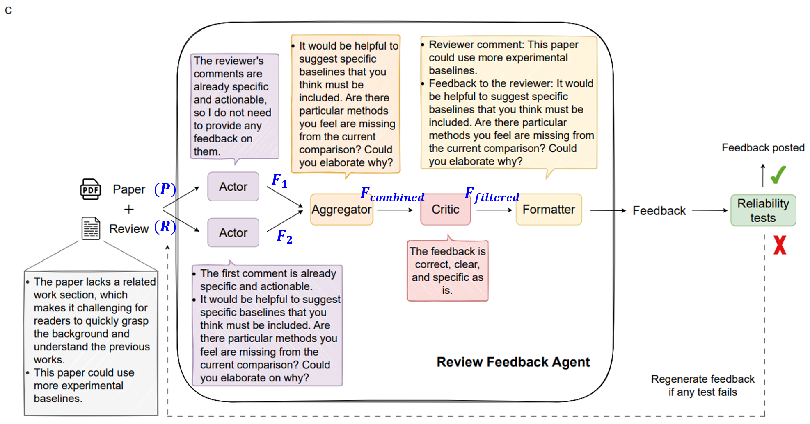
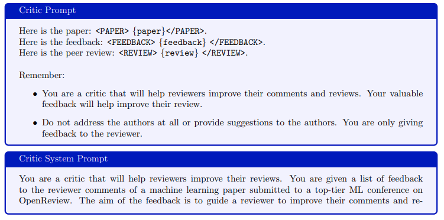

## 목차

* [1. Pilot Study (예비 연구)](#1-pilot-study-예비-연구)
  * [1-1. 실험 목표](#1-1-실험-목표)
  * [1-2. 실험 설정 및 결과](#1-2-실험-설정-및-결과)
* [2. 논문 리뷰 피드백 에이전트](#2-논문-리뷰-피드백-에이전트)
  * [2-1. 에이전트 상세 구조](#2-1-에이전트-상세-구조) 
  * [2-2. 사용된 프롬프트](#2-2-사용된-프롬프트)
* [3. 실험 결과](#3-실험-결과)
  * [3-1. AI를 이용한 논문 리뷰 피드백의 효과](#3-1-ai를-이용한-논문-리뷰-피드백의-효과)
  * [3-2. Feedback 에 대한 Reviewer 의 반응 평가](#3-2-feedback-에-대한-reviewer-의-반응-평가)
  * [3-3. Feedback 이 Author Rebuttal & Reviewer Reply 에 미치는 영향](#3-3-feedback-이-author-rebuttal--reviewer-reply-에-미치는-영향)
  * [3-4. Feedback comment 에 대한 클러스터링](#3-4-feedback-comment-에-대한-클러스터링)

## 논문 소개

* Nitya Thakkar and Mert Yuksekgonul et al., "Can LLM feedback enhance review quality? A randomized study of 20K reviews at ICLR 2025", 2025
* [arXiv Link](https://arxiv.org/pdf/2504.09737)

## 1. Pilot Study (예비 연구)

* 실제 ICLR 2025 의 논문에 대해 작성된 **peer review 에 대해 그 문제점을 피드백** 하는 실험
* 선택된 review 중 90% 이상에 대해 feedback 작성
* 총 18,946 개의 review 에 feedback 작성

### 1-1. 실험 목표


[(출처)](https://arxiv.org/pdf/2504.09737) : Nitya Thakkar and Mert Yuksekgonul et al., "Can LLM feedback enhance review quality? A randomized study of 20K reviews at ICLR 2025"

* 실험 목표
  * **정보성이 낮은 리뷰를 줄이고, 리뷰 품질 향상** 
* 실험 대상 플랫폼
  * ICLR 2025 & OpenReview

| 플랫폼        | 설명                                                                                                                                                                                    |
|------------|---------------------------------------------------------------------------------------------------------------------------------------------------------------------------------------|
| ICLR 2025  | - 가장 빠르게 성장하는 AI 컨퍼런스, 매년 수천 개의 논문 등재<br>- 각 submission 의 평균 reviewer 는 **4명**                                                                                                        |
| OpenReview | - 모든 리뷰는 **summary, strengths, weaknesses, questions** section 으로 구성<br>- 각 section 은 **soundness, presentation, contribution, rating, confidence** 의 관점에서 평가<br>- 평가 점수는 1 ~ 10 점 범위 |

* 리뷰 코멘트 분석
  * 리뷰에 자주 등장하는 다음 3가지의 **common issue 를 정의**

| common issue | 설명                                          |
|--------------|---------------------------------------------|
| 일반적인 지적 사항   | reviewer 에게 **더 구체적으로 리뷰를 작성** 하라는 피드백을 준다. |
| 관련성 부족       | reviewer 에게 논문 중의 **관련성이 있는 부분** 을 보여준다.    |
| 전문성 부족 코멘트   | reviewer 에게 **문장을 전문성을 살려서 재 작성** 하라고 한다.   |

### 1-2. 실험 설정 및 결과

* 실험 설정
  * **Randomized Control Trial (RCT)** 방법을 적용
  * feedback 이 peer review 프로세스에 **얼마나 영향을 미치는지** 분석
  * review 이전에 논문을 다음과 같이 3가지로 분류
    * **No reviews / (Randomly selected) Half of reviews / All reviews** 에 대해 feedback 을 한다.

* 실험 결과
  * 전체 44,831 개의 review 중 **42.3%** 에 해당하는 18,946 개의 리뷰에 대해 피드백
  * 선택된 review 중 **8% 미만** 에 해당하는 review 만이 피드백 없음 (피드백 불필요, 피드백이 reliability test 불합격)

## 2. 논문 리뷰 피드백 에이전트

* **Review Feedback Agent (LLM)** 는 **reviewer 의 review comment 가 더 구체적, 건설적, 실행 가능하도록 돕는** 에이전트이다.
  * 다음과 같은 3가지 형태의 제안을 제시한다.

| 제안 분류                | 설명                                               |
|----------------------|--------------------------------------------------|
| 구체성 증가               | reviewer 가 리뷰 코멘트를 보다 **구체적이고 실행 가능하게** 작성하도록 지시 |
| mis-understanding 해결 | reviewer 의 지적이 논문의 해당 part 에서 **이미 해결되었음을 표시**   |
| 전문적인 어휘 사용 조언        | **부적절하거나 비전문적인 어휘** 사용을 표시하고 이를 수정하도록 지시         |

### 2-1. 에이전트 상세 구조



[(출처)](https://arxiv.org/pdf/2504.09737) : Nitya Thakkar and Mert Yuksekgonul et al., "Can LLM feedback enhance review quality? A randomized study of 20K reviews at ICLR 2025"


[(출처)](https://arxiv.org/pdf/2504.09737) : Nitya Thakkar and Mert Yuksekgonul et al., "Can LLM feedback enhance review quality? A randomized study of 20K reviews at ICLR 2025"

* 입력 및 출력

| 입력                                                                                         | 출력                                                           |
|--------------------------------------------------------------------------------------------|--------------------------------------------------------------|
| - 논문의 **PDF Text** (**summary, strengths, weaknesses, question** section)<br>- review text | - **(review comment, corresponding feedback)** 의 pair 의 list |

* 상세 사용 LLM
  * 아래와 같이 **총 5 개의 LLM** 사용

| LLM 구분         | 설명                                                                          |
|----------------|-----------------------------------------------------------------------------|
| Actor (2 LLMs) | review 에 대한 feedback 생성 **(1개의 LLM 으로는 feedback 의 다양성 등이 부족함)**             |
| Aggregator     | 2 개의 Actor LLM 이 생성한 feedback 을 merge                                       |
| Critic         | feedback 이 정확하고 깔끔한지 검사 **(표면적이거나 너무 지엽적인 피드백 제거)**                         |
| Formatter      | Critic 의 검사를 통과한 feedback 에 대해, 이들을 Review Comment 와 Feedback 으로 formatting |

* Reliability Test
  * 다음 4가지 기준으로 Reliability Test 실시

| 기준                          | 예시 feedback ([출처: 해당 논문](https://arxiv.org/pdf/2504.09737))                                                                                                                                                                                                                                                                                                       |
|-----------------------------|-------------------------------------------------------------------------------------------------------------------------------------------------------------------------------------------------------------------------------------------------------------------------------------------------------------------------------------------------------------------|
| review 를 칭찬하기               | ```This is a good question that challenges a key assumption of the paper.```                                                                                                                                                                                                                                                                                      |
| 논문 저자에게 feedback 전달하기       | ```To strengthen your paper, consider discussing the relationship between FrugalGPT and traditional ensembling techniques. Highlight both similarities and differences and explain how this relates to the observed quality improvements. This would provide more context for your results and situate your work within the broader field of machine learning.``` |
| review comment 의 내용을 다시 말하기 | ```This is a good point that could lead to improved clarity in the paper. To make your comment more actionable, you could ask the authors to provide examples or further clarification for the sentence ”enhancing the accountability of the output.```                                                                                                           |
| format 이 정확한지 확인            |                                                                                                                                                                                                                                                                                                                                                                   |

### 2-2. 사용된 프롬프트

* **1. Actor & Actor System Prompt**


[(출처)](https://arxiv.org/pdf/2504.09737) : Nitya Thakkar and Mert Yuksekgonul et al., "Can LLM feedback enhance review quality? A randomized study of 20K reviews at ICLR 2025"

* **2. Aggregator & Aggregator System Prompt**


[(출처)](https://arxiv.org/pdf/2504.09737) : Nitya Thakkar and Mert Yuksekgonul et al., "Can LLM feedback enhance review quality? A randomized study of 20K reviews at ICLR 2025"

* **3. Critic & Critic System Prompt**




[(출처)](https://arxiv.org/pdf/2504.09737) : Nitya Thakkar and Mert Yuksekgonul et al., "Can LLM feedback enhance review quality? A randomized study of 20K reviews at ICLR 2025"

* **4. Formatter & Formatter System Prompt**


[(출처)](https://arxiv.org/pdf/2504.09737) : Nitya Thakkar and Mert Yuksekgonul et al., "Can LLM feedback enhance review quality? A randomized study of 20K reviews at ICLR 2025"

## 3. 실험 결과

### 3-1. AI를 이용한 논문 리뷰 피드백의 효과

* 논문의 review comment 에 대해, **updated** 와 **not updated** 로 구분

| 구분          | 설명                                                                                             |
|-------------|------------------------------------------------------------------------------------------------|
| updated     | LLM Agent 의 review feedback 을 받고 **review comment 를 update** 한 경우                              |
| not updated | LLM Agent 의 review feedback 을 받고도 **review comment 를 update 하지 않거나, (edit distance) < 5** 인 경우 |

* 실험 결과
  * 결론적으로, **feedback 은 reviewer 들이 review comment 를 update 하도록 하는 효과가 일정 부분 있음** 

| 구분                                                  | 업데이트 비율              |
|-----------------------------------------------------|----------------------|
| feedback 을 **받은** review (18,946 건)                 | **26.6 % (5,031 건)** |
| feedback 을 **받지 않은** 대조군 (control group) (22,364 건) | **9.4 % (2,103 건)**  |


[(출처)](https://arxiv.org/pdf/2504.09737) : Nitya Thakkar and Mert Yuksekgonul et al., "Can LLM feedback enhance review quality? A randomized study of 20K reviews at ICLR 2025"

### 3-2. Feedback 에 대한 Reviewer 의 반응 평가

* 실험 목표
  * 얼마나 많은 reviewer 들이 **LLM Agent 의 Feedback 을 유용하게 판단** 하는지 평가
* 실험 결과
  * 5,031 건의 updated review 에 대해 총 18,322 건의 feedback 존재
  * **89% 의 reviewer 들이 1개 이상의 피드백을 반영** 
    * 이는 **LLM Agent 의 피드백을 받은 전체 reviewer 의 23.6 % 가 그 피드백을 반영** 했다는 의미
  * LLM Agent 의 피드백을 반영한 reviewer 는 그 피드백들 중 **평균 69.3 % 를 반영**


[(출처)](https://arxiv.org/pdf/2504.09737) : Nitya Thakkar and Mert Yuksekgonul et al., "Can LLM feedback enhance review quality? A randomized study of 20K reviews at ICLR 2025"

### 3-3. Feedback 이 Author Rebuttal & Reviewer Reply 에 미치는 영향

* 실험 결과
  * LLM Agent Feedback 을 받은 그룹은 그렇지 않은 그룹에 비해 **Author Rebuttal & Reviewer Reply 가 조금 긴 편이다.**
  * 특히 해당 Feedback 으로 **review 를 update 한 경우** 에 이러한 경향성이 두드러진다.


[(출처)](https://arxiv.org/pdf/2504.09737) : Nitya Thakkar and Mert Yuksekgonul et al., "Can LLM feedback enhance review quality? A randomized study of 20K reviews at ICLR 2025"

### 3-4. Feedback comment 에 대한 클러스터링

* Review 에 대한 Feedback comment 분류 결과는 다음과 같다.
  * 저자에게 **구체적이고 실행 가능한 요청** 을 하도록 review 를 수정하도록 함 (43.5 %)
  * **특정 분석, 출처** 등을 추가하여 **명확한 요청** 이 되도록 review 를 수정하도록 함 (35.8 %)
* Feedback 의 반영 비율 분포는 다음과 같다.
  * 모든 카테고리의 Feedback comment 에 대해서 반영 비율의 큰 차이가 없음


[(출처)](https://arxiv.org/pdf/2504.09737) : Nitya Thakkar and Mert Yuksekgonul et al., "Can LLM feedback enhance review quality? A randomized study of 20K reviews at ICLR 2025"
