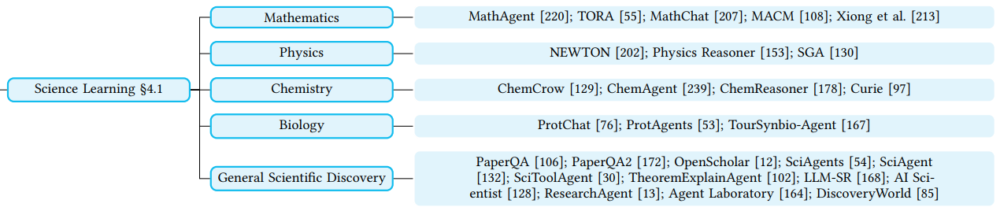
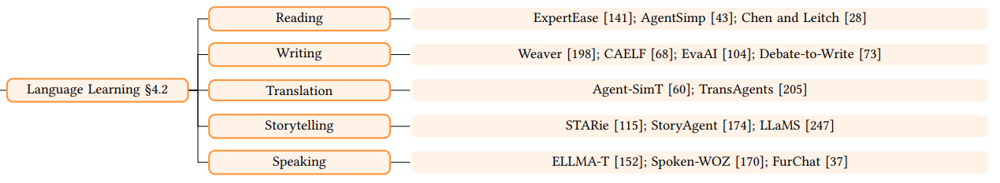
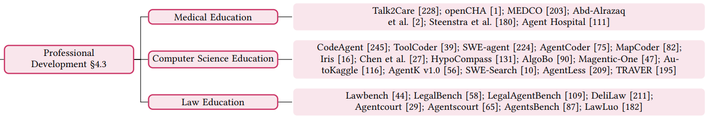

## 목차

* [1. 교육 목적의 LLM 에이전트](#1-교육-목적의-llm-에이전트)
* [2. Pedagogical Agents (교육 에이전트)](#2-pedagogical-agents-교육-에이전트)
  * [2-1. Teaching Assistant Agent](#2-1-teaching-assistant-agent)
  * [2-2. Student Support Agent](#2-2-student-support-agent)
* [3. Domain-Specific Educational Agents (특정 분야 교육 에이전트)](#3-domain-specific-educational-agents-특정-분야-교육-에이전트)
  * [3-1. 과학](#3-1-과학)
  * [3-2. 언어 학습](#3-2-언어-학습)
  * [3-3. 전문 분야](#3-3-전문-분야)
* [4. 교육 에이전트의 발전 방향](#4-교육-에이전트의-발전-방향)
  * [4-1. 프라이버시, 편견, 공정성 이슈](#4-1-프라이버시-편견-공정성-이슈)
  * [4-2. 환각 현상 등](#4-2-환각-현상-등)
  * [4-3. LLM 에이전트를 실제 교육 환경에 통합](#4-3-llm-에이전트를-실제-교육-환경에-통합)

## 논문 소개

* Zhendong Chu and Shen Wang et al., "LLM Agents for Education: Advances and Applications", 2025
* [arXiv Link](https://arxiv.org/pdf/2503.11733)

## 1. 교육 목적의 LLM 에이전트

* 교육 (특히 개인화된 학습 및 문제 해결) 은 LLM 을 적용 가능한 주요 분야 중 하나이다.
* 교육 분야에서 LLM의 역할은 다음과 같다.
  * 각 사용자에게 최적화된 **개인화된 지원** 제공
  * 이를 통해 **사용자의 학습 경험을 향상**

**1. 교육 목적의 LLM 에이전트의 구성**

* 교육 목적의 LLM 에이전트는 다음과 같은 요소로 구성된다.

| 구성 요소               | 설명                                                                                      |
|---------------------|-----------------------------------------------------------------------------------------|
| **memory** moodule  | - 기본 개념에 대한 이해를 유지 - 사용자의 **이전 상호 작용 및 학습 진행도** 추적 - 사용자의 **개인 프로필 정보** 저장        |
| **tool-use** module | - LLM 에이전트가 **특정 교육 도구 (예: 추천 모델, 검색 엔진 등) 를 사용** 할 수 있게 함 - 이를 통해 LLM Agent 의 역량 향상 |
| **planning** module | - 사용자의 **학습 목적을 파악** 하여 **학습 플래닝** 실시                                                   |
| LLM                 | LLM 에이전트에 사용되는 **거대 언어 모델 (LLM)**                                                       |

[(출처)](https://arxiv.org/pdf/2503.11733) : Zhendong Chu and Shen Wang et al., "LLM Agents for Education: Advances and Applications"

**2. 교육 목적의 LLM 에이전트의 분류**

* 교육 목적의 LLM 에이전트는 크게 **Pedagogical Agent** 와 **Domain-Specific Educational Agent** 로 구분된다.

| 구분                                | 설명                                                                |
|-----------------------------------|-------------------------------------------------------------------|
| Pedagogical Agent                 | 자동화 및 개인화를 통해 **가르치는 것 (teaching) 과 사용자의 학습 (learning) 을 동시에** 향상 |
| Domain-Specific Educational Agent | 과학, 언어 학습, 전문 분야 등 **특정 분야에 최적화된** LLM 에이전트                       |

[(출처)](https://arxiv.org/pdf/2503.11733) : Zhendong Chu and Shen Wang et al., "LLM Agents for Education: Advances and Applications"

## 2. Pedagogical Agents (교육 에이전트)

**Pedagogical Agent** 는 **자동화 및 개인화** 를 통해 **teaching (가르치는 것) 과 learning (사용자의 학습)** 을 동시에 향상시키는 LLM Agent 를 말한다.

* Pedagogical Agent 는 **Agents for Teaching Assistance & Agents for Student Support** 의 2가지로 분류된다.

| 구분                                                               | 설명                                           |
|------------------------------------------------------------------|----------------------------------------------|
| Agents for **Teaching Assistance** (Teaching Assistant Agent) | 교육자 (teacher) 들을 위한 **key factor 를 자동화** 한다. |
| Agents for **Student Support** (Student Support Agent)        | 사용자에게 **사용자 개인에게 최적화된 학습 가이드를 제공** 한다.       |

### 2-1. Teaching Assistant Agent

[(출처)](https://arxiv.org/pdf/2503.11733) : Zhendong Chu and Shen Wang et al., "LLM Agents for Education: Advances and Applications"

**Agents for Teaching Assistance (Teaching Assistant Agent)** 는 다음과 같이 3가지로 구분된다.

| Teaching Assistant Agent 구분            | 설명                                                                                                                                                                                                                                                                                          |
|----------------------------------------|---------------------------------------------------------------------------------------------------------------------------------------------------------------------------------------------------------------------------------------------------------------------------------------------|
| Classroom Simulation (CS)              | **교실에서 발생할 수 있는 여러 상황들을 시뮬레이션** 하는 Agent - 학생과 교사와의 대화 - 협력적 학습 (collaborative learning) - 문제 해결 역량을 필요로 하는 과제 등                                                                                                                                                                   |
| Feedback Comment Generation (FCG)      | 학생이 제출한 과제, 시험 답안 등에 대해 **feedback comment 를 생성하는 LLM Agent** - 학생의 과제가 논문을 peer review 하는 것이라면, [논문 peer review 에 feedback 을 하는 LLM](%5B2025.06.07%5D%20Can%20LLM%20feedback%20enhance%20review%20quality%20-%20A%20randomized%20study%20of%2020K%20reviews%20at%20ICLR%202025.md) 과 유사 |
| Learning Resource Recommendation (LRR) | 학생이 **자신에게 최적인 학습 콘텐츠** 에 접근할 수 있도록, **학습 콘텐츠를 추천** 하는 LLM Agent - **retrieval**-based & **generation**-based method 존재                                                                                                                                                                  |

* Learning Resource Recommendation (LRR) 을 위한 method 는 **retrieval-based & generation-based** 로 나눌 수 있다.

| method               | 설명                                                                     |
|----------------------|------------------------------------------------------------------------|
| **retrieval**-based  | LLM Agent 가 **내부 DB 또는 메모리에 접근** 하여 **존재하는 학습 콘텐츠를 retrieval 을 통해 제안** |
| **generation**-based | **개별 학생의 학습 스타일** 에 맞춰 **새로운 학습 콘텐츠를 제작**                              |

### 2-2. Student Support Agent

[(출처)](https://arxiv.org/pdf/2503.11733) : Zhendong Chu and Shen Wang et al., "LLM Agents for Education: Advances and Applications"

**Agents for Student Support (Student Support Agent)** 는 다음과 같이 3가지로 구분된다.

| Student Support Agent 구분             | 설명                                                                                                                                                                                         |
|--------------------------------------|--------------------------------------------------------------------------------------------------------------------------------------------------------------------------------------------|
| Adaptive Learning (AL)               | 교사의 개입 없는 **self-sustaining adaptive learning 시스템** 을 만들기 위해서, **task 를 자동화** 하는 LLM Agent - action-memory framework 으로 동작 - Student profiling 에 기반하여 **지속적으로 instruction 을 개선해 나감** |
| Knowledge Tracing (KT)               | 학습자가 **시간에 따라 학습 주제에 대한 이해도가 향상** 되는 것을 추적할 수 있는 LLM Agent - 지능적인 교육 시스템의 필수적인 요소 - 학습자의 **향후 학습 수준** 및 기존에 학습한 지식을 **기억하고 있는 정도** 를 예측 가능                                           |
| Error Correction and Detection (ECD) | 학습자의 답변에 대한 **오류를 정정** 하는 **실시간 feedback** 을 제공함으로써, **학습자가 자신의 이해도를 향상** 시키도록 함                                                                                                           |

## 3. Domain-Specific Educational Agents (특정 분야 교육 에이전트)

**Domain-Specific Educational Agent** 는 **특정 분야의 교육에 최적화된** LLM Agent 이다.

* 그 분야에 따라 **과학, 언어 학습, 전문 분야 (의료, 컴퓨터 공학, 법률 등)** 에 대한 교육 에이전트로 나뉜다.
* 전문 분야 교육 에이전트는 **Agent for Professional Development** 라고 한다.

### 3-1. 과학

[(출처)](https://arxiv.org/pdf/2503.11733) : Zhendong Chu and Shen Wang et al., "LLM Agents for Education: Advances and Applications"

과학 분야 교육에 최적화된 LLM Agent 는 다음과 같다.

| 분야     | 설명                                                                   | LLM 에이전트 예시              |
|--------|----------------------------------------------------------------------|--------------------------|
| 수학     | 학습자의 **추상적인 수학적 개념 이해 및 복잡한 문제 해결** 을 돕는다.                           | MathAgent, TORA          |
| 물리학    | 학습자에게 **이해하기 어려운 개념을 이해하는 것을 돕고**, 또한 **물리적 현상을 시뮬레이션하는 도구를 제공** 한다. | NEWTON, Physics Reasoner |
| 화학     | 분자 구조, 화학 반응, 각종 실험 등                                                | ChemCrow, ChemAgent      |
| 생물학    | 생물학적 과정에 대한 **상세 설명** 및 생태계 관련 **상호 작용 형태의 실험** 제공                   | ProtChat, ProtAgents     |
| 과학적 발견 | **학습자의 데이터 분석을 도와줌** 으로써 과학 분야에서의 발견을 도움                             | PaperQA, OpenScholar     |

### 3-2. 언어 학습

[(출처)](https://arxiv.org/pdf/2503.11733) : Zhendong Chu and Shen Wang et al., "LLM Agents for Education: Advances and Applications"

언어 학습을 도와주는 LLM Agent 는 다음과 같다.

| 분야    | 설명                                                                        | LLM 에이전트 예시             |
|-------|---------------------------------------------------------------------------|-------------------------|
| 읽기    | LLM Agent 는 학습자의 읽기 능력 향상에 도움을 줌                                          | ExpertEase, AgentSimp   |
| 쓰기    | 설명 가능한 **문법 교정** (EXGEC), 학습자가 작성한 **에세이에 점수를 매기는** LLM Agent 등           | Weaver, CAELF           |
| 번역    | 일반적으로 LLM Agent 단독이 아닌, **번역에 특화된 툴 & Multi-Agent 방법** 을 이용               | Agent-SimT, TransAgents |
| 스토리텔링 | LLM Agent 는 사용자에게 **몰입감 있는 상호작용 경험** 제공                                   | STARie, StoryAgent      |
| 말하기   | 사용자에게 최적화된 대화 시스템 - **Reasoning** (추론) 및 **Multi-Agent** 를 이용하는 경우가 많음 | ELLMA-T, Spoken-WOZ     |

### 3-3. 전문 분야

[(출처)](https://arxiv.org/pdf/2503.11733) : Zhendong Chu and Shen Wang et al., "LLM Agents for Education: Advances and Applications"

LLM Agent 는 **의료, 법률, 컴퓨터 공학 등 다양한 전문 분야의 학습을 지원** 할 수 있다.

| 분야     | 설명                                                                               | LLM 에이전트 예시                                           |
|--------|----------------------------------------------------------------------------------|-------------------------------------------------------|
| 의료     | 헬스케어 분야에서의 LLM (Health Agent) 을 이용할 수 있다.                                        | Talk2Care, openCHA                                    |
| 컴퓨터 공학 | 사용자가 다음 분야를 잘 학습할 수 있게 도와준다. - 코딩 및 디버깅 (코드 생성 등) - 컴퓨터 공학의 기초 지식 (알고리즘 등) | CodeAgent, ToolCoder, SWE-agent, AgentCoder, MapCoder |
| 법률     | 법률 교육 분야의 LLM Agent 는 법률 교육을 위해 일반적으로 **법률 지식, 상호 작용 능력, 법률적 추론 능력** 을 가지고 있음    | Lawbench, LegalBench                                  |

## 4. 교육 에이전트의 발전 방향

교육에 쓰이는 LLM Agent 의 **발전 방향 및 도전 과제** 는 다음과 같다.

| 발전 방향 / 도전 과제                                         | 설명                                                                                                                                     |
|-------------------------------------------------------|----------------------------------------------------------------------------------------------------------------------------------------|
| [프라이버시, 편견, 공정성 이슈](#4-1-프라이버시-편견-공정성-이슈)             | - 많은 LLM 이 그렇듯이, LLM 의 학습 데이터는 **민감한 개인정보를 포함** 할 수 있다. - 그 외에도 **편견/편향/공정성** 등의 문제가 발생할 수 있다.                                      |
| [환각 현상 등](#4-2-환각-현상-등)                               | - LLM이 잘못된 정보를 생성하는 [환각 현상](../../AI%20Basics/LLM%20Basics/LLM_기초_환각_현상.md) 역시 주의해야 한다. - 환각 현상은 **학습자가 잘못된 지식을 얻는 결과** 를 가져올 수 있다. |
| [LLM 에이전트를 실제 교육 환경에 통합](#4-3-llm-에이전트를-실제-교육-환경에-통합) | - LLM Agent 를 **실제 교육 환경과 결합시킬 만큼 구조적인 프레임워크가 부족** 한 실정이다.                                                                             |

### 4-1. 프라이버시, 편견, 공정성 이슈

* 문제점
  * **교육 분야의 LLM 에이전트** 역시 많은 다른 LLM과 같이 **민감한 개인정보 등이 학습 데이터에 포함** 되어 있을 수 있으므로, 이로 인해 프라이버시 등 문제가 발생하면 안 된다.
  * 그 외에도 **거대한 양의 데이터셋을 LLM이 학습** 하면서 의도치 않게 **편견** 이 발생했을 수 있다.
* 해결 방법

| 해결 방법                                | 설명                                                                                                |
|--------------------------------------|---------------------------------------------------------------------------------------------------|
| Privacy-preserving memory management | **민감한 개인정보 등을 잊고, 학습이라는 본래 목적에 유용한 데이터만 기억** 하게 한다. - 이를 위해 **context-aware 메모리 메커니즘** 을 사용한다. |
| Bias detection and mitigation        | **자동화된 fairness-checking 모델** 을 통해 **LLM이 실시간으로 생성하는 콘텐츠의 편향성을 평가하고 탐지** 한다.                      |
| LLM Agent 를 문화적으로 '적응'시킴             | 각 지역의 **학습 표준, 역사적 전통 등을 반영** 하는 다국어 모델을 개발한다.                                                    |

### 4-2. 환각 현상 등

* 문제점
  * LLM의 [환각 현상](../../AI%20Basics/LLM%20Basics/LLM_기초_환각_현상.md) 은 **교육 분야 LLM에서도 예외가 아니다.**
  * 교육 분야 LLM의 환각 현상은 **학습자가 잘못된 정보를 학습** 하게 할 수 있다.
* 해결 방법

| 해결 방법                                | 설명                                                                                 |
|--------------------------------------|------------------------------------------------------------------------------------|
| Self-correcting AI tutors            | LLM Agent가 **자신의 답변을 학습자에게 보여주기 전에 스스로 검토하고 교정** 하게 한다.                            |
| Hybrid Human-AI 피드백을 통한 교육 콘텐츠 검증    | **교육 담당자가 AI의 답변을 검토 및 교정** 할 수 있는 시스템을 만든다. - 이를 통해 LLM의 성능을 시간이 지남에 따라 향상시킨다. |
| Pedagogical-aware educational agents | **사람의 교육 방식** 에 맞게 LLM Agent 를 개발한다.                                               |

### 4-3. LLM 에이전트를 실제 교육 환경에 통합

* 문제점
  * LLM Agent 를 실제 교육 현장과 결합하기에는 **구조적인 프레임워크가 부족한 실정** 이다.
* 향후 연구 방향성
  * **개인 맞춤형 학습, PBL (Project-Based Learning)** 등에 최적화된 LLM 을 위한 조치가 필요하다.
    * 이를 위해 **표준화된 프레임워크 개발** 이 필요하다.
  * 맥락에 맞는 학습 가이드, 학습 진도 트래킹 등을 위한 **상호 작용 가능한 AI 튜터** 를 개발한다.
    * 이러한 에이전트는 PBL 에 적용할 수 있다.
  * **교육자들의 AI 관련 역량 (AI 리터러시 등) 을 향상** 시킨다.
