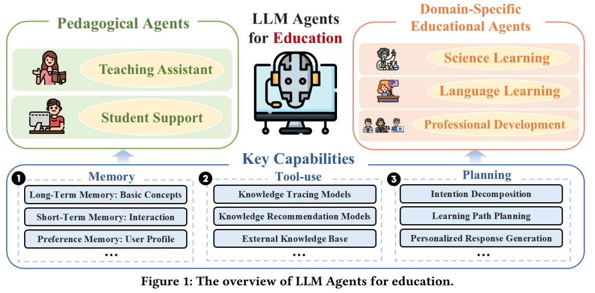
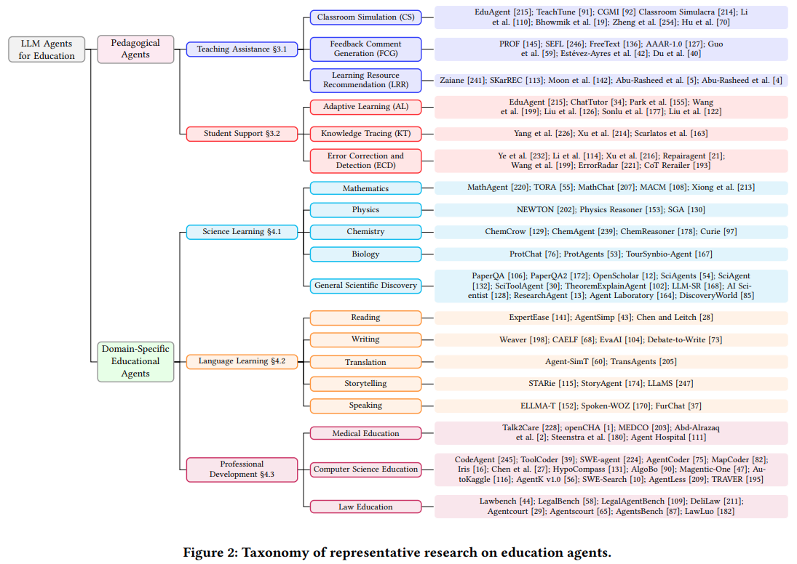
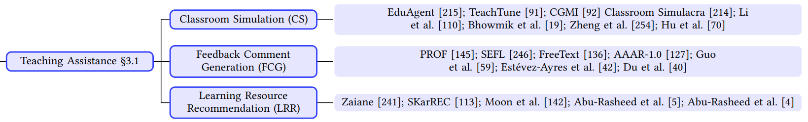
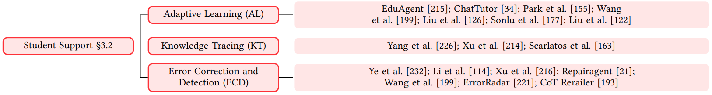

## 목차

* [1. 교육 목적의 LLM 에이전트](#1-교육-목적의-llm-에이전트)
* [2. Pedagogical Agents (교육 에이전트)](#2-pedagogical-agents-교육-에이전트)
  * [2-1. Teaching Assistant Agent](#2-1-teaching-assistant-agent)
  * [2-2. Student Support Agent](#2-2-student-support-agent)
* [3. Domain-Specific Educational Agents (특정 분야 교육 에이전트)](#3-domain-specific-educational-agents-특정-분야-교육-에이전트)
  * [3-1. 과학](#3-1-과학)
  * [3-2. 언어 학습](#3-2-언어-학습)
  * [3-3. 전문 분야](#3-3-전문-분야)
* [4. 교육 에이전트의 발전 방향](#4-교육-에이전트의-발전-방향)
  * [4-1. 프라이버시, 편견, 공정성 이슈](#4-1-프라이버시-편견-공정성-이슈)
  * [4-2. 환각 현상 등](#4-2-환각-현상-등)
  * [4-3. LLM 에이전트를 실제 교육 환경에 통합](#4-3-llm-에이전트를-실제-교육-환경에-통합)

## 논문 소개

* Zhendong Chu and Shen Wang et al., "LLM Agents for Education: Advances and Applications", 2025
* [arXiv Link](https://arxiv.org/pdf/2503.11733)

## 1. 교육 목적의 LLM 에이전트

* 교육 (특히 개인화된 학습 및 문제 해결) 은 LLM 을 적용 가능한 주요 분야 중 하나이다.
* 교육 분야에서 LLM의 역할은 다음과 같다.
  * 각 사용자에게 최적화된 **개인화된 지원** 제공
  * 이를 통해 **사용자의 학습 경험을 향상**

**1. 교육 목적의 LLM 에이전트의 구성**

* 교육 목적의 LLM 에이전트는 다음과 같은 요소로 구성된다.

| 구성 요소               | 설명                                                                                      |
|---------------------|-----------------------------------------------------------------------------------------|
| **memory** moodule  | - 기본 개념에 대한 이해를 유지 - 사용자의 **이전 상호 작용 및 학습 진행도** 추적 - 사용자의 **개인 프로필 정보** 저장        |
| **tool-use** module | - LLM 에이전트가 **특정 교육 도구 (예: 추천 모델, 검색 엔진 등) 를 사용** 할 수 있게 함 - 이를 통해 LLM Agent 의 역량 향상 |
| **planning** module | - 사용자의 **학습 목적을 파악** 하여 **학습 플래닝** 실시                                                   |
| LLM                 | LLM 에이전트에 사용되는 **거대 언어 모델 (LLM)**                                                       |

[(출처)](https://arxiv.org/pdf/2503.11733) : Zhendong Chu and Shen Wang et al., "LLM Agents for Education: Advances and Applications"

**2. 교육 목적의 LLM 에이전트의 분류**

* 교육 목적의 LLM 에이전트는 크게 **Pedagogical Agent** 와 **Domain-Specific Educational Agent** 로 구분된다.

| 구분                                | 설명                                                                |
|-----------------------------------|-------------------------------------------------------------------|
| Pedagogical Agent                 | 자동화 및 개인화를 통해 **가르치는 것 (teaching) 과 사용자의 학습 (learning) 을 동시에** 향상 |
| Domain-Specific Educational Agent | 과학, 언어 학습, 전문 분야 등 **특정 분야에 최적화된** LLM 에이전트                       |

[(출처)](https://arxiv.org/pdf/2503.11733) : Zhendong Chu and Shen Wang et al., "LLM Agents for Education: Advances and Applications"

## 2. Pedagogical Agents (교육 에이전트)

**Pedagogical Agent** 는 **자동화 및 개인화** 를 통해 **teaching (가르치는 것) 과 learning (사용자의 학습)** 을 동시에 향상시키는 LLM Agent 를 말한다.

* Pedagogical Agent 는 **Agents for Teaching Assistance & Agents for Student Support** 의 2가지로 분류된다.

| 구분                                                               | 설명                                           |
|------------------------------------------------------------------|----------------------------------------------|
| Agents for **Teaching Assistance** (Teaching Assistant Agent) | 교육자 (teacher) 들을 위한 **key factor 를 자동화** 한다. |
| Agents for **Student Support** (Student Support Agent)        | 사용자에게 **사용자 개인에게 최적화된 학습 가이드를 제공** 한다.       |

### 2-1. Teaching Assistant Agent

[(출처)](https://arxiv.org/pdf/2503.11733) : Zhendong Chu and Shen Wang et al., "LLM Agents for Education: Advances and Applications"

**Agents for Teaching Assistance (Teaching Assistant Agent)** 는 다음과 같이 3가지로 구분된다.

| Teaching Assistant Agent 구분            | 설명                                                                                                                                                                                                                                                                                          |
|----------------------------------------|---------------------------------------------------------------------------------------------------------------------------------------------------------------------------------------------------------------------------------------------------------------------------------------------|
| Classroom Simulation (CS)              | **교실에서 발생할 수 있는 여러 상황들을 시뮬레이션** 하는 Agent - 학생과 교사와의 대화 - 협력적 학습 (collaborative learning) - 문제 해결 역량을 필요로 하는 과제 등                                                                                                                                                                   |
| Feedback Comment Generation (FCG)      | 학생이 제출한 과제, 시험 답안 등에 대해 **feedback comment 를 생성하는 LLM Agent** - 학생의 과제가 논문을 peer review 하는 것이라면, [논문 peer review 에 feedback 을 하는 LLM](%5B2025.06.07%5D%20Can%20LLM%20feedback%20enhance%20review%20quality%20-%20A%20randomized%20study%20of%2020K%20reviews%20at%20ICLR%202025.md) 과 유사 |
| Learning Resource Recommendation (LRR) | 학생이 **자신에게 최적인 학습 콘텐츠** 에 접근할 수 있도록, **학습 콘텐츠를 추천** 하는 LLM Agent - **retrieval**-based & **generation**-based method 존재                                                                                                                                                                  |

* Learning Resource Recommendation (LRR) 을 위한 method 는 **retrieval-based & generation-based** 로 나눌 수 있다.

| method               | 설명                                                                     |
|----------------------|------------------------------------------------------------------------|
| **retrieval**-based  | LLM Agent 가 **내부 DB 또는 메모리에 접근** 하여 **존재하는 학습 콘텐츠를 retrieval 을 통해 제안** |
| **generation**-based | **개별 학생의 학습 스타일** 에 맞춰 **새로운 학습 콘텐츠를 제작**                              |

### 2-2. Student Support Agent

[(출처)](https://arxiv.org/pdf/2503.11733) : Zhendong Chu and Shen Wang et al., "LLM Agents for Education: Advances and Applications"

**Agents for Student Support (Student Support Agent)** 는 다음과 같이 3가지로 구분된다.

| Student Support Agent 구분             | 설명                                                                                                                                                                                         |
|--------------------------------------|--------------------------------------------------------------------------------------------------------------------------------------------------------------------------------------------|
| Adaptive Learning (AL)               | 교사의 개입 없는 **self-sustaining adaptive learning 시스템** 을 만들기 위해서, **task 를 자동화** 하는 LLM Agent - action-memory framework 으로 동작 - Student profiling 에 기반하여 **지속적으로 instruction 을 개선해 나감** |
| Knowledge Tracing (KT)               | 학습자가 **시간에 따라 학습 주제에 대한 이해도가 향상** 되는 것을 추적할 수 있는 LLM Agent - 지능적인 교육 시스템의 필수적인 요소 - 학습자의 **향후 학습 수준** 및 기존에 학습한 지식을 **기억하고 있는 정도** 를 예측 가능                                           |
| Error Correction and Detection (ECD) | 학습자의 답변에 대한 **오류를 정정** 하는 **실시간 feedback** 을 제공함으로써, **학습자가 자신의 이해도를 향상** 시키도록 함                                                                                                           |

## 3. Domain-Specific Educational Agents (특정 분야 교육 에이전트)

### 3-1. 과학

### 3-2. 언어 학습

### 3-3. 전문 분야

## 4. 교육 에이전트의 발전 방향

### 4-1. 프라이버시, 편견, 공정성 이슈

### 4-2. 환각 현상 등

### 4-3. LLM 에이전트를 실제 교육 환경에 통합