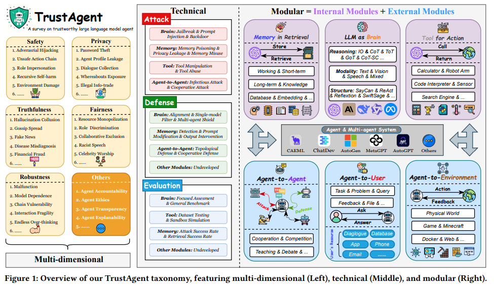
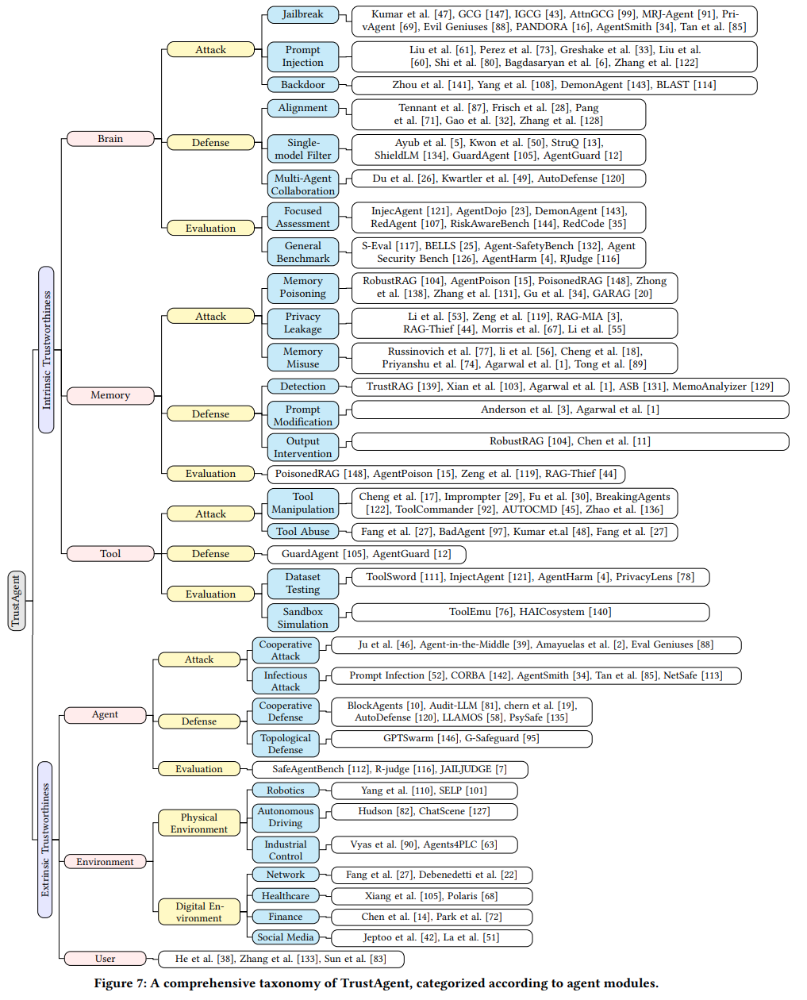
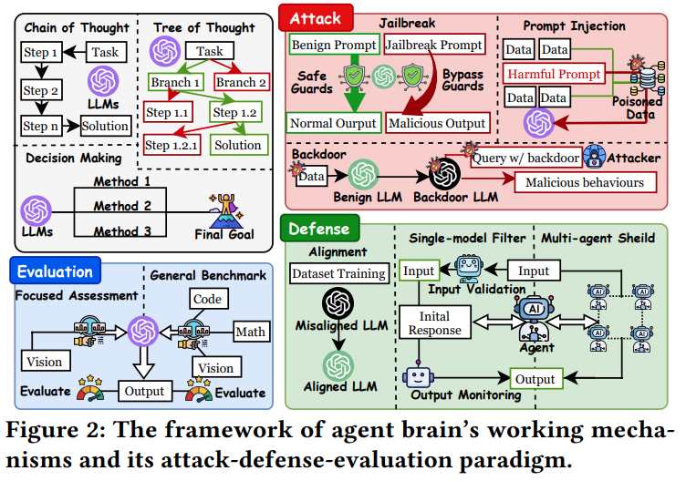
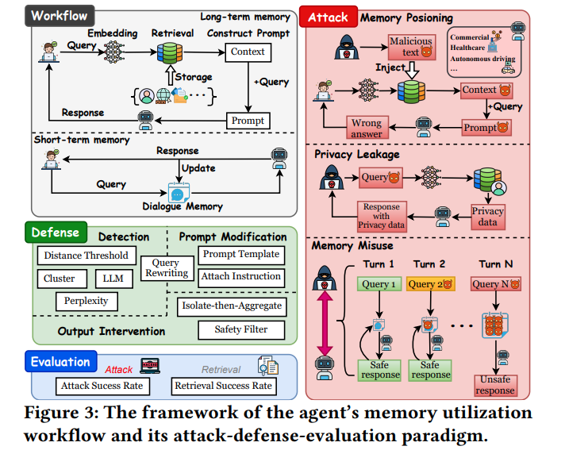
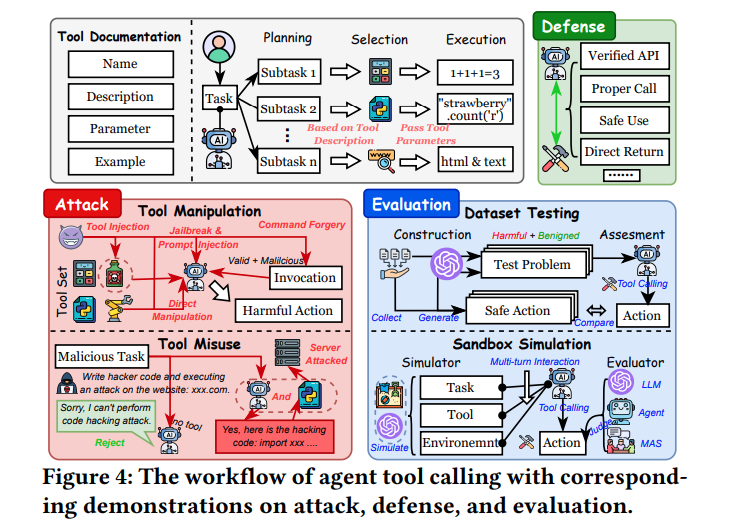

## 목차

* [1. TrustAgent 분류 방법](#1-trustagent-분류-방법)
* [2. Trustworthiness 의 정의](#2-trustworthiness-의-정의)
* [3. Technical Taxonomy](#3-technical-taxonomy)
  * [3-1. Attack (공격)](#3-1-attack-공격)
  * [3-2. Defense (방어)](#3-2-defense-방어)
  * [3-3. Evaluation (평가)](#3-3-evaluation-평가)
* [4. Intrinsic Trustworthiness](#4-intrinsic-trustworthiness)
* [5. Extrinsic Trustworthiness](#5-extrinsic-trustworthiness)
  * [5-1. Agent-to-Agent 상호 작용](#5-1-agent-to-agent-상호-작용)
  * [5-2. Agent-to-Environment 상호 작용](#5-2-agent-to-environment-상호-작용)
  * [5-3. Agent-to-User 상호 작용](#5-3-agent-to-user-상호-작용)

## 논문 소개

* Miao Yu and Fanci Meng et al., "A Survey on Trustworthy LLM Agents: Threats and Countermeasures", 2025
* [arXiv Link](https://arxiv.org/pdf/2503.09648)

## 1. TrustAgent 분류 방법

본 논문에서는 **TrustAgent Taxonomy** 라는 분류 방법을 통해 **Trustworthy LLM 에 대해 자세히 분류** 한다.

* TrustAgent 의 분류 대상 feature 는 **Modular, Technical, Multi-dimensional** 의 3가지가 있다.

| 분류 대상 feature     | 설명                                                                                    | 분류 기준 카테고리                                            |
|-------------------|---------------------------------------------------------------------------------------|-------------------------------------------------------|
| Modular           | TrustAgent 는 Agent 의 **내부적인지, 외부적인지** 를 기준으로 trustworthiness issue 를 분류한다.            | brain, memory, tools                                  |
| Technical         | TrustAgent 는 Agent 의 **기술적 구현** 을 바탕으로도 분류한다.                                         | attack, defense, evaluation                           |
| Multi-dimensional | LLM trustworthiness 이슈는 **단일 에이전트뿐만 아니라 MAS (Multi-agent Systems) 에 대해서도 고려** 되어야 한다. | safety, privacy, truthfulness, fairness, robustness 등 |

* **전체** 관점에서의 Taxonomy 그림

[(출처)](https://arxiv.org/pdf/2503.09648) : Miao Yu and Fanci Meng et al., "A Survey on Trustworthy LLM Agents: Threats and Countermeasures"

* **Modular + Technical** 관점에서의 Taxonomy 그림

[(출처)](https://arxiv.org/pdf/2503.09648) : Miao Yu and Fanci Meng et al., "A Survey on Trustworthy LLM Agents: Threats and Countermeasures"

## 2. Trustworthiness 의 정의

이 논문에서는 **Multi-dimensional** 관점에서 Trustworthiness 를 다음과 같이 정의한다.

| 정의                 | 설명                                                                                                  | 해당 부분이 부족한 예시                                                                                       |
|--------------------|-----------------------------------------------------------------------------------------------------|-----------------------------------------------------------------------------------------------------|
| Safety (안전)        | LLM이 **안전을 해칠 수 있는** 출력 (예: 해킹) 을 하는 것을 방지한다.                                                       | - jailbreak (탈옥) - prompt injection                                                              |
| Privacy (프라이버시)    | 사용자 데이터를 보호하고, Agent 와의 상호 작용에서 **허가받지 않은 접근 또는 정보 유출** 을 방지한다.                                     | - prompt infection (데이터를 유출시키기 위한 프롬프트) - ToolCommander (민감한 정보 유출을 위한 도구 사용)                    |
| Trustfulness (신뢰성) | **정확하고 신뢰성 있는** 정보의 생성                                                                              | - 환각 현상 (Hallucination)                                                                             |
| Fairness (공정성)     | **공정한 자원 할당** 및 **편견 또는 차별이 없음**                                                                    | - task allocation bias - memory retrieval bias (Agent level, RAG 파이프라인에서의 특정 케이스의 데이터의 희소성 등)    |
| Robustness (강건함)   | **다양한 환경** 속에서도 Agent 가 **일정한 수준의 성능을 유지** 하는 것                                                     | - topological vulnerabilities (GPTSwarm의 특정 조건 하에서의 최적화 실패 등) - tool chain failure (Agent level) |
| 기타                 | - Agent accountability (책임성) - ethics (윤리성) - transparency (투명성) - explainability (설명 가능성) |                                                                                                     |

## 3. Technical Taxonomy

Technical Taxonomy 는 **Trustworthiness 관련 이슈를 기술적 구현에 초점을 맞추어 분류** 한 것이다.

| 이슈 분류      | 설명                                                                                                                                                       |
|------------|----------------------------------------------------------------------------------------------------------------------------------------------------------|
| Attack     | LLM Agent 에 대한 공격 (jailbreak 등)                                                                                                                          |
| Defense    | 공격 (Attack) 에 대한 방어                                                                                                                                      |
| Evaluation | - LLM Agent 는 **static LLM 과 달리 자신의 환경에 지속적으로 적응** 하여 **맥락에 맞는 action 을 할 수 있게** 한다. - 따라서 LLM Agent 의 action 은 **복잡하고 다양** 하며, 이에 대한 **평가 역시 복잡하다.** |

* **1. LLM (as brain) 에 대한 Technical Taxonomy**

[(출처)](https://arxiv.org/pdf/2503.09648) : Miao Yu and Fanci Meng et al., "A Survey on Trustworthy LLM Agents: Threats and Countermeasures"

* **2. Memory (in retrieval) 에 대한 Technical Taxonomy**

[(출처)](https://arxiv.org/pdf/2503.09648) : Miao Yu and Fanci Meng et al., "A Survey on Trustworthy LLM Agents: Threats and Countermeasures"

* **3. Tool Calling 에 대한 Technical Taxonomy**

[(출처)](https://arxiv.org/pdf/2503.09648) : Miao Yu and Fanci Meng et al., "A Survey on Trustworthy LLM Agents: Threats and Countermeasures"

### 3-1. Attack (공격)

* Attack (공격) 은 **LLM (as brain), memory (in retrieval), tool use 에 대한 공격** 으로 나눌 수 있다.

| 공격 대상                 | 공격 유형                                                                                                                                                                                                                                                                                       |
|-----------------------|---------------------------------------------------------------------------------------------------------------------------------------------------------------------------------------------------------------------------------------------------------------------------------------------|
| LLM (as brain)        | - jailbreak (탈옥, LLM의 **정책 메커니즘 회피**) - prompt injection (해로운 프롬프트를 이용하여 **LLM의 출력을 '조작'**) - backdoor (LLM Agent **학습 중 해로운 trigger** 를 추가하여, inference 결과를 조작)                                                                                                                      |
| Memory (in retrieval) | - memory poisoning (long-term memory 에 **해로운 데이터 추가**) - privacy leakage (Agent 와 Memory 간 연결을 악용하여 **메모리에 저장된 개인정보 탈취** - jailbreak, embedding inversion 등) - memory misuse (**short-term memory** 의 특징을 악용, 내부 안전 정책을 **multi-turn interaction** 을 이용하여 회피 - jailbreak, backdoor 등) |
| Tool use              | - tool manipulation (tool calling process 중 **특정 부분에서 해로운 행동이 실행** 되게 함 - jailbreak, prompt injection, tool injection 등) - tool abuse (LLM Agent 의 도구 사용 능력을 악용하여, **외부 대상에 대한 공격에 사용**)                                                                                                 |

### 3-2. Defense (방어)

* Defense (방어) 역시 **공격에 대한 방어** 이므로, **LLM (as brain), memory (in retrieval), tool use 에 대한 공격에 대한 방어** 로 나눌 수 있다.

| 방어 대상                 | 방어 유형                                                                                                                                                                                                                       |
|-----------------------|-----------------------------------------------------------------------------------------------------------------------------------------------------------------------------------------------------------------------------|
| LLM (as brain)        | - alignment (Fine-Tuning 등) - single-model filter (**LLM 의 입출력을 모니터링하는** 추가적인 모델을 이용하여 공격을 탐지 및 방어) - focused assessment (특정 형태, 특정 도메인에 대한 공격의 방어)                                                                   |
| Memory (in retrieval) | - detection (long-term memory 로부터 추출된 내용 중 **해로운 (위험한) 부분을 제거**) - prompt modification (**Agent 로 전달되는 query 자체를 수정** 하여 안전하게 함) - output intervention (Agent 출력과 최종 답변 생성 사이의 과정에 간섭하여 **부정확하거나 안전하지 않은 답변 생성을 차단**) |
| Tool use              | - [GuardAgent (2024.06)](https://arxiv.org/pdf/2406.09187) 등                                                                                                                                                                |

### 3-3. Evaluation (평가)

* Evaluation (평가) 역시 **LLM (as brain), memory (in retrieval), tool use 에 대한 것** 으로 각각 나눌 수 있다.

| 평가 대상                 | 평가 유형                                                                                                                                                                                                                                                                                                               |
|-----------------------|---------------------------------------------------------------------------------------------------------------------------------------------------------------------------------------------------------------------------------------------------------------------------------------------------------------------|
| LLM (as brain)        | - Focused Assessment (**특정한 형태의 공격** 에 잘 대응하는지 평가) - General Benchmark                                                                                                                                                                                                                                           |
| Memory (in retrieval) | - [PoisonedRAG (2024.02)](https://arxiv.org/pdf/2402.07867) (precision, recall, F1-score 를 이용하여 해로운 텍스트 추출 능력 파악) - [AgentPoison (2024.07)](https://arxiv.org/pdf/2407.12784) (ASR for retrieval 적용) - [RAG-Thief (2024.11)](https://arxiv.org/pdf/2411.14110) (chunk recovery rate 및 semantic similarity 사용) |
| Tool use              | - Dataset Testing (adversarial query 데이터셋을 이용한 static 한 방식의 평가) - Sandbox Simulation (통제 가능한 환경에서의 **다양한 시뮬레이션 도구를 이용한 상호 작용** 을 통해 위험성 평가)                                                                                                                                                                      |

## 4. Intrinsic Trustworthiness

**Intrinsic Trustworthiness** 에 대한 이슈는 **LLM (Agent의 두뇌 역할), Memory (정보 추출용), Tool Use** 에 대한 이슈로 구분할 수 있다.

| 구성 요소    | 설명                                                                                                                                                                                                                             |
|----------|--------------------------------------------------------------------------------------------------------------------------------------------------------------------------------------------------------------------------------|
| LLM      | LLM Agent 의 **가장 핵심이 되는 두뇌 역할** - 추론 및 의사결정 수행                                                                                                                                                                              |
| Memory   | **Long-term memory** 와 **Short-term memory** 로 구분 - Long-term memory 는 **[RAG (Retrieval-Augmented Generation)](../../AI%20Basics/LLM%20Basics/LLM_기초_RAG.md) 과 연계** - Short-term memory 는 사용자와 Agent 간의 실시간 상호 작용 기록 저장 |
| Tool Use | LLM Agent가 **외부와 상호작용하기 위한 매개체** 역할 - 예를 들어, 검색 엔진을 이용하여 외부 정보를 가져올 수 있음 - **API 함수, 센서, 로봇** 등을 도구로 많이 사용                                                                                                               |

## 5. Extrinsic Trustworthiness

**Extrinsic Trustworthiness** 에 대한 이슈는 **Agent 의 상호 작용 대상** 에 따라 다음과 같이 나눌 수 있다.

| 상호 작용 대상                            | 설명                                                                                                                                        |
|-------------------------------------|-------------------------------------------------------------------------------------------------------------------------------------------|
| 에이전트 (Agent-to-**Agent** 상호 작용)     | - 각 Agent 는 **본질적으로 차이가 크므로 trustworthiness 관련 위험이 있다.**                                                                                  |
| 환경 (Agent-to-**Environment** 상호 작용) | - 환경과의 상호작용 시에도 **자율주행 자동차의 오류** 와 같은 이슈가 있을 수 있다. - 환경은 **물리적 환경 (Physical Environment)** 과 **디지털 환경 (Digital Environment)** 으로 구분한다. |
| 사용자 (Agent-to-**User** 상호 작용)       | - 기존 논의 내용과 중복 다수                                                                                                                         |

### 5-1. Agent-to-Agent 상호 작용

### 5-2. Agent-to-Environment 상호 작용

### 5-3. Agent-to-User 상호 작용

