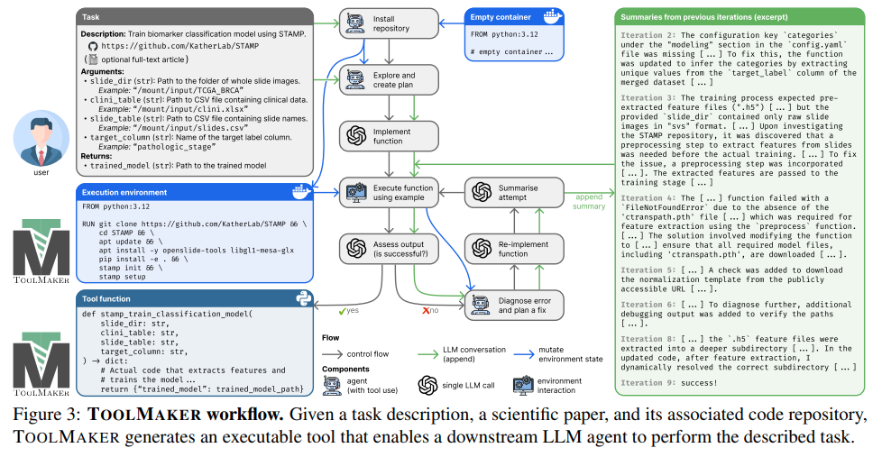
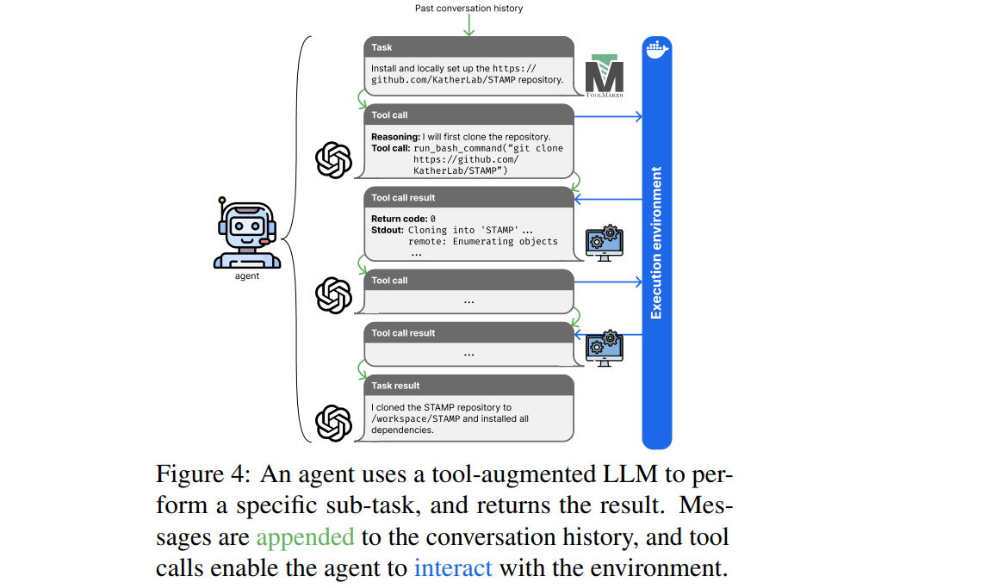
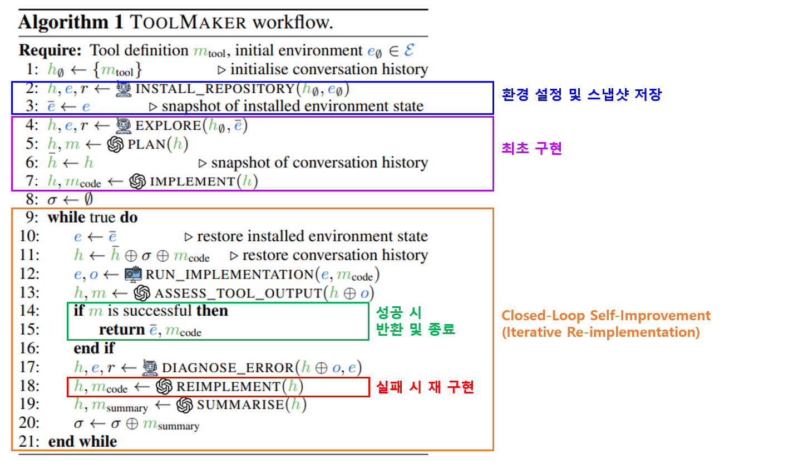
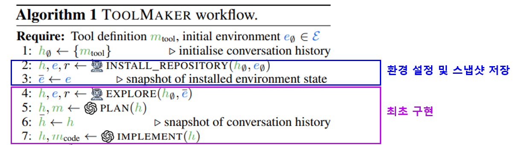
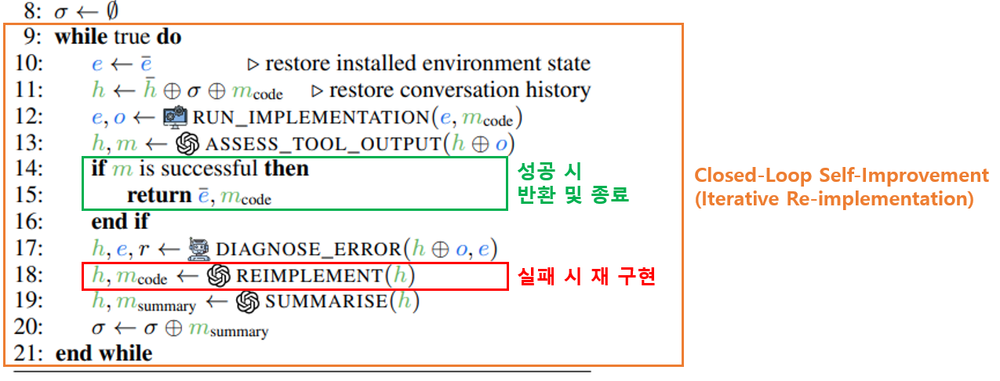

## 목차

* [1. ToolMaker 의 전체 구조 및 흐름](#1-toolmaker-의-전체-구조-및-흐름)
* [2. 구성 요소](#2-구성-요소)
  * [2-1. LLM Calls](#2-1-llm-calls)
  * [2-2. Environment Interactions](#2-2-environment-interactions)
  * [2-3. Agents](#2-3-agents)
* [3. 알고리즘 흐름](#3-알고리즘-흐름)
  * [3-1. 환경 설정 및 최초 구현](#3-1-환경-설정-및-최초-구현)
  * [3-2. Closed-Loop Self-Improvement](#3-2-closed-loop-self-improvement)
* [4. 실험 설정 및 결과](#4-실험-설정-및-결과)
  * [4-1. 실험 벤치마크 데이터셋](#4-1-실험-벤치마크-데이터셋)
  * [4-2. Task Definitions & Prompts](#4-2-task-definitions--prompts)
  * [4-3. 실험 결과](#4-3-실험-결과)

## 논문 소개

* Georg Wölflein and Dyke Ferber et al., "LLM Agents Making Agent Tools", 2025
* [arXiv Link](https://arxiv.org/pdf/2502.11705?)

## 1. ToolMaker 의 전체 구조 및 흐름



[(출처)](https://arxiv.org/pdf/2502.11705?) : Georg Wölflein and Dyke Ferber et al., "LLM Agents Making Agent Tools"

**ToolMaker** 의 핵심 아이디어는 다음과 같다.

* 배경
  * 머신러닝 논문과 같은 **논문의 code repo.** 를 **LLM-compatible tool 의 조합** 으로 바꿔야 한다.
    * 각 tool 은 **사용자가 정의한 특정 task 를 완수** 할 수 있어야 한다.
  * 이를 위해 최소한의 **tool definition** 이 있어야 한다.

* **tool definition** 에 포함되어야 할 내용
  * task 에 대한 **간결한 설명**
  * 관련된 repo. 의 **GitHub URL**
  * **input argument 의 목록** (각 argument 에 대한 예시 값 포함)

* **핵심 아이디어**
  * 위와 같은 **tool definition** 을 이용하여,
  * **이를 Python 함수로 구현** 할 뿐만 아니라 **함수가 실행되는 환경 설정** 까지 할 수 있는 Agent 인 **ToolMaker** 를 구현한다.
    * 환경 설정 (dependency 설치, 모델 다운로드 등) 은 **복잡한 작업을 요하므로 중요하다.**

* **핵심 흐름 요약**

| 흐름                  | 설명                                                            |
|---------------------|---------------------------------------------------------------|
| environment setup   | 재 생성 가능한, **tool 이 동작하는 Docker Image** (System Snapshot) 를 생성 |
| tool implementation | 주어진 task 를 실행하는 **Python 함수** 구현                              |

## 2. 구성 요소

**ToolMaker** 의 구성 요소는 다음과 같다.

| 구성 요소                                                     | 설명                                                              |
|-----------------------------------------------------------|-----------------------------------------------------------------|
| [LLM Calls](#2-1-llm-calls)                               | 현재 workflow 의 **conversation 을 update** 한다.                     |
| [Environment Interactions](#2-2-environment-interactions) | 현재 환경 (environment) 으로부터 정보를 읽거나, 현재 환경을 수정한다. (write)          |
| [Agents](#2-3-agents)                                     | 위에 언급한 **LLM Calls** 와 **Environment Interactions** 를 실제로 수행한다. |

* 기본 notation

| notation | 설명                                                 |
|----------|----------------------------------------------------|
| $s$      | state of the workflow, $s = (h, e) \in H \times E$ |
| $h$      | conversation history, $h \in H$                    |
| $e$      | environment state, $e \in E$                       |
| $S$      | 모든 가능한 workflow state 의 집합, $S = H \times E$       |
| $R$      | 모든 가능한 return 의 집합, $R ⊇ M \cup O$                 |
| $M$      | generated message 의 집합                             |
| $O$      | environment observation (환경 상태의 관측) 의 집합           |

* 추가 notation

| 용어                       | 설명                                                                                                                      |
|--------------------------|-------------------------------------------------------------------------------------------------------------------------|
| component                | workflow state 에서의 함수, $S → S \times R$ (Return 의 집합 $R$ 추가)<br>아래 **LLM Calls, environment interactions, agents** 를 의미 |
| LLM Calls                | $H → H \times M$ (메시지의 집합 $M$ 추가)                                                                                       |
| environment interactions | $E → E \times O$ (환경 상태 관측의 집합 $O$ 추가)                                                                                  |
| agents                   | $H \times E → H \times E \times R$ (Return 의 집합 $R$ 추가)                                                                 |

### 2-1. LLM Calls

**LLM Calls** 는 현재 workflow 에서의 **conversation 을 update** 하는 역할을 한다.

* LLM 은 **$H → M$ (conversation history 집합 → 메시지 집합) 이라는 함수** 로 나타낼 수 있다.
* ToolMaker workflow 에서는, **LLM call $l$ 을 $H → H \times M$ 으로** 나타낼 수 있다.
  * 개별 conversation history 관점에서는 $h → (h ⊕ LLM(h), LLM(h))$ 로 나타낼 수 있다.

| 구분           | LLM Calls 에 의해 업데이트됨 |
|--------------|----------------------|
| conversation | ✅                    |
| environment  | ❌                    |

* 본 논문에서는 LLM calls 를 위한 LLM 으로 OpenAI 의 **gpt-4o-2024-08-06** 을 사용한다.

### 2-2. Environment Interactions

**Environment Interaction** 은 현재 환경으로부터 정보를 읽거나 현재 환경에 정보를 write 하는 **action $a \in A$** 을 말한다.

* 수식으로는 $e → (e', o)$ 로 나타낼 수 있다.
  * $e'$ 는 **업데이트된 환경 상태**, $o \in O$ 는 해당 action 에 의해 만들어진 **환경 상태 관측** 이다.
* 가능한 Action 을 나타내면 다음과 같다.

| Action                           | read-only<br>($e' = e$) | write<br>(can modify $e$) | 비고                                      | 
|----------------------------------|-------------------------|---------------------------|-----------------------------------------|
| ```run_bash_command```           |                         | ✅                         |                                         |
| ```list_directory```             | ✅                       |                           |                                         |
| ```read_file```                  | ✅                       |                           |                                         |
| ```write_file```                 |                         | ✅                         |                                         |
| ```browse```                     | ✅                       |                           |                                         |
| ```google_drive_list_folder```   | ✅                       |                           |                                         |
| ```google_drive_download_file``` |                         | ✅                         |                                         |
| ```run_implementation```         |                         | ✅                         | ToolMaker 가 새로운 후보 tool 을 구현하고 실행할 수 있음 |

### 2-3. Agents

**Agents** 는 위에서 언급한 [LLM Calls](#2-1-llm-calls) 와 [Environment Interaction](#2-2-environment-interactions) 을 여러 번 수행하여 **특정한 high-level instruction 에 의해 지정된 sub-task 를 완수** 하는 것을 목표로 한다.

* high-level instruction 은 ```install this repository and its dependencies``` 와 같은 것을 말한다.

| notation      | 설명                     |
|---------------|------------------------|
| $\pi$         | Agent                  |
| $m_\pi \in M$ | high-level instruction |



[(출처)](https://arxiv.org/pdf/2502.11705?) : Georg Wölflein and Dyke Ferber et al., "LLM Agents Making Agent Tools"

**1. Agent 에 의한 State Transition**

* Agent $\pi$ 는 current state $s = (h, e)$ 를 new state $s_T = (h_T, e_T)$ 로 mapping 시킨다.
  * 이때 return value 는 $r \in R : (h, e) → (h_T, e_T, r)$ 이다.
  * Agent 에 의한 state transition 은 $s_0 → s_1 → ... → s_T$ 이다.
  * $s_0 = (h ⊕ m_\pi, e)$ 로 conversation history + instruction 만 있는 상태이다.

* 각 time step $t$ 에서 Agent 는 **tool-augmented LLM ( $LLM_\pi$ )** 을 사용한다.
  * $LLM_\pi : H → A_\pi \cup R$
  * 현재 conversation $h_t$ 에 대해, 다음 중 하나가 반드시 반환된다.
    * **action** $a_t \in A_\pi$ (= tool call) 
    * **final result** $r \in R$ of sub-task

* 이때, ```run_implementation``` 은 **ToolMaker workflow 의 별도 step** 이므로 **action 의 집합 $A_\pi$ 에 존재하지 않는다.**

**2. LLM 의 제안에 의한 Action 실행**

* LLM 이 action $a_t = LLM_\pi (h_t) \in A$ 를 제안한 경우, 다음과 같이 실행한다.
  * 현재 환경에서 $a_t$ 를 실행하여 **업데이트된 환경 상태 $(e_{t+1}, o_t) = a_t(e_t)$** 를 얻는다.
  * **tool call & observation 결과를 conversation** 에 추가한다. 즉 next state 는 다음과 같다.
    * $s_{t+1} = (h_t ⊕ a_t ⊕ o_t, e_{t+1})$ 

* 단, $a_t = LLM_\pi (h_t)$ 에 의해 **final result $r \in R$ 가 반환** 된 경우,
  * Agent 의 실행이 종료되고 그 결과로 $s_T = (h_t, e_t, r)$ 가 반환된다. 

## 3. 알고리즘 흐름

전체 알고리즘의 흐름은 아래 그림과 같다.



[(출처)](https://arxiv.org/pdf/2502.11705?) : Georg Wölflein and Dyke Ferber et al., "LLM Agents Making Agent Tools"

* 위 알고리즘에서 앞서 말한 **LLM calls, Environment Interactions, Agents** 의 component 를 사용한다.

### 3-1. 환경 설정 및 최초 구현



[(출처)](https://arxiv.org/pdf/2502.11705?) : Georg Wölflein and Dyke Ferber et al., "LLM Agents Making Agent Tools"

| 순서 | 작업                                | 설명                                                                                                                                                           |
|----|-----------------------------------|--------------------------------------------------------------------------------------------------------------------------------------------------------------|
| 1  | ```install_repository``` Agent 실행 | - 해당 Agent 는 Repo. 를 clone 하는 것은 물론 **탐색, 문서 읽기, dependency (모델, 데이터셋, 라이브러리 등) 다운로드** 도 수행<br>- 해당 Agent 는 **깨끗한 Python 3.12 환경 $e_\pi$** 을 초기 상태로 하여 실행 시작 |
| 2  | ```explore``` Agent 실행            | - context 오염을 방지하기 위해 **이전 stage 의 conversation history 를 이용하지는 않음** (즉, ```explore``` 실행 시 $h$ 대신 $h_\pi$ 를 인수로 함)                                          |
| 3  | ```plan``` LLM Call 실행            | - 구현을 위한 **step-by-step plan** 을 LLM 에게 요청하여 반환받음                                                                                                            |
| 4  | ```implement``` LLM Call 실행       | - 위 plan 에 근거하여 **최초의 Python 코드 작성**<br>- 이것은 **candidate implementation** 에 해당                                                                              |

### 3-2. Closed-Loop Self-Improvement



[(출처)](https://arxiv.org/pdf/2502.11705?) : Georg Wölflein and Dyke Ferber et al., "LLM Agents Making Agent Tools"

| 순서         | 작업                                                  | 설명                                                                                       |
|------------|-----------------------------------------------------|------------------------------------------------------------------------------------------|
| 1          | 환경 상태 & 대화 기록 복원                                    | Agent 가 write 를 이미 실행했을 경우에 대비                                                           |
| 2          | ```run_implementation``` environment interaction 실행 | candidate implementation (= candidate Python function) 실행                                |
| 3          | ```assess_tool_output``` LLM Call 실행                | candidate implementation 실행 결과 평가 **(성공 여부)**<br>- **평가 합격 (성공) 시, 해당 코드를 반환하고 알고리즘 종료** |
| (평가 불합격 시) | 아래 (4), (5), (6) 의 작업 진행                            |                                                                                          |
| 4          | ```diagnose_error``` Agent 실행                       | 오류 원인 탐색 (진단) & 해결 계획 수립<br>- 이때, **실행 환경을 reset 시키지 않음**                                |
| 5          | ```reimplement``` LLM Call 실행                       | 해결 계획에 근거하여 **수정된 Python 코드 작성**<br>- 앞의 ```implement``` LLM Call 과 유사                   |
| 6          | ```summarise``` LLM Call 실행                         | **Next iteration 에서 유용하게 사용** 하기 위해, **현재 step 에 대한 요약 정보** 를 반환하도록 LLM 에게 요청            |

## 4. 실험 설정 및 결과

### 4-1. 실험 벤치마크 데이터셋

* **TM-Bench** 를 벤치마크 데이터셋으로 사용
  * 과학의 여러 분야에 대한 15개의 다양한 task 포함
* TM-Bench 에 task 를 포함시키기 전에, **GitHub repo. 를 통해 관련 tool 을 설치** 하여 **task 의 설계 완전성을 높이고 해결 가능함을 보장**

### 4-2. Task Definitions & Prompts

* 각 task 의 정의는 다음 내용을 포함한다.
  * 한 문장으로 된 **task description** 
  * code **repository 의 URL**
  * **input argument** 목록 (example 'invocation' 포함)
  * **예상되는 출력값** 에 대한 설명

**1. Task Invocation**

* **Task Invocation** 이란, 각 input argument 에 대한 값, 외부 파일 및 디렉토리 등을 특정하는 역할을 한다.
* TM-Bench 의 task 중 대부분은 **외부 파일을 필요로** 한다.

**2. 정확도 평가**

* 각각의 task invocation 에 대해, TM-Bench 는 **의도한 출력을 생성하는지를 평가하는 unit test** 가 존재한다.
* 이 논문에서 unit test 를 채택한 이유는 **feature vector 의 형태, mask 의 크기 등 복잡한 기준을 충족** 하는지 평가할 수 있기 때문이다.
* 특히, 본 논문에서는 다음을 정확도 평가 기준으로 사용한다. **(엄격하게 적용)**

| 정확도 평가 기준       | 설명                       |
|-----------------|--------------------------|
| ```structure``` | return type, dimension 등 |
| ```values```    | 값의 범위, 정확도, 통계적 특징 등     |
| ```files```     | 파일 존재 여부, 포맷, 파일의 내용 등   |
| ```execution``` | 오류 발생 여부                 |

### 4-3. 실험 결과

