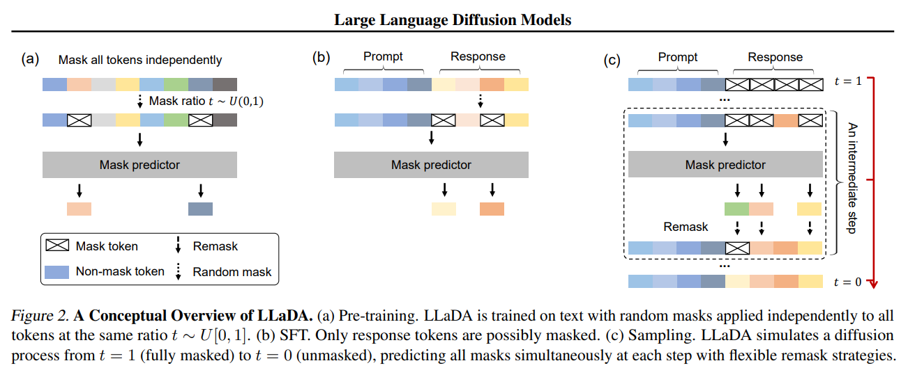
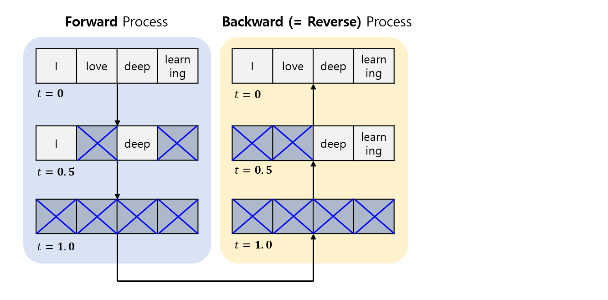
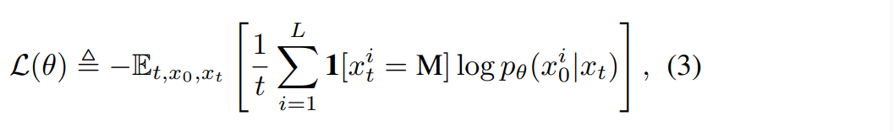
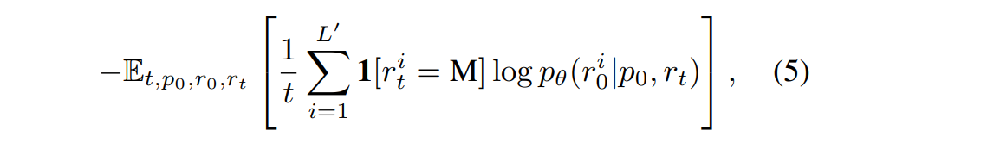
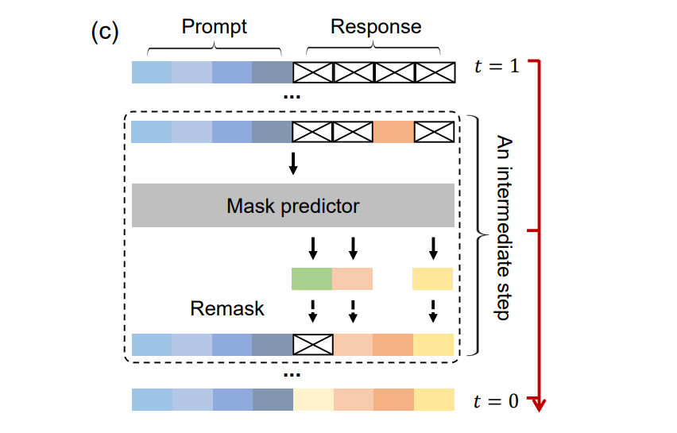
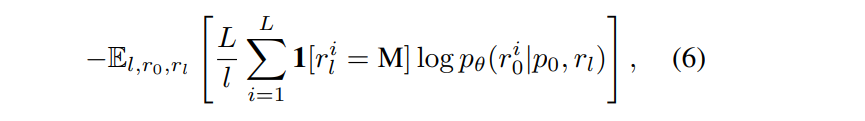
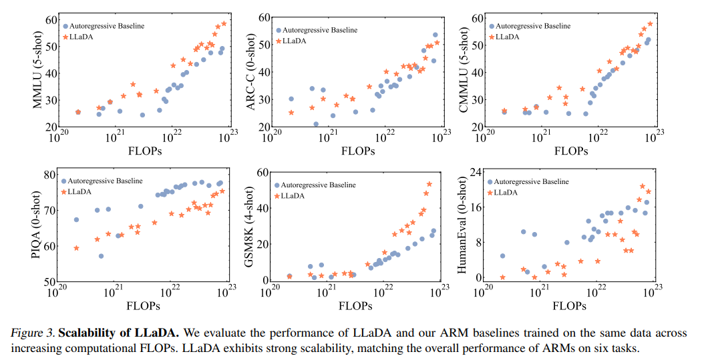
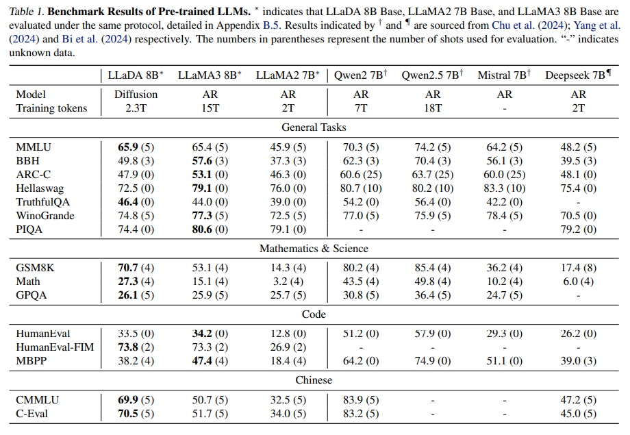
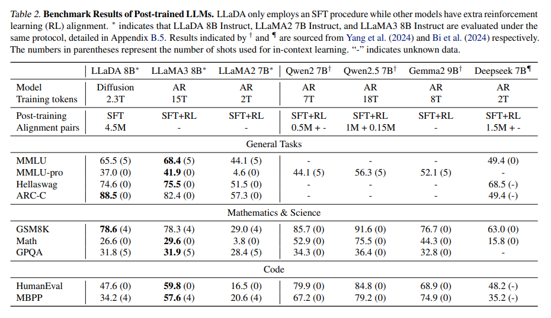

## 목차

* [1. 핵심 아이디어](#1-핵심-아이디어)
* [2. LLaDA 의 접근 방법](#2-llada-의-접근-방법)
  * [2-1. Mask Prediction (확률 기반)](#2-1-mask-prediction-확률-기반)
  * [2-2. Pre-training](#2-2-pre-training)
  * [2-3. Supervised Fine-Tuning](#2-3-supervised-fine-tuning)
  * [2-4. Inference](#2-4-inference)
* [3. 실험 결과](#3-실험-결과)
  * [3-1. 기존 ARM baseline 과의 비교](#3-1-기존-arm-baseline-과의-비교)
  * [3-2. 벤치마크 테스트 결과](#3-2-벤치마크-테스트-결과)

## 논문 소개

* Shen Nie and Fengqi Zhu et al., "Large Language Diffusion Models", 2025
* [arXiv Link](https://arxiv.org/pdf/2502.09992)

## 1. 핵심 아이디어

이 논문에서는 **LLaDA (Large Language Diffusion with mAsking)** 를 소개한다.

* 이미지 생성을 위한 [Diffusion 기술](../../Generative%20AI/Basics_Diffusion%20Model.md) 의 기술을 LLM 에 적용한다.
  * 즉, Next token prediction 이 아닌, **전체 문장을 처음에 noise 로 prediction** 한 후 **그 noise 를 제거해 나가면서 문장을 완성** 한다.
* Diffusion 기술의 **Noise** 를 여기서는 **Mask** 로 한다.
  * 즉, 이미지 생성을 위한 Diffusion 에서의 **Noise Prediction** 대신 **Mask Prediction** 을 사용한다.

## 2. LLaDA 의 접근 방법



[(출처)](https://arxiv.org/pdf/2502.09992) : Shen Nie and Fengqi Zhu et al., "Large Language Diffusion Models"

* LLaDA 의 접근 방법은 각 단계 (Pre-Training, Supervised Fine-Tuning, Sampling) 별로 다음과 같다.

| 구분                                                                                                                                                        | 그림  | 설명                                                                                                          |
|-----------------------------------------------------------------------------------------------------------------------------------------------------------|-----|-------------------------------------------------------------------------------------------------------------|
| Pre-Training                                                                                                                                              | (a) | **random mask** 가 독립적으로 적용된 텍스트 데이터로 Pre-train 됨                                                            |
| [Supervised Fine-Tuning (SFT)](https://github.com/WannaBeSuperteur/AI-study/blob/main/AI%20Basics/LLM%20Basics/LLM_%EA%B8%B0%EC%B4%88_Fine_Tuning_SFT.md) | (b) | Pre-Training 과 유사하되, **Response token 만을 masking** 처리                                                       |
| Sampling (Inference 의 기본 방법)                                                                                                                              | (c) | - $t=1$ (fully masked) → $t=0$ (unmasked) 로 진행<br>- 각 step 에서 **모든 mask 를 동시에** 예측하되, 이후에 **re-masking** 적용 |

### 2-1. Mask Prediction (확률 기반)

* 이미지 생성을 위한 **Diffusion** 기술의 **Noise Predictor** 처럼, **LLaDA** 에는 **Mask Predictor** 가 있다.

**1. LLaDA 의 Forward & Backward Process**

| Process                          | 설명                                                                                                                                         |
|----------------------------------|--------------------------------------------------------------------------------------------------------------------------------------------|
| **Forward** Process              | - 원본 텍스트 $x_0$ 를 **완전히 masking 될 때 ($t = 1$)** 까지 점차적으로 masking 한다.<br>- 이때 중간 텍스트 $x_t$ 는 **부분적으로 masking 된** 상태이다. (masking 되었을 확률: $t$) |
| **Backward (= Reverse)** Process | - **masked token 을 예측** 한다.<br>- Reverse Process 동안 $t = 1$ 에서 $t = 0$ 으로 이동한다.                                                            |



**2. Mask Predictor**

* Mask Predictor 는 **모든 masked token 을 동시에 예측** 하는 모델이다.
  * 다음과 같이 **masked token** 에만 적용되는 [Cross-Entropy Loss](../../AI%20Basics/Deep%20Learning%20Basics/딥러닝_기초_Loss_function.md#2-5-categorical-cross-entropy-loss) 를 Loss Function 으로 하여 학습된다.



[(출처)](https://arxiv.org/pdf/2502.09992) : Shen Nie and Fengqi Zhu et al., "Large Language Diffusion Models"

| notation                 | 설명                                         |
|--------------------------|--------------------------------------------|
| $p_\theta (· \vert x_t)$ | Mask Predictor                             |
| $x_0$                    | original text (sampled from training data) |
| $x_t$                    | input of mask predictor                    |
| $M$                      | masked token                               |
| $1[·]$                   | **Loss 가 masked token 에만 적용됨** 을 의미        |

### 2-2. Pre-training

LLaDA 의 Pre-training 에는 **Random Mask 가 독립적으로 & 확률적으로 적용된 텍스트 데이터** 가 사용되었다.

| 구분                  | 설명                                    |
|---------------------|---------------------------------------|
| Pre-training 데이터 규모 | **2.3 조 개** 의 token                   |
| LLaDA Model 크기      | **1B** (LLaDA 1B) & **8B** (LLaDA 8B) |

* Random Masking 방법
  * $t \in [0, 1]$ 의 $t$ 값을 랜덤하게 샘플링한다.
  * 각 token 을 **동일한 $t$ 의 확률로 masking** 하여 $x_t$ 를 얻는다.
  * 상술한 [확률 기반 Mask Prediction](#2-1-mask-prediction-확률-기반) 의 Cross-Entropy Loss Function 을 **그대로 적용** 하여 학습한다.
  * LLaDA 가 **다양한 길이의 텍스트** 를 처리할 수 있도록, **1% 의 Pre-training 데이터는 ```[1, 4096]``` 범위 내의 랜덤한 길이** 로 만든다.

* 상세 하이퍼파라미터

| 하이퍼파라미터                                                                                                 | 설정값                                                                                                                                                                                                                                           |
|---------------------------------------------------------------------------------------------------------|-----------------------------------------------------------------------------------------------------------------------------------------------------------------------------------------------------------------------------------------------|
| [Learning Rate Scheduler](../../AI%20Basics/Deep%20Learning%20Basics/딥러닝_기초_Learning_Rate_Scheduler.md) | Warmup-Stable-Decay<br>- **처음 2,000 회** iteration 에서는 Learning Rate 를 **0 → 4e-4** 로 증가<br>- 이후 **1.2조 개 token** 학습 시에는 **4e-4** 유지<br>- 이후 **0.8조 개 token** 학습 시에는 **4e-4 → 1e-4** 로 감소<br>- 이후 **0.3조 개 token** 학습 시에는 **1e-4 → 1e-5** 로 감소 | 
| [Optimizer](../../AI%20Basics/Deep%20Learning%20Basics/딥러닝_기초_Optimizer.md)                             | [AdamW](../../AI%20Basics/Deep%20Learning%20Basics/딥러닝_기초_Optimizer.md#2-3-adamw)                                                                                                                                                             |
| [Weight Decay](../../AI%20Basics/Deep%20Learning%20Basics/딥러닝_기초_Optimizer.md#1-1-중요-개념-weight-decay)   | 0.1                                                                                                                                                                                                                                           |
| Batch Size                                                                                              | 1,280 (local batch size: 4 per GPU)                                                                                                                                                                                                           |

### 2-3. Supervised Fine-Tuning

LLaDA 의 Supervised Fine-Tuning (SFT) 과정은 **Pre-training 과 유사하되, Response Token 만을 Masking 처리** 하여 실시한다.

* 즉, 원래 확률분포 $p_\theta(x_0)$ 대신 **조건부 분포 (conditional distribution)** $p_\theta(r_0|p_0)$ 를 최적화한다.

| $p_0$  | $r_0$    |
|--------|----------|
| prompt | response |

**1. LLaDA 의 SFT 에서 사용되는 Loss Function**

* 상술한 [확률 기반 Mask Prediction](#2-1-mask-prediction-확률-기반) 의 Cross-Entropy Loss Function 기반
* 단, **LLaDA LLM 에 prompt 와 response 를 입력** 했을 때의, **Response Token 만을 고려한** Loss 라는 결정적인 차이점이 있다.

| 구분                     | Loss Function                                              |
|------------------------|------------------------------------------------------------|
| Pre-Training           |                             |
| Supervised Fine-Tuning | <br>($L'$ : dynamic length) |

[(수식 출처)](https://arxiv.org/pdf/2502.09992) : Shen Nie and Fengqi Zhu et al., "Large Language Diffusion Models"

**2. 상세 하이퍼파라미터**

| 하이퍼파라미터                                                                                                 | 설정값                                                                                                                                                              |
|---------------------------------------------------------------------------------------------------------|------------------------------------------------------------------------------------------------------------------------------------------------------------------|
| [Learning Rate Scheduler](../../AI%20Basics/Deep%20Learning%20Basics/딥러닝_기초_Learning_Rate_Scheduler.md) | - **처음 50 회** iteration 에서는 Learning Rate 를 **0 → 2.5e-5** 로 증가<br>- 이후 **전체의 90% 까지** 학습 시에는 **2.5e-5** 유지<br>- 이후 **마지막 10%** 학습 시에는 **2.5e-5 → 2.5e-6** 으로 감소 | 
| [Weight Decay](../../AI%20Basics/Deep%20Learning%20Basics/딥러닝_기초_Optimizer.md#1-1-중요-개념-weight-decay)   | 0.1                                                                                                                                                              |
| Batch Size                                                                                              | local batch size: 2 per GPU                                                                                                                                      |

### 2-4. Inference



[(출처)](https://arxiv.org/pdf/2502.09992) : Shen Nie and Fengqi Zhu et al., "Large Language Diffusion Models"

* Inference 의 핵심 프로세스인 **Sampling** 의 과정은 다음과 같다.
  * $t=1$ (fully masked) → $t=0$ (unmasked) 로 진행
  * 각 step 에서 **모든 mask 를 동시에** 예측하되, 이후에 **re-masking** 적용

**1. Sampling 기본 설정**

* **균등 분포된 timestep** 을 기본으로 함
  * Mask Predictor 의 예측을 최적화하기 위해, 각 step 마다 **동일한 정도의 mask prediction + remasking** 을 적용한다는 의미 **(추정)** 
* Generation Length **(Causal LLM 과 달리 모든 token 을 동시에 예측하므로 필요)** 역시 하이퍼파라미터로 지정

**2. Mask Prediction & Re-masking 전략**

* Mask Prediction
  * $t \in (0, 1]$, $s \in [0, t)$ 에 대해,
  * prompt $p_0$ 과 **일부분이 masking 된** response $r_t$ 을 mask predictor 에 입력
* Re-masking
  * predicted token 중 $\displaystyle \frac{s}{t}$ 의 비율만큼을 re-masking 처리
  * Re-masking 적용 이유는 **정확한 샘플링을 위해 Reverse Process (Mask Prediction) 를 Forward Process 와 Align** 시키기 위함
* Re-masking 전략
  * **Mask Predictor 의 Confidence 가 가장 낮은** predicted token 을 Re-masking 처리
  * 이 전략을 **Low-confidence Remasking** 이라고 함

**3. Conditional Likelihood Evaluation**

* [LLaDA Supervised Fine-Tuning](#2-3-supervised-fine-tuning) 에서의 Loss Function 의 Upper Bound 를 사용 가능
* 그러나, **아래의 (6) 수식을 적용하는 것이 variance 가 낮고, 따라서 evaluation 에 더 적절함**

| 구분                                | Loss Function                                              |
|-----------------------------------|------------------------------------------------------------|
| Supervised Fine-Tuning            | <br>($L'$ : dynamic length) |
| Conditional Likelihood Evaluation |                             |

[(수식 출처)](https://arxiv.org/pdf/2502.09992) : Shen Nie and Fengqi Zhu et al., "Large Language Diffusion Models"

## 3. 실험 결과

| 실험                                                 | 결과 요약                                                                         |
|----------------------------------------------------|-------------------------------------------------------------------------------|
| [기존 ARM basline 과의 비교](#3-1-기존-arm-baseline-과의-비교) | - ARM (Autoregressive Model) 과 유사한 성능<br>- **MMLU, GSM8K** 에서는 ARM 보다 성능이 뛰어남 |
| [벤치마크 테스트 결과](#3-2-벤치마크-테스트-결과)                    | - **수학, 과학, 추론** 부분에서 LLaMA3 보다 성능이 뛰어난 부분이 있음                                |

### 3-1. 기존 ARM baseline 과의 비교

여기서는 **LLaDA** 를 기존 **ARM (Autoregressive Model)** baseline 과 비교했다.

* 실험 결과 요약
  * LLaDA 는 **기존 ARM 기반의 baseline 에 충분히 가까운** 성능을 보인다.
  * 특히 **MMLU, GSM8K** 벤치마크에서는 **ARM 기반의 baseline 보다 우수한 성능** 을 보인다.



[(출처)](https://arxiv.org/pdf/2502.09992) : Shen Nie and Fengqi Zhu et al., "Large Language Diffusion Models"

* 실험 대상 벤치마크 데이터셋 및 평가 방법

| MMLU   | ARC-C  | CMMLU  | PIQA   | GSM8K  | HumanEval |
|--------|--------|--------|--------|--------|-----------|
| 5-shot | 0-shot | 5-shot | 0-shot | 4-shot | 0-shot    |

### 3-2. 벤치마크 테스트 결과

**Pre-trained LLM 및 Post-trained LLM** 에 대한 **벤치마크 테스트 결과** 는 다음 표와 같다.

* 실험 결과 요약

| 구분                | 실험 결과 요약                                                                                        |
|-------------------|-------------------------------------------------------------------------------------------------|
| Pre-trained LLMs  | - General Task 및 코딩에서는 일반적으로 **LLaMA3** 보다 성능이 떨어짐<br>- 그러나, **수학, 과학, 중국어** 영역에서 LLaMA3 보다 뛰어남 |
| Post-trained LLMs | - 일반적으로 **LLaMA3** 보다 성능이 떨어짐<br>- 그러나, **ARC-C, GSM8K** 벤치마크에서 LLaMA3 보다 뛰어남                   |

* **Pre-trained LLMs** 실험 결과 상세



[(출처)](https://arxiv.org/pdf/2502.09992) : Shen Nie and Fengqi Zhu et al., "Large Language Diffusion Models"

* **Post-trained LLMs** 실험 결과 상세



[(출처)](https://arxiv.org/pdf/2502.09992) : Shen Nie and Fengqi Zhu et al., "Large Language Diffusion Models"
