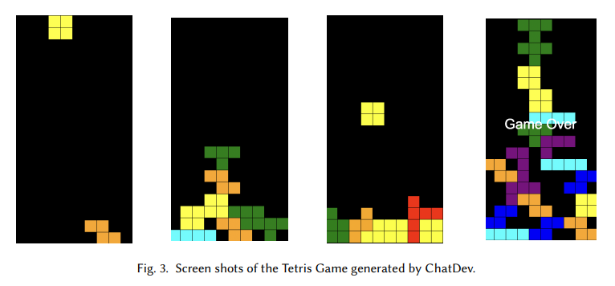

## 목차

* [1. LLM-based Autonomous Agent & Multi-Agent Systems](#1-llm-based-autonomous-agent--multi-agent-systems)
  * [1-1. Autonomous Agent](#1-1-autonomous-agent)
  * [1-2. LLM-based Autonomous Agent](#1-2-llm-based-autonomous-agent)
  * [1-3. LLM-based Multi-Agent Systems](#1-3-llm-based-multi-agent-systems)
* [2. LLM 논문 탐색 기준](#2-llm-논문-탐색-기준)
  * [2-1. Requires Engineering (요구사항 분석 등)](#2-1-requires-engineering-요구사항-분석-등)
  * [2-2. Code Generation (코드 생성)](#2-2-code-generation-코드-생성)
  * [2-3. Quality Assurance (QA)](#2-3-quality-assurance-qa)
* [3. Case Study](#3-case-study)
  * [3-1. Snake Game](#3-1-snake-game)
  * [3-2. Tetris Game](#3-2-tetris-game)
* [4. 논의 사항](#4-논의-사항)
  * [4-1. 개별 Agent 의 능력 향상](#4-1-개별-agent-의-능력-향상)
  * [4-2. Agent-Oriented Programming 을 통한 프롬프트 향상](#4-2-agent-oriented-programming-을-통한-프롬프트-향상)
  * [4-3. 인간과 Agent 간의 협업](#4-3-인간과-agent-간의-협업)
  * [4-4. 복잡한 프로젝트에 적용](#4-4-복잡한-프로젝트에-적용)

## 논문 소개

* JUNDA HE and CHRISTOPH TREUDE et al., "LLM-Based Multi-Agent Systems for Software Engineering: Literature Review, Vision and the Road Ahead", 2024
* [arXiv Link](https://arxiv.org/pdf/2404.04834)

## 1. LLM-based Autonomous Agent & Multi-Agent Systems

여기서는 다음 내용에 대해 다룬다.

| 구분                            | 설명                                                                      |
|-------------------------------|-------------------------------------------------------------------------|
| Autonomous Agent              | 다양한 환경에서 독립적, 효과적으로 동작하는 **계산 개체**                                      |
| LLM-based Autonomous Agent    | **LLM 기반** 의 Autonomous Agent                                           |
| LLM-based Multi-Agent Systems | **상호 작용하는 여러 개의 지능 에이전트** 가 작동하는 계산 프레임워크<br>- 복잡한 문제를 해결하는 등 목적 달성에 사용 |


### 1-1. Autonomous Agent

**Autonomous Agent** 는 **다양한 환경에서 독립적, 효과적으로 동작하는 계산 개체** 를 의미한다.

* 관련된 용어의 정의는 다음과 같다.

| 용어                           | 정의                                                |
|------------------------------|---------------------------------------------------|
| Autonomy                     | 외부 제어 없이 **독립적으로** 행동 및 내부 상태를 제어 가능              |
| Perceptron                   | 특정 메커니즘을 이용하여 **주변 환경의 변화** 를 감지                  |
| Intelligence and Goal-Driven | 특정 분야의 지식 및 문제 해결 능력 등을 이용하여 **문제 해결 목적** 에 초점을 둠 |
| Social Ability               | **인간 또는 다른 에이전트** 와 상호작용 가능, 그들과의 협업을 통해 목적 달성    |
| Learning Capabilities        | **지속적으로 새로운 경험, 지식 등을 학습** 하여 모델 자체를 발전시킬 수 있음    |

### 1-2. LLM-based Autonomous Agent

**LLM-based Autonomous Agent** 는 **LLM 기반으로 작동하는 Autonomous Agent** 이다.

* 관련된 notation 은 다음과 같다.

| Notation | 의미                                  | 설명                                        |
|----------|-------------------------------------|-------------------------------------------|
| **$L$**  | **Large Language Model (거대 언어 모델)** | LLM Agent 의 핵심 두뇌 역할                      |
| **$O$**  | **Objective (목표)**                  | LLM Agent 가 달성해야 하는 일종의 목표                |
| **$M$**  | **Memory (메모리)**                    | 현재 상태 및 지금까지 축적한 데이터 저장 공간                |
| **$P$**  | **Perception (인식)**                 | LLM Agent 가 주변 환경을 탐지 및 인식할 수 있는 능력       |
| **$A$**  | **Action (행동)**                     | LLM Agent 가 '실행할 수 있는 것'의 범위              |
| **$R$**  | **Rethink**                         | LLM Agent 가 **그 결과 및 사용자의 피드백을 재검토** 하는 것 |

### 1-3. LLM-based Multi-Agent Systems

**LLM-based Multi-Agent System** 은 **상호 작용하는 여러 개의 지능 에이전트가 작동하는 계산 프레임워크** 를 의미한다.

* **LMA = Large Language Models into Multi-Agent** 이다.
* LMA 시스템은 다음과 같은 **다음과 같은 2개의 중요 요소로 구성** 되어 있다.

**1. Orchestration Platform**

* **Agent 간의 상호작용 및 정보 교환** 을 관리하는 핵심 구조
* Agent 간의 커뮤니케이션, 계획 수립, 구조적인 동작 등을 가능하게 함

| Orchestration Platform 의 특징 | 설명                                                                                                                                                                                                                      |
|-----------------------------|-------------------------------------------------------------------------------------------------------------------------------------------------------------------------------------------------------------------------|
| Coordination (조정) Models    | - 에이전트 간 **상호작용 (협력적, 경쟁적 등)** 을 정의                                                                                                                                                                                     |
| Communication Mechanism     | - 에이전트 간 **정보의 흐름** 정의<br>- 중앙 집중형 (Centralized), 탈중앙형 (Decentralized) 등의 구조 가능                                                                                                                                         |
| Planning & Learning Style   | - 여러 개의 에이전트가 있는 시스템에서 **계획 수립 및 학습** 의 실행 방식 설정<br>- Agent 간 task 할당 등을 계획<br>- 방법 1 : **Centralized Planning, Decentralized Execution (CPDE)**<br>- 방법 2 : **Decentralized Planning, Decentralized Execution (DPDE)** |

**2. LLM-based Agents**

* LLM Agent 는 다음과 같은 특징을 가질 수 있다.
  * **Homogeneous** (각 Agent 가 **특정한 기능** 을 수행하는 경우)
  * **Heterogeneous** (각 Agent 가 **특정되지 않고 다양한 기능** 을 수행하는 경우)
* 각 LLM Agent 는 다음과 같이 표현할 수 있다.

| 구성 요소            | 표현              |
|------------------|-----------------|
| 전체 구조            | 그래프 $G(V, E)$   |
| 간선 (edge)        | $e_{i,j} \in E$ |
| LLM Agent (node) | $v_i$, $v_j$ 등  |

## 2. LLM 논문 탐색 기준

본 Survey 논문에서 정의한 **LLM Agent 논문 탐색 기준** 은 다음과 같다.

**1. 기본 전략**

* **DBLP publication** 에서 **keyword-based** search 실시
  * 논문 제목 선정 목적
  * DBLP 는 소프트웨어 엔지니어링 분야에서 많이 사용되는 논문 출처로, **컴퓨터 공학 분야의 1,800개의 저널에 있는 750만 개의 논문을 제공** 한다.
* 2개의 키워드 조합

| 키워드 조합 이름   | 설명                              |
|-------------|---------------------------------|
| Agent Words | LLM-based Multi-Agent System 관련 |
| SE Words    | 특정한 소프트웨어 엔지니어링 분야 관련           |

**2. SE (Software Engineering) Words 에서 사용되는 키워드**

* 다음과 같이 SDLC 의 핵심 키워드인 **Requirements Engineering, Code Generation, Quality Assurance, Maintenance** 에 대해서 키워드를 지정한다.

| 키워드 분야                   | 키워드                                                                |
|--------------------------|--------------------------------------------------------------------|
| Requirements Engineering | ```requirement``` ```specification``` ```stakeholder```            |
| Code Generation          | ```software``` ```code``` ```coding``` ```program```               |
| Quality Assurance (QA)   | ```bug``` ```fault``` ```defect``` ```test``` ```vulnerab``` 등     |
| Maintenance              | ```debug``` ```repair``` ```review``` ```refactor``` ```patch``` 등 |

**3. 논문 포함 및 제외 조건**

* 본 Survey 논문에서 제시한 LLM Agent 관련 논문 포함 및 제외 조건은 다음과 같다.
* 논문 탐색 실시일은 **2024년 11월 14일** 이다.


[(출처)](https://arxiv.org/pdf/2404.04834) : JUNDA HE and CHRISTOPH TREUDE et al., "LLM-Based Multi-Agent Systems for Software Engineering: Literature Review, Vision and the Road Ahead"


### 2-1. Requires Engineering (요구사항 분석 등)

| 논문                                                                                                                                   | 설명                                                              |
|--------------------------------------------------------------------------------------------------------------------------------------|-----------------------------------------------------------------|
| [Elicitron: An LLM Agent-Based Simulation Framework for Design Requirements Elicitation (2024.04)](https://arxiv.org/pdf/2404.16045) | **Elicitation (사람으로부터 데이터를 얻는 것)** 단계에 대한 상세 논문                 |
| [MARE: Multi-Agents Collaboration Framework for Requirements Engineering (2024.05)](https://arxiv.org/pdf/2405.03256)                | **요구사항 분석의 여러 단계** 를 커버하는 LMA 프레임워크                             |
| [AI based Multiagent Approach for Requirements Elicitation and Analysis (2024.09)](https://arxiv.org/pdf/2409.00038)                 | **Product owner, developer, QA, manager 의 4개의 Agent** 로 구성된 시스템 |

### 2-2. Code Generation (코드 생성)

* 코드를 생성하는 LLM Agent 시스템은 다음과 같이 5가지로 구분된다.

| 구분                    | 설명                                           | 예시                                                                                                                     |
|-----------------------|----------------------------------------------|------------------------------------------------------------------------------------------------------------------------|
| Orchestrator          | 소프트웨어 개발에 대한 **고수준의 계획** 수립                  | - [PairCoder (2024.09)](https://arxiv.org/pdf/2409.05001)                                                              |
| Programmer            | 소프트웨어의 **첫 번째 코드** 작성                        |                                                                                                                        |
| Reviewer              | Programmer 가 작성한 코드에 대한 **리뷰** 실시            | - [INTERVENOR (2023.11)](https://arxiv.org/pdf/2311.09868)                                                             |
| Tester                | **Edge case 를 포함한 test case 를 작성** 하여 테스트 실시 |                                                                                                                        |
| Information Retriever | 코드 생성을 돕기 위해 **관련된 정보를 추출**                  | - [Agents4PLC (2024.10)](https://arxiv.org/pdf/2410.14209)<br>- [MapCoder (2024.05)](https://arxiv.org/pdf/2405.11403) |

### 2-3. Quality Assurance (QA)

* 소프트웨어에 대한 QA는 다음과 같이 분류할 수 있다.

| 구분                      | 예시                                                                                                                 |
|-------------------------|--------------------------------------------------------------------------------------------------------------------|
| Testing                 | - [Fuzz4All (2023.08)](https://arxiv.org/abs/2308.04748)<br>- [AXNav (2023.08)](https://arxiv.org/abs/2310.02424)  |
| Vulnerability Detection | - [GPTLens (2023.10)](https://arxiv.org/abs/2310.01152)<br>- [MuCoLD (2024.03)](https://arxiv.org/abs/2403.14274)  |
| Bug Detection           | - [Intelligent Code Analysis Agent (ICAA) (2023.10)](https://arxiv.org/pdf/2310.08837)                             |
| Fault Localization      | - [RCAgent (2023.10)](https://arxiv.org/abs/2310.16340)<br>- [AgentFL (2024.03)](https://arxiv.org/abs/2403.16362) |

### 2-4. Maintenance (유지관리)

* 소프트웨어 유지관리 (Software Maintenance) 관련 LLM Agent 시스템은 다음과 같이 분류할 수 있다.

| 구분                    | 설명                                          | 예시                                                                                                                                                         |
|-----------------------|---------------------------------------------|------------------------------------------------------------------------------------------------------------------------------------------------------------|
| 디버깅 (Debugging)       | 소프트웨어에 있는 버그를 발견하고 해결하는 것까지 포함              | - [MASAI (2024.06)](https://arxiv.org/pdf/2406.11638)<br>- [MarsCode (2024.09)](https://arxiv.org/pdf/2409.00899)                                          |
| 코드 리뷰 (Code Review)   | code smell, 잠재적인 버그 등을 탐지하는, 자동화된 코드 리뷰 시스템 | - [CodeAgent (2024.01)](https://openreview.net/forum?id=s06YUpbNZD&referrer=%5Bthe%20profile%20of%20Jacques%20Klein%5D(%2Fprofile%3Fid%3D~Jacques_Klein1)) |
| Test Case Maintenance | **코드 변경 사항을 고려하여 test case 를 유지관리** 하는 에이전트 | - [Exploring the Integration of Large Language Models in Industrial Test Maintenance Processes (2024.09)](https://arxiv.org/abs/2409.06416)                |

## 3. Case Study

* 결과 요약

| 게임          | 결과                                                                                                |
|-------------|---------------------------------------------------------------------------------------------------|
| Snake Game  | ChatDev 에게 1번째 코드 요청 시에는 실패했으나, **2번째 코드 요청에서 실제 플레이 가능한 게임 완성**                                  |
| Tetris Game | ChatDev 에 의해서, 처음 9번째까지의 시도에서는 요구 사항이 충족되지 않은 게임이 개발되었으나, **10번째 시도에서 대부분의 요구사항을 충족시키는 게임 개발 완료** |

### 3-1. Snake Game

* **LLM Prompt (ChatDev)**


[(출처)](https://arxiv.org/pdf/2404.04834) : JUNDA HE and CHRISTOPH TREUDE et al., "LLM-Based Multi-Agent Systems for Software Engineering: Literature Review, Vision and the Road Ahead"

### 3-2. Tetris Game

* **LLM Prompt (ChatDev)**


[(출처)](https://arxiv.org/pdf/2404.04834) : JUNDA HE and CHRISTOPH TREUDE et al., "LLM-Based Multi-Agent Systems for Software Engineering: Literature Review, Vision and the Road Ahead"

* **게임 스크린샷**



[(출처)](https://arxiv.org/pdf/2404.04834) : JUNDA HE and CHRISTOPH TREUDE et al., "LLM-Based Multi-Agent Systems for Software Engineering: Literature Review, Vision and the Road Ahead"

## 4. 논의 사항

### 4-1. 개별 Agent 의 능력 향상

### 4-2. Agent-Oriented Programming 을 통한 프롬프트 향상

### 4-3. 인간과 Agent 간의 협업

### 4-4. 복잡한 프로젝트에 적용
