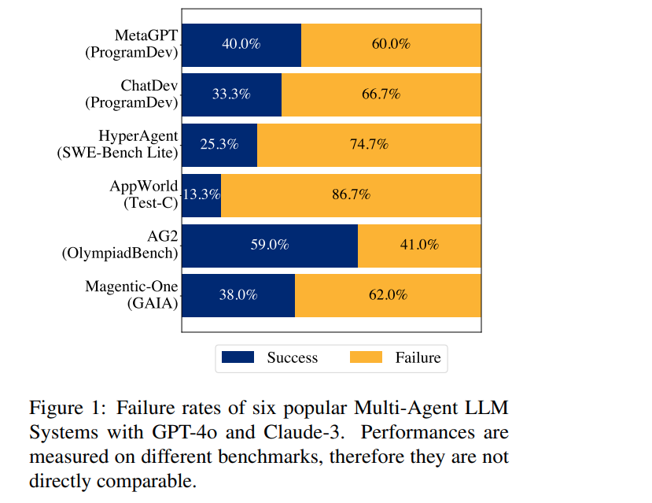
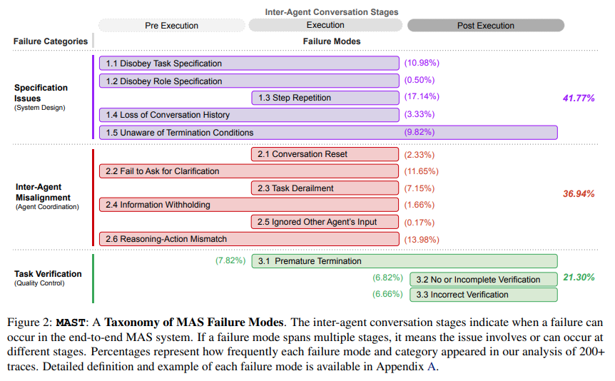
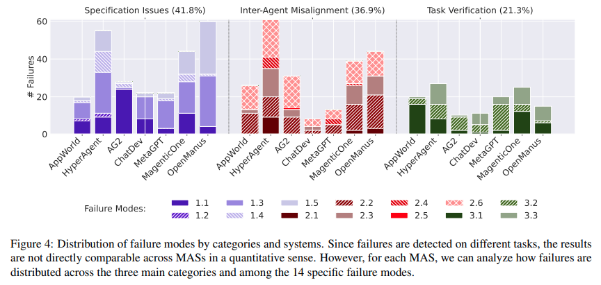

## 목차

* [1. MAS (Multi-Agent System)](#1-mas-multi-agent-system)
* [2. MAST: MAS failure Taxonomy](#2-mast-mas-failure-taxonomy)
* [3. MAST Details](#3-mast-details)
  * [3-1. Specification Issues](#3-1-specification-issues)
  * [3-2. Inter-Agent Misalignment](#3-2-inter-agent-misalignment)
  * [3-3. Task Verification](#3-3-task-verification)
* [4. MAST Effectiveness Evaluation](#4-mast-effectiveness-evaluation)
* [5. Towards Better Multi-Agent LLM Systems](#5-towards-better-multi-agent-llm-systems)

## 논문 소개

* Mert Cemri and Melissa Z. Pan et al., "Why Do Multi-Agent LLM Systems Fail?", 2025
* [arXiv Link](https://arxiv.org/pdf/2503.13657)

## 1. MAS (Multi-Agent System)

**MAS (Multi-Agent System)** 은 **여러 개의 Agent가 상호 작용하여 집단 지능을 형성** 하는 시스템을 의미한다.

* MAS 의 목적은 다음과 같다.
  * 여러 개의 Agent 간 협력적 상호 작용으로 인해 발생하는 효과
  * task decomposition (작업 분해)
  * 특화된 모델 앙상블

**MAS Failure (MAS 시스템의 실패)** 는 **이러한 MAS 시스템이 정상적인 작동에 실패** 하는 것을 의미한다.

* 현재 널리 알려진 Multi-Agent LLM 시스템의 실패 케이스는 다음과 같다.

[(출처)](https://arxiv.org/pdf/2503.13657) : Mert Cemri and Melissa Z. Pan et al., "Why Do Multi-Agent LLM Systems Fail?"

## 2. MAST: MAS failure Taxonomy

**MAST (Multi-Agent System Failure Taxonomy)** 는 MAS 시스템의 이러한 실패에 대한 **최초의 구조적인 Taxonomy** 이다.

[(출처)](https://arxiv.org/pdf/2503.13657) : Mert Cemri and Melissa Z. Pan et al., "Why Do Multi-Agent LLM Systems Fail?"

* MAST 는 다음과 같은 의의를 갖는다.

| 의의               | 설명                                                         |
|------------------|------------------------------------------------------------|
| MAST 자체          | MAST 는 **MAS 시스템의 실패를 분류하는 최초의 taxonomy** 이다.              |
| MAS 시스템 성능 평가 방법 | **LLM을 평가자로 하는 평가 파이프라인** 을 MAST 와 결합하여 MAS 시스템의 성능을 평가한다. |
| Case Study       | MAST 에 의해 평가된 MAS 시스템의 실패는 **시스템 설계 문제** 일 수도 있음을 발견       |
| 오픈소스 공개          | 데이터셋 및 코드를 annotation 과 함께 **오픈소스로 공개**                    |

## 3. MAST Details

* MAST 에서의 **LMA 시스템의 실패 분류 기준** 은 다음과 같다.

| 이슈 구분                    | 설명                                      | 인사이트                                |
|--------------------------|-----------------------------------------|-------------------------------------|
| Specification Issues     | **시스템 설계 또는 저품질 프롬프트** 에 의한 실패          | 해당 오류는 **MAS 의 설계를 개선하여 해결** 할 수 있음 |
| Inter-Agent Misalignment | **Agent 간 상호작용** 에서 발생하는 실패             |                                     |
| Task Verification        | **오류 탐지 프로세스의 문제점** 으로 인해 **오류 탐지에 실패** |                                     |

* 각 case 의 실패에 대한 상세 비율은 다음과 같다.

[(출처)](https://arxiv.org/pdf/2503.13657) : Mert Cemri and Melissa Z. Pan et al., "Why Do Multi-Agent LLM Systems Fail?"

### 3-1. Specification Issues

### 3-2. Inter-Agent Misalignment

### 3-3. Task Verification

## 4. MAST Effectiveness Evaluation

## 5. Towards Better Multi-Agent LLM Systems
