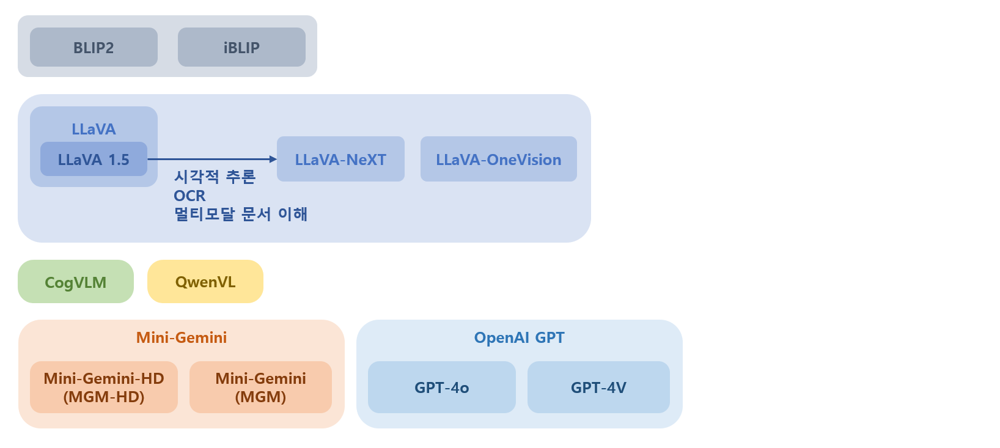
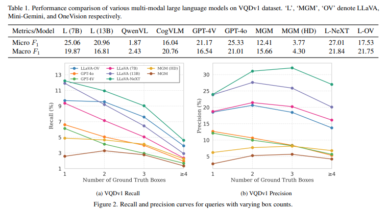
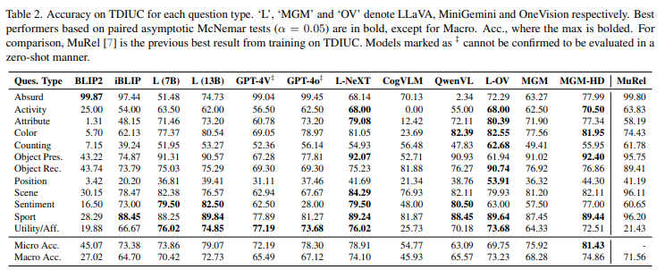
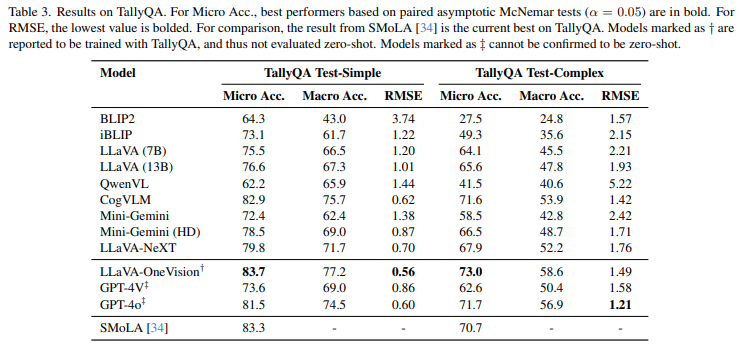
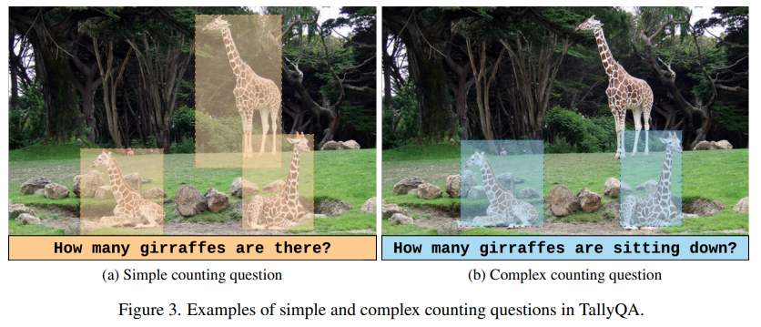
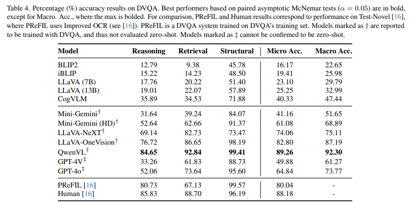

## 목차

* [1. 핵심 내용 요약](#1-핵심-내용-요약)
* [2. MLLMs (Multi-modal Large Language Models)](#2-mllms-multi-modal-large-language-models)
* [3. 실험 결과](#3-실험-결과)
  * [3-1. VQDv1 데이터셋에 대한 Visual Query Detection](#3-1-vqdv1-데이터셋에-대한-visual-query-detection)
  * [3-2. TDIUC 데이터셋에 대한 Fine-Grained VQA 평가](#3-2-tdiuc-데이터셋에-대한-fine-grained-vqa-평가)
  * [3-3. TallyQA 데이터셋에 대한 Counting (개수 세기) 평가](#3-3-tallyqa-데이터셋에-대한-counting-개수-세기-평가)
  * [3-4. DVQA 데이터셋에 대한 차트 해석 능력 평가](#3-4-dvqa-데이터셋에-대한-차트-해석-능력-평가)
* [4. 현대 MLLM의 강점 및 약점 분석](#4-현대-mllm의-강점-및-약점-분석)
  * [4-1. 강점: 물체 해석 (인식) & 장면 이해](#4-1-강점-물체-해석-인식--장면-이해)
  * [4-2. 약점: 복잡한 추론, 정밀한 Counting (개수 세기)](#4-2-약점-복잡한-추론-정밀한-counting-개수-세기)
* [5. Open-Source vs. Closed-Source 모델 성능 비교](#5-open-source-vs-closed-source-모델-성능-비교)
* [6. 모델 크기 및 이미지 해상도에 따른 성능 추이](#6-모델-크기-및-이미지-해상도에-따른-성능-추이)

## 논문 소개

* Jian Lu and Shikhar Srivastava et al., "Revisiting Multi-Modal LLM Evaluation", 2025
* [Open Access Link](https://openaccess.thecvf.com/content/CVPR2025W/BEAM/papers/Lu_Revisiting_Multi-Modal_LLM_Evaluation_CVPRW_2025_paper.pdf)

## 1. 핵심 내용 요약

* 이 논문에서 다루는 핵심 내용은 다음과 같다.

| 핵심 내용                                             | 설명                                                                  |
|---------------------------------------------------|---------------------------------------------------------------------|
| MLLMs (Multi-modal Large Language Models) 에 대한 평가 | 평가 대상 데이터셋 : **TallyQA, TDIUC, DVQA**<br>- 이전에 드러나지 않았던 MLLM의 약점 탐구 |
| MLLM의 **시각 정보 해석** 능력 평가                          | 평가 대상 데이터셋 : **VQDv1**<br>- 여러 개의 물체가 있는 이미지에 대한 복잡한 추론 능력 평가       |
| 현재의 MLLM의 **강점 및 약점 분석** 및 특징화                    | 향후 MLLM의 발전 방향 제시                                                   |

* 이 논문에서 사용하는 데이터셋은 다음과 같다.

| 데이터셋    | 설명                                                                                                            |
|---------|---------------------------------------------------------------------------------------------------------------|
| VQDv1   | 모델이 1개의 물체를 localize 하는 대신 **여러 개의 bounding box 를 생성** 하는 능력 평가                                               |
| TallyQA | counting (개수 세기) 등 **복잡한 시각 정보 해석 능력** 평가                                                                     |
| TDIUC   | 모델의 **다양한 측면에서의 역량 (versatility)** 평가                                                                         |
| DVQA    | **차트 형식으로 된 시각 자료** 를 해석 및 분석하는 능력 평가<br>- 3 Question Types: ```Structural``` ```Retrieval``` ```Reasoning``` |

## 2. MLLMs (Multi-modal Large Language Models)

**MLLM** 은 **Multi-modal Large Language Model** 을 가리킨다.

* MLLM 의 일반적인 구성

| 구성 요소                      | 설명                                          |
|----------------------------|---------------------------------------------|
| Pre-trained LLM            |                                             |
| Pre-trained Vision Encoder |                                             |
| **Learned Adapter**        | 시각 표현 (visual) 과 언어 표현 (linguistic) 을 align |

* 널리 알려진 MLLM



| MLLM            | 설명 및 기술적 요소                                                                                                                                                | 파라미터 개수                | 이미지 해상도                                                                    |
|-----------------|------------------------------------------------------------------------------------------------------------------------------------------------------------|------------------------|----------------------------------------------------------------------------|
| BLIP2           | **lightweight Querying Transformer (Q-Former)**<br>- image & text 해석을 연결하기 위해, **image & text transformer** 를 submodule 로 가짐                               | **188M** (transformer) |                                                                            |
| iBLIP           | **instruction-aware Query Transformer**<br>- 모델이 prompt 의 지시에 기반하여 visual feature 를 추출할 수 있도록 함                                                            |                        |                                                                            |
| LLaVA           | LLaVA 1.5 에서는 visual encoder 를 개선하여 **더 높은 해상도의 이미지** 처리                                                                                                   |                        | **336 x 336** (LLaVA 1.5)                                                  |
| CogVLM          | 사전 학습된 고정된 (frozen) 언어 모델과 image encoder 간의 gap 을 줄이기 위한 **새로운 방법론** 도입<br>- 학습 가능한 **visual expert 모듈** 도입                                                |                        |                                                                            |
| QwenVL          | **3단계 학습 파이프라인**<br>- **bounding box 입출력** 을 처리하는 새로운 입출력 메커니즘 사용                                                                                          |                        | **448 x 448**                                                              |
| LLaVA-NeXT      | LLaVA 1.5 를 다음 부분에 집중하여 업데이트<br>- 시각적 추론 능력<br> - OCR (optical character recognition)<br>- 멀티모달 기반 문서 이해                                                   | 본 논문에서는 **7B** 버전 사용   | 최대 **1344 x 336**                                                          |
| Mini-Gemini     | **Dual-encoder Architecture** 도입<br>- 저차원 및 고차원 시각 임베딩을 **분리하여 처리**<br>- 고차원 영역과 저차원 visual query 를 patch level 에서 연결하는 **patch information mining** 기술 사용 | 본 논문에서는 **7B** 버전 사용   | **672 x 672** (Mini-Gemini-HD, MGM-HD)<br>**336 x 336** (Mini-Gemini, MGM) |
| LLaVA-OneVision | 1개의 모델을 학습하여 **다양한 modality 를 처리** 가능한 **거대한 멀티모달 모델의 집합**<br>- 단일 이미지, 여러 장의 이미지, 비디오 등                                                                   | 본 논문에서는 **7B** 버전 사용   |                                                                            |
| GPT-4o, GPT-4V  | - OpenAI 개발<br>- GPT-4 정도 규모의 LLM이 **시각 정보 입력을 처리** 할 수 있도록 함                                                                                              |                        |                                                                            |

## 3. 실험 결과

* 실험 결과 요약

| 데이터셋    | 평가 항목                  | Metric                                                                                  | 실험 결과                                                                                                                                           |
|---------|------------------------|-----------------------------------------------------------------------------------------|-------------------------------------------------------------------------------------------------------------------------------------------------|
| VQDv1   | Visual Query Detection | **average precision** using IoU = 0.5                                                   | best: **LLaVA-NeXT ([micro F1 score](../../AI%20Basics/Data%20Science%20Basics/데이터_사이언스_기초_Metrics_MultiClass.md#4-2-micro-f1-score) = 27.01)** |
| TDIUC   | Fine-Grained VQA       | - **micro** accuracy<br>- **macro** accuracy                                            | best: **LLaVA (13B) & LLaVA-NeXT (highest macro accuracy)**                                                                                     |
| TallyQA | Counting 능력 (개수 세기)    | **macro accuracy**<br>- 정답 범위 (0개, 1개, 2개, 3개, 4개 이상) 에 따라 **질문 그룹화** & **각 그룹별 평균** 계산 | **simple counting** 문제에 비해 **대부분의 모델이 성능 하락**                                                                                                   |
| DVQA    | 차트 해석 능력               | - **micro** accuracy<br>- **macro** accuracy                                            | best: **LLaVA-NeXT (highest macro accuracy)**                                                                                                   |

### 3-1. VQDv1 데이터셋에 대한 Visual Query Detection

| 데이터셋    | 평가 항목                  | Metric                                                                                  | 실험 결과                                                                                                                                           |
|---------|------------------------|-----------------------------------------------------------------------------------------|-------------------------------------------------------------------------------------------------------------------------------------------------|
| VQDv1   | Visual Query Detection | **average precision** using IoU = 0.5                                                   | best: **LLaVA-NeXT ([micro F1 score](../../AI%20Basics/Data%20Science%20Basics/데이터_사이언스_기초_Metrics_MultiClass.md#4-2-micro-f1-score) = 27.01)** |

* **Visual Query Detection (VQD)** 은 **모델이 주어진 쿼리에 대해 0개~N개의 물체를 bounding box 로 표시** 하도록 하는 task 이다.
  * 장면에 있는 단일 object 를 localize 하는 **referring expression comprehension** 보다 훨씬 복잡하다.
  * **Visual Question Answering (VQA)** 과 달리 **시각 입력 정보 기반 답변 도출** 을 하도록 한다.

**[ 실험 결과 ]**



[(출처)](https://openaccess.thecvf.com/content/CVPR2025W/BEAM/papers/Lu_Revisiting_Multi-Modal_LLM_Evaluation_CVPRW_2025_paper.pdf) : Jian Lu and Shikhar Srivastava et al., "Revisiting Multi-Modal LLM Evaluation"

### 3-2. TDIUC 데이터셋에 대한 Fine-Grained VQA 평가

| 데이터셋    | 평가 항목                  | Metric                                                                                  | 실험 결과                                                                                                                                           |
|---------|------------------------|-----------------------------------------------------------------------------------------|-------------------------------------------------------------------------------------------------------------------------------------------------|
| TDIUC   | Fine-Grained VQA       | - **micro** accuracy<br>- **macro** accuracy                                            | best: **LLaVA (13B) & LLaVA-NeXT (highest macro accuracy)**                                                                                     |

* TDIUC 는 **12가지 분류의 질문** 들로 구성된 **Visual Question Answering (VQA)** 데이터셋이다.
  * 즉, **질문을 다양하게 하여** 기존의 VQA 데이터셋의 한계를 극복한다.
* 성능은 **각각의 질문 종류** 별로 계산한다.

**[ 실험 결과 ]**



[(출처)](https://openaccess.thecvf.com/content/CVPR2025W/BEAM/papers/Lu_Revisiting_Multi-Modal_LLM_Evaluation_CVPRW_2025_paper.pdf) : Jian Lu and Shikhar Srivastava et al., "Revisiting Multi-Modal LLM Evaluation"

### 3-3. TallyQA 데이터셋에 대한 Counting (개수 세기) 평가

| 데이터셋    | 평가 항목                  | Metric                                                                                  | 실험 결과                                                                                                                                           |
|---------|------------------------|-----------------------------------------------------------------------------------------|-------------------------------------------------------------------------------------------------------------------------------------------------|
| TallyQA | Counting 능력 (개수 세기)    | **macro accuracy**<br>- 정답 범위 (0개, 1개, 2개, 3개, 4개 이상) 에 따라 **질문 그룹화** & **각 그룹별 평균** 계산 | **simple counting** 문제에 비해 **대부분의 모델이 성능 하락**                                                                                                   |

* **TallyQA** 는 **물체의 개수를 세는 능력을 평가** 하는 데이터셋이다.
  * 이전의 VQA dataset 과 달리, **개수를 직접적으로 묻는 질문** 위주로 구성되어 있다.
    * 예시: ```How many giraffes are there?```
  * 추론을 필요로 하는 보다 복잡한 질문을 이용하여 **변별력을 확보** 하기도 한다.
    * 예시: ```How many giraffes are sitting down?``` 

**[ 실험 결과 ]**





[(출처)](https://openaccess.thecvf.com/content/CVPR2025W/BEAM/papers/Lu_Revisiting_Multi-Modal_LLM_Evaluation_CVPRW_2025_paper.pdf) : Jian Lu and Shikhar Srivastava et al., "Revisiting Multi-Modal LLM Evaluation"

### 3-4. DVQA 데이터셋에 대한 차트 해석 능력 평가

| 데이터셋    | 평가 항목                  | Metric                                                                                  | 실험 결과                                                                                                                                           |
|---------|------------------------|-----------------------------------------------------------------------------------------|-------------------------------------------------------------------------------------------------------------------------------------------------|
| DVQA    | 차트 해석 능력               | - **micro** accuracy<br>- **macro** accuracy                                            | best: **LLaVA-NeXT (highest macro accuracy)**                                                                                                   |

* **DVQA** 는 **차트 해석 능력** 을 평가하기 위한 **VQA 데이터셋** 이다.
  * 차트 데이터셋에서는 모델이 **관련된 단어, 수식 등에 집중** 해야 한다.
  * 이는 **일반적인 '촬영된 사진'과는 다른 분야** 이다.

**[ 실험 결과 ]**



[(출처)](https://openaccess.thecvf.com/content/CVPR2025W/BEAM/papers/Lu_Revisiting_Multi-Modal_LLM_Evaluation_CVPRW_2025_paper.pdf) : Jian Lu and Shikhar Srivastava et al., "Revisiting Multi-Modal LLM Evaluation"

## 4. 현대 MLLM의 강점 및 약점 분석

위 실험 결과, **현존하는 LLM의 강점 및 약점** 을 다음과 같이 분석할 수 있다.

| 구분 | 분야                                                            | 데이터셋                |
|----|---------------------------------------------------------------|---------------------|
| 강점 | - 물체 인식 (object recognition)<br>- 장면 이해 (scene understanding) | - VQDV1<br>- TDIUC  |
| 약점 | - 복잡한 추론<br>- 정밀한 Counting                                    | - TallyQA<br>- DVQA |

### 4-1. 강점: 물체 해석 (인식) & 장면 이해

**1. TDIUC 데이터셋**

* 결론: **카테고리에 따라 성능이 다름**

| 카테고리                    | 성능                                     |
|-------------------------|----------------------------------------|
| Counting                | best : **LLaVA-OneVision (62.68 %)**   |
| Object Detection, Sport | **QwenVL, LLaVA-OneVision** 모델의 성능이 좋음 |
| Sentiment, Position     | 저조한 성능                                 |

**2. VQDv1 데이터셋**

* 결론: **LLaVA-NeXT 모델의 성능이 좋음**
  * LLaVA-NeXT 모델 성능

| [Micro F1 Score](../../AI%20Basics/Data%20Science%20Basics/데이터_사이언스_기초_Metrics_MultiClass.md#4-2-micro-f1-score) | [Macro F1 Score](../../AI%20Basics/Data%20Science%20Basics/데이터_사이언스_기초_Metrics_MultiClass.md#4-1-macro-f1-score) |
|------------------------------------------------------------------------------------------------------------------|------------------------------------------------------------------------------------------------------------------|
| 27.01 %                                                                                                          | 21.84 %                                                                                                          |

### 4-2. 약점: 복잡한 추론, 정밀한 Counting (개수 세기)

**1. DVQA 데이터셋 (차트 해석)**

* 결론 : **모델 별 성능 차이가 너무 큼**
  * QwenVL, LLaVA-One-Vision 등 **오픈소스 모델** 의 정확도가 높음
  * QwenVL 은 **Micro Accruacy 89.26%, Macro Accuracy 92.30%** 를 기록함
  * LLaVA (7B & 13B), BLIP2, iBLIP 등은 성능이 떨어짐

**2. TallyQA 데이터셋 (개수 세기)**

* 결론 : **물체의 개수가 증가할수록 성능 감소**
  * **LLaVA-OneVision** 모델의 성능

|     | Test-Simple 데이터셋 | Test-Complex 데이터셋 |
|-----|------------------|-------------------|
| 정확도 | 83.7%            | 73.0%             |

## 5. Open-Source vs. Closed-Source 모델 성능 비교

**1. 결론**

* 오픈소스 모델이 Closed-Source Model 과 **비슷한 성능을 달성** 하거나, 때로는 **더 좋은 성능** 을 보이기도 한다.

**2. 대표적인 Open-Source & Closed-Source 모델**

| 구분                    | 예시                      |
|-----------------------|-------------------------|
| Open-Source (오픈소스) 모델 | LLaVA, CogVLM, QwenVL   |
| Closed-Source 모델      | GPT-4o, GPT-4V (OpenAI) |

**3. 성능 비교**

| 데이터셋                                | 평가지표                                                                                                                                  | 오픈소스 모델 성능                                   | Closed-Source 모델 성능                  | 승자                   |
|-------------------------------------|---------------------------------------------------------------------------------------------------------------------------------------|----------------------------------------------|--------------------------------------|----------------------|
| VQDv1                               | Micro F1 Score                                                                                                                        | **LLaVA-NeXT (27.01 %)**                     | GPT-4o (25.33 %)<br>GPT-4V (21.17 %) | **오픈소스** 모델          |
| TDIUC<br>(category: ```Position```) | Accuracy                                                                                                                              | **LLaVA-OneVision (53.91 %)**                | GPT-4o (37.46 %)<br>GPT-4V (31.11 %) | **오픈소스** 모델          |
| TallyQA                             | [Root Mean-Squared Error (RMSE)](../../AI%20Basics/Deep%20Learning%20Basics/딥러닝_기초_Loss_function.md#2-2-root-mean-squared-error-rmse) | Mini-Gemini (HD) (1.71)<br>LLaVA-Next (1.76) | **GPT-4o (1.21)**                    | **Closed-Source** 모델 |

## 6. 모델 크기 및 이미지 해상도에 따른 성능 추이

**1. 결론**

* 7B, 13B 모델 중 **더 큰 모델 (13B) 의 성능이 일반적으로 좋다.**
* **해상도가 높은 이미지** 를 사용하는 모델일수록 **복잡한 숫자 세기, 추론 등의 task** 에서의 **visual understanding 에서 이득** 을 보는 듯하다.

**2. 모델 크기에 따른 성능 추이 상세**

* 모델: **LLaVA 7B vs. LLaVA 13B**

| 데이터셋                              | 성능지표           | 7B 모델 성능 | 13B 모델 성능   | 승자         |
|-----------------------------------|----------------|----------|-------------|------------|
| TallyQA Test-Simple               | Micro Accuracy | 75.5 %   | **76.6 %**  | **13B** 모델 |
| TDIUC (category: ```Counting```)  | Accuracy       | 51.95 %  | **53.27 %** | **13B** 모델 |
| TDIUC (category: ```Attribute```) | Accuracy       | 71.46 %  | **73.20 %** | **13B** 모델 |

**3. 이미지 해상도에 따른 성능 추이 상세**

| 데이터셋                    | 성능지표                                                                                                             | 저해상도 이미지 모델<br>(해상도 / 성능)                | 고해상도 이미지 모델<br>(해상도 / 성능)                         | 승자          |
|-------------------------|------------------------------------------------------------------------------------------------------------------|------------------------------------------|---------------------------------------------------|-------------|
| TallyQA Test-Complex    | Micro Accuracy                                                                                                   | LLaVA<br>(336 x 336 / **65.6 %**)        | **LLaVA-Next**<br>(최대 1344 x 336 / **67.9 %**)    | **고해상도** 모델 |
| TallyQA Test-Complex    | Micro Accuracy                                                                                                   | Mini-Gemini<br>(336 x 336 / **58.5 %**)  | **Mini-Gemini (HD)**<br>(672 x 672 / **66.5 %**)  | **고해상도** 모델 |
| DVQA                    | Micro Accuracy                                                                                                   | Mini-Gemini<br>(336 x 336 / **41.16 %**) | **Mini-Gemini (HD)**<br>(672 x 672 / **61.08 %**) | **고해상도** 모델 |
| DVQA (```Reasoning```)  | Accuracy                                                                                                         | Mini-Gemini<br>(336 x 336 / **31.64 %**) | **Mini-Gemini (HD)**<br>(672 x 672 / **52.64 %**) | **고해상도** 모델 |
| DVQA (```Retrieval```)  | Accuracy                                                                                                         | Mini-Gemini<br>(336 x 336 / **39.24 %**) | **Mini-Gemini (HD)**<br>(672 x 672 / **62.66 %**) | **고해상도** 모델 |
| DVQA (```Structural```) | Accuracy                                                                                                         | Mini-Gemini<br>(336 x 336 / **84.07 %**) | **Mini-Gemini (HD)**<br>(672 x 672 / **91.37 %**) | **고해상도** 모델 |
| VQDv1                   | [Macro F1 Score](../../AI%20Basics/Data%20Science%20Basics/데이터_사이언스_기초_Metrics_MultiClass.md#4-1-macro-f1-score) | Mini-Gemini<br>(336 x 336 / **15.66**)   | **Mini-Gemini (HD)**<br>(672 x 672 / **4.30**)    | **저해상도** 모델 |
