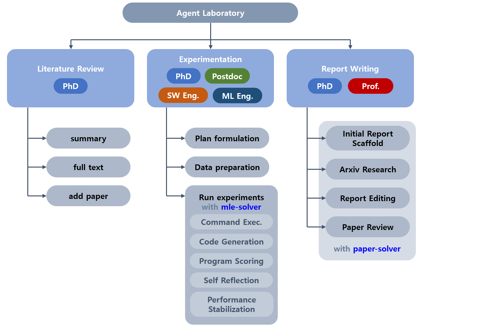
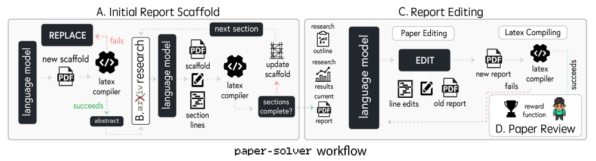
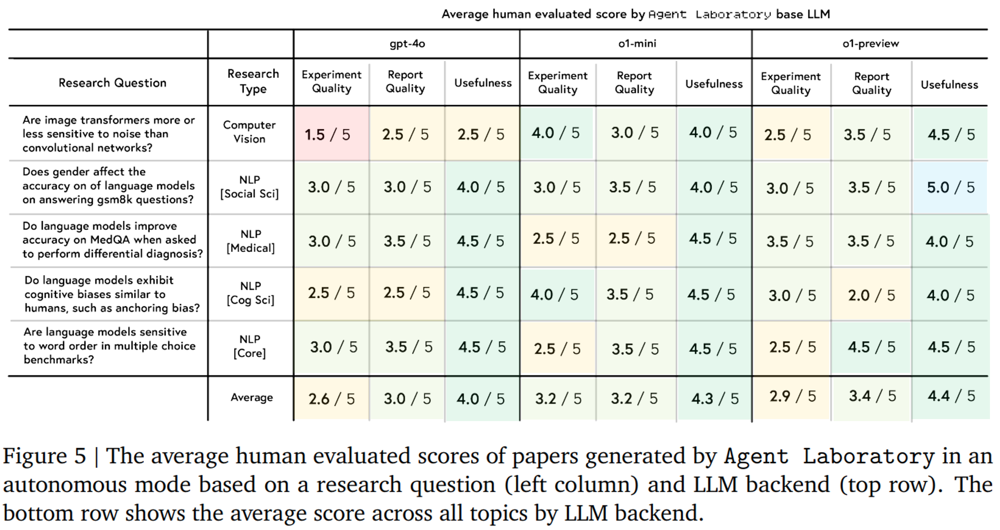
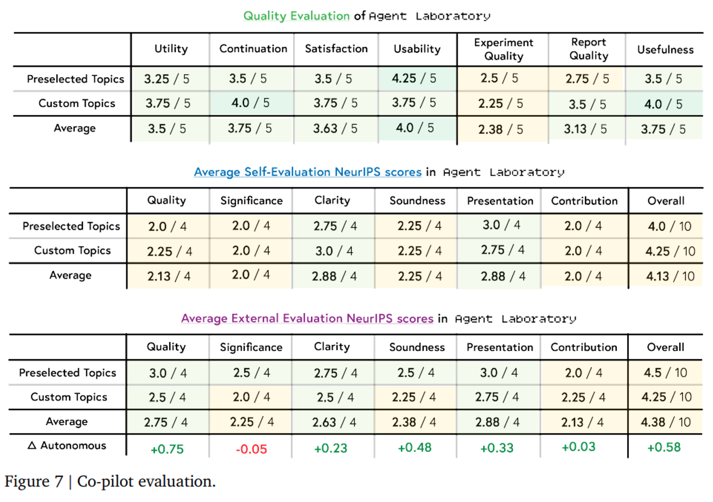
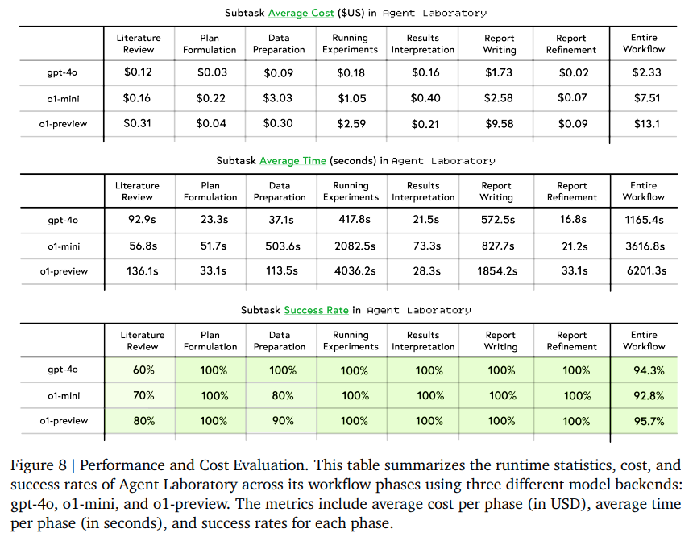

## 목차

* [1. Agent Laboratory 프레임워크 소개](#1-agent-laboratory-프레임워크-소개)
* [2. **(Process 1)** Literature Review (논문 리뷰)](#2-process-1-literature-review-논문-리뷰)
* [3. **(Process 2)** Experimentation (실험)](#3-process-2-experimentation-실험)
  * [3-1. Plan Formulation (계획 수립)](#3-1-plan-formulation-계획-수립)
  * [3-2. Data Preparation (데이터 준비)](#3-2-data-preparation-데이터-준비)
  * [3-3. 실험 실시](#3-3-실험-실시)
* [4. **(Process 3)** Report Writing (보고서 작성)](#4-process-3-report-writing-보고서-작성)
* [5. 실험 결과](#5-실험-결과)
  * [5-1. Agent Laboratory 로 생성된 논문의 품질 평가](#5-1-agent-laboratory-로-생성된-논문의-품질-평가)
  * [5-2. Co-pilot mode 품질 평가](#5-2-co-pilot-mode-품질-평가)
  * [5-3. 실행 시간 및 비용, 작업 성공률 분석](#5-3-실행-시간-및-비용-작업-성공률-분석)
* [6. 한계점 분석](#6-한계점-분석)
  * [6-1. 워크플로우의 한계](#6-1-워크플로우의-한계)
  * [6-2. 일반적인 실패 케이스](#6-2-일반적인-실패-케이스)
  * [6-3. 윤리적 고려 사항](#6-3-윤리적-고려-사항)

## 논문 소개

* Samuel Schmidgall and Yusheng Su et al., "Agent Laboratory: Using LLM Agents as Research Assistants", 2025
* [arXiv Link](https://arxiv.org/pdf/2501.04227)

## 1. Agent Laboratory 프레임워크 소개

본 논문에서는 **Agent Laboratory** 라는 프레임워크를 소개한다.

* 핵심 아이디어
  * 머신러닝 분야에서의 **개인의 연구 역량을 향상** 시키기 위한 **LLM 에이전트 기반** 프레임워크
* 기본 프로세스

| 프로세스              | 설명                                                                   | 관련 에이전트                                         |
|-------------------|----------------------------------------------------------------------|-------------------------------------------------|
| Literature Review | 주어진 아이디어에 대한 **논문 탐색**                                               | - PhD Student                                   |
| Experimentation   | - Plan Formulation (계획 수립)<br>- Data Preparation (데이터 준비)<br>- 실험 실시 | - PhD Student<br>- Postdoc<br>- SW, ML Engineer |
| Report Writing    | 연구 결과로부터 얻은 발견 사항을 **학술 논문 형태로 변환**                                  | - PhD Student<br>- Professor                    |


[(출처)](https://arxiv.org/pdf/2501.04227) : Samuel Schmidgall and Yusheng Su et al., "Agent Laboratory: Using LLM Agents as Research Assistants"



## 2. (Process 1) Literature Review (논문 리뷰)

| 핵심 설명                  | 관련 에이전트     |
|------------------------|-------------|
| 주어진 아이디어에 대한 **논문 탐색** | PhD Student |

**Literature Review (논문 리뷰)** 는 다음과 같이 진행된다.

* PhD Student 에이전트가 arXiv API를 이용하여 관련 논문 탐색
* 다음과 같은 행동 실행

| 행동 (action)     | 설명                                                       |
|-----------------|----------------------------------------------------------|
| ```summary```   | 최초 쿼리에 대한 **20개의 관련 논문** 들에 대해, 그 **abstract** 를 요약      |
| ```full text``` | 특정 논문의 **전체 텍스트** 를 추출                                   |
| ```add paper``` | 특정 논문의 **전체 텍스트 또는 특정 summary** 를 Literature Review 에 추가 |

## 3. (Process 2) Experimentation (실험)

| 핵심 설명                                 | 관련 에이전트                                         |
|---------------------------------------|-------------------------------------------------|
| **연구 실시**<br>(계획 수립 → 데이터 준비 → 실험 실시) | - PhD Student<br>- Postdoc<br>- SW, ML Engineer |


[(출처)](https://arxiv.org/pdf/2501.04227) : Samuel Schmidgall and Yusheng Su et al., "Agent Laboratory: Using LLM Agents as Research Assistants"

**Experimentation (실험)** 은 다음의 3단계로 진행된다.

| 단계                        | 설명                                                  | 관련 에이전트                                   |
|---------------------------|-----------------------------------------------------|-------------------------------------------|
| Plan Formulation (계획 수립)  | **연구 목적 및 논문 리뷰 결과** 에 따라, **자세하고 실현 가능한** 연구 계획 수립 | - Postdoc<br>- PhD Student                |
| Data Preparation (데이터 준비) | 실험 실시를 위한 **데이터를 준비하는 코드** 생성                       | - SW (Software) Engineer<br>- ML Enginner |
| 실험 실시                     | 실험 계획에 따라 **구현 및 실험 실시**                            | - ML Engineer                             |

### 3-1. Plan Formulation (계획 수립)

**Plan Formulation (계획 수립)** 은 **연구 목적 및 논문 리뷰 결과** 에 기반하여 **자세하고 실현 가능한 연구 계획** 을 수립하는 단계이다.

* **PhD Student** 및 **Postdoc** 에이전트가 다음과 같은 부분에서 협업한다.
  * 연구 목표의 달성 방법 구체화
  * 특정 Research Idea (예: ```어떤 머신러닝 모델을 구현할 것인가?``` ```어떤 데이터셋을 사용할 것인가?```) 달성을 위한 실험 구성 요소 결정
* 그 후, **Postdoc** 에이전트는 ```plan``` 명령어를 통해 해당 계획을 제출한다.

### 3-2. Data Preparation (데이터 준비)

**Data Preparation (데이터 준비)** 는 **계획 단계에서 생성된 지시 (instruction)** 에 기반하여 **실험을 실시하기 위해 필요한 데이터를 준비하는 코드를 작성** 하는 것이다.

* 각 엔지니어 에이전트의 역할은 다음과 같다.

| 엔지니어 에이전트   | 역할                                       | 권한                          |
|-------------|------------------------------------------|-----------------------------|
| ML Engineer | - ```Python``` 명령어를 이용하여 코드 실행 및 그 결과 관찰 | - HuggingFace 에 등록된 데이터셋 접근 |
| SW Engineer | - 최종적인 **데이터 준비 코드** 제출                  |                             |

### 3-3. 실험 실시

**Running Experiments (실험 실시)** 는 실험 계획에 따라 **구현 및 실험 실시** 하는 단계이다.

* ```mle-solver``` 는 **머신러닝 코드를 자동 생성, 테스트, 개선** 하기 위한 특화된 모듈이다.
  * **ML Engineer** 에이전트가 해당 모듈을 사용하여 실험을 실시한다.


[(출처)](https://arxiv.org/pdf/2501.04227) : Samuel Schmidgall and Yusheng Su et al., "Agent Laboratory: Using LLM Agents as Research Assistants"

* ```mle-solver``` 모듈의 상세 동작 방식

| 동작 방식 (순서)                | 설명                                                                                                                                                                                                     |
|---------------------------|--------------------------------------------------------------------------------------------------------------------------------------------------------------------------------------------------------|
| Command Execution         | - 성능이 가장 좋은 (top-performing) 프로그램 중 하나를 샘플링하여 **initial program** 으로 지정<br>- 해당 프로그램을 ```REPLACE```, ```EDIT``` 연산을 통해 계속 개선                                                                           |
| Code Generation           | Command Execution 으로 생성된 프로그램의 **컴파일 가능 여부** 평가<br>- 컴파일 **성공** 시: score 계산 & 해당 score 가 기존 프로그램보다 높을 시 top program 순위 테이블 업데이트<br>- 컴파일 **실패** 시: 코드 수정 (최대 $N_{rep} = 3$ 회)                          |
| Program Scoring           | - **LLM의 reward model** 에 기반한 scoring function을 이용<br>- 해당 reward model 은 프로그램을 **0 ~ 1 의 점수로 평가** (기준: **연구 계획, 생성된 코드, 출력값** 등)                                                                      |
| Self Reflection           | - **실험 결과 또는 오류 내용** 에 따라 진행<br>- **컴파일 실패** 시: 다음 iteration 에서 코드를 fix 할 방법 고안<br>- **컴파일 성공 (score 반환)** 시: 이 score 값을 향상시킬 방법 고안                                                                    |
| Performance Stabilization | 다음의 2가지 메커니즘 적용<br>- **top program sampling** : 점수가 가장 높은 프로그램들 중 랜덤하게 선택<br>- **batch-parallelization** : 각 solver step 이 서로 다른 N개의 수정 버전을 만든 후, 성능이 가장 높은 수정본이 top collection에 있는 성능이 가장 낮은 프로그램을 대체 |

## 4. (Process 3) Report Writing (보고서 작성)

| 핵심 설명                               | 관련 에이전트                      |
|-------------------------------------|------------------------------|
| 연구 결과로부터 얻은 발견 사항을 **학술 논문 형태로 변환** | - PhD Student<br>- Professor |

**Report Writing (보고서 작성)** 은 연구 결과로부터 얻은 발견 사항을 **종합적으로 정리하여 학술 논문 형태로 변환** 하는 작업을 말한다.

* ```paper-solver``` 는 연구 보고서를 **반복적으로 생성 및 개선** 하는 모듈이다.
  * Report Writing 프로세스에서는 이 모듈을 사용하여 연구 결과에서의 발견 사항을 **학술 논문으로 변환** 한다. 



[(출처)](https://arxiv.org/pdf/2501.04227) : Samuel Schmidgall and Yusheng Su et al., "Agent Laboratory: Using LLM Agents as Research Assistants"

* ```paper-solver``` 모듈의 상세 동작 방식

| 단계                      | 설명                                                                                                                                          |
|-------------------------|---------------------------------------------------------------------------------------------------------------------------------------------|
| Initial Report Scaffold | 연구 논문의 **initial scaffold (논문 구조 및 ```Abstract``` ```Introduction``` ```Methods``` 등 8개 섹션 개요)** 생성<br>- 이 개요는 이후 상세 내용 생성을 위한 일종의 프레임워크 역할 |
| Arxiv Research          | ```paper-solver``` 가 Arxiv 에 접근하여, **관련 논문을 탐색하여 reference 로 인용** 할 수 있게 함                                                                  |
| Report Editing          | scaffold 생성 이후, **생성된 논문을 반복적으로 개선**<br>- 가장 중요한 명령어는 ```EDIT``` 으로, 논문의 각 줄을 LaTeX 포맷으로 변경                                                 |
| Paper Review            | ```paper-solver``` 가 탐색하는 각 논문을 **리뷰를 통해 점수화**                                                                                              |

## 5. 실험 결과

* 실험 결과 요약

| 실험 항목                            | 결론 요약                                                                                                        |
|----------------------------------|--------------------------------------------------------------------------------------------------------------|
| 각 LLM 별 논문 품질                    | ```GPT-4o``` < ```o1-mini``` = ```o1-preview```                                                              |
| Co-pilot mode (인간-AI 협업) 시 품질 평가 | - 완전 자동화 시보다 **전반적으로 논문 품질 좋음**<br>- 특히 ```Quality``` ```Soundness``` 항목이 크게 좋아짐                             |
| 실행 시간 및 비용, 작업 성공률 분석            | - 비용, 실행 시간 : ```GPT-4o``` < ```o1-mini``` < ```o1-preview```<br>- 작업 성공률 (Subtask 기준) : 3개 모델 간 **큰 차이 없음** |

### 5-1. Agent Laboratory 로 생성된 논문의 품질 평가

* 사용한 LLM
  * OpenAI 의 ```GPT-4o``` ```o1-mini``` ```o1-preview```

| LLM | GPT-4o       | o1-mini        | o1-preview    |
|-----|--------------|----------------|---------------|
| 총점  | **9.6** / 15 | **10.7** / 15  | **10.7** / 15 |



[(출처)](https://arxiv.org/pdf/2501.04227) : Samuel Schmidgall and Yusheng Su et al., "Agent Laboratory: Using LLM Agents as Research Assistants"

* **인간 평가자** 의 평가 기준
  * **Research** Question
    * **1.** 편견/편향
      * ```Do language models exhibit cognitive biases, such as confirmation bias or anchoring bias?```
    * **2.** 컴퓨터 비전
      * ```Are image transformers more or less sensitive to pixel noise than convolutional networks?```
    * **3.** 의료 분야 NLP
      * ```Do language models improve accuracy on MedQA when asked to perform differential diagnosis?```
    * **4.** 단어 순서에 대한 robustness
      * ```Are language models sensitive to word order in multiple choice benchmarks?```
    * **5.** 성 역할 관련
      * ```Does gender role play affect the accuracy on of language models on answering math questions?```
  * **Evaluation** Question
    * **1.** Experimental Quality
      * ```What is your perception of the quality of the experimental results presented in this report?```
    * **2.** Report Quality
      * ```What is your perception of the quality of the research report writing quality presented in this report?```
    * **3.** Usefulness
      * ```What is your perception of the usefulness of an AI assistant tool that can generate the presented report autonomously?``` 

### 5-2. Co-pilot mode 품질 평가

**Co-pilot Mode** 는 앞에서 소개한 완전 자동화 (Autonomous) 와 달리, **사람이 각 subtask 의 결과물에 대해 피드백을 주는** 형태의 방법이다.

* Co-pilot Mode 실험 결과 **(완전 자동화 대비)**

| 거의 차이 없음                                             | 소폭 상승                                       | 대폭 상승                                        |
|------------------------------------------------------|---------------------------------------------|----------------------------------------------|
| - **Significance (-0.05)**<br>- Contribution (+0.03) | - Clarity (+0.23)<br>- Presentation (+0.33) | - Soundness (+0.48)<br>- **Quality (+0.75)** |



[(출처)](https://arxiv.org/pdf/2501.04227) : Samuel Schmidgall and Yusheng Su et al., "Agent Laboratory: Using LLM Agents as Research Assistants"

### 5-3. 실행 시간 및 비용, 작업 성공률 분석

* 실험 결과

| 항목                            | LLM 간 비교                          |
|-------------------------------|-----------------------------------|
| Average Cost (비용)             | **GPT-4o** < o1-mini < o1-preview |
| Average Time (실행 시간)          | **GPT-4o** < o1-mini < o1-preview |
| Subtask Success Rate (작업 성공률) | 통계적으로 유의미한 차이 없음                  |



[(출처)](https://arxiv.org/pdf/2501.04227) : Samuel Schmidgall and Yusheng Su et al., "Agent Laboratory: Using LLM Agents as Research Assistants"

## 6. 한계점 분석

### 6-1. 워크플로우의 한계

**Agent Laboratory** 는 그 워크플로우 특성상 다음과 같은 한계점이 있다.

| 한계점                 | 설명                                                                                                                                               |
|---------------------|--------------------------------------------------------------------------------------------------------------------------------------------------|
| Self-Evaluation     | - **질적/정성적 연구 (Qualitatively Research)** 의 품질은 실제 인간 AI 과학자보다 부족함<br>- 생성된 논문은 실제 사람의 논문 작성 과정을 대체하기보다는 **사람에게 무엇이 수행되었는지를 알려주는 보고서** 에 가깝다고 평가됨 |
| Automated Structure | 워크플로우 특성상 **논문 구조의 제약이 심함**<br> - 예를 들어, ```paper-solver``` 는 논문을 고정된 구조로 작성하게 하여, **개별 논문의 특성에 맞는 독특한 구성이 불가능** 하게 만듦                           |
| 환각 현상               | - GPT-4o 와 같이 상대적으로 성능이 떨어지는 모델에서는 **실험 결과와 관련된 환각 현상** 발생                                                                                       |

### 6-2. 일반적인 실패 케이스

다음과 같은 여러 가지 **실패 케이스** 가 발견되었음

* **Literature Review (논문 리뷰)** 단계에서 지시 수행에 어려움을 겪음
  * 특히 ```summarize``` 명령어를 많이 사용하는 경향이 있음
* 최대 토큰 길이 제한에 의해 문장 생성이 끊기기도 함
* ```mle-solver``` 관련
  * ```mle-solver``` 에 의해 진행된 실험에서 **모든 test method** 에 대해 **0%의 정확도** 를 기록하는 경우가 있음
  * ```mle-solver``` 는 다른 line 보다 ```line 0``` 을 더 많이 수정하는 경향이 있음
  * Python으로 코딩할 때 ```exit()``` 명령어를 사용하는 경우가 많음

### 6-3. 윤리적 고려 사항

Agent Laboratory 는 다음과 같은 **윤리적 도전 과제** 도 있다.

* (환각 현상 관련) 의도하지 않게 **오해의 소지** 가 있는 논문을 생성할 수 있으며, 심각한 경우 **연구 윤리에 위배** 될 수도 있음
* 데이터셋 또는 알고리즘에 내재되어 있는 편향성을 **반영하거나 오히려 심화** 시킬 수도 있음
  * 이로 인해 **편향된 결론** 도출 가능
* **해로운 기술을 개발하거나 비윤리적인 데이터를 생성** 하는 등 부적절한 목적으로 사용 가능
