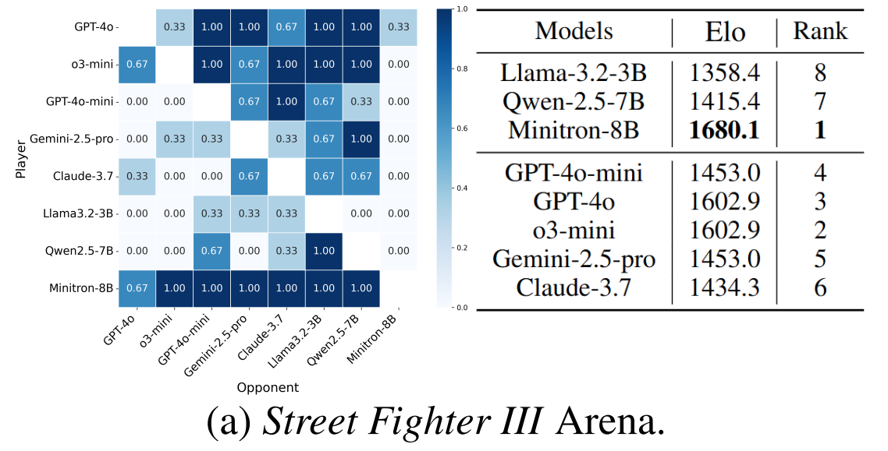
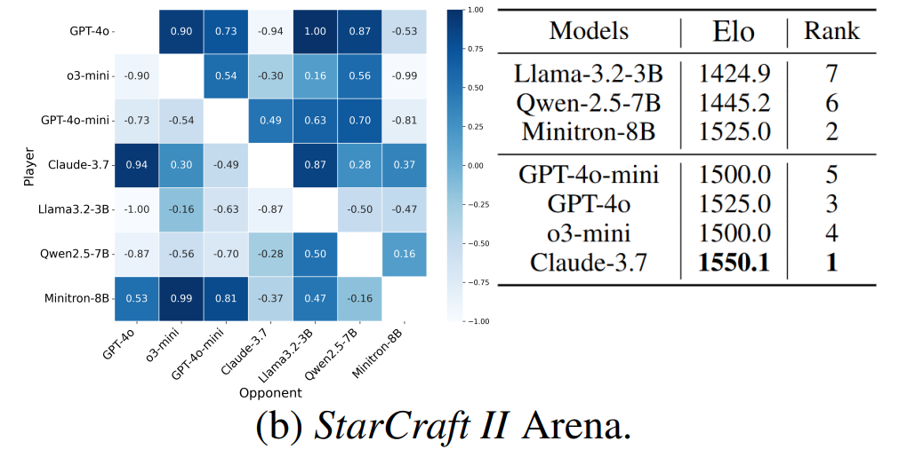
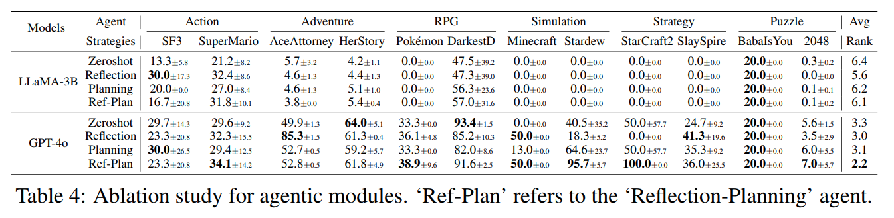
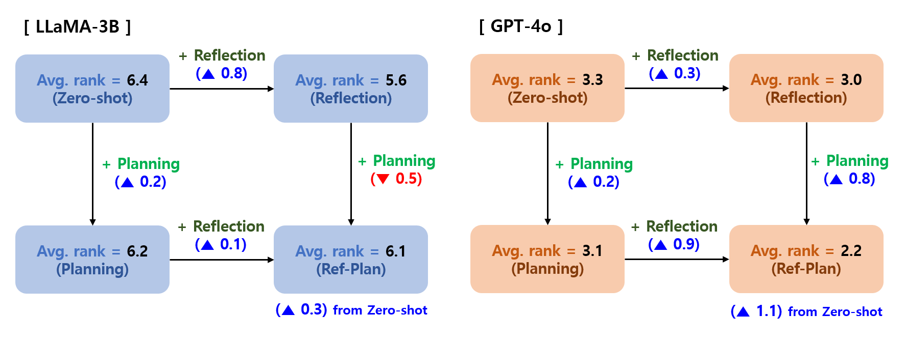
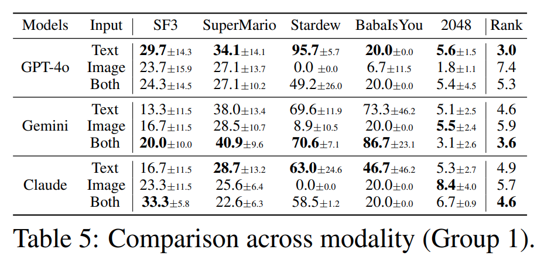
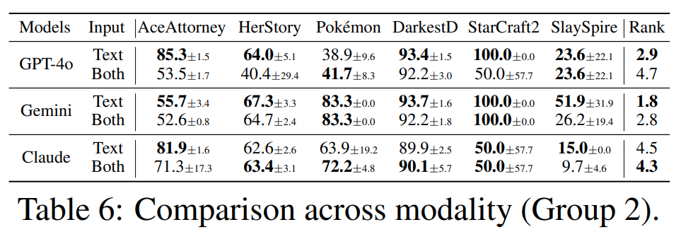
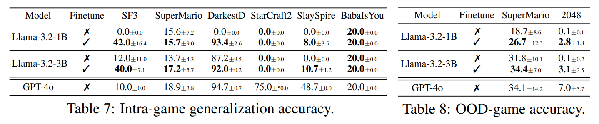

## 목차

* [1. Orak 개요](#1-orak-개요)
* [2. 실험 설정](#2-실험-설정)
  * [2-1. 게임 플레이에 요구되는 LLM의 역량](#2-1-게임-플레이에-요구되는-llm의-역량)
  * [2-2. 실험 대상 게임](#2-2-실험-대상-게임)
  * [2-3. 모델 (LLM) 및 전략](#2-3-모델-llm-및-전략)
* [3. Fine-Tuning](#3-fine-tuning)
* [4. 실험 결과](#4-실험-결과)
  * [4-1. LLM Arena](#4-1-llm-arena)
  * [4-2. Ablation Study (for Agentic Modules)](#4-2-ablation-study-for-agentic-modules)
  * [4-3. 시각적 입력의 효과](#4-3-시각적-입력의-효과)
  * [4-4. Fine-Tuning 의 효과](#4-4-fine-tuning-의-효과)

## 논문 소개

* Dongmin Park and Minkyu Kim et al., "Orak: A Foundational Benchmark for Training and Evaluating LLM Agents on Diverse Video Games", 2025
* [arXiv Link](https://arxiv.org/pdf/2506.03610)
* [AI Trend Link](../../AI%20Trend/AI_TREND_Jun_2025.md#20250616-월)

## 1. Orak 개요

**Orak (오락)** 은 **LLM이 여러 가지 비디오 게임을 플레이하는 성능** 을 평가하기 위한 벤치마크이다.


[(출처)](https://arxiv.org/pdf/2506.03610) : Dongmin Park and Minkyu Kim et al., "Orak: A Foundational Benchmark for Training and Evaluating LLM Agents on Diverse Video Games"

* Orak 의 특징은 다음과 같다.

| 특징            | 설명                                                                                                     |
|---------------|--------------------------------------------------------------------------------------------------------|
| 2가지 커스터마이징 제공 | **LLM 커스터마이징** 및 **Agent 커스터마이징** (새로운 전략) 각각 가능                                                       |
| MCP 인터페이스 사용  | [MCP (Model Context Protocol)](../../AI%20Basics/LLM%20Basics/LLM_기초_MCP_Model_Context_Protocol.md) 참고 |
| 점수 산출 방법      | **게임, LLM (backbone), LLM 에이전트 전략** 에 대한 설정만으로 가능                                                      |

## 2. 실험 설정

### 2-1. 게임 플레이에 요구되는 LLM의 역량

* 게임 플레이에 요구되는 LLM의 역량은 다음과 같다.

| LLM의 역량                       | 설명                                               | 레벨 기준                                             |
|-------------------------------|--------------------------------------------------|---------------------------------------------------|
| Rule Following (RF)           | LLM은 **각 게임의 규칙** 을 충실히 따라야 한다.                  | 규칙의 개수                                            |
| Logical Reasoning (LR)        | in-game 행동 수행을 위한 LLM의 **추론 단계**                 | LLM 추론 단계 개수                                      |
| Spatial Reasoning (SR)        | **spatial understanding** (공간 인식) 이 필요한가?        | spatial understanding 의 필요 여부                     |
| Long-text Understanding (LTU) | LLM은 **긴 문맥을 이해** 할 수 있어야 한다.                    | 문맥의 길이                                            |
| Long-term Planning (LP)       | **전략적 계획 수립** 이 필요한가? (+ 앞으로 **몇 수를 내다봐야** 하는가?) | 계획의 길이 (= sequential action 개수)                   |
| Error Handling (EH)           | 게임 플레이 중 **오류 수정** (error correction) 의 필요 수준    | error correction 의 필요 수준 (one-step, multi-step 등) |
| Odds Handling (OH)            | 게임 플레이 중 **랜덤성** (randomness) 이해의 필요 수준          | randomness 가 게임 플레이에 미치는 영향 수준                    |

### 2-2. 실험 대상 게임

* 실험 대상 게임은 다음과 같다.


[(출처)](https://arxiv.org/pdf/2506.03610) : Dongmin Park and Minkyu Kim et al., "Orak: A Foundational Benchmark for Training and Evaluating LLM Agents on Diverse Video Games"

* 각 게임에 요구되는 LLM의 역량 수준은 다음과 같다.


[(출처)](https://arxiv.org/pdf/2506.03610) : Dongmin Park and Minkyu Kim et al., "Orak: A Foundational Benchmark for Training and Evaluating LLM Agents on Diverse Video Games"

### 2-3. 모델 (LLM) 및 전략

* Orak 에서는 다음과 같이 **오픈소스 LLM 및 proprietary LLM을 혼합** 하여 사용했다.

| LLM 종류              | LLM 유형      | LLM 규모 |
|---------------------|-------------|--------|
| LLaMA-3.2           | Open-source | 1B, 3B |
| Qwen-2.5            | Open-source | 3B, 7B |
| Minitron            | Open-source | 4B, 8B |
| GPT-4o-mini, GPT-4o | Proprietary |        |
| o3-mini             | Proprietary |        |
| Gemini-2.5-pro      | Proprietary |        |
| Claude-3.7-sonnet   | Proprietary |        |
| DeepSeek-R1         | Proprietary |        |

## 3. Fine-Tuning

Orak 에서는 추가적으로 다음과 같이 **각 게임별로 LLM Fine-Tuning** 을 실시했다.

* LLM Fine-Tuning 기본 설정

| 설정 유형             | 설명                                                                                                                                              |
|-------------------|-------------------------------------------------------------------------------------------------------------------------------------------------|
| Data Format       | 게임 플레이를 위한 **trajectory** 및 **LLM inference sequence** 를 정의                                                                                     |
| Data Selection    | - N 개의 **gameplay trajectory** 를 먼저 수집<br>- 고품질 데이터 확보를 위해, **LLM inference 횟수가 900회를 초과** 할 때까지 **높은 점수의 trajectory 를 선택**                     |
| Data Augmentation | 언어적 다양성 확보를 위해, 각 데이터 샘플 $\tau$ 에 대해 **paraphrasing (새로운 표현 사용) 을 이용한 augmentation** 실시<br>- prompt $X^a$ 에 대한 새로운 표현을 도출하기 위해 **GPT-4o** 모델 사용 |

* Data Format 설정 상세 설명

| 구분                 | 설명                                                | 수식                                                                                                                                                                                                                                   |
|--------------------|---------------------------------------------------|--------------------------------------------------------------------------------------------------------------------------------------------------------------------------------------------------------------------------------------|
| trajectory         | LLM 에이전트의 전략에 의해 실행된 **LLM inference 의 sequence** | $T = \lbrace \tau_1, ..., \tau_T \rbrace$<br>- $T$ : total game step count<br>- $\tau_t$ : game step $t$ 에서의 LLM inference sequence                                                                                                  |
| inference sequence | **LLM prompt + game state → LLM answer** 의 집합     | $\tau = \lbrace (X^{a_i}, S, Y^{a_i}) \rbrace_{i=1}^n$<br>- $a_i \in \lbrace 'reflection', 'planning', ..., 'action' \rbrace$ : $i$ 번째 agentic module<br>- $X^a$ : agentic module $a$ 에 입력되는 prompt<br>- $Y^a$ : $X^a$ 에 대응되는 LLM 출력 |

* Fine-Tuning 학습 데이터 예시
  * 아래 예시는 **Supermario** 게임의 **reflection** 에이전트에 대한 데이터임 


[(출처)](https://arxiv.org/pdf/2506.03610) : Dongmin Park and Minkyu Kim et al., "Orak: A Foundational Benchmark for Training and Evaluating LLM Agents on Diverse Video Games"

## 4. 실험 결과

* 실험 결과 요약

| 구분                                   | 실험 결과                                                                                               |
|--------------------------------------|-----------------------------------------------------------------------------------------------------|
| LLM Arena                            | - **Minitron-8B** 모델의 성능이 가장 좋음<br>- OpenAI의 모델 (o3-mini, GPT 등) 은 **중간 수준 성능**                     |
| Ablation Study (for Agentic Modules) | 최적의 Agent 전략은 **LLM 자체의 성능에 영향** 을 받음                                                               |
| 시각적 입력의 효과                           | 입력의 종류 (Modality) 에 따른 게임 성능:<br>- ```Text-Only``` >= ```Both``` (Text & Image) >> ```Image-Only``` |
| Fine-Tuning 의 효과                     | - **같은 게임의 다른 시나리오, 새로운 게임** 의 2가지 경우 모두, **Fine-Tuning 시 모델 성능이 대폭 향상됨**                           |

### 4-1. LLM Arena

* 결과 요약

| 게임                 | LLM 성능 비교                                                           |
|--------------------|---------------------------------------------------------------------|
| Street Fighter III | **Minitron-8B** > o3-mini = GPT-4o > GPT-4o-mini > ...              |
| StarCraft II       | **Claude-3.7** > Minitron-8B = GPT-4o > o3-mini = GPT-4o-mini > ... |

* **Street Fighter III** 결과



[(출처)](https://arxiv.org/pdf/2506.03610) : Dongmin Park and Minkyu Kim et al., "Orak: A Foundational Benchmark for Training and Evaluating LLM Agents on Diverse Video Games"

* **StarCraft II** 결과



[(출처)](https://arxiv.org/pdf/2506.03610) : Dongmin Park and Minkyu Kim et al., "Orak: A Foundational Benchmark for Training and Evaluating LLM Agents on Diverse Video Games"

### 4-2. Ablation Study (for Agentic Modules)

* 실험 결과
  * 서로 다른 Agent 전략을 적용했을 때의 결과는 **LLaMA-3B, GPT-4o 간에 서로 달랐다.**
  * GPT-4o 의 경우 Agentic Model을 추가했을 때 **항상 성능이 향상** 되었지만, LLaMA-3.2-3B 의 경우에는 그렇지 않다. 
  * 따라서, **최적의 Agent 전략은 LLM 자체의 성능에 영향을 받음** 을 알 수 있다.



[(출처)](https://arxiv.org/pdf/2506.03610) : Dongmin Park and Minkyu Kim et al., "Orak: A Foundational Benchmark for Training and Evaluating LLM Agents on Diverse Video Games"



### 4-3. 시각적 입력의 효과

* 실험 결과
  * 종합적으로, 입력 형태 (Modality) 에 따른 게임 성능은 다음과 같다.
    * ```Text-Only``` >= ```Both (Text & Image)``` >> ```Image-Only```
  * 입력이 ```Image-Only``` 일 때는 입력이 ```Text-Only``` 일 때에 비해 성능이 훨씬 떨어진다.
  * 입력이 ```Both``` (Text & Image) 일 때와 입력이 ```Text-Only``` 일 때는 **각 게임마다 어느 경우에 성능이 더 좋은지가 다르다.**

* **Group 1** (1장의 이미지만으로 게임 상태를 전부 파악 가능)



[(출처)](https://arxiv.org/pdf/2506.03610) : Dongmin Park and Minkyu Kim et al., "Orak: A Foundational Benchmark for Training and Evaluating LLM Agents on Diverse Video Games"

* **Group 2** (1장의 이미지 외에 **추가적인 텍스트 정보** 를 통해 게임 상태 파악)



[(출처)](https://arxiv.org/pdf/2506.03610) : Dongmin Park and Minkyu Kim et al., "Orak: A Foundational Benchmark for Training and Evaluating LLM Agents on Diverse Video Games"

### 4-4. Fine-Tuning 의 효과

* 실험 결과

| 구분                        | 설명                                                  | 실험 결과    |
|---------------------------|-----------------------------------------------------|----------|
| Intra-game Generalization | Fine-Tuning 된 LLM이 **현재 게임의 새로운 시나리오** 에 대응하는 능력 평가 | 성능 대폭 향상 |
| OOD-game Generalization   | Fine-Tuning 된 LLM이 **학습되지 않은 새로운 게임** 을 플레이하는 능력 평가 | 성능 대폭 향상 |



[(출처)](https://arxiv.org/pdf/2506.03610) : Dongmin Park and Minkyu Kim et al., "Orak: A Foundational Benchmark for Training and Evaluating LLM Agents on Diverse Video Games"

