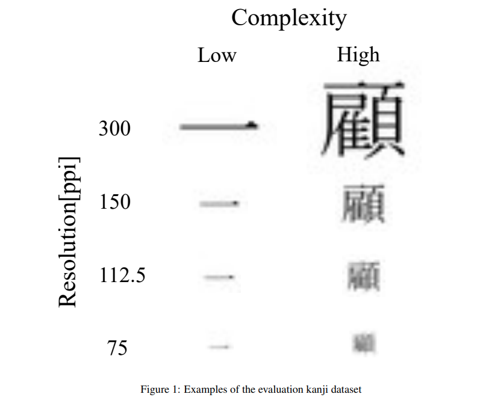
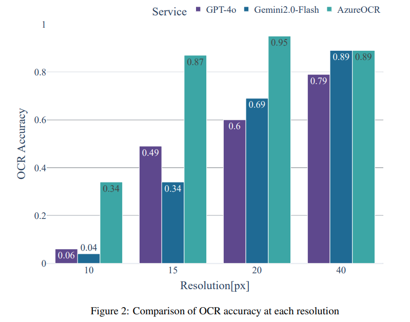
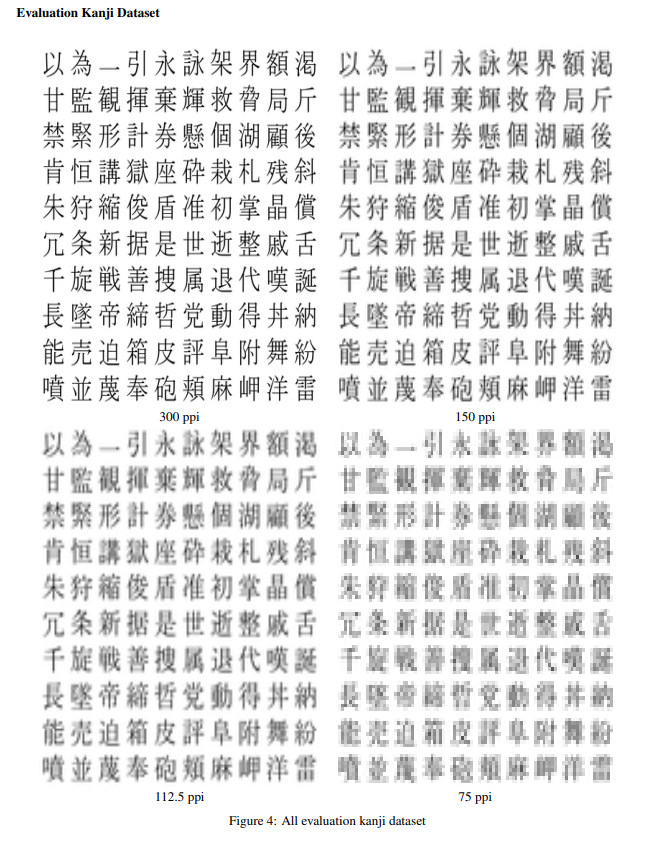
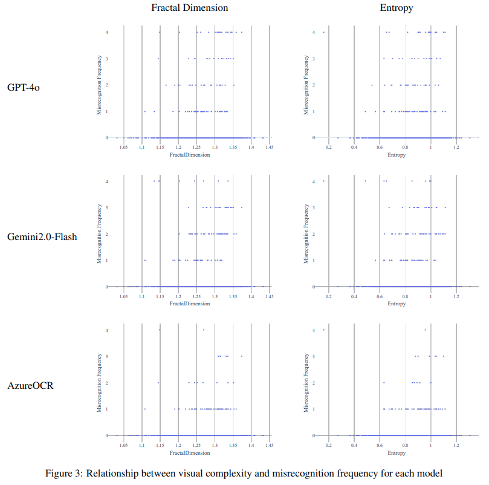

## 목차

* [1. 논문 개요](#1-논문-개요)
  * [1-1. Context-Independent OCR](#1-1-context-independent-ocr)
* [2. 실험 방법](#2-실험-방법)
  * [2-1. OCR 실험을 진행할 글자 데이터셋 생성](#2-1-ocr-실험을-진행할-글자-데이터셋-생성)
  * [2-2. Multimodal LLM 을 이용한 평가](#2-2-multimodal-llm-을-이용한-평가)
* [3. 실험 결과](#3-실험-결과)
  * [3-1. Context-Independent Kanji 문자에 대한 인식 정확도](#3-1-context-independent-kanji-문자에-대한-인식-정확도)
  * [3-2. 시각적 복잡도와 부정확한 인식 간 상관관계](#3-2-시각적-복잡도와-부정확한-인식-간-상관관계)
* [4. 논의 사항](#4-논의-사항)

## 논문 소개

* Kotaro Inoue, "Context-Independent OCR with Multimodal LLMs: Effects of Image Resolution and Visual Complexity", 2025
* [arXiv Link](https://arxiv.org/pdf/2503.23667)

## 1. 논문 개요

* 이 논문에서는 **Multi-Modal LLM** 이 **Context-Independent OCR task 에서 각 글자를 정확히 인식하는 성능** 이, **이미지 환경이 어떨 때** 좋은지 실험하고 그 결과에 대해 논한다.

### 1-1. Context-Independent OCR

**Context-Independent OCR** 은 **글자의 배치가 문맥에 영향을 받지 않는** 경우의 OCR task 를 의미한다. 예를 들어 다음과 같다.

* 완전히 랜덤한 숫자의 배열
* uuid 와 같이 숫자와 문자의 배열이 완전히 랜덤한 경우
* **주변 문맥 없이** 단 1개의 글자만 표시되는 이미지

## 2. 실험 방법

여기서는 다음과 같은 조건을 사용하여 실험을 실시했다.

| 실험 조건                         | 설명                                        |
|-------------------------------|-------------------------------------------|
| 글자 형태의 다양성                    | **2136 가지 Kanji 글자** (일본에서 많이 사용하는 글자 종류) |
| 멀티모달 LLM이 충분히 Pre-train 된 상태임 | **GPT-4o, Gemini2.0-Flash** 의 2개의 LLM 사용  |

### 2-1. OCR 실험을 진행할 글자 데이터셋 생성

OCR 실험을 진행하기 위해, 다음과 같이 **모델 평가를 위한 kanji 글자 데이터셋을 먼저 생성** 한다.

* **scanner 로 스캔된 글자를 재현** 하기 위해 아래와 같은 조건을 적용한다.

| 실험 조건       | 내용        |
|-------------|-----------|
| font size   | 200       |
| font type   | MS Mincho |
| 이미지 크기 (px) | 256 x 256 |



[(출처)](https://arxiv.org/pdf/2503.23667) : "Context-Independent OCR with Multimodal LLMs: Effects of Image Resolution and Visual Complexity", 2025

**1. Fractal Dimension**

* **Fractal Dimension** 은 **기하학적 object가 공간을 얼마나 완전히 채우는지** 를 나타내는 값이다.
  * 글자 인식 (OCR) 분야에서는 일반적으로 **Fractal Dimension 값이 클수록 글자가 복잡하다. (have more details)** 
* Fractal Dimension 수식

$\displaystyle D = - \lim_{\epsilon \to 0} \frac{log N(\epsilon)}{log \epsilon}$

| notation      | 설명                                                  |
|---------------|-----------------------------------------------------|
| $D$           | **Fractal Dimension 의 값**                           |
| $\epsilon$    | box size                                            |
| $N(\epsilon)$ | box size $\epsilon$ 에 대해, **이미지를 커버하기 위한 box 의 개수** |

**2. Shannon Entropy**

* **Shannon Entropy** 는 **각 pixel value 의 분포에 대해 계산한 entropy** 의 개념이다.
  * Entropy 의 개념은 [Decision Tree 의 Entropy 문단](../../AI%20Basics/Machine%20Learning%20Models/머신러닝_모델_Decision_Tree.md#2-2-entropy) 을 참고하면 알 수 있다. 
* Shannon Entropy 수식

$H = - \Sigma_{i=1}^n p(i) log_2 p(i)$

| notation | 설명                      |
|----------|-------------------------|
| $H$      | **Shannon Entropy 의 값** |
| $n$      | pixel value 의 범위        |
| $i$      | 각 pixel 의 pixel value   |
| $p(i)$   | pixel value $i$ 에 대한 확률 |

### 2-2. Multimodal LLM 을 이용한 평가

* 실험을 위해 다음과 같이 **2가지 종류의 Multi-Modal LLM + 1가지 baseline OCR 모델** 을 사용한다.

| 모델                           | 모델 종류           | 설명                                          |
|------------------------------|-----------------|---------------------------------------------|
| GPT-4o                       | Multi-Modal LLM |                                             |
| Gemini2.0-Flash              | Multi-Modal LLM |                                             |
| Azure Computer Vision OCR 모델 | OCR 모델          | Azure Computer Vision service 의 전통적인 OCR 모델 |

* LLM 설정 세부 사항

| 세부 사항                                                                                              | 내용                                                                                       |
|----------------------------------------------------------------------------------------------------|------------------------------------------------------------------------------------------|
| 모델 버전                                                                                              | 2025년 3월 28일 버전                                                                          |
| 프롬프트                                                                                               | ```OCR the image, then return the text in JSON format: "text": str without code block``` |
| [LLM Temperature](../../AI%20Basics/LLM%20Basics/LLM_기초_Decoding_Strategies.md#2-5-temperature-조정) | 0.0 (**완전히 deterministic** 한 출력)                                                         |

* OCR 모델 설정 세부 사항

| 세부 사항      | 내용                                 |
|------------|------------------------------------|
| 최소 이미지 해상도 | 50 pixels                          |
| Padding    | 50 x 50 pixels 까지 확장하도록 Padding 적용 |

## 3. 실험 결과

* 실험 결과 요약

| 구분                     | 설명                                                                                                                                                |
|------------------------|---------------------------------------------------------------------------------------------------------------------------------------------------|
| 인식 정확도                 | **LLM** (GPT-4o & Gemini2.0-Flash) < **OCR 모델** (AzureOCR)                                                                                        |
| 시각적 복잡도 - 부정확한 인식 상관관계 | - **LLM** 의 경우, 부정확한 인식의 빈도는 시각적 복잡도를 나타내는 값 (Fractal Dimension & Shannon Entropy) 과 **약한 양의 상관관계를 보임**<br>- **OCR 모델** 의 경우, 이러한 상관관계가 잘 나타나지 않음 |

### 3-1. Context-Independent Kanji 문자에 대한 인식 정확도

* 평가 대상 및 방법
  * 테스트 데이터셋에 있는 이미지 중 **400장의 이미지**
  * **실존하는 OCR 서비스** 및 앞에서 말한 **2개의 Multi-Modal LLM (GPT-4o & Gemini2.0-Flash)** 을 이용하여 OCR Processing 실시
* 평가 지표
  * **정확도 (Accuracy)** 

$\displaystyle Accracy = \frac{N_{correct}}{N_{total}}$

| notation      | 설명                 |
|---------------|--------------------|
| $N_{correct}$ | **알맞게 예측한** 문자의 개수 |
| $N_{total}$   | **전체** 문자의 개수      |

* 실험 결과
  * Resolution 이 커질수록 전반적인 모델의 정확도 향상
  * 개별 모델의 정확도는 **LLM (GPT-4o & Gemini2.0-Flash) < OCR 모델 (AzureOCR)**



[(출처)](https://arxiv.org/pdf/2503.23667) : "Context-Independent OCR with Multimodal LLMs: Effects of Image Resolution and Visual Complexity", 2025

* 평가 대상 데이터셋 상세



[(출처)](https://arxiv.org/pdf/2503.23667) : "Context-Independent OCR with Multimodal LLMs: Effects of Image Resolution and Visual Complexity", 2025

### 3-2. 시각적 복잡도와 부정확한 인식 간 상관관계

* 평가 방법

| 평가 방법                 | 설명                                         |
|-----------------------|--------------------------------------------|
| Fractal Dimension $D$ | 해당 값이 클수록 글자가 복잡함을 나타내므로, **시각적 복잡도를 나타냄** |
| (Shannon) Entropy $H$ | Entropy의 개념이므로, **시각적 복잡도가 클수록 해당 값도 커짐**  |
 
* 평가 결과 요약

| 모델                        | 상관계수<br>(Fractal Dimension - 인식 오류 빈도) | 상관계수<br>(Entropy Correlation - 인식 오류 빈도) |
|---------------------------|----------------------------------------|------------------------------------------|
| GPT-4o **(LLM)**          | +0.281                                 | +0.150                                   |
| Gemini2.0-Flash **(LLM)** | +0.172                                 | +0.037                                   |
| AzureOCR **(OCR Model)**  | -0.031                                 | -0.116                                   |

* 상세 그래프
  * **LLM (GPT-4o & Gemini2.0-Flash)** 의 경우, 인식 오류 빈도와 시각적 복잡도를 나타내는 수치 (Fractal Dimension & Entropy) 간 **약한 양의 상관관계** 를 보임
  * **OCR 모델 (AzureOCR)** 의 경우, 이러한 상관관계가 잘 나타나지 않음



[(출처)](https://arxiv.org/pdf/2503.23667) : "Context-Independent OCR with Multimodal LLMs: Effects of Image Resolution and Visual Complexity", 2025

## 4. 논의 사항

* 실험 결과 요약
  * Multi-modal LLM 의 인식 정확도는 **입력 이미지의 해상도에 크게 영향을 받는다.**
  * 또한, 원본 이미지의 해상도는 스캐너의 성능에 영향을 받는다.

* 논의 사항
  * Multi-Modal LLM 들은 **일반적인 텍스트 & 이미지 데이터로 학습** 되었으므로, **context-independant data** 에서는 관련된 시각적 속성을 추출하는 성능이 다소 떨어질 수 있다.
  * 이와 같이 OCR task 성능이 떨어지는 이유는 **극도로 제한된 환경** 때문이다.
  * 이러한 경향성은 **낮은 해상도에서 복잡한 글자를 추출** 할 때 더욱 잘 발생한다.

* Fractal Dimension 과 LLM 의 인식 오류 빈도 간 **약한 양의 상관관계** 에 대한 탐구
  * 이는 **시각적으로 복잡한 글자에 대한 LLM의 해석 능력은 한계가 있음** 을 의미한다.
  * Gemini 모델에서 해당 상관관계가 더 약한 이유는, **두 모델 사이에 Visual Encoder 의 성능 차이가 있을 수 있음** 을 암시한다.

* 최종 결론
  * Multi-Modal LLM을 OCR task 에 적용할 때는 **입력되는 이미지의 품질이 매우 중요** 하다.
    * 그 중에서도 특히 **이미지 해상도** 가 중요하다.
  * Multi-Modal LLM을 **높은 정확도가 필요한** OCR task 에 사용할 때는 다음이 필요하다.
    * 특별한 전처리 알고리즘
    * 글자를 인식하는 추가적인 sub-model
