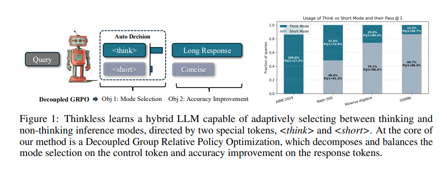

## 목차

* [1. Thinkless 개요 및 등장 배경](#1-thinkless-개요-및-등장-배경)
* [2. Thinkless의 핵심 아이디어](#2-thinkless의-핵심-아이디어)
  * [2-1. Distillation for Warm-up](#2-1-distillation-for-warm-up)
  * [2-2. Reinforcement Learning with DeGRPO](#2-2-reinforcement-learning-with-degrpo)
* [3. 실험 및 그 결과](#3-실험-및-그-결과)
  * [3-1. 실험 설정](#3-1-실험-설정)
  * [3-2. Hybrid Reasoning 결과](#3-2-hybrid-reasoning-결과)
  * [3-3. Reinforcement Learning 결과](#3-3-reinforcement-learning-결과)
  * [3-4. Warm-up Distillation 상세](#3-4-warm-up-distillation-상세)
* [4. 논의 사항](#4-논의-사항)

## 논문 소개

* Gongfan Fang and Xinyin Ma et al., "Thinkless: LLM Learns When to Think", 2025
* [arXiv Link](https://arxiv.org/pdf/2505.13379)

## 1. Thinkless 개요 및 등장 배경

**Thinkless** 는 **[추론 기능을 포함한](../../AI%20Basics/LLM%20Basics/LLM_기초_추론형_모델.md) LLM이 주어진 프롬프트에 대해 '추론'을 해야 할지 말아야 할지 결정하는 '판단력'을 부여하는 컨셉** 의 방법론이다.

* Thinkless 의 등장 배경
  * 최근 등장하고 있는 추론형 모델의 성공 요인은 [Chain of Thought (COT)](../../AI%20Basics/LLM%20Basics/LLM_기초_Chain_of_Thought.md) 방법론임
  * 그러나, **CoT 방법을 모든 사용자 프롬프트에 똑같이 적용하면 자원 낭비가 발생** 할 수 있음
  * 이를 위해 다음과 같은 방법들이 등장했으나, **모델이 추론을 실시할지 말지를 결정하는 부분** 은 여전히 해결되지 않은 과제임
    * 추론형 모델의 inference 효율성 향상
    * **hybrid reasoning** 등 방법 존재

## 2. Thinkless의 핵심 아이디어



[(출처)](https://arxiv.org/pdf/2505.13379) : "Thinkless: LLM Learns When to Think", 2025

**Thinkless** 의 핵심 아이디어는 다음과 같다.

| 핵심 아이디어                                    | 설명                                                                                                        |
|--------------------------------------------|-----------------------------------------------------------------------------------------------------------|
| Distillation for Warm-up                   | **warm-up** 단계에서, token 을 이용하여 response style 결정<br>- token 은 ```<think>``` ```<short>``` 의 2종류           |
| Reinforcement Learning with Decoupled GRPO | **reinforcement learning** 단계에서, 모델은 **performance feedback 에 기반** 하여 **적절한 inference mode** 를 선택하도록 최적화됨 |

### 2-1. Distillation for Warm-up

**Distillation for Warm-up** 은 Pre-train 된 추론형 LLM을 **2개의 response style** 로 Fine-Tuning 하는 것이다.


### 2-2. Reinforcement Learning with DeGRPO

**Reinforcement Learning with DeGRPO** 는 모델이 적절한 response style 을 선택하도록 **performance feedback 을 이용하여 강화학습** 시키는 것을 말한다.

## 3. 실험 및 그 결과

### 3-1. 실험 설정

### 3-2. Hybrid Reasoning 결과

### 3-3. Reinforcement Learning 결과

### 3-4. Warm-up Distillation 상세

## 4. 논의 사항
