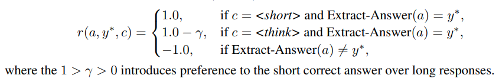
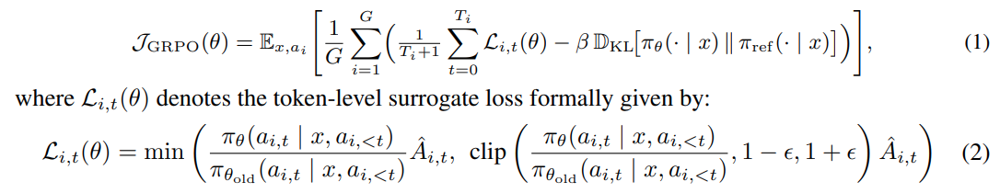
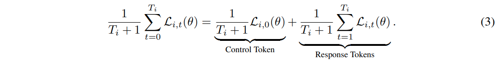
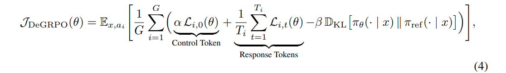
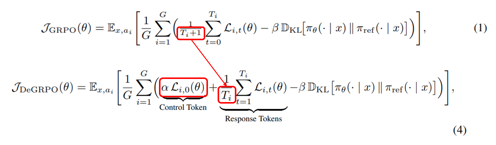
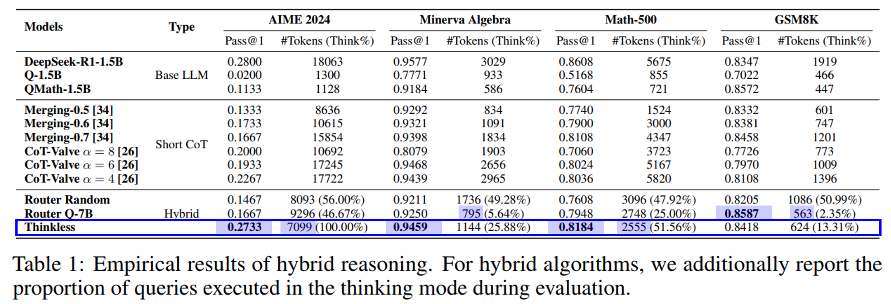
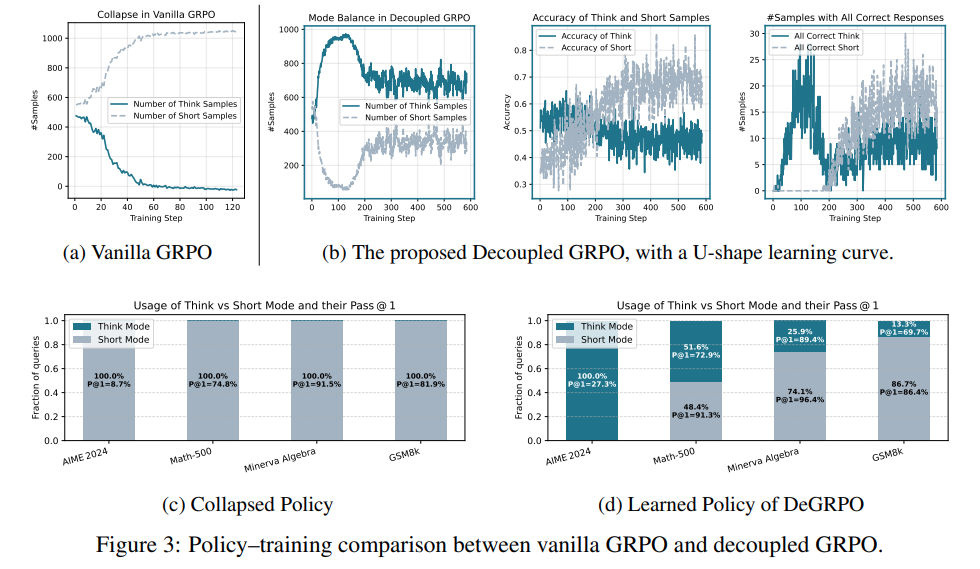
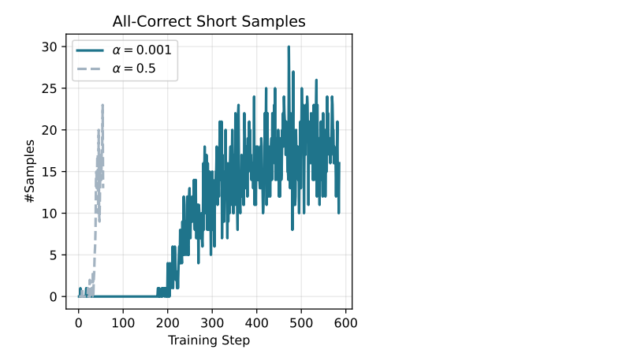
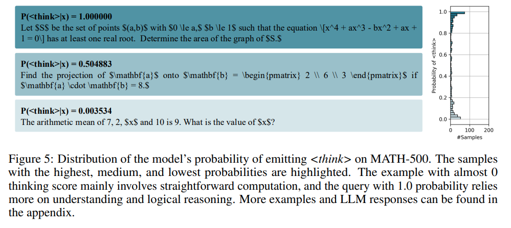

## 목차

* [1. Thinkless 개요 및 등장 배경](#1-thinkless-개요-및-등장-배경)
* [2. Thinkless의 핵심 아이디어](#2-thinkless의-핵심-아이디어)
  * [2-1. Distillation for Warm-up](#2-1-distillation-for-warm-up)
  * [2-2. Reinforcement Learning with DeGRPO](#2-2-reinforcement-learning-with-degrpo)
* [3. 실험 및 그 결과](#3-실험-및-그-결과)
  * [3-1. 실험 설정](#3-1-실험-설정)
  * [3-2. Hybrid Reasoning 결과](#3-2-hybrid-reasoning-결과)
  * [3-3. Reinforcement Learning 결과](#3-3-reinforcement-learning-결과)
  * [3-4. Warm-up Distillation 상세](#3-4-warm-up-distillation-상세)
* [4. 논의 사항](#4-논의-사항)

## 논문 소개

* Gongfan Fang and Xinyin Ma et al., "Thinkless: LLM Learns When to Think", 2025
* [arXiv Link](https://arxiv.org/pdf/2505.13379)

## 1. Thinkless 개요 및 등장 배경

**Thinkless** 는 **[추론 기능을 포함한](../../AI%20Basics/LLM%20Basics/LLM_기초_추론형_모델.md) LLM이 주어진 프롬프트에 대해 '추론'을 해야 할지 말아야 할지 결정하는 '판단력'을 부여하는 컨셉** 의 방법론이다.

* Thinkless 의 등장 배경
  * 최근 등장하고 있는 추론형 모델의 성공 요인은 [Chain of Thought (COT)](../../AI%20Basics/LLM%20Basics/LLM_기초_Chain_of_Thought.md) 방법론임
  * 그러나, **CoT 방법을 모든 사용자 프롬프트에 똑같이 적용하면 자원 낭비가 발생** 할 수 있음
  * 이를 위해 다음과 같은 방법들이 등장했으나, **모델이 추론을 실시할지 말지를 결정하는 부분** 은 여전히 해결되지 않은 과제임
    * 추론형 모델의 inference 효율성 향상
    * **hybrid reasoning** 등 방법 존재

## 2. Thinkless의 핵심 아이디어


[(출처)](https://arxiv.org/pdf/2505.13379) : "Thinkless: LLM Learns When to Think", 2025

**Thinkless** 의 핵심 아이디어는 다음과 같다.

| 핵심 아이디어                                    | 설명                                                                                                        | 핵심 기술                          |
|--------------------------------------------|-----------------------------------------------------------------------------------------------------------|--------------------------------|
| Distillation for Warm-up                   | **warm-up** 단계에서, token 을 이용하여 response style 결정<br>- token 은 ```<think>``` ```<short>``` 의 2종류           | 지식 증류 (Knowledge Distillation) |
| Reinforcement Learning with Decoupled GRPO | **reinforcement learning** 단계에서, 모델은 **performance feedback 에 기반** 하여 **적절한 inference mode** 를 선택하도록 최적화됨 | 강화학습 (Reinforcement Learning)  |

### 2-1. Distillation for Warm-up

**Distillation for Warm-up** 은 Pre-train 된 추론형 LLM을 **2개의 response style** 로 Fine-Tuning 하는 것이다.
  * 이때 [Knowledge Distillation (지식 증류)](../../AI%20Basics/Deep%20Learning%20Basics/딥러닝_기초_Knowledge_Distillation.md) 를 이용한다.

| 구분                                                                                                            | 설명                                                                                                                                                                                 | 
|---------------------------------------------------------------------------------------------------------------|------------------------------------------------------------------------------------------------------------------------------------------------------------------------------------|
| 핵심 목표                                                                                                         | **short-term** response 와 **long-term** response 를 둘 다 생성 가능한 LLM 학습                                                                                                               | 
| [Knowledge Distillation (지식 증류)](../../AI%20Basics/Deep%20Learning%20Basics/딥러닝_기초_Knowledge_Distillation.md) | 다음 2개의 Pre-trained 모델을 Teacher Model 로 하여 **지식 증류**<br>- $\pi_{think}$ : step-by-step 추론을 통해 **상세한 CoT chain 생성**<br>- $\pi_{short}$ : instruction following model (비교적 간단한 답변 생성) |

* 다음 수식과 같이 **synthetic paired dataset** 을 생성
  * $\displaystyle D_{distill} = \lbrace (x_i, a_i^{think}, a_i^{short}) \rbrace_{i=1}^N$
  * 각 response 는 ```<short>``` 또는 ```<think>``` 의 prefix 를 가짐

| notation      | 설명                                                                                   |
|---------------|--------------------------------------------------------------------------------------|
| $x_i$         | prompt corpus $X = \lbrace x_i \rbrace_{i=1}^N$ 에 있는 각 prompt                        |
| $a_i^{think}$ | Pre-trained LLM $\pi_{long}$ 에 $x_i$ 를 입력시킨 결과<br>$a_i^{think} = \pi_{long} (x_i)$   |
| $a_i^{short}$ | Pre-trained LLM $\pi_{short}$ 에 $x_i$ 를 입력시킨 결과<br>$a_i^{short} = \pi_{short} (x_i)$ |

### 2-2. Reinforcement Learning with DeGRPO

**Reinforcement Learning with DeGRPO** 는 모델이 적절한 response style 을 선택하도록 **performance feedback 을 이용하여 강화학습** 시키는 것을 말한다.

| 구분             | 설명                                                                                                                                                                                      |
|----------------|-----------------------------------------------------------------------------------------------------------------------------------------------------------------------------------------|
| 핵심 목표          | Distillation 이 완료되어 **long-term & short-term answer 를 둘 다 생성 가능** 한 LLM에 대해, **input $x$ 에 대해 적절한 response mode 를 결정** 하는 것을 학습                                                         |
| 강화학습 대상 Policy | $\pi_\theta (c,a \vert x) = \pi_\theta (c \vert x) \pi_\theta (a \vert x,c)$<br>- $c \in C$, $C = \lbrace$ ```<short>```,```<think>``` $\rbrace$<br>- 여기서 $c$ 를 **control token** 이라고 함 |

**1. 강화학습 시의 Reward**

* 아래와 같이 **control token 및 Ground-truth answer 와의 일치 여부** 에 따른 reward 를 적용한다.



[(출처)](https://arxiv.org/pdf/2505.13379) : "Thinkless: LLM Learns When to Think", 2025

| notation      | 설명                                         |
|---------------|--------------------------------------------|
| $r(a, y*, c)$ | reward function                            |
| $a$           | sequence token 의 집합                        |
| $y*$          | ground-truth answer                        |
| $c$           | control token                              |
| $\gamma$      | 짧지만 정확한 답변에 대한 선호도를 나타내며, $0 < \gamma < 1$ |

**2. Decoupled Policy Optimization (GRPO objective function)**

* 간단한 reward function 에 기반하여, 다음과 같이 **GRPO-based framework** 을 통해 LLM 학습 실시
* GRPO 의 Objective function 은 다음과 같음
  * 참고: [DPO (Direct Preference Optimization) & ORPO (Odds Ratio Preference Optimization)](../../AI%20Basics/LLM%20Basics/LLM_기초_Fine_Tuning_DPO_ORPO.md)



[(출처)](https://arxiv.org/pdf/2505.13379) : "Thinkless: LLM Learns When to Think", 2025

| notation          | 설명                                                    |
|-------------------|-------------------------------------------------------|
| $L_{i,t}(\theta)$ | **token-level** surrogate loss                        |
| $\hat{A}_{i,t}$   | relative advantage<br>- $\hat{A}_{i,t} = r - mean(r)$ |

* 실제 학습 시, 위 수식은 아래와 같이 다음 2가지 목적을 달성하기에 적합하다.
  * Response Mode Selection 을 위한 **적합한 control token** 결정에 대한 학습
  * Response token **자체의 정확도 향상**



[(출처)](https://arxiv.org/pdf/2505.13379) : "Thinkless: LLM Learns When to Think", 2025

**3. Decoupled Policy Optimization (DeGRPO objective function)**

* 위 **(3)** 의 수식은 다음과 같은 imbalance 문제점을 가지고 있다.

| imbalance 문제점           | 설명                                                                                                                                                                                  |
|-------------------------|-------------------------------------------------------------------------------------------------------------------------------------------------------------------------------------|
| Mode-Accuracy imbalance | 각 sequence 는 많은 토큰 중에 **오직 1개의 control token** 만 가지고 있다.<br>- 이로 인해 **전체 Objective Function 에서 적절한 control token 학습의 가중치가 감소** 한다.                                                  |
| Think-Short imbalance   | normalization factor $T_i + 1$ 에 의해, **길이가 긴 sequence** 의 경우 **control token 의 gradient 기여도** 가 낮아진다.<br>- 이로 인해 ```<think>``` token 이 ```<short>``` token 보다 **비교적 덜 최적화** 될 수 있다. |

* 위 문제점을 해결하기 위해, 다음과 같이 **GRPO 의 decoupled version Objective function** 을 사용한다.





[(출처)](https://arxiv.org/pdf/2505.13379) : "Thinkless: LLM Learns When to Think", 2025

* 위 Objective Function 의 핵심 아이디어는 다음과 같다.
  * $\alpha L_{i,0}(\theta)$ 항 추가
  * 이를 통해, **response mode selection $L_{i,0}(\theta)$** 과 **response accuracy improvement $\Sigma_{t=1}^{T_i} L_{i,t}(\theta)$** 를 **독립적으로 정규화**
* 안정적인 학습을 위해 실험에서는 **$\alpha$ = 0.001 (= 1e-3)** 을 사용한다.

## 3. 실험 및 그 결과

* 실험 결과 요약

| 실험                                                          | 결과 요약                                                                                                                                                       |
|-------------------------------------------------------------|-------------------------------------------------------------------------------------------------------------------------------------------------------------|
| [Hybrid Reasoning 결과](#3-2-hybrid-reasoning-결과)             | **학습된 hybrid reasoning model (LLM)** 은 simple query & complex query 의 구분을 잘 하며, **'thinking mode' 비율이 50% - 90% 감소** 한다.                                    |
| [Reinforcement Learning 결과](#3-3-reinforcement-learning-결과) | - **Vanilla GRPO** 에서는 **Control token 의 불균형한 업데이트** 로 인해 **정책이 붕괴** 될 수 있다.<br> - **short-chain sample** 비율은 초반에 낮아지다가 후반에 높아지는 **U자형 곡선** 형태이다.           |
| [Warm-up Distillation 상세](#3-4-warm-up-distillation-상세)     | - **control token update weight ($a$)** 값이 **model selection 학습의 속도를 좌우** 한다.<br>- Reasoning LLM (추론형 LLM) 은 **정확도가 높은 short response 생성 방법을 잘 학습** 할 수 있다. |

### 3-1. 실험 설정

* 주요 실험 설정은 다음과 같다.

**1. LLM**

| 실험 목적                                            | 사용한 LLM                             |
|--------------------------------------------------|-------------------------------------|
| **hybrid reasoning policy** 학습용 기본 모델            | ```DeepSeek-R1-Distill-Qwen-1.5B``` |
| 지식 증류 (Distillation) 을 위한 **long-short pair** 생성 | ```DeepSeek-R1-671B```              |
| 대응되는 **short-form answer** 생성                    | ```Qwen2.5-Math-1.5B-Instruct```    |

**2. 평가용 데이터셋**

| 데이터셋                  | 설명                                                       |
|-----------------------|----------------------------------------------------------|
| ```DeepScaleR```      | Reinforcement Learning 단계 성능 테스트용 / 40K labeled examples |
| ```AIME```            | 성능 평가용 수학 데이터셋                                           |
| ```Minerva Algebra``` | 성능 평가용 수학 데이터셋                                           |
| ```MATH-500```        | 성능 평가용 수학 데이터셋                                           |
| ```GSM-8K```          | 성능 평가용 수학 데이터셋                                           |

**3. 학습 방법 상세**

| 구분     | 단계                                                                                       | 학습 방법                                                                                                 | 내용                                                                                                                      |
|--------|------------------------------------------------------------------------------------------|-------------------------------------------------------------------------------------------------------|-------------------------------------------------------------------------------------------------------------------------|
| 시스템 환경 |                                                                                          | GPU                                                                                                   | single node + 4개의 H100 GPU                                                                                              |
| 시스템 환경 | [SFT (Supervised Fine-Tuning)](../../AI%20Basics/LLM%20Basics/LLM_기초_Fine_Tuning_SFT.md) | 프레임워크                                                                                                 | Megatron framework                                                                                                      |
| 시스템 환경 | reinforcement learning                                                                   | 프레임워크                                                                                                 | VeRL framework                                                                                                          |
| 학습 설정  | warm-up                                                                                  | maximum context length                                                                                | 16K                                                                                                                     |
| 학습 설정  | reinforcement learning                                                                   | maximum context length                                                                                | 24K                                                                                                                     |
| 학습 설정  |                                                                                          | [Optimizer](../../AI%20Basics/Deep%20Learning%20Basics/딥러닝_기초_Optimizer.md)                           | [AdamW Optimizer](../../AI%20Basics/Deep%20Learning%20Basics/딥러닝_기초_Optimizer.md#2-3-adamw) with $\beta$ = (0.9, 0.999) |
| 학습 설정  |                                                                                          | [Learning Rate](../../AI%20Basics/Deep%20Learning%20Basics/딥러닝_기초_Learning_Rate.md)                   | 0.000001 (= 1e-6)                                                                                                       |
| 학습 설정  |                                                                                          | [Weight Decay](../../AI%20Basics/Deep%20Learning%20Basics/딥러닝_기초_Optimizer.md#1-1-중요-개념-weight-decay) | 0.01                                                                                                                    |
| 학습 설정  |                                                                                          | batch size                                                                                            | 128                                                                                                                     |
| 학습 설정  |                                                                                          | responses per each query                                                                              | 8 (전체 1,024 개의 data point)                                                                                              |

### 3-2. Hybrid Reasoning 결과

**결론**

* **학습된 hybrid reasoning model (LLM)** 은 simple query & complex query 의 구분을 잘 한다.
* 이때 'thinking' (추론 기능) 사용률 감소는 **50% ~ 90% 수준** 이다.

**hybrid reasoning 에서의 정확도 및 Token 개수 비교**

* Thinkless 는 대부분의 경우에 Router Random & Router Q-7B 보다 **정확도 (Pass@1) 가 높으며, 동시에 사용 token 개수가 적다.**



[(출처)](https://arxiv.org/pdf/2505.13379) : "Thinkless: LLM Learns When to Think", 2025

### 3-3. Reinforcement Learning 결과

**결론**

* **Vanilla GRPO** 에서는 **Control token 의 불균형한 업데이트** 로 인해 **정책이 붕괴** 될 수 있다.
* **short-chain sample** 의 비율이 학습 초반에 낮아지는 이유는 **학습 초반의 낮은 정확도** 때문이다. 그 이후 다시 상승하는 U자형 곡선을 그린다.

**Vanilla GRPO 와 decoupled GRPO 의 정책 학습 곡선 비교**

* Vanilla GRPO 에서는 **학습이 진행될수록 Short Sample 의 비율이 100%에 수렴** 하는 모습을 볼 수 있다.
* 반면, Decoupled GRPO 에서는 이러한 현상이 없다.



[(출처)](https://arxiv.org/pdf/2505.13379) : "Thinkless: LLM Learns When to Think", 2025

### 3-4. Warm-up Distillation 상세

**결론**

* **control token update weight ($a$)** 값이 **model selection 학습의 속도를 좌우** 한다.
* Reasoning LLM (추론형 LLM) 은 **정확도가 높은 short response 생성 방법을 잘 학습** 할 수 있다.

**1. $\alpha$ 값 및 training step 에 따른 All-correct short sample 의 개수**



[(출처)](https://arxiv.org/pdf/2505.13379) : "Thinkless: LLM Learns When to Think", 2025

**2. MATH-500 데이터셋에서 ```<think>``` token 포함 확률에 따른 예시 답변**

* ```<think>``` token 포함 확률이 낮을수록 **비교적 직접적인 계산** 위주의 내용을 생성한다.



[(출처)](https://arxiv.org/pdf/2505.13379) : "Thinkless: LLM Learns When to Think", 2025

## 4. 논의 사항

* 본 실험에는 다음과 같은 한계점이 있다.
  * 최적 성능 달성을 위해 추가적인 파라미터 튜닝 방법 ([LoRA](../../AI%20Basics/LLM%20Basics/LLM_기초_Fine_Tuning_LoRA_QLoRA.md#2-lora-low-rank-adaptation) 등) 없이 **단순한 Supervised Fine-Tuning (SFT) 방법만을 사용**
  * Thinkless 알고리즘은 **DeepScaleR (40K size)** 데이터셋으로만 평가되었는데, **향후 보다 다양한 데이터셋으로 테스트** 할 수 있음
