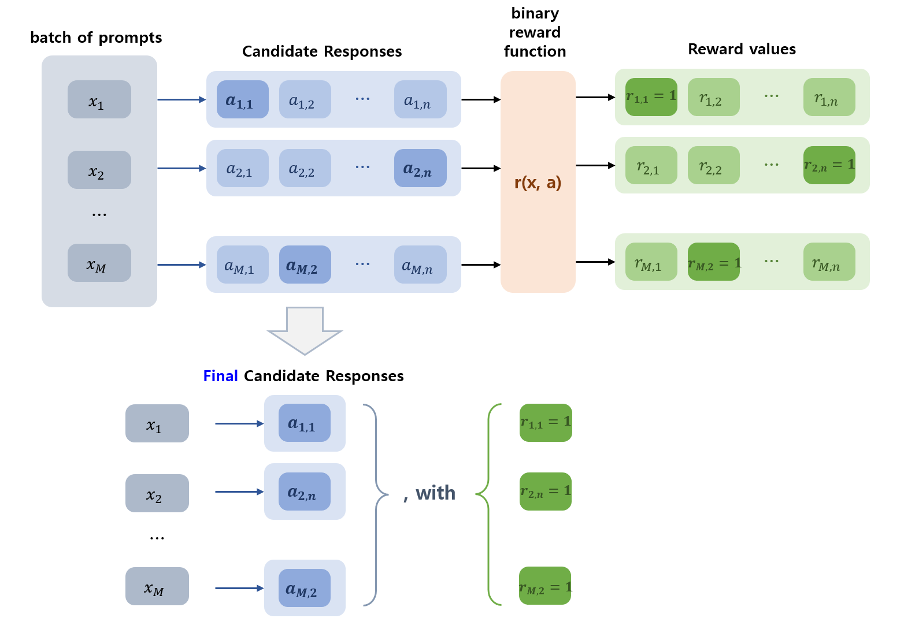
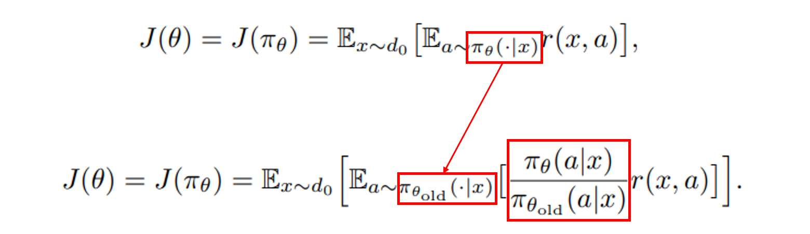
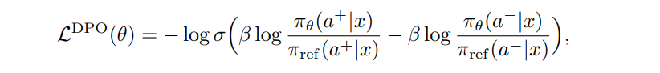
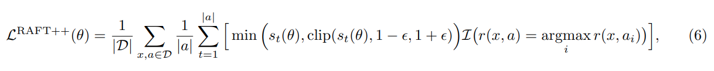
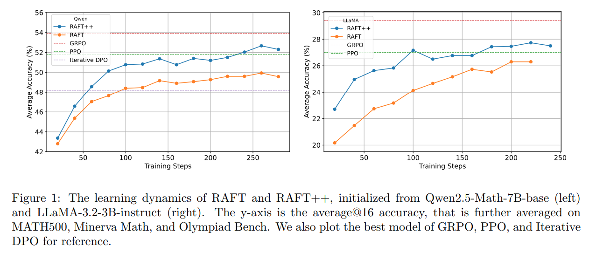
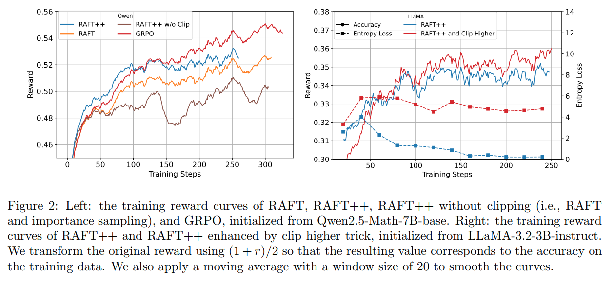
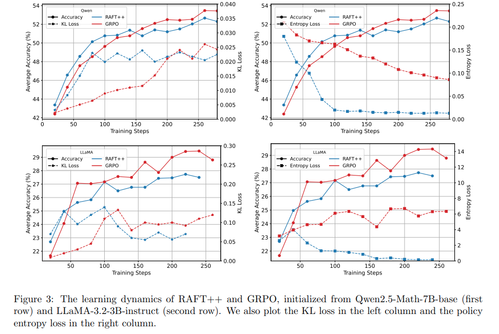
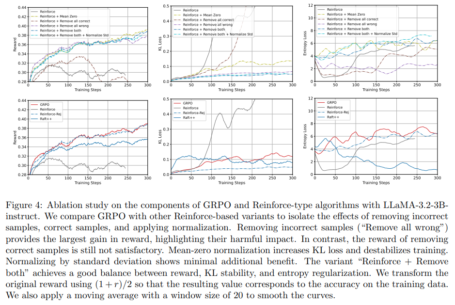

## 목차

* [1. Methods](#1-methods)
  * [1-1. RAFT (Rejection Sampling Fine-Tuning)](#1-1-raft-rejection-sampling-fine-tuning)
  * [1-2. Policy Gradient and Reinforce](#1-2-policy-gradient-and-reinforce)
  * [1-3. GRPO](#1-3-grpo)
  * [1-4. (Iterative) DPO](#1-4-iterative-dpo)
  * [1-5. RAFT++](#1-5-raft)
* [2. 실험 및 그 결과](#2-실험-및-그-결과)
  * [2-1. 실험 설정](#2-1-실험-설정)
  * [2-2. 실험 결과](#2-2-실험-결과)
  * [2-3. Ablation Study 결과](#2-3-ablation-study-결과)
* [3. 결론](#3-결론)

## 논문 소개

* Wei Xiong and Jiarui Yao et al., "A Minimalist Approach to LLM Reasoning: from Rejection Sampling to Reinforce", 2025
* [arXiv Link](https://arxiv.org/pdf/2504.11343)

## 1. Methods

* 본 논문에서 소개하는 Method 에는 다음과 같은 것들이 있다.

| Method                                | 설명                                                                                                                                                                                                  |
|---------------------------------------|-----------------------------------------------------------------------------------------------------------------------------------------------------------------------------------------------------|
| RAFT (Rejection Sampling Fine-Tuning) | - **Data Collection** : prompt batch 에서, **각 prompt 당 N개의 response** 를 추출<br>- **Data Ranking** : 해당 response 를 reward 기반으로 랭킹<br>- **Model Fine-Tuning** : 주어진 데이터셋에 대한 Log Likelihood 가 최대화되도록 학습 |
| Policy Gradient and Reinforce         | Policy Ascent                                                                                                                                                                                       |
| GRPO                                  | reward function 을 **advantage function** 으로 대체                                                                                                                                                      |
| (Iterative) DPO                       | [DPO (Direct Perference Optimization)](../../AI%20Basics/LLM%20Basics/LLM_기초_Fine_Tuning_DPO_ORPO.md#2-dpo-direct-preference-optimization)                                                          |
| RAFT++                                | 기존 RAFT 알고리즘에 **importance sampling & clipping** 적용                                                                                                                                                 |

### 1-1. RAFT (Rejection Sampling Fine-Tuning)

**RAFT (Rejection Sampling Fine-Tuning)** 은 다음과 같은 3개의 step으로 구성된 Fine-Tuning 알고리즘이다.

| Step                              | 설명                                                                                                                                                                                        |
|-----------------------------------|-------------------------------------------------------------------------------------------------------------------------------------------------------------------------------------------|
| Data Collection                   | - prompt batch ${x_1, ..., x_M}$ 에서, 각 prompt 당 **n 개의 reponse 추출**<br>- 이를 통해, 각 $x_i$ 에 대해 후보 답변 리스트 $\lbrace a_{i,1}, ..., a_{i,n} \rbrace$ 를 얻음                                       |
| Data Ranking (Rejection Sampling) | - 각 prompt $x_i$ 에 대해,<br>- **binary** reward function $r(x, a)$ 을 이용하여 각 response 에 대한 **reward value** $\lbrace r_{i,1}, ..., r_{i,n} \rbrace$ 계산<br>- **response 값이 가장 큰 후보** 만 남기고 제거 |
| Model Fine-Tuning                 | - 주어진 dataset 에 대해 **Log-likelihood 를 최대화** 하도록 최적화                                                                                                                                       |



* Model Fine-Tuning 수식
  * $\displaystyle L^{RAFT}(\theta) = \Sigma_{(x, a) \in D} \log \pi_\theta (a|x)$ 

### 1-2. Policy Gradient and Reinforce

**Policy Gradient and Reinforce** 는 다음과 같은 **Policy Gradient** 알고리즘을 이용하여 **Policy Ascent** 를 실시하는 것이다.

* $J(\theta) = J(\pi_\theta) = E_{x \sim d_0}[E_{a \sim \pi_\theta(·|x)} r(x, a)]$
* $\theta' ← \theta + \beta · ∇_\theta J(\theta)$

| notation             | 설명                                                                 |
|----------------------|--------------------------------------------------------------------|
| $\theta$             | Neural Network 의 파라미터                                              |
| $∇_\theta J(\theta)$ | **Policy Gradient** (Policy Network 갱신을 위한 Policy Ascent 알고리즘에 사용) |

**1. 실무적으로는 Replay Buffer 를 이용**

* 실무적으로는 RAFT 와 비슷하게 다음과 같이 한다.
  * $\pi_{\theta_{old}}$ 를 이용하여 replay buffer 에 들어갈 trajectory 를 수집한다.
  * $\pi_{\theta_{old}}$ 를 갱신하기 위한 **stochastic policy gradient** 를 계산한다.

**2. Strict On-policy Training 에서의 문제점**

* Strict On-Policy Training 에서는 다음과 같은 문제가 발생한다.
  * Gradient Ascent 의 매 step 마다 새로운 데이터를 수집해야 함
  * 따라서 학습 속도를 높이기 위해, **mini-batch와 비슷한 방법으로 multiple step 을 수행** 하며, **importance sampling** 을 통해 분포 보정
* 따라서 Objective function 을 다음과 같이 쓸 수 있음
  * $\displaystyle J(\theta) = J(\pi_\theta) = E_{x \sim d_0}[E_{a \sim \pi_{\theta_{old}}(·|x)} \frac{\pi_\theta(a|x)}{\pi_{\theta_{old}}(a|x)} r(x, a)]$



[(출처)](https://arxiv.org/pdf/2504.11343) : Wei Xiong and Jiarui Yao et al., "A Minimalist Approach to LLM Reasoning: from Rejection Sampling to Reinforce", 2025

### 1-3. GRPO

**GRPO (Group Relative Policy Optimization)** 는 다음과 같이 **reward function $r(x, a)$** 을 **reward 값을 Normal Distribution 으로 정규화** 한 **advantage function $A_t(x, a)$** 으로 바꾸는 컨셉이다.

* $\displaystyle A_t(x, a_i) = \frac{r_i - mean(r_1, ..., r_n)}{std(r_1, ..., r_n)}$

| notation | 설명        |
|----------|-----------|
| $t$      | token No. |
| $a$      | response  |
| $x$      | prompt    |

### 1-4. (Iterative) DPO

* [DPO (Direct Perference Optimization)](../../AI%20Basics/LLM%20Basics/LLM_기초_Fine_Tuning_DPO_ORPO.md#2-dpo-direct-preference-optimization) 는 **입력 $x$, 비교적 선호되는 답변 $a^+$, 선호되지 않는 답변 $a^-$** 을 이용하여 LLM을 Fine-Tuning 하는 컨셉이다.
  * 여기서 $a^+$, $a^-$ 가 한 쌍을 이룬다.



### 1-5. RAFT++

**RAFT++** 는 **Replay Buffer 에서 Multiple Step 을 수행** 할 때 **Off-Policy** 가 될 수 있는, 하이브리드 컨셉의 알고리즘이다.

* RAFT++ 에는 다음과 같은 기법이 적용된다.
  * importance sampling
  * clipping
* RAFT++ 의 Loss Function 은 다음과 같다.



[(출처)](https://arxiv.org/pdf/2504.11343) : Wei Xiong and Jiarui Yao et al., "A Minimalist Approach to LLM Reasoning: from Rejection Sampling to Reinforce", 2025

## 2. 실험 및 그 결과

* 실험 결과 요약

| 실험                        | 결과 요약                                                                      |
|---------------------------|----------------------------------------------------------------------------|
| RAFT vs. RAFT++ 평균 정확도 비교 | 평균 정확도: **RAFT++ > RAFT**                                                  |
| reward curve 비교           | Reward의 크기: **GRPO > RAFT++ > RAFT > RAFT++ (w/o clipping)**<br>- 학습 후반 기준 |

### 2-1. 실험 설정

**1. 데이터셋 및 모델**

| 구분                                                                                | 설정                                                                                                                                                                  |
|-----------------------------------------------------------------------------------|---------------------------------------------------------------------------------------------------------------------------------------------------------------------|
| 학습 데이터셋                                                                           | **Numina-Math**<br>- 약 86만 개의, ground truth가 라벨링된 수학 문제로 구성                                                                                                         |
| 테스트 데이터셋                                                                          | - **Math500**<br>- **Minerva Math**<br>- **Olympiad Bench**                                                                                                         |                                                                                                        |
| 모델                                                                                | - Qwen2.5-Math-7B-base<br>- LLaMA-3.2-3B-instruct                                                                                                                   |
| [Prompt Engineering](../../AI%20Basics/LLM%20Basics/LLM_기초_Prompt_Engineering.md) | [CoT (Chain of Thought)](../../AI%20Basics/LLM%20Basics/LLM_기초_Chain_of_Thought.md)<br>- ```Let's think step by step and output the final answer within \boxed{}``` |

**2. 하이퍼파라미터 설정**

| 하이퍼파라미터                                                                             | 설정값                                                                                         |
|-------------------------------------------------------------------------------------|---------------------------------------------------------------------------------------------|
| [Optimizer](../../AI%20Basics/Deep%20Learning%20Basics/딥러닝_기초_Optimizer.md)         | [AdamW Optimizer](../../AI%20Basics/Deep%20Learning%20Basics/딥러닝_기초_Optimizer.md#2-3-adamw) |
| [Learning Rate](../../AI%20Basics/Deep%20Learning%20Basics/딥러닝_기초_Learning_Rate.md) | **1e-6** (= 0.000001)                                                                       |
| iteration 당 샘플링할 prompt 개수                                                          | 1,024                                                                                       |
| prompt 당 생성할 답변 개수                                                                  | 4                                                                                           |
| baseline                                                                            | iterative DPO                                                                               |

### 2-2. 실험 결과

**1. RAFT vs. RAFT++ 평균 정확도 비교**

* RAFT++ 가 RAFT 보다 현저히 우수하다.



[(출처)](https://arxiv.org/pdf/2504.11343) : Wei Xiong and Jiarui Yao et al., "A Minimalist Approach to LLM Reasoning: from Rejection Sampling to Reinforce", 2025

**2. RAFT vs. RAFT++ vs. RAFT++ (w/o clipping) reward curve 비교**

* RAFT++ (w/o clipping) = RAFT and importance sampling
* 학습 후반으로 갈수록 **GRPO > RAFT++ > RAFT > RAFT++ (w/o clipping)** 순으로 reward 가 높게 나타난다.



[(출처)](https://arxiv.org/pdf/2504.11343) : Wei Xiong and Jiarui Yao et al., "A Minimalist Approach to LLM Reasoning: from Rejection Sampling to Reinforce", 2025

### 2-3. Ablation Study 결과

**1. RAFT++ 와 GRPO 학습 상세 결과**

| Model \ Loss          | KL Loss                                                   | Entropy Loss            |
|-----------------------|-----------------------------------------------------------|-------------------------|
| Qwen2.5-Math-7B-base  | - **RAFT++** 가 GRPO 보다 높음                                 | **GRPO** 가 RAFT++ 보다 높음 |
| LLaMA-3.2-3B-Instruct | - KL Loss 는 서로 비슷<br>- Accuracy 는 **GRPO** 가 RAFT++ 보다 높음 | **GRPO** 가 RAFT++ 보다 높음 |



[(출처)](https://arxiv.org/pdf/2504.11343) : Wei Xiong and Jiarui Yao et al., "A Minimalist Approach to LLM Reasoning: from Rejection Sampling to Reinforce", 2025

**2. Reinforce 에 각종 요소 추가 시의 Reward, KL Loss, Entropy Loss 비교**



[(출처)](https://arxiv.org/pdf/2504.11343) : Wei Xiong and Jiarui Yao et al., "A Minimalist Approach to LLM Reasoning: from Rejection Sampling to Reinforce", 2025

## 3. 결론

