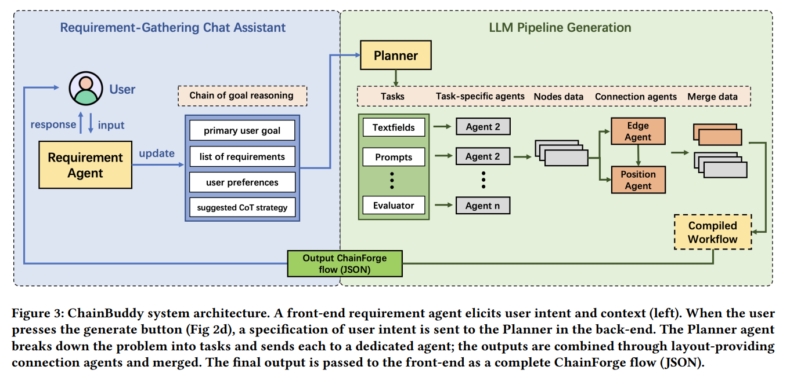
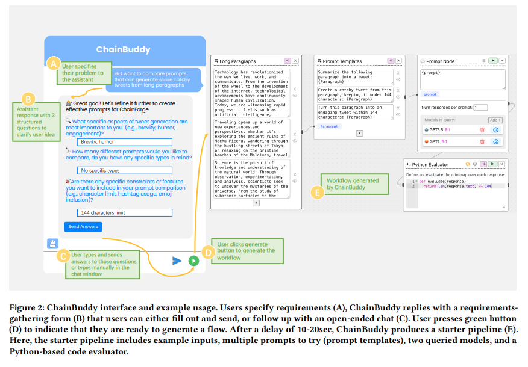
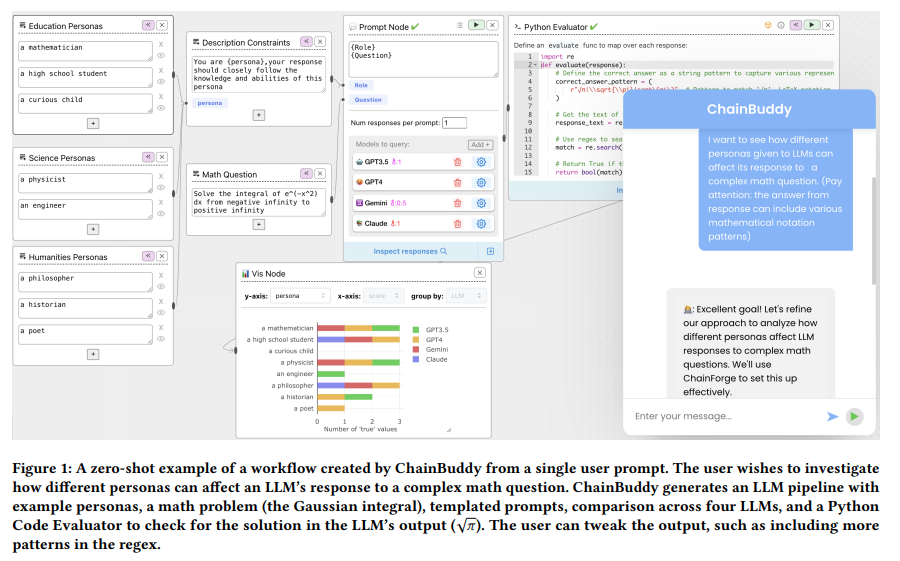

## 목차

* [1. ChainBuddy 개요 및 핵심 아이디어](#1-chainbuddy-개요-및-핵심-아이디어)
* [2. 시스템 구조](#2-시스템-구조)
  * [2-1. Requirement Gathering](#2-1-requirement-gathering)
  * [2-2. Workflow Generation](#2-2-workflow-generation)
  * [2-3. Early Feedback](#2-3-early-feedback)
  * [2-4. Technical Evaluation](#2-4-technical-evaluation)
* [3. Usability Study](#3-usability-study)
  * [3-1. Recruitment and Participants](#3-1-recruitment-and-participants)
  * [3-2. Methodology, Procedure and Tasks](#3-2-methodology-procedure-and-tasks)
  * [3-3. Data Analysis](#3-3-data-analysis)
* [4. 실험 결과](#4-실험-결과)
  * [4-1. 양적 실험 결과](#4-1-양적-실험-결과)
  * [4-2. 질적 실험 결과](#4-2-질적-실험-결과)
* [5. 논의 사항 요약](#5-논의-사항-요약)

## 논문 소개

* Jingyue Zhang and Ian Arawjo et al., "ChainBuddy: An AI Agent System for Generating LLM Pipelines", 2024
* [arXiv Link](https://arxiv.org/pdf/2409.13588)

## 1. ChainBuddy 개요 및 핵심 아이디어

**ChainBuddy** 는 다음과 같은 **챗봇 형태의 Assistant 인터페이스** 이다.

| 구분 | 설명                                                                        |
|----|---------------------------------------------------------------------------|
| 목적 | LLM pipeline 생성 자동화                                                       |
| 특징 | - 유연하고 사용자 친화적<br>- 단순 prompt engineering 을 넘어선, **다양한 use case 를 커버 가능** |

## 2. 시스템 구조

* ChainBuddy 의 전체 시스템 구조는 다음과 같다.

**1. 전체 시스템 구조**



[(출처)](https://arxiv.org/pdf/2409.13588) : Jingyue Zhang and Ian Arawjo et al., "ChainBuddy: An AI Agent System for Generating LLM Pipelines"

| 시스템 구조                | 설명                                                                                                               | 상세 과정                                                                                                      |
|-----------------------|------------------------------------------------------------------------------------------------------------------|------------------------------------------------------------------------------------------------------------|
| Requirement Gathering | **Chain of Reasoning** 이라는 프롬프팅 전략을 사용한다. (AI가 사용자의 목적 달성을 돕도록 설계)                                               | - Goal Clarification Questions<br>- Requirements Exploration Questions<br>- Disambiguation Questions       |
| Workflow Generation   | **Plan-and-Solve Prompting** 과 **Baby-AGI** 등 기술에 착안하여, **사용자 요구사항에 기반한 Long-term plan** 을 생성한다.                 | - Requirement Gathering Chat Assistant<br>- Planner Agent<br>- Task-Specific Agents<br>- Connection Agents |
| Early Feedback        | - 새로운 task 에 대해서 **반복적 내부 테스트 실시 (프롬프트 및 모델 비교)**<br>- Planner Agent Prompt 등 특정 부분에서 **Few-shot Example 들을 제거** | - Intent disambiguation<br>- Structured elicitation<br>- Feedback<br>- Desire to edit existing flows       |
| Technical Evaluation  | ChainBuddy 의 파이프라인 생성 알고리즘에 대한 평가 실시 **(straightforward 하지 않음)**                                                 |                                                                                                            |

**2. 사용자 인터페이스**



[(출처)](https://arxiv.org/pdf/2409.13588) : Jingyue Zhang and Ian Arawjo et al., "ChainBuddy: An AI Agent System for Generating LLM Pipelines"

### 2-1. Requirement Gathering

**Requirement Gathering** 프로세스는 다음과 같이 동작한다.

| 구분                    | 설명                                                                                 |
|-----------------------|------------------------------------------------------------------------------------|
| 프롬프팅 전략               | [Chain of Reasoning (Paper, 2024.01)](https://arxiv.org/pdf/2401.12954)            |
| 사용자 의도 추출             | [ExploreLLM (Paper)](https://dl.acm.org/doi/10.1145/3613905.3651093) 으로부터 아이디어를 얻음 |
| Agent 의 Dictionary 구조 | 사용자 목표, 구체적인 요구사항, 기타 사용자 선호 사항 등을 저장                                              |

* 해당 Agent 는 다음과 같이 3가지 형태의 질문을 사용자에게 하고, 이에 대한 답변을 통해 요구사항을 수집한다.

| 질문                                 | 설명                                                 |
|------------------------------------|----------------------------------------------------|
| Goal Clarification Questions       | 사용자의 **전반적인 목표 (objectives)** 및 문제 해결 맥락 이해        |
| Requirements Exploration Questions | 사용자의 **구체적인 요구사항 및 제약 조건** 을 이해                    |
| Disambiguation Questions           | 사용자의 전반적인 목표 및 요구 사항 간의 **모호함, 충돌이 발생하는 부분** 등을 해결 |

### 2-2. Workflow Generation

**Workflow Generation** 프로세스는 다음과 같이 동작한다.

| 구분      | 설명                                                                                                                                                  |
|---------|-----------------------------------------------------------------------------------------------------------------------------------------------------|
| 착안 기술   | - Plan-and-Solve prompting [(논문)](https://doi.org/10.18653/V1/2023.ACL-LONG.147)<br>- Baby-AGI [(GitHub)](https://github.com/yoheinakajima/babyagi) |
| 목적      | **사용자 요구 사항** 에 기반한 **Long-term plan** 생성                                                                                                           |
| 상세 프로세스 | - 각 task를 구체적이고 관리 가능한 action 으로 분해<br>- 이 task 들을 **개별 Agent 가 실행** 하여, **이어지는 Agent 에게 구조화된 데이터 (json 등) 반환**                                     |

* 핵심 구조 설명

| 핵심 구조                                | 설명                                                                                                            |
|--------------------------------------|---------------------------------------------------------------------------------------------------------------|
| Requirement Gathering Chat Assistant | 채팅 기반 Agent가 **사용자와 상호작용** 을 통해 사용자의 **의도를 명확히 하고 맥락을 파악**                                                    |
| Planner Agent                        | - 사용자 목표에 대한 specification을 획득<br>- 이를 이용하여 **종합적인 구현 계획** 수립                                                 |
| Task-Specific Agents                 | - Plan 에 포함된 각 task 는 **특정한 Agent 에게 할당** 되어 **focused execution** 실시<br>- 이를 통해 **작은 모델도 task 에 사용 가능** 하게 함 |
| Connection Agents                    | task-specific한 출력을 이용하여 edge specification을 생성<br>- 이를 통해 **각 Agent 들을 연결**                                   |

### 2-3. Early Feedback

* 문제
  * 거대 언어 모델 (LLM) 은 **identity-based bias** 가 존재한다.
  * 특히, **few-shot 으로 제공되는 예제에 overfitting 되는 경향** 을 보일 수 있다.
* 해결 방법
  * Planner Agent Prompt 와 같은 특정 부분에 대해서는 **few-shot example 들을 제거** 한다. 
* 추가 사항
  * Early Feedback 을 받기 위한 **informal pilot study** 실시

**Early Feedback 을 통해 도출한 Early Insight**

| 인사이트                          | 설명                                                                                       |
|-------------------------------|------------------------------------------------------------------------------------------|
| Intent disambiguation         | 사용자가 입력한 **단일 프롬프트** 는 일반적으로 **사용자의 실제 요구를 충족시키는 상세 workflow 에 대한 정보가 부족** 하다.           |
| Structured elicitation        | LLM Agent 가 사용자에게 **모호함이 해결될 때까지** 질문하는 접근은 **너무 느리고 사용자에게 스트레스를 준다.**                   |
| Feedback                      | 사용자의 제안 사항은 다음과 같다.<br>- loading progress 시각화<br>- **설명 가능한 인공지능 (xAI, eXplainable AI)** |
| Desire to edit existing flows | AI Assistant 와의 대화를 계속하기를 바라는 사용자가 있음                                                    |

### 2-4. Technical Evaluation

**Technical Evaluation** 은 **ChainBuddy 의 파이프라인 생성 품질을 평가** 하기 위한 **소규모 평가** 이다.

* 결론적으로, **ChainBuddy는 User Study 로 진행하기에 충분했다.**

## 3. Usability Study

* ChainBuddy 를 이용하여 생성한 workflow 예시



[(출처)](https://arxiv.org/pdf/2409.13588) : Jingyue Zhang and Ian Arawjo et al., "ChainBuddy: An AI Agent System for Generating LLM Pipelines"

**1. 질문 구성**

* Usability Study 를 위한 질문 구성은 다음과 같다.

| 질문 분류                           | 질문 구성                                                                                                                                                                                                                                                                                                                                                                                                                                                                                                                                                                                                      |
|---------------------------------|------------------------------------------------------------------------------------------------------------------------------------------------------------------------------------------------------------------------------------------------------------------------------------------------------------------------------------------------------------------------------------------------------------------------------------------------------------------------------------------------------------------------------------------------------------------------------------------------------------|
| 양적 실험 (Quantitative Evaluation) | - 1. ```Users feel that they complete tasks more quickly when using ChainBuddy, versus without.```<br>- 2. ```Users perceive their workload with ChainBuddy as less demanding than the manual baseline interface.```<br>- 3. ```Users report greater self-satisfaction with ChainBuddy, versus without (i.e., ease of use, confidence, learnability).```<br>- 4. ```Users are able to complete tasks more successfully with ChainBuddy, versus without.```                                                                                                                                                 |
| 질적 실험 (Qualitative Evaluation)  | - 1. ```What aspects of the assistant do they appreciate the most, compared to the baseline?```<br>- 2. ```Do users find the requirements-gathering interaction helpful or necessary?```<br>- 3. ```What kinds of problems do participants want to use ChainBuddy for? (free exploration task)```<br>- 4. ```Do people feel that their ideas or hypotheses changed after interacting with the assistant?```<br>- 5. ``` How do people edit the generated flows? What kinds of edits do they tend to make?```<br>- 6. ```Do people learn anything from interacting with the assistant (and if so, what)?``` |

**2. Usability Study 개요**

| 구분                                         | 설명                                                                                           |
|--------------------------------------------|----------------------------------------------------------------------------------------------|
| Recruitment and Participants (참가자 모집)      | 북미 대학 연구실의 12명                                                                               |
| Methodology, Procedure and Tasks (방법 및 과제) | - with vs. without ChainBuddy<br>- 이메일 작성 자동화 툴, 트윗 작성 툴 개발 과제 (각각 $T_{email}$, $T_{tweet}$) |
| Usability Study 결과 데이터 분석                  | 피실험자의 상호 작용 과정을 촬영 및 Assistant 와의 채팅 로그 데이터를 분석                                              |

### 3-1. Recruitment and Participants

* 피실험자 (참가자) 는 **북미 대학 연구실의 12명** 으로 구성된다.

| 정보           | 내용                                  |
|--------------|-------------------------------------|
| 연령           | 18 - 34 세                           |
| 성별           | 남성 7명, 여성 6명                        |
| 배경 지식        | **컴퓨터 과학 및 공학** 관련 배경지식 보유          |
| LLM 경험       | **평균 3.83점**, 표준편차 0.71점 (5점 만점 기준) |
| 파이썬 프로그래밍 지식 | **평균 3.83점**, 표준편차 1.11점 (5점 만점 기준) |

### 3-2. Methodology, Procedure and Tasks

* 실험 조건

| 실험 조건     | 설명                                                  |
|-----------|-----------------------------------------------------|
| Assistant | **with** ChainBuddy                                 |
| Control   | **without** ChainBuddy (=baseline ChainForge 인터페이스) |

* 과제

| 과제          | 과제 요약               | 설명                                                                                                                                       |
|-------------|---------------------|------------------------------------------------------------------------------------------------------------------------------------------|
| $T_{email}$ | 이메일 작성 자동화 소프트웨어 개발 | ```You are a software engineer tasked with designing an automated tool to help people professionalize their emails for work contexts.``` |
| $T_{tweet}$ | 트윗 작성 소프트웨어 개발      | ```You are working on a tool to help summarize long text paragraphs into concise, catchy tweets limited to 144 characters.```            |

* 과제 목표
  * **가장 좋은 프롬프트** 를 찾도록 도와주는 workflow 를 ChainForge 에서 설계
  * 가장 좋은 프롬프트를 **찾는 것 자체가 아닌, 찾도록 도와주는 것** 임

### 3-3. Data Analysis

* 데이터 수집 방법
  * 참가자의 상호작용 정보를 **스크린 및 오디오 녹화**
  * Assistant 와의 **채팅 로그를 기록**
* **양적 데이터 (Quantitative Data)** 분석 방법
  * R 의 **linear mixed effects model** 을 이용
  * **조건 (condition), 과제 (task), 순서 (order)** 등 factor 의 효과를 분석

## 4. 실험 결과

* 실험 결과 요약

| 실험    | 실험 결과 요약                                                                                                             |
|-------|----------------------------------------------------------------------------------------------------------------------|
| 양적 실험 | - **with ChainBuddy** 는 정신적 및 물리적으로 부담이 덜했음<br>- ChainBuddy 사용 시 그렇지 않을 때에 비해 **성과가 좋았음**                            |
| 질적 실험 | - ChainBuddy 는 사용자의 'black page problem'을 극복하게 했음<br>- ChainBuddy 의 요구사항 분석 프로세스는 **참가자가 구체적인 목표 및 기준을 제시** 하도록 지원했음 |

### 4-1. 양적 실험 결과

### 4-2. 질적 실험 결과

## 5. 논의 사항 요약

