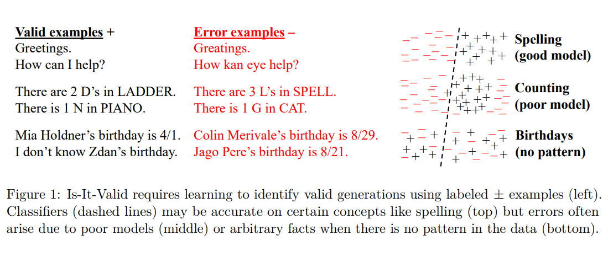
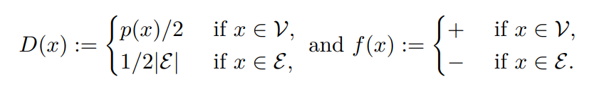
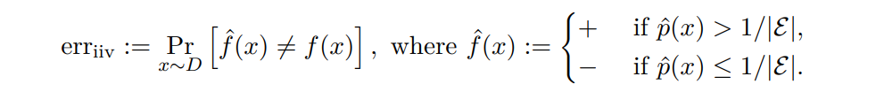
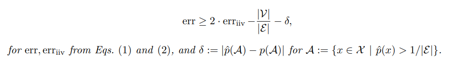
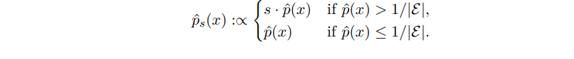
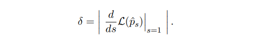
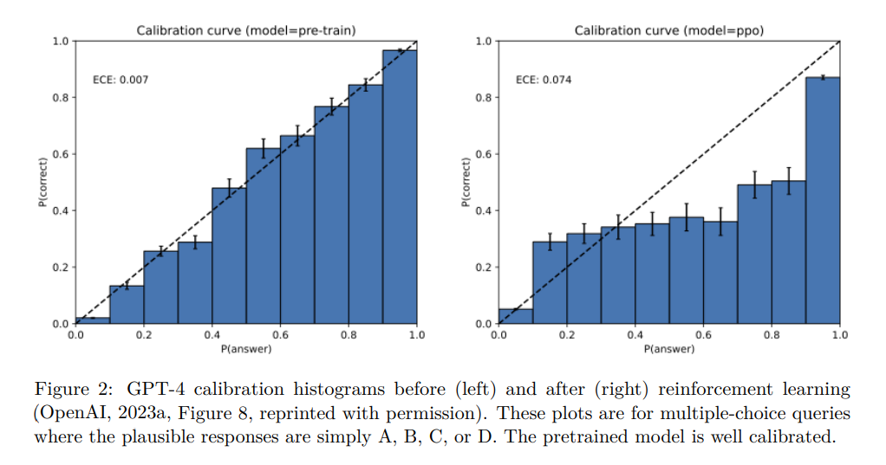

## 목차

* [1. 환각 현상에 대한 몇 가지 사항](#1-환각-현상에-대한-몇-가지-사항)
  * [1-1. Pre-training 에 의한 오류](#1-1-pre-training-에-의한-오류)
  * [1-2. 환각 현상은 왜 Post-training 이후에도 있는가?](#1-2-환각-현상은-왜-post-training-이후에도-있는가)
* [2. Pre-training Error](#2-pre-training-error)
  * [2-1. Prompt 없는 Reduction](#2-1-prompt-없는-reduction)
  * [2-2. Prompt 있는 Reduction](#2-2-prompt-있는-reduction)
  * [2-3. base model 의 Error Factor](#2-3-base-model-의-error-factor)
  * [2-4. 추가적인 Factor](#2-4-추가적인-factor)
* [3. Post-training 에서의 환각 현상](#3-post-training-에서의-환각-현상)
  * [3-1. 모델 평가가 환각 현상을 강화시킴](#3-1-모델-평가가-환각-현상을-강화시킴)
  * [3-2. 명백한 Confidence Target](#3-2-명백한-confidence-target)
* [4. 논의 사항](#4-논의-사항)
* [5. 본 연구의 한계점](#5-본-연구의-한계점)

## 논문 소개

* Adam Tauman Kalai and Ofir Nachum et al., "Why Language Models Hallucinate", 2025
* [OpenAI Paper Link](https://cdn.openai.com/pdf/d04913be-3f6f-4d2b-b283-ff432ef4aaa5/why-language-models-hallucinate.pdf)

## 1. 환각 현상에 대한 몇 가지 사항

* LLM의 환각 현상에 대해 다음과 같이 알아 두어야 할 사항들이 몇 가지 있다.

| 알아 두어야 할 사항                       | 설명                                                                                                                                                                                                                             |
|-----------------------------------|--------------------------------------------------------------------------------------------------------------------------------------------------------------------------------------------------------------------------------|
| Pre-training 에 의한 오류              | 오류가 없는 데이터셋으로 학습하더라도, **Pre-training 을 통해 [Objective function](../../AI%20Basics/Deep%20Learning%20Basics/딥러닝_기초_Loss_function.md#1-1-loss-function-과-cost-function-objective-function) 이 최소화** 되면서 **오류를 생성하는 LLM** 이 될 수 있다. |
| Post-training 이후에도 환각 현상이 존재하는 이유 | - 많은 언어 모델은 **시험 형태의 벤치마크 데이터셋에 최적화** 되어 있다.<br>- 따라서, **```I don't know``` 와 같은 응답은 0점** 이기 때문에 **어떻게든 답을 생성하려고** 하기 때문이다.                                                                                                    |

### 1-1. Pre-training 에 의한 오류

**1. 핵심 요약**

> - 오류가 없는 데이터셋으로 Pre-training 하더라도, Pre-training 과정에서 **Objective Function 의 값이 최소화** 된다.
> - 이 과정에서 **오류를 생성하는 LLM** 으로 학습될 수 있다.
> - 그 원인은 **binary classification** 의 관점에서 생각해 볼 수 있다.

**2. IIV (Is-It-Valid) Binary Classification**

* 이 문제를 다음과 같은 **IIV (Is-It-Valid) Binary Classification** 컨셉에서 생각하면 다음과 같다.
  * 많은 양의 response 가 있는 학습 데이터셋에서, 각 데이터의 label은 **valid (+)** 또는 **invalid (-)** 이다. 
  * 이 경우, **어떤 언어 모델** 이든 이 문제를 해결하는 **IIV Classifier** 가 될 수 있다.
  * 이를 통해 **환각 현상과 IIV misclassification의 관계** 를 설명할 수 있다.



[(출처)](https://cdn.openai.com/pdf/d04913be-3f6f-4d2b-b283-ff432ef4aaa5/why-language-models-hallucinate.pdf) : Adam Tauman Kalai and Ofir Nachum et al., "Why Language Models Hallucinate"

* 이때, 환각 현상 비율 (generative errors) 과 IIV 오분류 비율에는 다음과 같은 관계가 있다.
  * **(generative error rate) ≥ 2 · (IIV mis-classification rate)**
* 참고로, **LLM의 모든 오류가 환각 현상인 것은 아니다.**

### 1-2. 환각 현상은 왜 Post-training 이후에도 있는가?

**1. 핵심 요약**

> - 많은 언어 모델은 그 평가지표인 **시험 형태의 벤치마크 데이터셋에 최적화** 되어 있다. (무응답은 0점으로 처리되는)
> - 따라서, **```I don't know``` 와 같은 응답은 0점** 이기 때문에, 많은 LLM은 **어떻게든 답을 생성하려고** 하는 방향으로 학습되기 때문이다.

**2. 상세 설명**

* 학생이 객관식 시험에서 답을 모를 때 '찍는' 것처럼, LLM 역시 **guessing (추측)** 을 한다.
  * 그 결과, 그 추측이 잘못되었을 때 발생하는 것이 바로 **LLM의 환각 현상** 이다.
  * 이때 **해당 추측에 대한 confidence는 전반적으로 낮다.**
* LLM에서는 이 원리가 다음과 같이 작동한다.
  * 위와 같은 형태의 시험에서, LLM 역시 **아무 답변도 하지 않는 것보다 추측이라도 해서 답하는 것이 더 높은 'reward'를 받는다.**
  * 따라서, LLM 역시 **더 높은 reward** 를 받기 위해 '추측'을 하고, 이것이 **환각 현상** 으로 이어진다.

## 2. Pre-training Error

* **Density Estimation** 은 Pre-training 에 의해 생성되는 **기본 언어 모델** 이 학습 데이터의 분포 $p$ 를 이용하여 텍스트의 분포를 근사하는 것이다.
  * 또한, 이것은 **통계적 언어 모델링의 기본 목표** 이다.
* 환각 현상이 없는 언어 모델의 예시
  * 단, **optimal base model** 을 제외한 두 모델은 모두 **Density Estimation 에 실패** 한다.

| 예시                                 | 설명                                                                  |
|------------------------------------|---------------------------------------------------------------------|
| degenerate model                   | 항상 ```I don't know``` 를 생성하며, 이는 환각 현상 (= 오류) 으로 간주되지 않는다.          |
| 오류가 없는 데이터로 학습한 trivial base model | 학습 데이터 중에서 랜덤하게 1개를 출력하는데, **학습 데이터 자체에 오류가 없으므로** 환각 현상이 발생하기 어렵다. |
| optimal base model ($\hat{p} = p$) | 학습 데이터의 분포를 그대로 따르는 LLM<br>- 단, **매우 많은 학습 데이터** 필요                 |

* 따라서, 위 경우에 해당하지 않는 모델은 **잘 훈련된 모델이라도 환각 현상이 발생** 할 수 있다.
* 결론적으로, **오류가 없는 valid output 을 생성하는 것은 output의 valid/invalid 를 분류하는 것보다 어렵다** 는 것을 증명하고자 한다.

**Not merely autocomplete**

* 본 연구는 일반적인 density estimation 및 next-word predictor 에 적용된다.
* 본 연구는 **LLM의 환각 현상은 모델이 language distribution에 맞춘다는 점에서 시작** 함을 보여준다.

### 2-1. Prompt 없는 Reduction

prompt 가 없을 때, base model $\hat{p}$ 는 **token 집합 $X$ 에 대한 확률분포** 가 된다.

* 이때 base model $\hat{p}$ 의 error rate 는 다음과 같다.
  * $err := \hat{p}(E) = Pr_{x \sim \hat{p}} [x \in E]$

| notation | 설명                                          |
|----------|---------------------------------------------|
| $E$      | error example set ($V$ : valid example set) |
| $x$      | each example, $x \in X$                     |

**1. IIV binary-classification problem**

* IIV 는 다음과 같이 정의된다.
  * 학습해야 할 target function
    * $f : X → \lbrace -,+ \rbrace$ 
  * $X$ 에 대한 분포 $D$



[(출처)](https://cdn.openai.com/pdf/d04913be-3f6f-4d2b-b283-ff432ef4aaa5/why-language-models-hallucinate.pdf) : Adam Tauman Kalai and Ofir Nachum et al., "Why Language Models Hallucinate"

* 이때 error rate $\hat{p}(E)$ 의 lower bound 를 **IIV 의 mis-classification rate ($err_{iiv}$)** 로 나타내면 다음과 같다.



[(출처)](https://cdn.openai.com/pdf/d04913be-3f6f-4d2b-b283-ff432ef4aaa5/why-language-models-hallucinate.pdf) : Adam Tauman Kalai and Ofir Nachum et al., "Why Language Models Hallucinate"

**2. error rate 와 IIV mis-classification rate 의 관계**

* 어떤 학습 데이터 분포 $p$ 에 대해서 $p(V) = 1$ 일 때, 어떤 base model $\hat{p}$ 에 대해서든 다음이 성립한다.
  * 즉, 나머지 term 들을 무시했을 때 **base model 의 error rate 는 IIV 의 mis-classification rate 의 2배 이상** 이다.



[(출처)](https://cdn.openai.com/pdf/d04913be-3f6f-4d2b-b283-ff432ef4aaa5/why-language-models-hallucinate.pdf) : Adam Tauman Kalai and Ofir Nachum et al., "Why Language Models Hallucinate"

| notation    | 설명                                                                                               |
|-------------|--------------------------------------------------------------------------------------------------|
| $err$       | base model $\hat{p}$ 의 error rate                                                                |
| $err_{iiv}$ | IIV 의 mis-classification rate                                                                    |
| $V$         | valid example set                                                                                |
| $E$         | error example set                                                                                |
| $\delta$    | **measure of (mis-)calibration**<br>(참고: $\hat{p} = 1 / size(X)$ 로 하면 $\delta = 0$ 을 쉽게 얻을 수 있음) |

**3. Calibration**

위 수식에서 **$\delta$ 가 Calibration 또는 Mis-calibration 을 측정하는 지표** 로 나타나는데, 그 이유는 다음과 같다.

* Pre-training 에서의 **Cross Entropy** Loss Function 
  * $\displaystyle L(\hat{p}) = E_{x \sim p} [- \log \hat{p}(x)]$  
* Positive-labeled example 에 대한 확률 re-scaling 실시



[(출처)](https://cdn.openai.com/pdf/d04913be-3f6f-4d2b-b283-ff432ef4aaa5/why-language-models-hallucinate.pdf) : Adam Tauman Kalai and Ofir Nachum et al., "Why Language Models Hallucinate"

* $\delta$ 는 다음 수식과 같이, **scaling factor $s$** 에 대한 **위 loss function 의 미분값의 크기** 이다.



[(출처)](https://cdn.openai.com/pdf/d04913be-3f6f-4d2b-b283-ff432ef4aaa5/why-language-models-hallucinate.pdf) : Adam Tauman Kalai and Ofir Nachum et al., "Why Language Models Hallucinate"

**4. 결론**

* 환각 현상은 **base model 에서만 불가피** 한 것이다.
* Question-Answer DB 등을 이용하여 **non-hallucinating model** 을 충분히 만들 수 있다.
  * fixed formed question 또는 잘 정의된 수학 수식 (예: ```3 + 8```) 이외에는 ```I don't know``` 로 답하게 하면 된다. 
* 참고: **GPT-4 의 Calibration Histogram**



[(출처)](https://cdn.openai.com/pdf/d04913be-3f6f-4d2b-b283-ff432ef4aaa5/why-language-models-hallucinate.pdf) : Adam Tauman Kalai and Ofir Nachum et al., "Why Language Models Hallucinate"

### 2-2. Prompt 있는 Reduction

### 2-3. base model 의 Error Factor

### 2-4. 추가적인 Factor

## 3. Post-training 에서의 환각 현상

### 3-1. 모델 평가가 환각 현상을 강화시킴

### 3-2. 명백한 Confidence Target

## 4. 논의 사항

## 5. 본 연구의 한계점

