## 목차

* [1. PaSa Agent 의 핵심 아이디어](#1-pasa-agent-의-핵심-아이디어)
* [2. PaSa Agent 의 구조](#2-pasa-agent-의-구조)
* [3. 데이터셋](#3-데이터셋)
  * [3-1. AutoScholarQuery](#3-1-autoscholarquery)
  * [3-2. RealScholarQuery](#3-2-realscholarquery)
* [4. PaSa Agent 의 워크플로우](#4-pasa-agent-의-워크플로우)
  * [4-1. Crawler 개요](#4-1-crawler-개요)
  * [4-2. Crawler 의 강화학습](#4-2-crawler-의-강화학습)
  * [4-3. Selector](#4-3-selector)
* [5. 실험 및 그 결과](#5-실험-및-그-결과)
  * [5-1. 실험 설정](#5-1-실험-설정)
  * [5-2. 평가 벤치마크 데이터셋](#5-2-평가-벤치마크-데이터셋)
  * [5-3. 실험 결과 (기본)](#5-3-실험-결과-기본)
  * [5-4. 실험 결과 (Ablation Study)](#5-4-실험-결과-ablation-study)

## 논문 소개

* Yichen He and Guanhua Huang et al., "PaSa: An LLM Agent for Comprehensive Academic Paper Search", 2025
* [arXiv Link](https://arxiv.org/pdf/2501.10120)

## 1. PaSa Agent 의 핵심 아이디어

**PaSa (Paper Search Agent)** 는 **종합적이고 정확도 높은 논문 탐색 Agent** 이다.

* 핵심 아이디어
  * 인터넷 검색 툴을 자동으로 사용
  * 전체 논문을 읽고, citation network 를 통해 관련 논문 탐색
* 복잡한 논문 탐색 [관련 데이터셋](#3-데이터셋) 구축
  * [AutoScholarQuery](#3-1-autoscholarquery)
  * [RealScholarQuery](#3-2-realscholarquery)

## 2. PaSa Agent 의 구조

* PaSa Agent 의 전체 구조

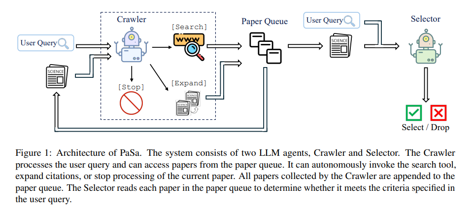

[(출처)](https://arxiv.org/pdf/2501.10120) : Yichen He and Guanhua Huang et al., "PaSa: An LLM Agent for Comprehensive Academic Paper Search"

PaSa 시스템은 다음과 같이 **2개의 LLM Agent** 로 구성된다.

| LLM Agent | 요약                                                                                                                                                    | 설명                                                                                                                        |
|-----------|-------------------------------------------------------------------------------------------------------------------------------------------------------|---------------------------------------------------------------------------------------------------------------------------|
| Crawler   | 관련된 논문의 [recall](../../AI%20Basics/Data%20Science%20Basics/데이터_사이언스_기초_Metrics.md#1-2-accuracy-recall-precision) (발견되는 양) 을 최대화                       | - 사용자의 쿼리를 읽고 여러 개의 검색 쿼리 생성<br>- 관련 논문 탐색<br>- 이때, 각 논문을 **paper queue** 를 통해 처리하며, **관련된 새로운 논문을 queue 에 추가** 하는 식으로 진행 |
| Selector  | 사용자의 요구 사항에 맞는 논문만 필터링하여 [precision](../../AI%20Basics/Data%20Science%20Basics/데이터_사이언스_기초_Metrics.md#1-2-accuracy-recall-precision) (요구 사항 충족 비율) 증가 | - paper queue 에 있는 각 논문을 철저히 리뷰<br>- 이를 통해 **사용자의 쿼리에 나타난 요구 사항을 충족시키는지** 평가                                              |

## 3. 데이터셋

* 본 연구에서 구축한 데이터셋은 다음과 같다.

| 데이터셋             | 설명                                                                                                                                                   | 수집한 쿼리                                              | 포함 저널/컨퍼런스/학회 등                                                           |
|------------------|------------------------------------------------------------------------------------------------------------------------------------------------------|-----------------------------------------------------|---------------------------------------------------------------------------|
| AutoScholarQuery | 학술적 query 및 관련 논문에 대한, **Synthetic High-Quality 데이터셋**<br>- 학습 데이터 : **33,551 개**<br>- 검증 (development) 데이터 : **1,000 개**<br>- 테스트 데이터 : **1,000 개** | 각 논문의 ```Related Work``` 부분에 대해 GPT-4o 를 이용하여 쿼리 생성 | - ICLR 2023<br>- ICML 2023<br>- NeurIPS 2023<br>- ACL 2024<br>- CVPR 2024 |
| RealScholarQuery | 50개의 **실제 현실에서의 연구** 관련 쿼리 데이터셋<br>- AI 연구자들이 제공한 query 중 **랜덤 샘플링 → 수동 필터링** 적용                                                                     | 50개의 현실적인 Fine-grained 쿼리                           |                                                                           |

### 3-1. AutoScholarQuery

**AutoScholarQuery** 는 **학술적 query 및 관련 논문에 대한 데이터셋** 으로, 그 특징은 다음과 같다.

* Synthetic 데이터셋이지만, 품질은 높음
* AI 분야에 특화된 데이터셋

| 학습 데이터   | 검증 (development) 데이터 | 테스트 데이터 |
|----------|----------------------|---------|
| 33,551 개 | 1,000 개              | 1,000 개 |

**1. AutoScholarQuery 의 쿼리 및 관련 논문**

* 쿼리 및 해당 쿼리와 관련된 논문의 예시

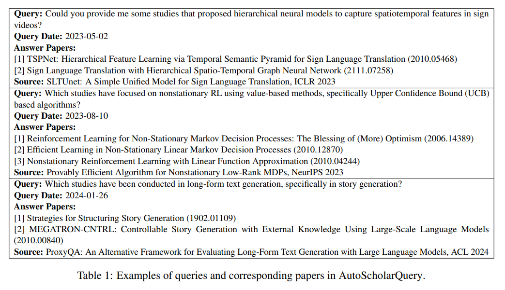

[(출처)](https://arxiv.org/pdf/2501.10120) : Yichen He and Guanhua Huang et al., "PaSa: An LLM Agent for Comprehensive Academic Paper Search"

**2. AutoScholarQuery 의 각 저널/컨퍼런스/학회 별 논문 분포**

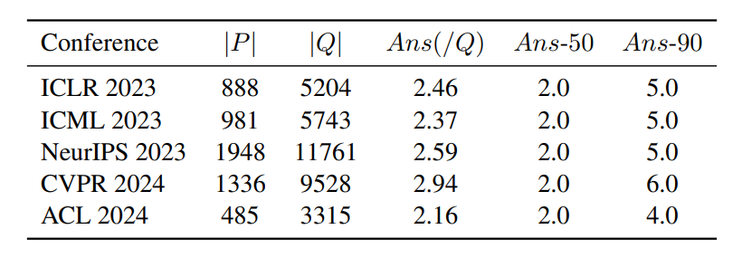

[(출처)](https://arxiv.org/pdf/2501.10120) : Yichen He and Guanhua Huang et al., "PaSa: An LLM Agent for Comprehensive Academic Paper Search"

| notation        | 설명                                             |
|-----------------|------------------------------------------------|
| $\vert P \vert$ | 전체 논문 개수                                       |
| $\vert Q \vert$ | 전체 쿼리 개수                                       |
| $Ans(/Q)$       | 쿼리 당 평균 answer paper 의 개수                      |
| $Ans-50$        | 쿼리 당 answer paper 개수의 중간값 (상위 50%)             |
| $Ans-90$        | 쿼리 당 answer paper 개수의 90-percentile 값 (상위 10%) |

### 3-2. RealScholarQuery

**RealScholarQuery** 는 **보다 현실적인 시나리오에서 PaSa 를 테스트** 하기 위한 데이터셋으로, 그 특징은 다음과 같다.

* 50개의 real-world research query 로 구성
* AI 연구자들에게 PaSa의 데모 버전을 사용하게 한 다음, 그들이 제공한 쿼리를 **랜덤 샘플링한 후 수작업 필터링** 실시하여 최종 쿼리 도출
  * 최종 쿼리 예시
    * ```multimodal large language models```
    * ```video generation```

**1. RealScholarQuery 의 쿼리 및 관련 논문**

* 쿼리 및 해당 쿼리와 관련된 논문의 예시

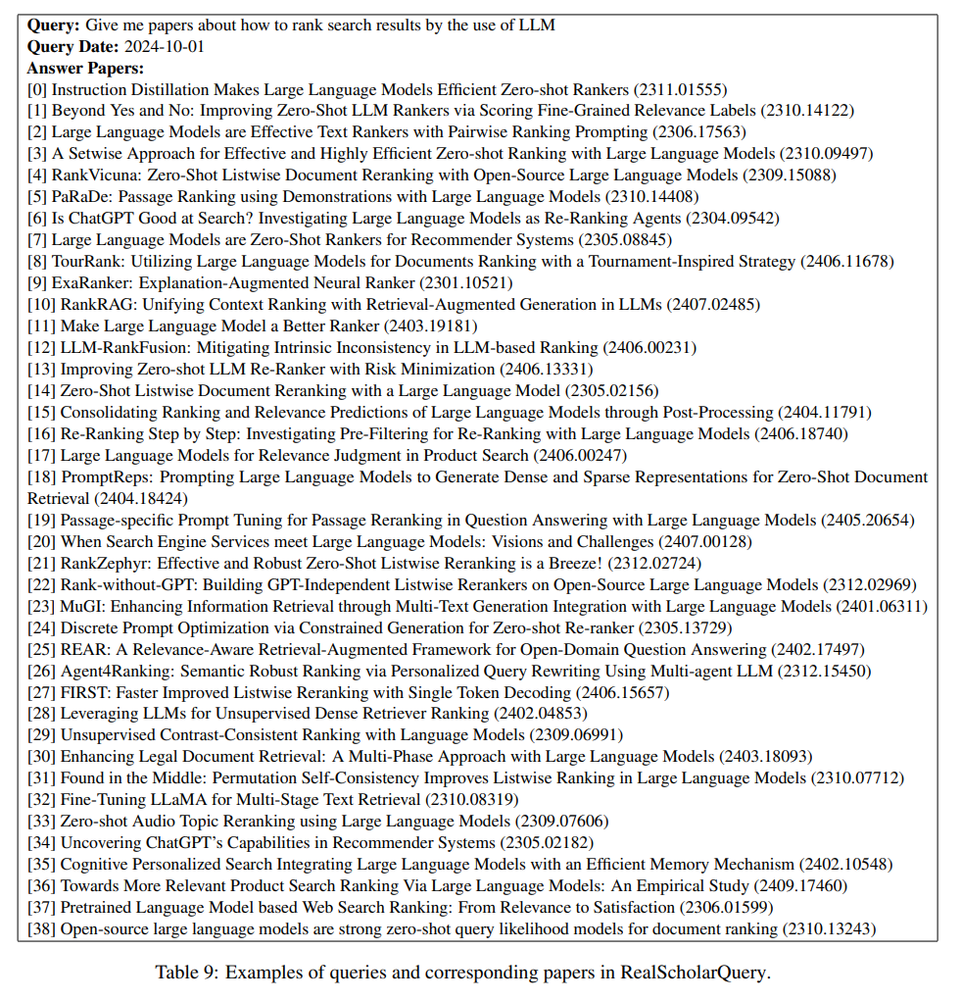

[(출처)](https://arxiv.org/pdf/2501.10120) : Yichen He and Guanhua Huang et al., "PaSa: An LLM Agent for Comprehensive Academic Paper Search"

**2. 각 쿼리에 대한 related paper 추출 방법**

* 각 쿼리에 대해서 수작업으로 관련 논문 수집
  * 이때 종합적인 converage 를 위해 **ChatGPT 등 LLM을 포함한 여러 가지 방법** 사용
* 이들을 aggregate 한 후, 최종적으로 **전문가 리뷰** 를 통해 **관련 있는 논문만 필터링**

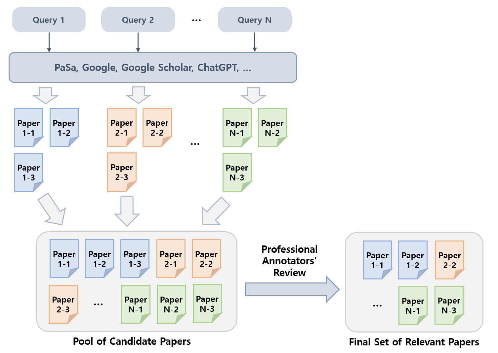

## 4. PaSa Agent 의 워크플로우

**PaSa Agent 의 전체 Workflow (예시)** 는 다음과 같다.

* PaSa Agent workflow 의 구성 요소인 **Crawler** 와 **Selector** 에 대해서는 [해당 부분](#2-pasa-agent-의-구조) 참고.

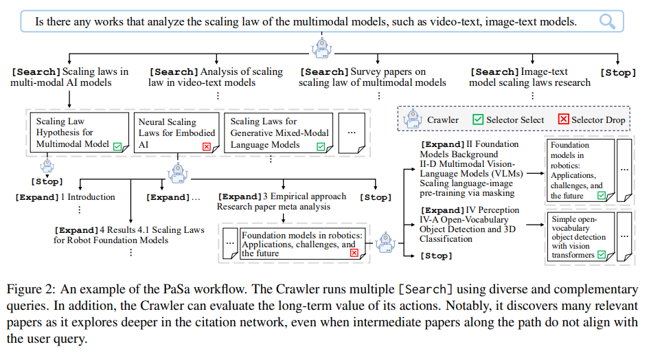

[(출처)](https://arxiv.org/pdf/2501.10120) : Yichen He and Guanhua Huang et al., "PaSa: An LLM Agent for Comprehensive Academic Paper Search"

### 4-1. Crawler 개요

PaSa Agent 의 구성 요소 중 **Crawler** 는 다음과 같은 역할을 한다.

* 사용자의 쿼리에 따라 **검색 쿼리 생성 및 논문 탐색**
* 관련된 논문을 **paper queue** 에 추가하는 식으로, paper queue를 이용하여 관리
* 즉, **관련된 논문의 Recall (요구 사항을 충족시키는 모든 논문 중 발견되는 비율) 을 최대화**

Crawler 의 기본 동작 원리는 **token-level Markov Decision Process (MDP)** 기반 **강화학습** 이다.

| 구분            | 설명                                     |
|---------------|----------------------------------------|
| Action Space  | LLM이 생성할 수 있는 token의 집합 (= vocabulary) |
| Policy Model  | LLM                                    |
| Agent 의 State | 현재의 LLM context + paper queue          |

**Crawler 의 3가지 Function**

| Function       | 설명                                                                | paper queue 동작                             |
|----------------|-------------------------------------------------------------------|--------------------------------------------|
| ```[Search]``` | search query 생성 및 search tool 호출                                  | 검색 결과로 나오는 **모든 논문** 을 paper queue 에 추가    |
| ```[Expand]``` | - subsection 이름 생성<br>- 해당 subsection 에 reference 로 언급되는 모든 논문 수집 | **해당 모든 reference 논문** 들을 paper queue 에 추가 |
| ```[Stop]```   | Context 초기화                                                       | **다음 논문** 을 paper queue 에 추가               |

### 4-2. Crawler 의 강화학습

본 연구에서는 **Crawler 를 AutoScholarQuery 데이터셋으로 강화학습** 시켰다.

**1. 기본 동작 방식**

* 각 instance 는 query $q$ 및 이에 대응되는 논문 집합 $P$ 로 구성
* $q$ 에서 시작하여, $\tau = (s_1, a_1, ..., s_T, a_T)$ 를 생성
* action $a_t$ 수행 전까지, Crawler는 $(p_1, p_2, ..., p_{n_t})$ 의 새로운 논문들을 paper queue 에 추가
  * 단, $a_t$ = ```[Stop]``` 이면 논문이 더 이상 추가되지 않음

**2. 강화학습 Loss Function**

| 구분                   | 컨셉                                                                               | 수식                              |
|----------------------|----------------------------------------------------------------------------------|---------------------------------|
| 전체 Loss Function     | Policy Loss Term 과 Value Loss Term 의 가중치 합                                       | 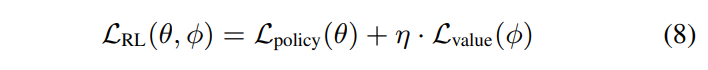  |
| **Policy** Loss Term | [PPO (Proximal Policy Optimization)](https://huggingface.co/blog/deep-rl-ppo) 컨셉 | 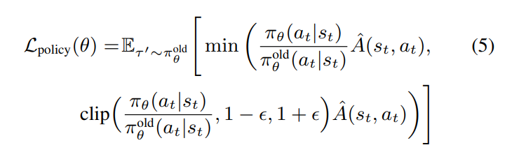  |
| **Value** Loss Term  | Return $\hat{R}_t$ 과 Value Function 값의 차이 (= advantage) 의 제곱                     | 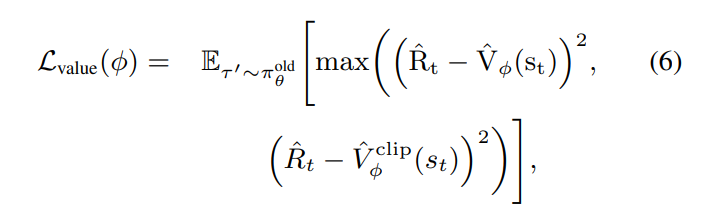  |
| Return $\hat{R}_t$   | Monte Carlo Sampling 을 통해 계산                                                     | 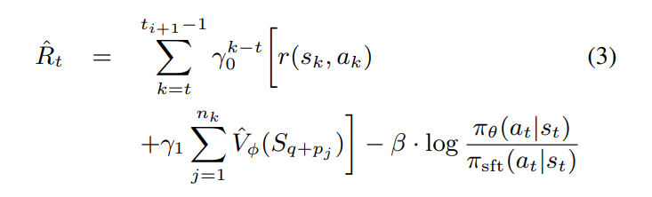 |

[(수식 출처)](https://arxiv.org/pdf/2501.10120) : Yichen He and Guanhua Huang et al., "PaSa: An LLM Agent for Comprehensive Academic Paper Search"

| notation                    | 설명                                                                          |
|-----------------------------|-----------------------------------------------------------------------------|
| $\eta$                      | Policy / Value Loss Term 가중치 조절을 위한 상수                                      |
| $\pi_\theta(a_t \vert s_t)$ | Crawler (as Policy)                                                         |
| $\pi_{sft}(a_t \vert s_t)$  | initial policy                                                              |
| $\hat{A}(s_t, a_t)$         | advantage function, $\hat{A}(s_t, a_t) = \hat{R}t - \hat{V}_\phi (s_t)$    |
| $\hat{V}_\phi(s_t)$         | value function                                                              |
| $\epsilon$                  | 새로운 정책의 이전 정책 대비 발전 정도를 나타내는 작은 값 (하이퍼파라미터)                                 |
| $\gamma_0$                  | **in-session** discount factor                                              |
| $\gamma_1$                  | **across-session** discount factor                                          |
| $\beta$                     | over-optimization 을 줄이기 위해 추가한 **per-token KL penalty term 의 크기 조정** 목적의 상수 |

**3. Reward Function**

* state $s_t$ 에서 action $a_t$ 를 실행했을 때의 reward 는 다음과 같다.

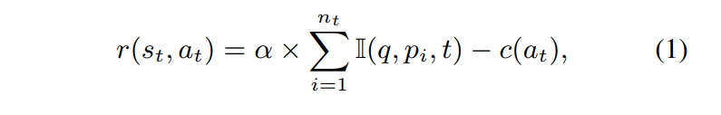

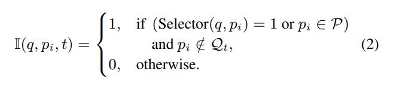

[(출처)](https://arxiv.org/pdf/2501.10120) : Yichen He and Guanhua Huang et al., "PaSa: An LLM Agent for Comprehensive Academic Paper Search"

* 여기서 $I(q, p_i, t)$ 는 **indicator function** 으로, **$p_i$ 가 $P - Q_t$ 에 속하는지 검사** 하는 역할을 한다.
  * 즉, **기존 논문 집합 ($P$) 에는 있지만 paper queue ($Q$) 에는 없는** 논문일 때 보상이 있으므로, **AutoScholarQuery 는 ground-truth paper 의 부분집합에 속한 논문을 포함해야 함** 을 의미한다. (중요)
  * 이는 **논문 인용 부분은 핵심적인 인용에 해당하는 제한된 개수의 논문만을 언급** 하기 때문이다.

### 4-3. Selector

## 5. 실험 및 그 결과

### 5-1. 실험 설정

### 5-2. 평가 벤치마크 데이터셋

### 5-3. 실험 결과 (기본)

### 5-4. 실험 결과 (Ablation Study)
