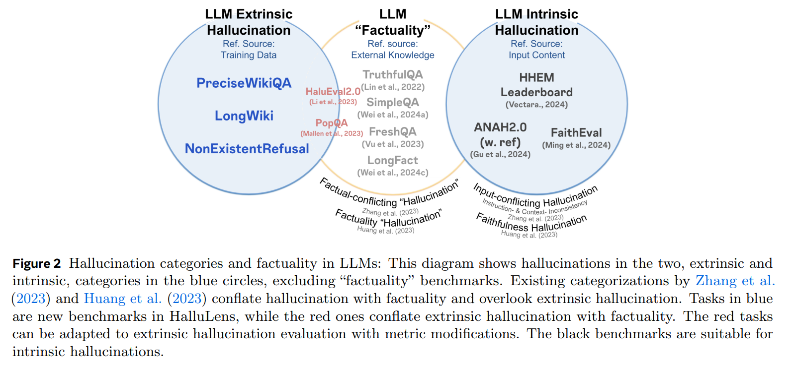

## 목차

* [1. LLM 환각 현상 개요](#1-llm-환각-현상-개요)
  * [1-1. LLM 환각 현상과 Factuality (사실) 의 구분](#1-1-llm-환각-현상과-factuality-사실-의-구분) 
  * [1-2. 환각 현상의 종류](#1-2-환각-현상의-종류)
  * [1-3. 환각 현상의 가능한 원인](#1-3-환각-현상의-가능한-원인)
* [2. 환각 현상 평가 Benchmark](#2-환각-현상-평가-benchmark)
* [3. HalluLens 개요](#3-hallulens-개요)
* [4. HalluLens 를 이용한 Extrinsic Hallucination 평가](#4-hallulens-를-이용한-extrinsic-hallucination-평가)
  * [4-1. PreciseWikiQA](#4-1-precisewikiqa)
  * [4-2. LongWiki](#4-2-longwiki)
  * [4-3. NonExistentRefusal](#4-3-nonexistentrefusal)
* [5. HalluLens 를 이용한 Intrinsic Hallucination 평가](#5-hallulens-를-이용한-intrinsic-hallucination-평가)
  * [5-1. HHEM leaderboard](#5-1-hhem-leaderboard)
  * [5-2. ANAH 2.0 (with reference)](#5-2-anah-20-with-reference)
  * [5-3. FaithEval](#5-3-faitheval)
* [6. 기존 평가 벤치마크와의 비교](#6-기존-평가-벤치마크와의-비교)

## 논문 소개

* Yejin Bang and Ziwei Ji et al., "HalluLens: LLM Hallucination Benchmark", 2025
* [arXiv Link](https://arxiv.org/pdf/2504.17550)

## 참고

* [LLM의 환각 현상 (Hallucination)](../../AI%20Basics/LLM%20Basics/LLM_기초_환각_현상.md)
* [OpenAI가 말하는 환각 현상의 원인 (2025.09. 논문)](%5B2025.09.09%5D%20Why%20Language%20Models%20Hallucinate.md)

## 1. LLM 환각 현상 개요

LLM의 **환각 현상 (Hallucination)** 은 LLM이 다음에 해당하는 답변을 생성하는 것을 의미한다.

* 사용자 입력 또는 LLM의 이전 답변과 논리적 모순 발생
* 현실의 실제 지식과 불일치

환각 현상은 다음과 같은 문제점의 원인이다.

* LLM의 성능 및 신뢰성 감소
* 경우에 따라 **LLM을 윤리적으로 신뢰하기 어렵게 할 수 있음**

### 1-1. LLM 환각 현상과 Factuality (사실) 의 구분

LLM이 생성하는 **사실적 정보 (Factuality)** 와 **환각 현상** 은 생성된 콘텐츠의 신뢰성과 관련된 내용이지만, 다음과 같은 점에서 구분된다.

| 항목               | 사실적 정보 (Factuality)              | 환각 현상 (Hallucination)                                      |
|------------------|----------------------------------|------------------------------------------------------------|
| 기본 관점            | LLM이 생성한 내용의 **절대적인 정확도**        | 모델이 생성한 내용의 **일관성 (consistency)**                          |
| reference source | 이미 구축된 검증용 출처                    | 모델이 접근 가능한 지식                                              |
| 기본 설명            | 이미 존재하는, 기존 세계에 대한 지식에 기반한 내용 생성 | **사용자 입력 및 학습 데이터** 를 기준으로 한 **일관성 (consistency)** 이 부족한 것 |

### 1-2. 환각 현상의 종류

[(출처)](https://arxiv.org/pdf/2504.17550) : Yejin Bang and Ziwei Ji et al., "HalluLens: LLM Hallucination Benchmark"

LLM 환각 현상의 종류는 다음과 같다.

|           | Extrinsic Hallucination (외재적 환각)                                                   | Intrinsic Hallucination (내재적 환각)            |
|-----------|---------------------------------------------------------------------------------------|------------------------------------------------|
| 정의        | LLM이 생성한 결과물이 **학습 데이터** 와의 일관성이 떨어지는 경우                                              | LLM이 생성한 결과물이 **사용자 입력 내용** 과 일관성이 떨어지는 경우     |
| 일관성 부족 대상 | 학습 데이터                                                                                | 사용자 입력 내용                                      |
| 모델의 한계    | 학습 데이터로부터 **지식을 습득하는 능력**                                                             | **inference-time 에서의 일관성 유지** 능력               |
| 추가 설명     | 모델이 **새로운 콘텐츠 (지시에 의한 free-form text 등)** 를 생성하거나, **knowledge gap 을 채우려고** 할 때 발생 가능 | 입력 내용과 모순되거나, 원래 입력 내용으로부터 **추론할 수 없는** 내용을 생성 |

### 1-3. 환각 현상의 가능한 원인

## 2. 환각 현상 평가 Benchmark

## 3. HalluLens 개요

## 4. HalluLens 를 이용한 Extrinsic Hallucination 평가

### 4-1. PreciseWikiQA

### 4-2. LongWiki

### 4-3. NonExistentRefusal

## 5. HalluLens 를 이용한 Intrinsic Hallucination 평가

### 5-1. HHEM leaderboard

### 5-2. ANAH 2.0 (with reference)

### 5-3. FaithEval

## 6. 기존 평가 벤치마크와의 비교
