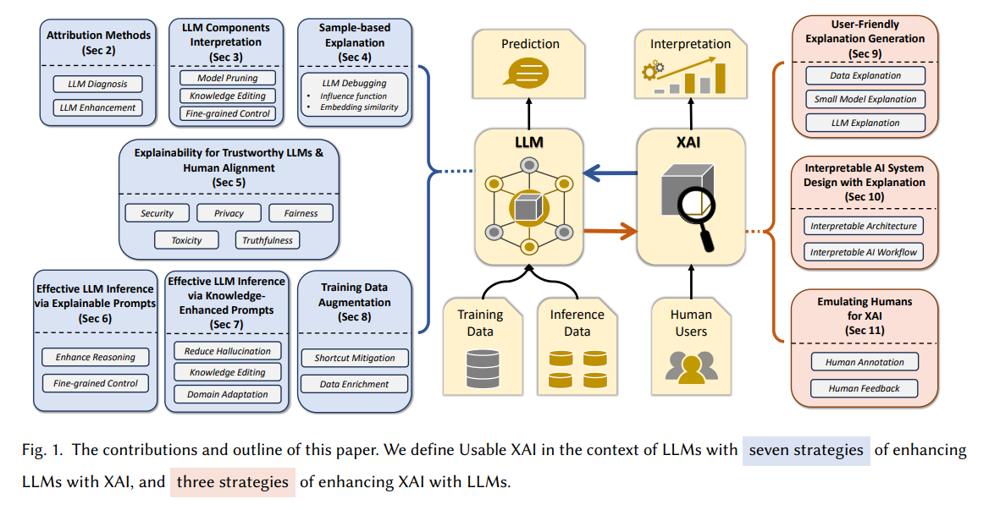
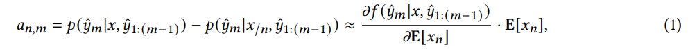
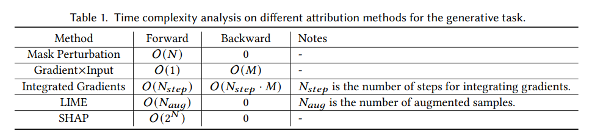
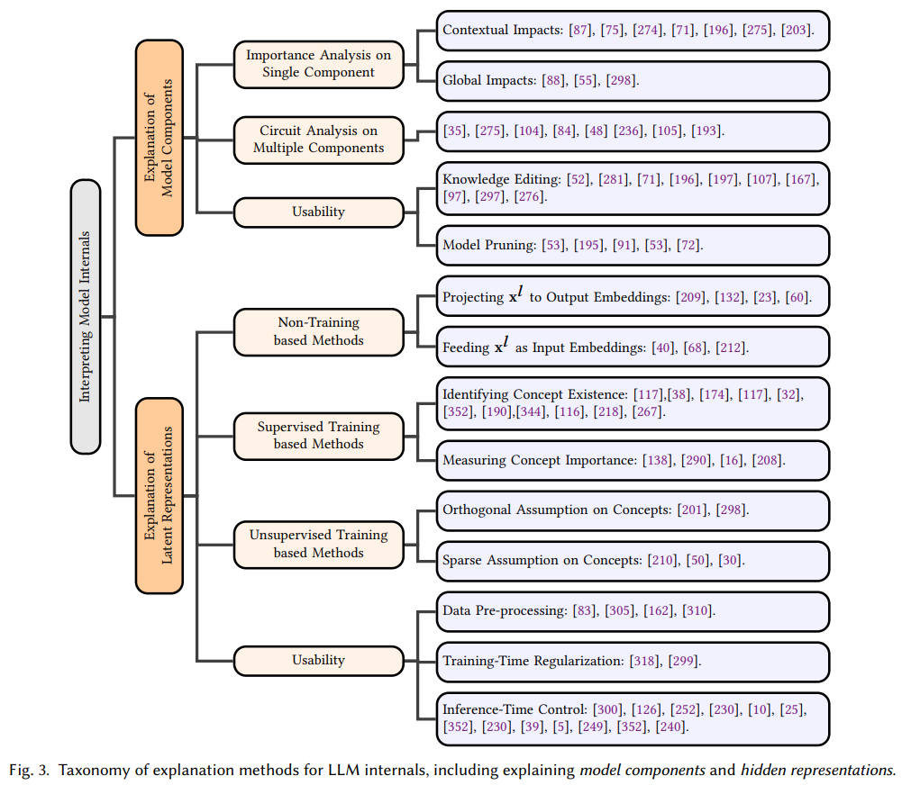

## 목차

* [1. 논문 개요](#1-논문-개요)
* [2. XAI를 이용하여 LLM 향상](#2-xai를-이용하여-llm-향상)
  * [2-1. Attribution Methods](#2-1-attribution-methods)
  * [2-2. LLM Component 해석](#2-2-llm-component-해석)
  * [2-3. Sample-based Explanation](#2-3-sample-based-explanation)
  * [2-4. 신뢰할 수 있는 LLM을 위한 설명 가능성 & Human Alignment](#2-4-신뢰할-수-있는-llm을-위한-설명-가능성--human-alignment)
  * [2-5. Explainable Prompt 를 이용한 LLM Inference](#2-5-explainable-prompt-를-이용한-llm-inference)
  * [2-6. Knowledge-enhanced Prompt 를 이용한 LLM Inference](#2-6-knowledge-enhanced-prompt-를-이용한-llm-inference)
  * [2-7. Data Augmentation 학습](#2-7-data-augmentation-학습)
* [3. LLM을 이용하여 XAI 향상](#3-llm을-이용하여-xai-향상)
  * [3-1. 사용자 친화적 설명 생성](#3-1-사용자-친화적-설명-생성)
  * [3-2. 설명을 이용한, 해석 가능한 AI 시스템 설계](#3-2-설명을-이용한-해석-가능한-ai-시스템-설계)
  * [3-3. Emulating Humans for XAI](#3-3-emulating-humans-for-xai)
* [4. 결론](#4-결론)

## 논문 소개

* Xuansheng Wu and Haiwan Zhao et al., "Usable XAI: 10 Strategies Towards Exploiting Explainability in the LLM Era", 2024
* [arXiv Link](https://arxiv.org/pdf/2403.08946)

## 1. 논문 개요

이 논문의 핵심 주제는 다음과 같다.

* LLM의 관점에서 **Usable XAI (eXplainable AI, 설명 가능한 AI)** 를 정의
* 다음을 위한 총 10가지 전략 소개 및 분석
  * **XAI를 이용** 하여 **LLM** 기반 AI 시스템을 설명하는 방법들 **(총 7가지)**
  * **LLM을 이용** 하여 **XAI** 기술을 개선하는 방법들 **(총 3가지)**

[(출처)](https://arxiv.org/pdf/2403.08946) : Xuansheng Wu and Haiwan Zhao et al., "Usable XAI: 10 Strategies Towards Exploiting Explainability in the LLM Era"

## 2. XAI를 이용하여 LLM 향상

### 2-1. Attribution Methods

**Attribution Method** 는 **각 입력 feature 의 중요도 (= 모델의 예측에 기여한 정도) 를 측정** 하는 XAI 방법론이다.

* 생성형 AI (LLM 등) 의 경우에는 다음과 같은 원리이다.
  * **입력 $x$ 에 대한 전체적인 confidence $p(\hat{y} | x)$ 를 계산** 한다. ($x$ : input, $\hat{y}$ : 생성된 LLM 응답) 
  * input token $a_{n,m}$ 에 대한 중요도는 다음과 같이 **해당 토큰을 제외했을 때의 생성 확률과의 차이** 로 계산한다.

[(출처)](https://arxiv.org/pdf/2403.08946) : Xuansheng Wu and Haiwan Zhao et al., "Usable XAI: 10 Strategies Towards Exploiting Explainability in the LLM Era"

| notation    | 설명                                                        |
|-------------|-----------------------------------------------------------|
| $a_{n,m}$   | 입력 토큰 $x_n$ 의 출력 토큰 $\hat{y}_m$ 에 대한 **중요도 (importance)** |
| $x_{/n}$    | 입력 $x$ 에서 $n$번째 token을 제외한 것                              |
| $\hat{y}_m$ | 각각의 output word                                           |
| $E[x_n]$    | token $x_n$ 에 대한 **Embedding**                            |

* 각 Attribution Method 별 생성 task에서의 시간 복잡도

[(출처)](https://arxiv.org/pdf/2403.08946) : Xuansheng Wu and Haiwan Zhao et al., "Usable XAI: 10 Strategies Towards Exploiting Explainability in the LLM Era"

### 2-2. LLM Component 해석

**LLM 의 Component 를 해석 (LLM Components Interpretation)** 하는 것은 **LLM의 각 Component를 해석** 하기 위한 XAI 방법론을 말한다.

* 즉, LLM의 **internal (내부 구조) 에 대한 설명 방법** 이라고 할 수 있다.
* 구체적인 방법들은 다음과 같다.

[(출처)](https://arxiv.org/pdf/2403.08946) : Xuansheng Wu and Haiwan Zhao et al., "Usable XAI: 10 Strategies Towards Exploiting Explainability in the LLM Era"

**1. LLM Component 해석 방법 기본 분류**

| 해석 방법 분류                 | 설명                                                                                                                                   |
|--------------------------|--------------------------------------------------------------------------------------------------------------------------------------|
| Model Component 해석       | LLM의 Self-Attention (ATT), Feed-forward Network (FFN) 과 같은 **개별 Component 를 분석** 하기 위한 방법                                            |
| Latent Representation 해석 | LLM의 행동을 해석하기 위해 **LLM의 Latent (Hidden) Representation** 을 해석하려고 함 - Latent Representation 안에 있는 **각 값을 해석하는 방법으로는 확실히 해석하기 어려움** |

**2. Model Component 해석 방법 상세**

| 해석 방법                        | 설명                                                                                |
|------------------------------|-----------------------------------------------------------------------------------|
| 각 단일 Component 에 대한 중요도 분석   | LLM의 **각 layer 의 contextual impact** 를 측정 - 각 Component 간 선형 관계 분석을 위한 수식에서 착안 |
| 여러 Component 에 대한 Circuit 분석 | 복잡한 생성 문제 해결을 위한 LLM의 **서로 다른 레이어 간 협업 방식** 탐구                                    |
| 사용성 분석                       | **Knowledge Editing & Model Pruning** 에 직접 적용 가능                                  |

**3. Latent Representation 해석 방법 상세**

| 해석 방법                                   | 설명                                                                                                                                                                                      |
|-----------------------------------------|-----------------------------------------------------------------------------------------------------------------------------------------------------------------------------------------|
| **Non-training** 기반 방법                  | 다음과 같은 방법 존재 - latent representation $x^l$ 을 **Output Embedding 으로 mapping** - $x^l$ 을 **Input Embedding** 으로 취급하여 처리                                                             |
| **지도학습 (Supervised Training)** 기반 방법    | 다음에 초점을 두어 연구 - LLM의 latent space 가 특정 concept 을 인코딩하는지 - 해당 concept 이 **LLM의 예측에 기여하고, 얼마나 중요한지**                                                                                |
| **비지도학습 (Unsupervised Training)** 기반 방법 | 학습된 concept 를 벡터 $C$ 로 나타낼 때, - **Orthogonal** Assumption ($CC^T = I$, 즉 Singular Vector Decomposition에 중점) - **Sparse** Assumption (Top-k ($X · C^T$), 즉 Sparse Auto-Encoder 컨셉) |
| 사용성 분석                                  | 모델 개발 프로세스의 3단계, 즉 **Data Pre-processing & Training $ Inference** 에 초점                                                                                                                  |

### 2-3. Sample-based Explanation

### 2-4. 신뢰할 수 있는 LLM을 위한 설명 가능성 & Human Alignment

### 2-5. Explainable Prompt 를 이용한 LLM Inference

### 2-6. Knowledge-enhanced Prompt 를 이용한 LLM Inference

### 2-7. Data Augmentation 학습

## 3. LLM을 이용하여 XAI 향상

### 3-1. 사용자 친화적 설명 생성

### 3-2. 설명을 이용한, 해석 가능한 AI 시스템 설계

### 3-3. Emulating Humans for XAI

## 4. 결론
