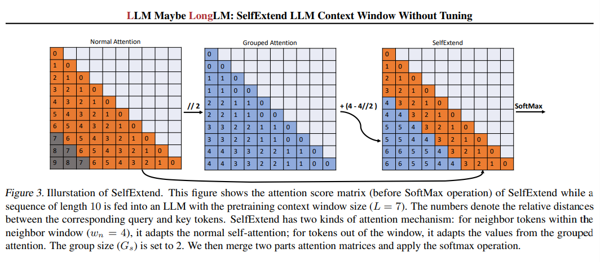
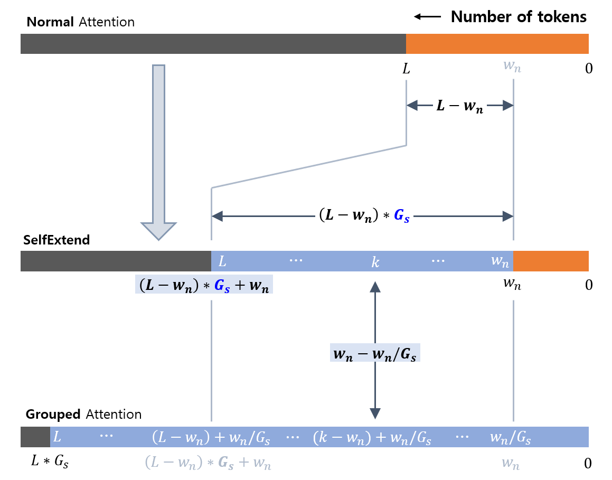
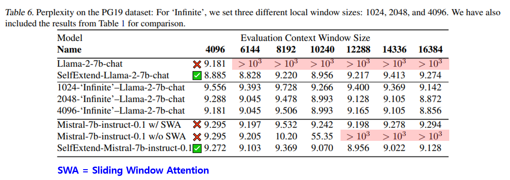
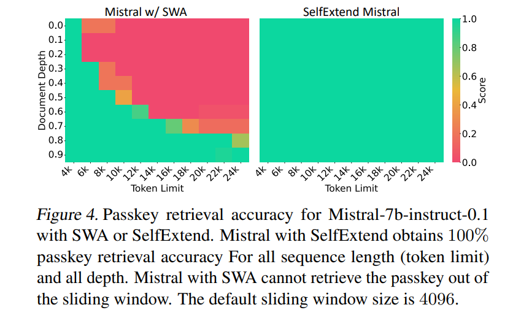
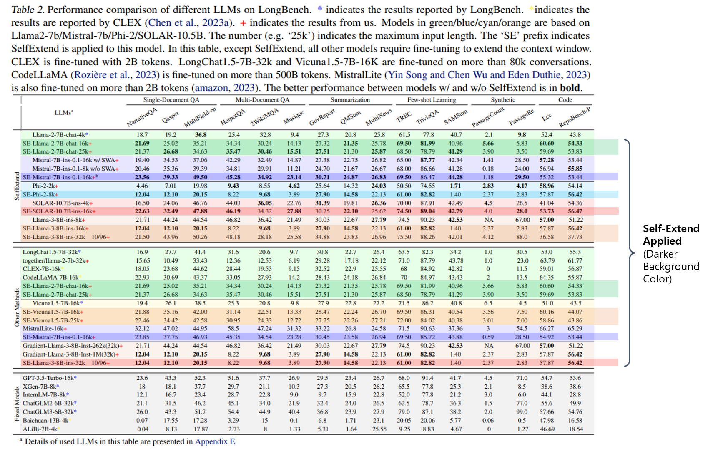
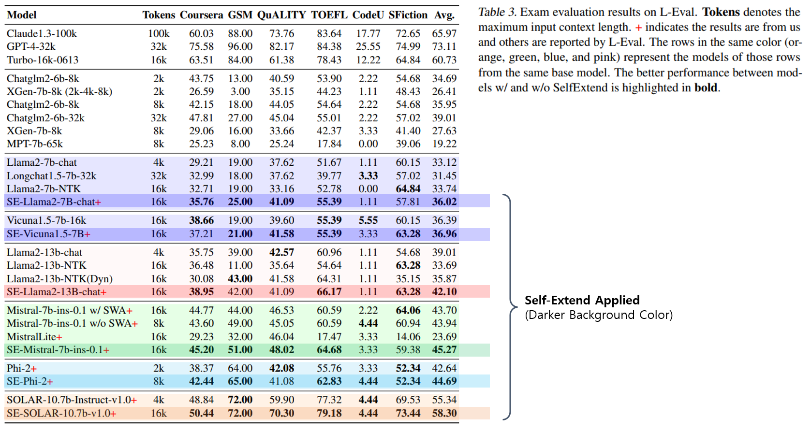
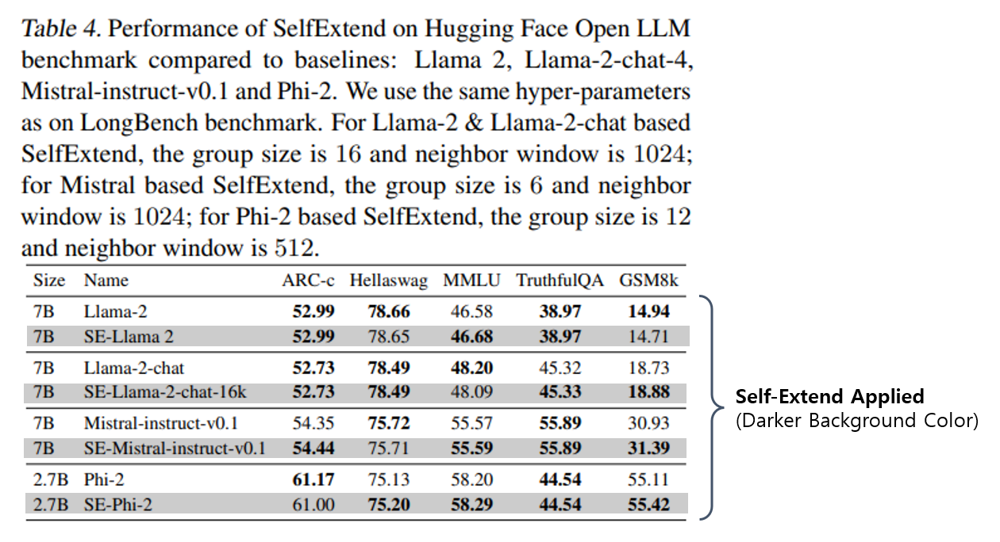
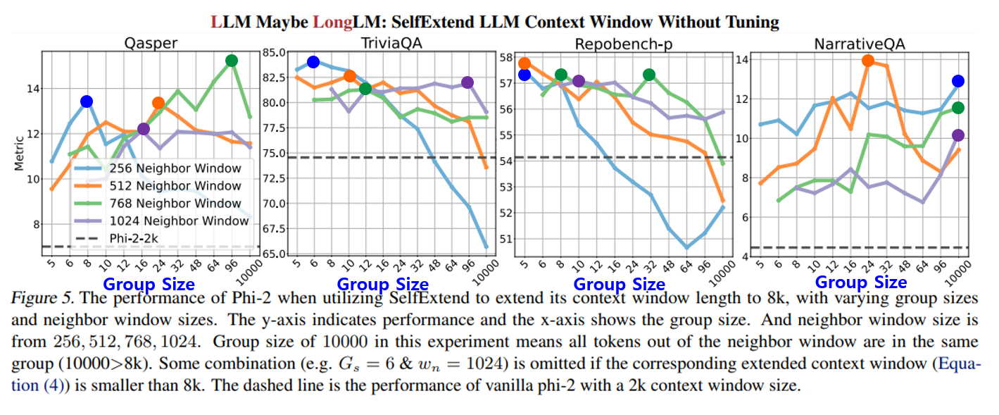
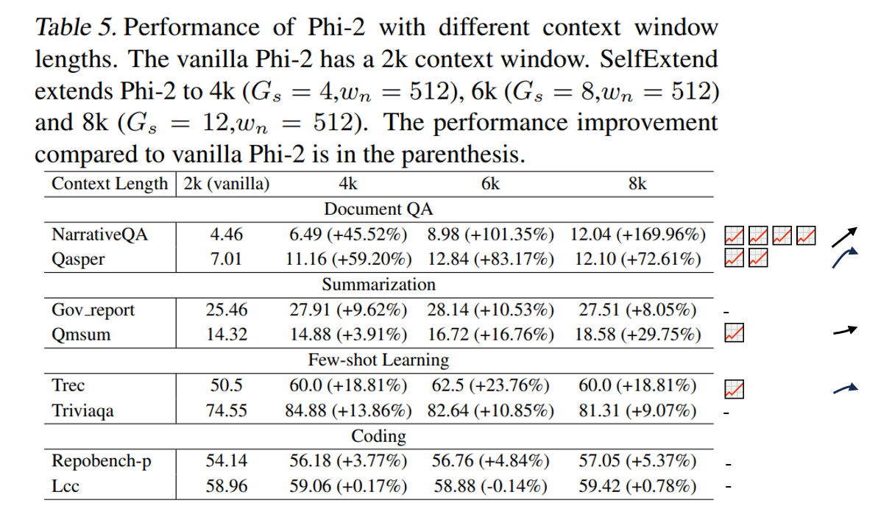

## 목차

* [1. Position Encoding, RoPE 및 OOD](#1-position-encoding-rope-및-ood)
* [2. SelfExtend 의 핵심 아이디어](#2-selfextend-의-핵심-아이디어)
* [3. SelfExtend 상세](#3-selfextend-상세)
  * [3-1. 예비 분석](#3-1-예비-분석)
  * [3-2. SelfExtend LLM Context Window (without Tuning)](#3-2-selfextend-llm-context-window-without-tuning)
* [4. 실험 결과](#4-실험-결과)
  * [4-1. 언어 모델링 task 성능](#4-1-언어-모델링-task-성능)
  * [4-2. Synthetic Long Context Task 성능](#4-2-synthetic-long-context-task-성능)
  * [4-3. 실세계의 Long Context Task 성능](#4-3-실세계의-long-context-task-성능)
  * [4-4. Short Context Task 성능](#4-4-short-context-task-성능)
  * [4-5. Ablation Study](#4-5-ablation-study)
  * [4-6. 다양한 Context Window 길이에서의 성능](#4-6-다양한-context-window-길이에서의-성능)
* [5. 논의 사항](#5-논의-사항)

## 논문 소개

* Hongye Jin and Xiaotian Han et al., "LLM Maybe LongLM: SelfExtend LLM Context Window Without Tuning", 2024
* [arXiv Link](https://arxiv.org/pdf/2401.01325)

## 1. Position Encoding, RoPE 및 OOD

논문을 본격적으로 읽기 전에 알아야 할 3가지 개념으로 **Position Encoding, RoPE, OOD** 가 있다. 각각 다음과 같다.

| 개념                               | 설명                                                                                                                                                                                                | 참고 링크                                                                                                                              |
|----------------------------------|---------------------------------------------------------------------------------------------------------------------------------------------------------------------------------------------------|------------------------------------------------------------------------------------------------------------------------------------|
| Position Encoding                | [Transformer](../../Natural%20Language%20Processing/Basics_트랜스포머%20모델.md) 에서 token 의 position 을 나타내기 위해 사용되는 Encoding<br>- **Absolute** Position Embedding 과 **Relative** Position Encoding 으로 구분 | [Positional Encoding](../../Natural%20Language%20Processing/Basics_트랜스포머%20모델.md#2-포지셔널-인코딩-positional-encoding)                   |
| RoPE (Rotary Position Embedding) | positional information 을 **query Q 및 key K vector와 결합** 하는 것                                                                                                                                      | [Rotary Embedding](%5B2025.03.12%5D%20LLaMA%20-%20Open%20and%20Efficient%20Foundation%20Language%20Models.md#2-3-rotary-embedding) |
| OOD (Out-of-Distribution)        | inference 시 입력되는 데이터를 **학습 과정에서 접하지 못한** 경우                                                                                                                                                       |                                                                                                                                    |

## 2. SelfExtend 의 핵심 아이디어

* 해결하려는 문제
  * RoPE 가 적용된 LLM은 아주 긴 텍스트를 처리할 수 있다.
  * 그러나, **OOD Position (학습 도중에는 나타나지 않은 token position)** 이 inference 시에 나타나는 경우 한계점이 있다. 

* SelfExtend 의 핵심 아이디어
  * **추가적인 [LLM Fine-Tuning](../../AI%20Basics/LLM%20Basics/LLM_기초_Fine_Tuning.md) 없이도 context window를 추가 확장** 할 수 있게 한다.
  * 이를 위해, **unseen (large) relative position 을 known position 으로 mapping** 시킨다.
    * 이를 통해 **LLM이 더 긴 context 에서도 일관성을 유지** 할 수 있게 한다.

## 3. SelfExtend 상세

| 내용 구성                                                                                               | 설명                                                         |
|-----------------------------------------------------------------------------------------------------|------------------------------------------------------------|
| [예비 분석](#3-1-예비-분석)                                                                                 | LLM 이 long context 를 처리하는 내부 메커니즘 (Grouped Attention 등) 분석 |
| [SelfExtend LLM Context Window (without Tuning)](#3-2-selfextend-llm-context-window-without-tuning) | SelfExtend 방법론 제안                                          |

### 3-1. 예비 분석

**1. LLM은 왜 pre-trained context window 보다 긴 문맥에서 inference가 실패하는가?**

* sequence length 가 pre-training context window 보다 긴 경우, **LLM의 출력은 예측 불가능** 하다.
  * 이는 이때 **Attention Distribution** 이 pre-training context window 에 있을 때와 **다르기** 때문이다.
* 즉, **신경망은 OOD input 에 robust 하지 않음** 을 의미한다.

**2. positional OOD problem 해결 방법**

* 한 가지 방법은 **unseen relative position** 을 **pre-training 에서 학습한 position 으로 바꾸는** 것이다.
* 이때 다음과 같이 ```FLOOR``` 연산 (= **Grouped Attention**) 을 사용할 수 있다.
  * 이 방법은 ```FLOOR``` 연산을 제외하면 원래 self-attention 과 같은 메커니즘이다.
  * ```P_g = P // G_s```

| notation  | 설명                                                                                         |
|-----------|--------------------------------------------------------------------------------------------|
| ```P_g``` | Grouped Attention 결과                                                                       |
| ```P```   | $P \in R^{B \times L}$, original position encoding<br>- B: batch size<br>- L: input length |
| ```G_s``` | grouped attention                                                                          |


[(출처)](https://arxiv.org/pdf/2401.01325) : Hongye Jin and Xiaotian Han et al., "LLM Maybe LongLM: SelfExtend LLM Context Window Without Tuning"

**3. LLM은 정확한 위치 정보 없이도 동작할 수 있는가?**

* 결론적으로 말하면 **일정 부분은 그렇다.**
* ```FLOOR``` 연산을 적용했을 때의 [Perplexity (PPL)](../../AI%20Basics/LLM%20Basics/LLM_기초_LLM의_성능_평가.md#3-4-기타-metric) 값을 비교한 결과는 다음과 같다.
  * **PG-19 데이터셋** 기준, 원본 Llama-2-7b-chat 모델의 Perplexity 는 **6k sequence length** 지점에서 폭증한다. 


[(출처)](https://arxiv.org/pdf/2401.01325) : Hongye Jin and Xiaotian Han et al., "LLM Maybe LongLM: SelfExtend LLM Context Window Without Tuning"

* 위 실험 결과로 다음을 알 수 있다.
  * **```FLOOR``` 연산을 적용한 LLM은 상대적으로 안정적인 Perplexity** 를 보인다.
  * 단, Grouped Attention 을 적용했을 때는 **Perplexity 가 원본 모델에 비해 약간 높다.**

**4. Grouped Attention 으로 저하된 LLM의 능력을 복구하는 방법**

* LLM의 Next token prediction 에서는 **target token 의 인접한 이웃 token** 이 가장 큰 역할을 한다.
* **target token 과 가까운 token 에 대해서는 원래의 표준 Attention 을 적용하는 것이 좋다** 는 여러 연구 결과가 있다.
* 따라서 해결 방법은 다음과 같다.
  * Grouped Attention을 적용하는 것은 생성된 문장의 전체적인 품질을 크게 향상시키지 않을 수 있다.
  * 따라서 **target token 부근에서는 표준 Attention** 을 적용해야 한다.

### 3-2. SelfExtend LLM Context Window (without Tuning)

**SelfExtend** 는 **LLM의 long context 에서의 생성 능력을 추가 Fine-Tuning 없이도 향상** 시키는 방법이다.

**1. SelfExtend 의 Attention 메커니즘**

| Attention 메커니즘         | 설명                                                                                | 적용 대상 토큰         |
|------------------------|-----------------------------------------------------------------------------------|------------------|
| **Grouped** Attention  | **token 간의 long-distance relationship** 을 처리해야 하는 position 에 대해 ```FLOOR``` 연산 적용 | **서로 멀리 떨어진** 토큰 |
| **Standard** Attention | 특정 범위 내의 인접한 토큰에 대해 표준 Attention 메커니즘 적용                                          | **서로 가까운** 토큰    |



[(출처)](https://arxiv.org/pdf/2401.01325) : Hongye Jin and Xiaotian Han et al., "LLM Maybe LongLM: SelfExtend LLM Context Window Without Tuning"

**2. SelfExtend 의 최대 context length**

* 가정

| pre-trained context window size | group size      | neighbor tokens window size |
|---------------------------------|-----------------|-----------------------------|
| $L$ ```L```                     | $G_s$ ```G_s``` | $w_n$ ```w_n```             |

* 계산 결과
  * Grouped Attention 에 대한 relative position shift : ```w_n - w_n // G_s```
  * SelfExtend 적용 시의 최대 Context Length : ```(L - w_n) * G_s + w_n```
* 예를 들어 위 그림과 같은 경우, 다음과 같다.

| 구분                                             | 값                                |
|------------------------------------------------|----------------------------------|
| pre-trained context window size ```L```        | 7                                |
| group size ```G_s```                           | 2                                |
| neighbor tokens window size ```w_n```          | 4                                |
| relative position shift (by Grouped Attention) | **2** (= ```4 - 4 // 2```)       |
| SelfExtend 적용 시 최대 Context Length              | **10** (= ```(7 - 4) * 2 + 4```) |



## 4. 실험 결과

* 실험 결과 요약

| 실험                                                                       | 실험 결과                                                                                                 |
|--------------------------------------------------------------------------|-------------------------------------------------------------------------------------------------------|
| [1. 언어 모델링 task 성능](#4-1-언어-모델링-task-성능)                                 | SelfExtend 가 없으면 **Perplexity (PPL)** 가 폭증하는 경우가 있음                                                   |
| [2. Synthetic Long Context Task 성능](#4-2-synthetic-long-context-task-성능) | SelfExtend 적용 시, **long context 에서도 처리 성능 완벽**                                                        |
| [3. 실세계의 Long Context Task 성능](#4-3-실세계의-long-context-task-성능)           | SelfExtend 로 Context Length 확장 결과, **원본 모델보다 좋은, Fine-Tuning 된 모델과 비슷하거나 좋은** 성능을 보임                  |
| [4. Short Context Task 성능](#4-4-short-context-task-성능)                   | Context Length 확장 시에도 **Short Context 처리 성능 유지**                                                      |
| [5. Ablation Study](#4-5-ablation-study)                                 | - Group Size $G_s$ 는 **최적의 값 존재**<br>- neighbor window size $w_n$ 은 **너무 커지면 전체 sequence 에 대한 성능 감소** |
| [6. 다양한 Context Window 길이에서의 성능](#4-6-다양한-context-window-길이에서의-성능)       | Context Window 길이가 커질수록 **점진적 성능 향상 또는 성능 유지 (정체)**<br>- 성능 추이는 다양한 패턴을 보임                            |

* 실험 전제
  * **높은 Perplexity (PPL)** 는 LLM의 성능에 **심각한 문제가 있음** 을 나타낸다.

* 실험 설정

| 구분                    | 설정값                        |
|-----------------------|----------------------------|
| 테스트 데이터셋              | PG-19 (100 books)          |
| sliding window size   | $S = 256$                  |
| LLM                   | Llama-2-7b-chat, Mistral 등 |
| context window length | 4096 (=4k) - 16384 (=16k)  |
| group size            | $G_s = 8$                  |
| neighbor window size  | $w_n = 1024 (=1k)$         |

### 4-1. 언어 모델링 task 성능

* SelfExtend 적용 결과, **pre-trained context window 밖** 에서도 **Llama-2-7b-chat, Mistral** 의 2개 모델에서 모두 낮은 Perplexity를 보인다.
* 반면 SelfExtend 미 적용 시에는 이 경우에서 **Perplexity 가 폭증** 한다.



[(출처)](https://arxiv.org/pdf/2401.01325) : Hongye Jin and Xiaotian Han et al., "LLM Maybe LongLM: SelfExtend LLM Context Window Without Tuning"

### 4-2. Synthetic Long Context Task 성능

* **Mistral** 모델 대상 실험 결과,
  * **SWA (Sliding Window Attention)** 적용 시에는 long context 를 잘 처리하지 못하는 경우가 있다.
  * 그러나, **SelfExtend 적용 시에는 long context 에서도 완벽한 처리** 를 보인다.



[(출처)](https://arxiv.org/pdf/2401.01325) : Hongye Jin and Xiaotian Han et al., "LLM Maybe LongLM: SelfExtend LLM Context Window Without Tuning"

### 4-3. 실세계의 Long Context Task 성능

* **Llama-2-7b-chat** 모델에 SelfExtend 적용
  * context length 를 4K 에서 **16K, 25K** 로 각각 증가
  * 그 결과, **HotpotQA** 등 데이터셋에서 원본 모델과 대부분의 Fine-Tuning 된 모델에 비해 좋은 성능
* **Mistral-7B** 모델에 SelfExtend 적용
  * context length 를 **16K** 로 확장
  * 그 결과, **LEval** 벤치마크 데이터셋에서 **MistralLite 등 Fine-Tuned 모델과 유사** 한 성능 기록

**1. Llama-2-7b-chat 모델 실험 결과**



[(출처)](https://arxiv.org/pdf/2401.01325) : Hongye Jin and Xiaotian Han et al., "LLM Maybe LongLM: SelfExtend LLM Context Window Without Tuning"

**2. Mistral-7B 모델 실험 결과**



[(출처)](https://arxiv.org/pdf/2401.01325) : Hongye Jin and Xiaotian Han et al., "LLM Maybe LongLM: SelfExtend LLM Context Window Without Tuning"

### 4-4. Short Context Task 성능

* Context Length 를 **SelfExtend 로 확장** 하더라도, **Short Context 에서의 성능은 떨어지지 않는다.**



[(출처)](https://arxiv.org/pdf/2401.01325) : Hongye Jin and Xiaotian Han et al., "LLM Maybe LongLM: SelfExtend LLM Context Window Without Tuning"

### 4-5. Ablation Study

* **Group Size $G_s$** 에 따른 성능
  * **최적의 Group Size 존재**
  * Group Size 가 너무 크거나 작은 경우 성능이 떨어짐
* **neighbor window size $w_n$** 에 따른 성능
  * $w_n$ 이 커지면 **이웃한 token 에 대한 정밀한 정보 획득 가능**
  * 그러나 이때 **SelfExtend 의 Group Size 가 커져야** 하므로, **전체 sequence** 에 대한 성능이 떨어지게 됨



[(출처)](https://arxiv.org/pdf/2401.01325) : Hongye Jin and Xiaotian Han et al., "LLM Maybe LongLM: SelfExtend LLM Context Window Without Tuning"

### 4-6. 다양한 Context Window 길이에서의 성능

* 서로 다른 context window 길이의 **Phi-2** 모델 대상 실험 결과는 다음과 같다.
  * 원본 Phi-2 모델의 context window 길이는 2K 이다. 
* 실험 결과



[(출처)](https://arxiv.org/pdf/2401.01325) : Hongye Jin and Xiaotian Han et al., "LLM Maybe LongLM: SelfExtend LLM Context Window Without Tuning"

## 5. 논의 사항
