## 목차

* [1. 핵심 아이디어](#1-핵심-아이디어)
* [2. Memento 방법론 - Memory-Based MDP](#2-memento-방법론---memory-based-mdp)
  * [2-1. Definitions](#2-1-definitions)
  * [2-2. Soft Q-Learning for CBR Agent](#2-2-soft-q-learning-for-cbr-agent)
  * [2-3. Enhance Q-Learning Based on State Similarity](#2-3-enhance-q-learning-based-on-state-similarity)
* [3. 실제 구현](#3-실제-구현)
  * [3-1. 프레임워크](#3-1-프레임워크)
  * [3-2. Case Memory 관리](#3-2-case-memory-관리)
  * [3-3. 도구 사용 (Tool Usage)](#3-3-도구-사용-tool-usage)
* [4. 실험 및 그 결과](#4-실험-및-그-결과)
  * [4-1. 데이터셋 및 모델](#4-1-데이터셋-및-모델)
  * [4-2. 평가 Metric](#4-2-평가-metric)
  * [4-3. 실험 결과 (기본)](#4-3-실험-결과-기본)
  * [4-4. 실험 결과 (Ablation Study)](#4-4-실험-결과-ablation-study)
* [5. 논의 사항 및 분석](#5-논의-사항-및-분석)

## 논문 소개

* Huichi Zhou and Yihang Chen et al., "Memento: Fine-tuning LLM Agents without Fine-tuning LLMs", 2025
* [arXiv Link](https://arxiv.org/pdf/2508.16153)

## 1. 핵심 아이디어

**Memento** 의 핵심 아이디어는 다음과 같다.

* 해결해야 할 문제
  * LLM Agent 를 해당 Agent 에 속한 LLM 들을 **추가 Fine-Tuning 시키지 않고도**,
  * **변화하는 환경** 속에서 **지속적으로 학습** 하게 하는 것
* 해결 방법
  * **non-parametric 하게, on-the-fly로 학습** 하는 프레임워크 제안
  * **Memory 기반 MDP** (Markov Decision Process) 에 기반한,
  * **Planner-executor** 구조

## 2. Memento 방법론 - Memory-Based MDP

**Memento** 의 핵심 구성 요소는 다음과 같다.

| 핵심 구성 요소                                    | 설명                                                                                       |
|---------------------------------------------|------------------------------------------------------------------------------------------|
| Planner                                     | LLM 기반 CBR (Case-based Reasoning) 에이전트                                                   |
| Tool-enabled Executor                       | LLM 기반 [MCP Client](../../AI%20Basics/LLM%20Basics/LLM_기초_MCP_Model_Context_Protocol.md) |
| **Case Bank** (기존 기록을 eposodic memory 로 저장) | LLM의 파라미터 기반으로 저장된 메모리 **(학습 후에는 fixed 상태임)** 를 대신함                                      |

### 2-1. Definitions

본 논문에서는 다음과 같은 용어를 정의한다.

**1. Memory-Based Markov Decision Process**

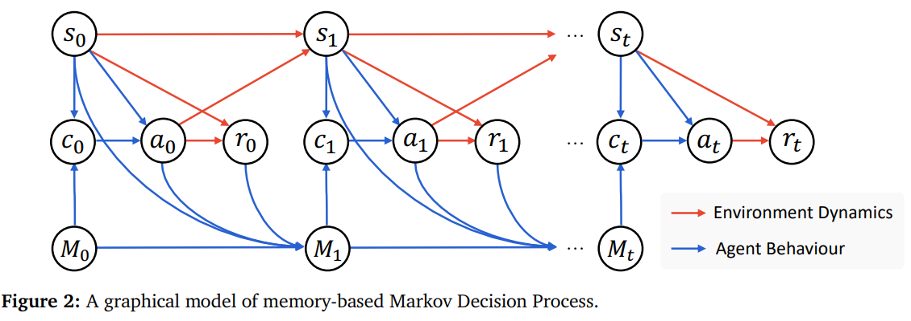

[(출처)](https://arxiv.org/pdf/2508.16153) : Huichi Zhou and Yihang Chen et al., "Memento: Fine-tuning LLM Agents without Fine-tuning LLMs"

* 다음과 같이 정의되는 Markov Decision Process (MDP) 를 말한다.
  * < $S, A, P, R, \gamma, M$ >

| notation | 설명                                              |
|----------|-------------------------------------------------|
| $S$      | state space                                     |
| $A$      | action space                                    |
| $P$      | transition dynamics, $P : S \times A → ∆(S)$    |
| $R$      | reward function, $R : S \times A → R$           |
| $\gamma$ | discount factor, $\gamma \in [0, 1)$            |
| $M$      | **memory space**, $M = (S \times A \times R)^*$ |

* 일반적인 MDP와의 가장 큰 차이점은 **memory space** 가 있다는 점이다.

**2. Case-Based Reasoning Agent**

* **Case-based Reasoning (CBR) Agent** 는 **현재 상태와 과거 경험을 모두 고려** 하여 결정을 생성하는 Agent이다.
  * 이때 과거 경험은 **한정된 크기의 메모리** 에 저장된다.

| notation                 | 설명                                                                                      |
|--------------------------|-----------------------------------------------------------------------------------------|
| $s \in S$                | 현재 상태 (current state)                                                                   |
| M $\in M$                | 현재 case bank (past case 의 집합 $c$ 로 구성)                                                  |
| $a \in A$                | action                                                                                  |
| $\mu (c \vert s, M)$     | **case retrieval policy** (현재 상태 $s$ 및 현재 case bank M에 대한 확률분포)                         |
| $p_{LLM} (a \vert s, c)$ | 거대 언어 모델 (LLM) 의, 현재 상태 $s$ 및 retrieved case $c \in$ M 에 대한 **action $a$ 의 likelihood** |       

* 이때 CBR Agent의 정책은 다음과 같다.
  * $\displaystyle \pi(a|s,M) = \Sigma_{c \in M} \mu(c|s,M) p_{LLM}(a|s,c)$ 
* CBR Agent의 trajectory $\tau$ 는 다음과 같이 나타낼 수 있다.

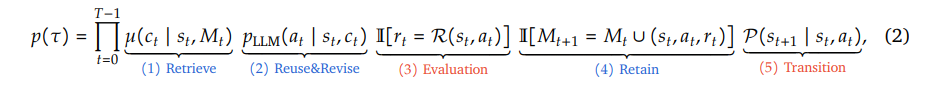

[(출처)](https://arxiv.org/pdf/2508.16153) : Huichi Zhou and Yihang Chen et al., "Memento: Fine-tuning LLM Agents without Fine-tuning LLMs"

| 구분         | 요소                                                 |
|------------|----------------------------------------------------|
| Agent 의 행동 | ```Retrieve``` ```Reuse and Revise``` ```Retain``` |
| 환경 관련 요소   | ```Evaluation``` ```Transition```                  |

### 2-2. Soft Q-Learning for CBR Agent

**위 CBR Policy 를 최적화** 하기 위해, 다음과 같이 학습을 실시한다.

* LLM component $p_{LLM}$ 을 **고정** 시킨 채로,
* case retrieval policy $\mu$ 만을 학습

이때 **Retrieval 되는 case 의 다양성** 을 확보하면서 최적화하기 위해, 다음과 같이 **Maximum Entropy RL framework** 기반으로 다음 Objective Function 을 적용한다.

| 구분                                       | 수식                                |
|------------------------------------------|-----------------------------------|
| Objective function $J(\pi)$              | 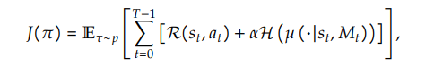 |
| Value function $V^\pi (s_t, M_t)$        | 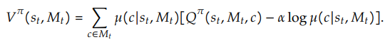 |
| Q value function $Q^\pi (s_t, M_t, c_t)$ | 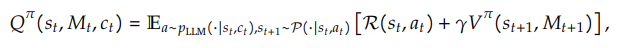 |

[(수식 출처)](https://arxiv.org/pdf/2508.16153) : Huichi Zhou and Yihang Chen et al., "Memento: Fine-tuning LLM Agents without Fine-tuning LLMs"

| notation | 설명                                 |
|----------|------------------------------------|
| $H$      | Entropy                            |
| $\alpha$ | 최종 reward 에서의 Entropy 에 대한 하이퍼파라미터 |

따라서 최종적인 Optimal Policy 의 **Closed-form solution** 은 다음과 같이 표현된다.


[(출처)](https://arxiv.org/pdf/2508.16153) : Huichi Zhou and Yihang Chen et al., "Memento: Fine-tuning LLM Agents without Fine-tuning LLMs"

### 2-3. Enhance Q-Learning Based on State Similarity

* 다음과 같은 **Soft Q Learning** 을 통해 위의 Optimal Policy 를 학습할 수 있다.

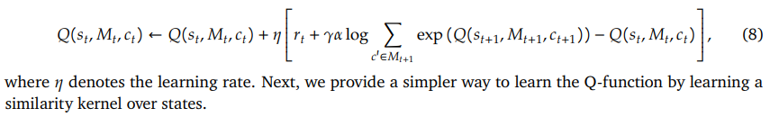

[(출처)](https://arxiv.org/pdf/2508.16153) : Huichi Zhou and Yihang Chen et al., "Memento: Fine-tuning LLM Agents without Fine-tuning LLMs"

* 그러나, 위와 같이 **직접 학습하는 것은 자연어의 복잡한 특성상 어려우므로**, 그 대신 **EC (episodic control) 알고리즘** 을 이용한 **Kernel-based Estimation** 으로 한다.
* 따라서 다음과 같은 근사 함수를 이용한다.


[(출처)](https://arxiv.org/pdf/2508.16153) : Huichi Zhou and Yihang Chen et al., "Memento: Fine-tuning LLM Agents without Fine-tuning LLMs"

| notation                                               | 설명                                        |
|--------------------------------------------------------|-------------------------------------------|
| $D_c = \lbrace (s_i, c_i, Q_i) \in D: c_i = c \rbrace$ | episodic memory $D$ 에 저장된 **과거의 상호작용 기록** |
| $k_\theta$                                             | kernel network (파라미터: $\theta$)           |
| $D$                                                    | episodic memory                           |

위 함수를 최적화하기 위해 다음과 같이 **TD (temporal difference) Learning 을 통해 Kernel Parameter $\theta$ 를 최적화** 한다.

| 구분                              | 수식                                 |
|---------------------------------|------------------------------------|
| TD Learning **Loss Function**   | 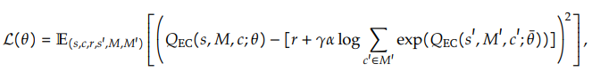  |
| TD Learning **Loss 의 Gradient** | 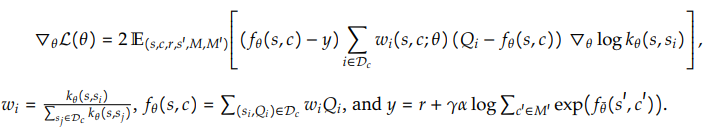 |

[(수식 출처)](https://arxiv.org/pdf/2508.16153) : Huichi Zhou and Yihang Chen et al., "Memento: Fine-tuning LLM Agents without Fine-tuning LLMs"

## 3. 실제 구현

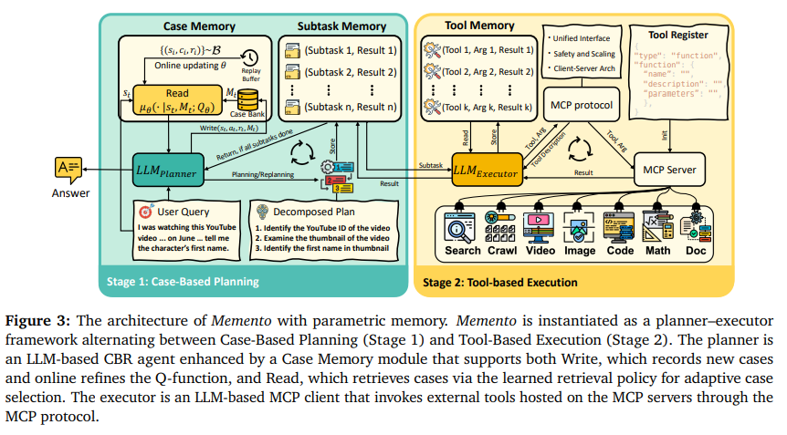

[(출처)](https://arxiv.org/pdf/2508.16153) : Huichi Zhou and Yihang Chen et al., "Memento: Fine-tuning LLM Agents without Fine-tuning LLMs"

**Memento** 는 위 그림과 같이 **Case-Based Planning** 과 **Tool-Based Execution** 의 핵심 단계로 구성되어 있다.

| 단계                                | 설명                                                                                                                                                                       |
|-----------------------------------|--------------------------------------------------------------------------------------------------------------------------------------------------------------------------|
| Stage 1. **Case-Based Planning**  | LLM 기반 CBR Agent인 **Planner** 가, 작업 지시를 받아서 **case memory 로부터 적절한 case triplet $(s_i, a_i, r_i)_{i=1}^K$ 을 추출** 한다.                                                      |
| Stage 2. **Tool-Based Execution** | 일반 용도의 LLM 기반 **Executor** 가, 각 subtask 를 **자동화된 eposide 로서 수행** 한다.<br>- 이때 [MCP Protocol](../../AI%20Basics/LLM%20Basics/LLM_기초_MCP_Model_Context_Protocol.md) 을 사용한다. |

### 3-1. 프레임워크

Memento 는 **Plan-and-Act 방법론** 을 적용하며, 이를 통해 **Planner 와 Executor 가 번갈아 가며 실행된다.**

* 효율적인 협업을 위해 Memento 에서는 다음과 같은 구조를 사용한다.

| 구조             | 설명                                                                   |
|----------------|----------------------------------------------------------------------|
| Case Memory    | High-level planning 을 위해 마련된, **기존 기록의 vector storage (RAG 연상 가능?)** |
| Subtask Memory | **현재 활성화된 subtask 와 그 결과** 를 저장한 **텍스트 기반** 저장소                      |
| Tool Memory    | 각 subtask 에 대한 **도구 사용 및 도구와의 상호작용** 기록을 저장한 **텍스트 기반** 저장소          |

* 각 단계는 다음과 같다.

| 단계                                | 사용 LLM                         | 상세 설명                                                             |
|-----------------------------------|--------------------------------|-------------------------------------------------------------------|
| Stage 1. **Case-Based Planning**  | **Planner** (LLM 기반 CBR Agent) | - 작업 지시를 전달받음<br>- 적절한 case memory 를 쿼리하여 **알맞은 case triplet 추출** |
| Stage 2. **Tool-Based Execution** | **Executor** (일반적인 목적의 LLM 기반) | - 각 subtask 를 실행 (자동화된 에피소드로서)<br>- 이때 **MCP 프로토콜** 사용            |

* 이때 case triplet 은 다음과 같이 $(s_i, a_i, r_i)_{i=1}^K$ 로 표현된다.

| notation | 설명                                 |
|----------|------------------------------------|
| $s_i$    | task (= state)                     |
| $a_i$    | plan (= action)                    |
| $r_i$    | success (= reward)                 |
| $K$      | retrieval 횟수 (= retrieved case 개수) |

### 3-2. Case Memory 관리

Case Memory 는 **계속 성장하는 Case Bank $M_t$** 로 나타낼 수 있으며, 다음과 같이 **Read & Write 연산** 이 가능하다.

| 연산    | 설명                                                                                                                                                                                                       | 수식                                                                                |
|-------|----------------------------------------------------------------------------------------------------------------------------------------------------------------------------------------------------------|-----------------------------------------------------------------------------------|
| Read  | **Non-parametric** 메모리 (계속 성장하는 Case Bank) 는 **매 Planning Step** 마다 작업 지시를 받고, 관련된 case 를 retrieve 함<br>- 이때, **현재 state 와 해당 과거 시점의 state 의 semantic similarity** 를 계산하여 **K 개의 가장 가까운 과거 케이스를 추출** 한다. | $Read_{NP}(s_t, M_t) = TopK_{(s_i, a_i, r_i) \in M_t} sim(enc(s_t), enc(s_i))$    |
| Write | 각 time step $t$ 에서, 각 historical case $(s_t, a_t, r_t)$ 를 **case bank $M_t$ 에 write** 한다.                                                                                                                | $Write(s_t, a_t, r_t, M_t) = M_{t+1} = M_t \cup \lbrace (s_t, a_t, r_t) \rbrace $ |

* 이때, Agent 가 **좋은 case를 더 잘 추출** 하게 하기 위해 **Parametric Memory Retrieval** 을 할 수 있다.
  * 이를 위해 **Parametric Q-function** 을 사용한다.

| 구분                                               | 설명                                                                                                                           |
|--------------------------------------------------|------------------------------------------------------------------------------------------------------------------------------|
| 핵심 아이디어                                          | case bank 에 새로운 case를 쓸 때, **Q-function 을 동시에 업데이트** 한다.<br>- 이를 통해 **parametric Q-function $Q(s, c; \theta)$ 을 학습** 할 수 있다. |
| Q-learning Loss<br>**(Mean-Squared Error Loss)** | 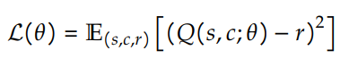                                                                                           |
| Q-learning Loss<br>**(Cross-Entropy Loss)**      | 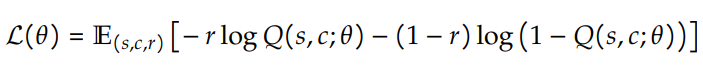                                                                                           |

[(수식 출처)](https://arxiv.org/pdf/2508.16153) : Huichi Zhou and Yihang Chen et al., "Memento: Fine-tuning LLM Agents without Fine-tuning LLMs"

### 3-3. 도구 사용 (Tool Usage)

깊이 있는 연구의 경우 **Agent 가 외부 정보를 얻어와야** 할 수 있으므로, 이를 위해 **MCP 프로토콜에 기반하여 도구를 사용할 수 있게** 한다.

| 도구 사용 목적       | 설명                                                                                                        |
|----------------|-----------------------------------------------------------------------------------------------------------|
| 추가 정보 획득       | - **최신 정보** 를 필요로 하는 open-ended task 등에서 사용<br>- 구글 등 검색 엔진의 결과를 조합하는 **메타 검색 엔진** 등을 사용                  |
| 멀티모달 정보 처리     | - 텍스트, 이미지, 동영상 등 **다양한 형태 (멀티모달)** 데이터를 처리하기 위해 사용<br>- 이를 위해 **다양한 형태의 정보에서 자동으로 원하는 정보를 추출** 하는 도구를 구현 |
| 추론 (Reasoning) | - **코드 실행, 수학 계산** 등<br>- 코드 실행의 경우 코드 작성, 실행 등이 가능한 샌드박스 형태의 환경 사용                                       |

## 4. 실험 및 그 결과

### 4-1. 데이터셋 및 모델

**1. 데이터셋**

* Memento 를 테스트하는 데이터셋으로 **GAIA benchmark** 를 사용했다.
  * 450개의 non-trivial / ambiguous 한 질문 포함
  * 150개 valid 데이터, 300개 테스트 데이터
* 그 외의 벤치마크
  * **DeepResearcher** (2025)
    * 7가지 open-domain QA 데이터셋 포함
  * **SimpleQA** (2024)
  * **Humanity's Last Exam (HLE)** (2025)

**2. 모델 (LLM)**

| 구분       | LLM                                                                     |
|----------|-------------------------------------------------------------------------|
| Planner  | ```GPT-4.1```                                                           |
| Executor | ```o3``` (for ```GAIA``` dataset)<br>```o4-mini``` (for other datasets) |
| 이미지 프로세싱 | ```GPT-4o```                                                            |
| 비디오 에이전트 | ```Gemini 2.5 Pro```                                                    |
| 오디오 에이전트 | ```Assembly AI```                                                       |

### 4-2. 평가 Metric

| Metric                                                                                                           | 설명                                                                                                       | 적용 대상                              |
|------------------------------------------------------------------------------------------------------------------|----------------------------------------------------------------------------------------------------------|------------------------------------|
| Exact Match (EM)                                                                                                 | standard normalization 처리 후 **Ground-Truth 정답과 동일** 해야 정답 인정                                             | GAIA 데이터셋                          |
| [Macro F1 Score](../../AI%20Basics/Data%20Science%20Basics/데이터_사이언스_기초_Metrics_MultiClass.md#4-1-macro-f1-score) | 각 라벨 별 [F1 Score](../../AI%20Basics/Data%20Science%20Basics/데이터_사이언스_기초_Metrics.md#1-3-f1-score) 의 단순 평균 | DeepResearcher, SimpleQA, HLE 데이터셋 |

### 4-3. 실험 결과 (기본)

**1. 각 데이터셋 별 성능 평가**

* F1 Score 및 PM Score 기준, **모든 데이터셋에서 Memento 가 가장 우수**

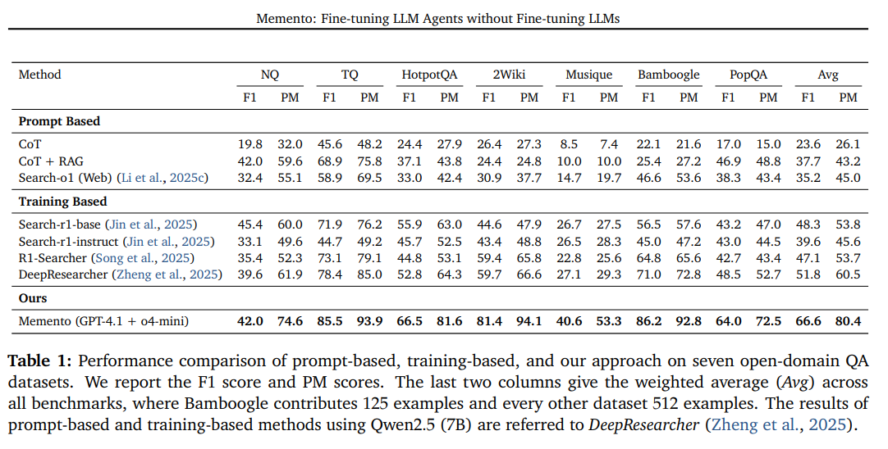

[(출처)](https://arxiv.org/pdf/2508.16153) : Huichi Zhou and Yihang Chen et al., "Memento: Fine-tuning LLM Agents without Fine-tuning LLMs"

**2. SimpleQA & HLE 데이터셋 성능 평가**

* Accuracy 기준, **HLE 에서 GPT-5가 가장 우수한 것** 을 제외하고는 Memento 가 다른 모델/에이전트 등에 비해 우수

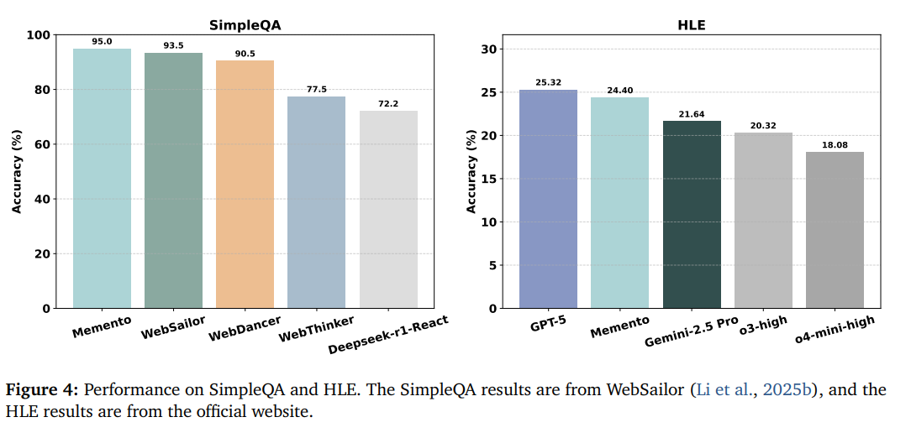

[(출처)](https://arxiv.org/pdf/2508.16153) : Huichi Zhou and Yihang Chen et al., "Memento: Fine-tuning LLM Agents without Fine-tuning LLMs"

### 4-4. 실험 결과 (Ablation Study)

**1. 하이퍼파라미터 [K (retrieval 횟수 = case 개수)](#3-1-프레임워크) 에 따른 성능 비교**

* 대략 $K = 4$ 일 때 최적의 성능을 보인다.

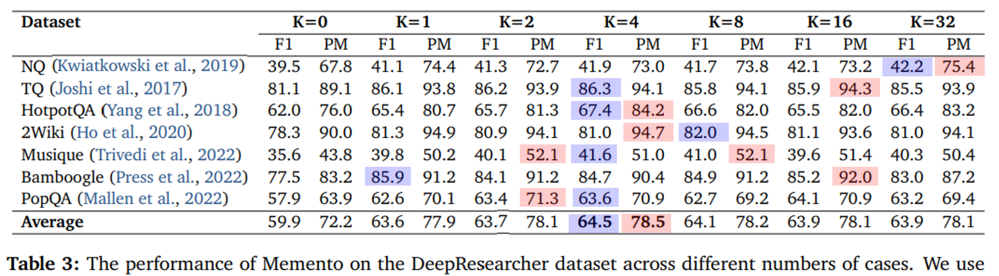

[(출처)](https://arxiv.org/pdf/2508.16153) : Huichi Zhou and Yihang Chen et al., "Memento: Fine-tuning LLM Agents without Fine-tuning LLMs"

**2. 여러 가지 벤치마크 데이터셋에서의 종합 실험 결과**

* 3가지 벤치마크 데이터셋 **HLE, SimpleQA, DeepResearcher** 로 실험 실시
* offline executor 에 비해 **live tool** 로 갈수록,
  * 환각 현상이 줄어들며,
  * 이와 함께 성능 (F1 Score & PM) 도 높아진다.

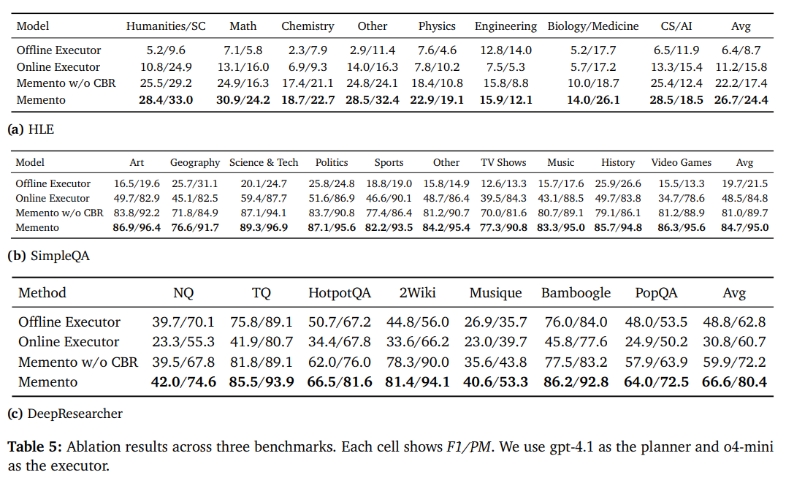

[(출처)](https://arxiv.org/pdf/2508.16153) : Huichi Zhou and Yihang Chen et al., "Memento: Fine-tuning LLM Agents without Fine-tuning LLMs"

## 5. 논의 사항 및 분석

| 논의 및 분석 사항                                          | 논의/분석 결과                                                                               |
|-----------------------------------------------------|----------------------------------------------------------------------------------------|
| task 난이도 별 tool call 평균 횟수 (MCP 프레임워크 적용의 성공 여부 파악) | tool call 횟수는 **task 의 복잡도가 증가할수록 늘어난다.**                                              |
| MCP tool 의 입출력 토큰 개수                                | 난이도가 높아질수록 입력, 출력 토큰 개수가 **모두 증가** 한다.<br>- 특히 **입력 토큰 개수가 빠르게 증가** 한다.                |
| Fast/Slow Thinking mode 의 효과                        | **Fast & Non-deliberative GPT-4.1** (as planner) & **o3** (as executor) 조합의 성능이 가장 좋다. |

* **1. task 난이도 별 tool call 평균 횟수**

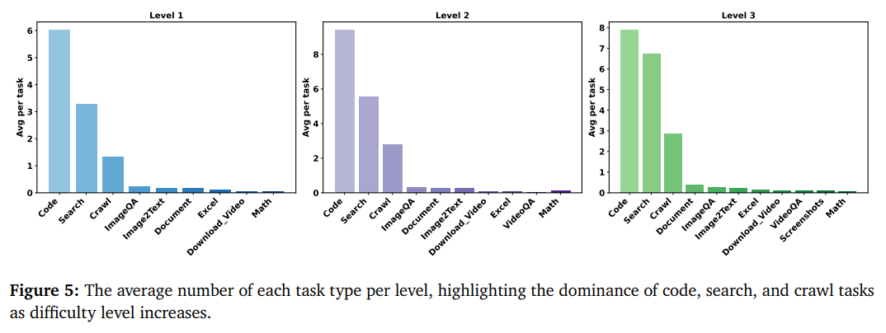

[(출처)](https://arxiv.org/pdf/2508.16153) : Huichi Zhou and Yihang Chen et al., "Memento: Fine-tuning LLM Agents without Fine-tuning LLMs"

* **2. MCP tool 의 입출력 토큰 개수**

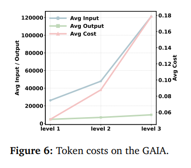

[(출처)](https://arxiv.org/pdf/2508.16153) : Huichi Zhou and Yihang Chen et al., "Memento: Fine-tuning LLM Agents without Fine-tuning LLMs"

* **3. Fast/Slow Thinking mode 의 효과**

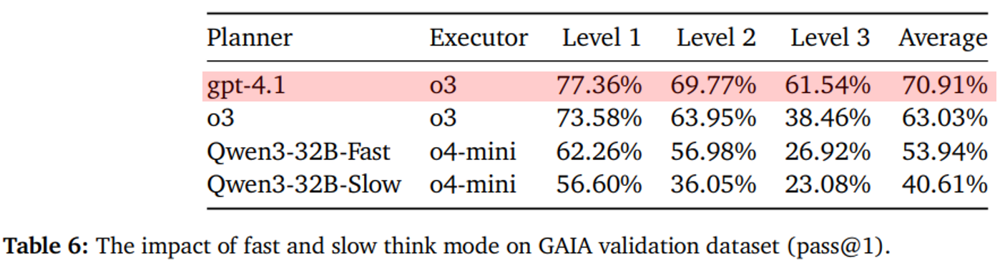

[(출처)](https://arxiv.org/pdf/2508.16153) : Huichi Zhou and Yihang Chen et al., "Memento: Fine-tuning LLM Agents without Fine-tuning LLMs"
