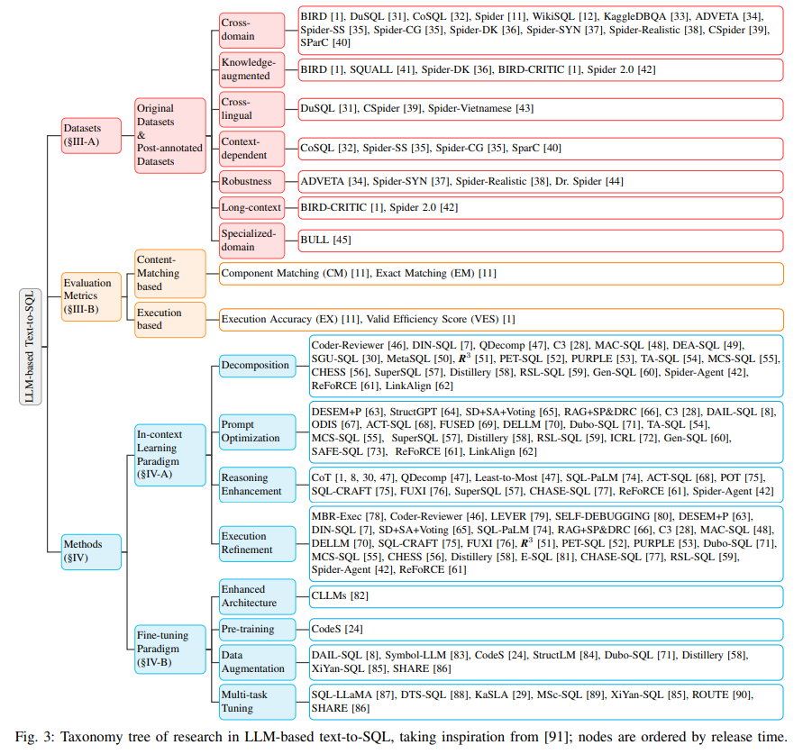
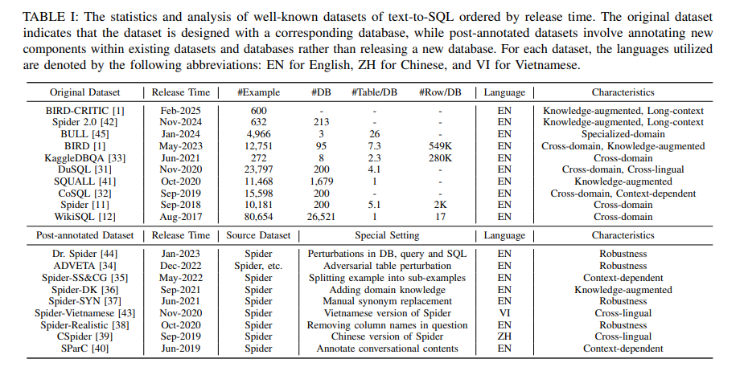
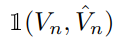
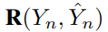
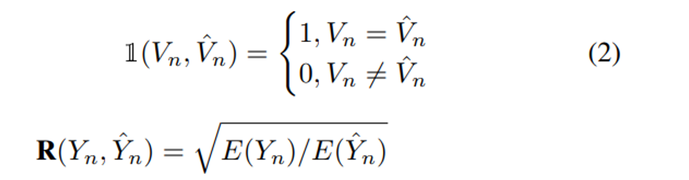
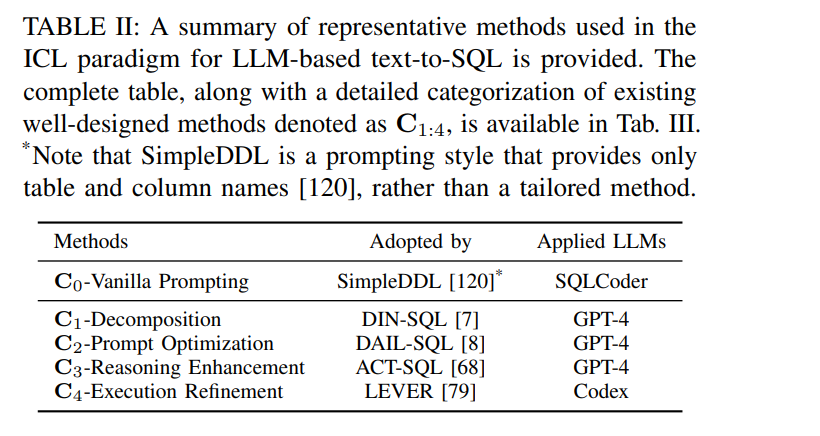
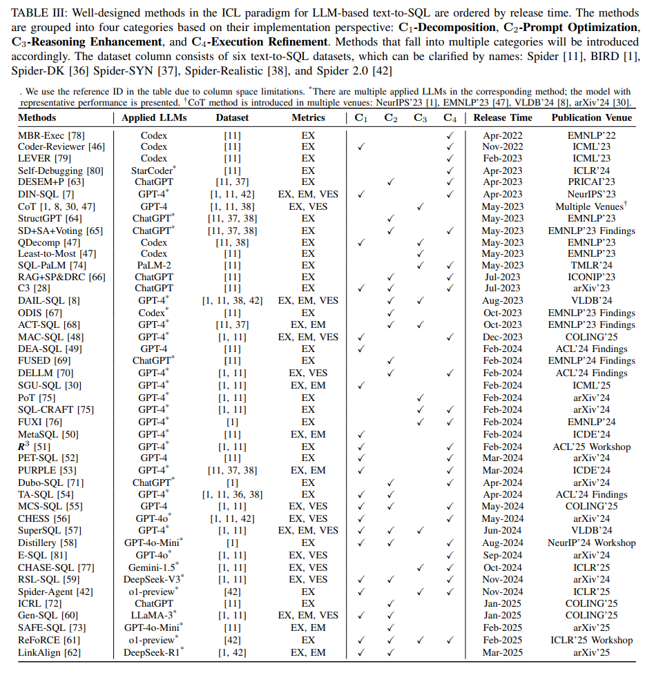
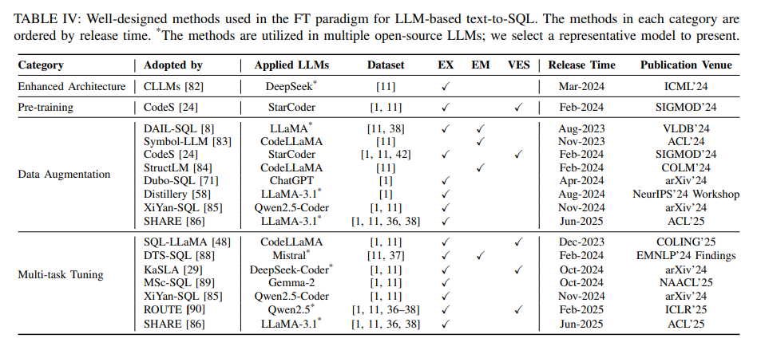

## 목차

* [1. LLM-based Text-to-SQL 개요](#1-llm-based-text-to-sql-개요)
  * [1-1. Text-to-SQL의 기술적 발전 과제](#1-1-text-to-sql의-기술적-발전-과제)
  * [1-2. Text-to-SQL 시스템의 진화 과정](#1-2-text-to-sql-시스템의-진화-과정)
* [2. 벤치마크 데이터셋 및 평가](#2-벤치마크-데이터셋-및-평가)
  * [2-1. 데이터셋](#2-1-데이터셋)
  * [2-2. 평가 Metric](#2-2-평가-metric)
* [3. 상세 방법론](#3-상세-방법론)
  * [3-1. In-context Learning 개요](#3-1-in-context-learning-개요) 
  * [3-2. In-Context Learning 의 대표적인 방법들](#3-2-in-context-learning-의-대표적인-방법들)
  * [3-3. Fine-Tuning](#3-3-fine-tuning)
* [4. 논의 사항](#4-논의-사항)
  * [4-1. LLM 기반 방법 vs. 전통적 방법](#4-1-llm-기반-방법-vs-전통적-방법)
  * [4-2. LLM 기반 방법 간 비교](#4-2-llm-기반-방법-간-비교)
  * [4-3. 실제 적용 시의 Robustness](#4-3-실제-적용-시의-robustness)
  * [4-4. 데이터 보안 및 해석 가능성](#4-4-데이터-보안-및-해석-가능성)

## 논문 소개

* Zijin Hong and Zheng Yuan et al., "Next-Generation Database Interfaces: A Survey of LLM-based Text-to-SQL", 2024
* [arXiv Link](https://arxiv.org/pdf/2406.08426)

## 1. LLM-based Text-to-SQL 개요

* **Text-to-SQL** 은 자연어를 DB에서 많이 사용하는 SQL 쿼리문으로 바꾸는 NLP 분야이다.
* **LLM-based Text-to-SQL** 은 이를 LLM 기반으로 해결하는 것이다. 

**LLM-based Text-to-SQL 방법론의 분류**

[(출처)](https://arxiv.org/pdf/2406.08426) : Zijin Hong and Zheng Yuan et al., "Next-Generation Database Interfaces: A Survey of LLM-based Text-to-SQL"

### 1-1. Text-to-SQL의 기술적 발전 과제

Text-to-SQL의 기술적 발전 과제는 다음과 같다.

| 발전 과제                       | 설명                                                                                                                             |
|-----------------------------|--------------------------------------------------------------------------------------------------------------------------------|
| 언어적 복잡성 및 애매모호함             | - 자연어로 된 질문은 **복잡한 언어적 표현을 포함** 하기도 한다. - 이러한 언어적 표현을 **SQL로 정확히 mapping 시키는 것** 은 어려울 수 있다.                                |
| 스키마 이해 및 표현                 | - 정확한 SQL 쿼리 생성을 위해, Text-to-SQL 시스템은 **데이터베이스 스키마를 정확하고 완벽히 이해** 해야 한다.                                                       |
| 드물거나 복잡한 SQL 연산             | - 가끔 어떤 SQL 쿼리는 **드물거나 복잡한 연산 syntax 를 포함** 할 수 있다. (nested sub-query 등) - 이러한 연산이 있는 데이터는 **학습 데이터에 별로 없을** 수 있다.          |
| Cross-Domain Generalization | - text-to-SQL 시스템은 **다양한 데이터베이스 검색 시나리오** 에 일반화하여 적용하기 어려울 수 있다. - **특정 도메인에 최적화** 하여 학습된 모델은 다른 도메인에서 성능을 잘 발휘하지 못할 수도 있다. |

### 1-2. Text-to-SQL 시스템의 진화 과정

Text-to-SQL 시스템의 진화 과정은 다음과 같다.

| 진화 단계                         | 설명                                                                                                                                                          |
|-------------------------------|-------------------------------------------------------------------------------------------------------------------------------------------------------------|
| **Rule-based** methods        | text-to-SQL 시스템의 초기 단계 - 사람이 직접 휴리스틱하게 규칙을 구성 - **언어적으로 복잡한 자연어 쿼리** 를 해석하는 데 한계                                                                      |
| **Deep Learning-based** 접근 방법 | 다음 기술 적용 - Sequence-to-sequence 모델 - Encoder-Decoder 기반 모델                                                                                            |
| **PLM-based** 구현              | **PLM (Pre-trained Language Model)** 기반 방법 - BERT, RoBERTa 등을 표준 text-to-SQL 데이터셋에 적용하여 Fine-Tuning 시도 - 딥러닝 기반 방법보다 정확도가 높지만, **복잡한 연산에서 여전히 오류 발생** |
| **LLM-based** 구현              | GPT와 같은 거대 언어 모델 (LLM) 을 이용 - 현재 활발히 연구되고 있는 분야 중 하나 - LLM의 지식 및 추론 능력을 SQL 해석에 이용하려는 여러 시도들이 있음                                                      |

## 2. 벤치마크 데이터셋 및 평가

### 2-1. 데이터셋

* 벤치마크 데이터셋 목록

[(출처)](https://arxiv.org/pdf/2406.08426) : Zijin Hong and Zheng Yuan et al., "Next-Generation Database Interfaces: A Survey of LLM-based Text-to-SQL"

* 벤치마크 데이터셋 분류

| 데이터셋 분류                  | 설명                                                                                                                                              |
|--------------------------|-------------------------------------------------------------------------------------------------------------------------------------------------|
| Cross-Domain 데이터셋        | 다양한 도메인의 서로 다른 DB의 배경 지식을 포함한 데이터셋                                                                                                              |
| Knowledge-Augmented 데이터셋 | **특정 도메인에 특화된 지식** 이 결합된 데이터셋 (domain knowledge 등) - BIRD, Spider-DK, SQUALL 등                                                               |
| Context-Dependent 데이터셋   | 하나의 예시에 대해 **1개의 질문이 1개의 SQL 쿼리와 대응되는** 데이터만 포함 (SParC, CoSQL 등) - Spider 데이터셋의 자연어 질문을 **여러 개의 sub-question 과 sub-SQL 로 분해** (Spider SS&CG) |
| Robustness 데이터셋          | 오염된 데이터베이스에서의 text-to-SQL 성능 평가 - Spider-SYN, ADVETA 등                                                                                       |
| Cross-lingual 데이터셋       | **여러 개의 언어** 로 구성된 text-to-SQL 데이터셋 - 영어로 된 데이터베이스 내용을 검색하기 위한 중국어 자연어 질의 등을 예시로 들 수 있음 - DuSQL 등                                         |
| Long-context 데이터셋        | **자연어를 복잡한 SQL 쿼리로 변환** 하는 능력을 평가하는 데이터셋 - 일부 SQL 쿼리는 **100개 이상의 토큰** 으로 구성되어 있는 경우가 있음 - Spider 2.0 등                                    |
| Specialized-domain 데이터셋  | 특정 domain-specific 한 데이터셋의 경우, **우수한 text-to-SQL 성능의 모델도 부족함이 있을 수 있음** - BULL 의 경우, 금융 분야에서 이런 점을 극복하기 위한 벤치마크 데이터셋임                        |

### 2-2. 평가 Metric

LLM 기반 Text-to-SQL의 평가 Metric 은 다음과 같다.

| 분류                            | 평가 Metric                    | 설명                                                                       |
|-------------------------------|------------------------------|--------------------------------------------------------------------------|
| Content Matching-based Metric | Component Matching (CM)      | predicted SQL, ground-truth SQL 의 **각 component 간의 exact match 여부** 를 판단 |
| Content Matching-based Metric | Exact Matching (EM)          | predicted SQL, ground-truth SQL 간의 **완전 일치하는 비율** 로 계산                   |
| Execution-based Metric        | Execution Accuracy (EX)      | 알맞은 DB에서 predicted SQL 실행 후, **ground truth SQL 을 실행한 결과와 비교** 하여 정확도 계산 |
| Execution-based Metric        | Valid Efficiency Score (VES) | **valid SQL query의 효율성** 을 수식으로 정의하여 계산                                  |

* **Valid Efficiency Score (VES)** 에서의 평가 수식
  * $\displaystyle VES = \frac{1}{N} \Sigma_{n=1}^N 1(V_n, \hat{V_n}) · R(Y_n, \hat{Y_n})$   

| notation                                  | 설명                                                     |
|-------------------------------------------|--------------------------------------------------------|
| $\hat{Y_n}$                               | SQL Query 의 예측값                                        |
| $\hat{V_n}$                               | 예측된 SQL Query 를 실행했을 때의 결과                             |
| $Y_n$                                     | SQL Query 의 실제 값                                       |
| $V_n$                                     | 실제 SQL Query 를 실행했을 때의 결과                              |
|  | **$V_n = \hat{V_n}$ 인지의 여부** 를 나타내는 indicator function |
|  | 예측된 SQL 실행의 ground truth SQL 대비 **실행의 상대적 효율성**        |
| $E(·)$                                    | 각 SQL query 의 **실행 시간**                                |

[(출처)](https://arxiv.org/pdf/2406.08426) : Zijin Hong and Zheng Yuan et al., "Next-Generation Database Interfaces: A Survey of LLM-based Text-to-SQL"

## 3. 상세 방법론

LLM 기반 Text-to-SQL 의 상세 방법론은 다음과 같이 2가지로 구분된다.

| 방법론 분류              | 설명                                                                                                   |
|---------------------|------------------------------------------------------------------------------------------------------|
| In-context Learning | [Prompt Engineering (프롬프트 엔지니어링)](../../AI%20Basics/LLM%20Basics/LLM_기초_Prompt_Engineering.md) 기반 방법 |
| Fine-Tuning         | [LLM Fine-Tuning](../../AI%20Basics/LLM%20Basics/LLM_기초_Fine_Tuning.md) 참고                           |

### 3-1. In-context Learning 개요

**In-context Learning (= Prompt Engineering, ICL)** 은 LLM의 성능을 향상시키는 방법 중 하나로, **SQL 쿼리 생성에서도 역시 성능 향상이 가능** 하다.

* ICL 에서의 SQL query prediction 방법은 다음 수식과 같다.
  * $\hat{Y} = \pi(I, Q, S|\theta)$

| notation | 설명                                                         |
|----------|------------------------------------------------------------|
| $I$      | text-to-SQL task 를 위한 **지시 사항 (instruction)**              |
| $Q$      | 사용자 질문                                                     |
| $S$      | 데이터베이스 스키마 및 내용, $S = <C, T, K>$                           |
| $C$      | **column** collection, $C = \lbrace c_1, c_2, ... \rbrace$ |
| $T$      | **table** collection, $T = \lbrace t_1, t_2, ... \rbrace$  |
| $K$      | 잠재적 보충 지식 (foreign key와 관련된 것 등)                           |

* 이때 **text-to-SQL 의 Zero-shot Prompting 을 위한 입력 $P_0$** 는 다음과 같이 **$I$, $S$, $Q$ 를 concatenate 한 형태** 이다.
  * $P_0 = I ⊕ S ⊕ Q$
* 또한, **Few-shot (k-shot) prompting** 의 경우는 다음과 같다.
  * $P_k = {E_1, E_2, ..., E_k} ⊕ P_0$
  * 이때 $E_i$ 는 $i$ 번째 few-shot instance 를 나타낸다.

### 3-2. In-Context Learning 의 대표적인 방법들

**In-Context Learning** 의 대표적인 방법들은 다음과 같다.

| 전략                          | 설명                                                           | 상세 분류                                                                                                                                                                             |
|-----------------------------|--------------------------------------------------------------|-----------------------------------------------------------------------------------------------------------------------------------------------------------------------------------|
| $C_0$-Vanilla Prompting     | Zero-shot, Few-shot 기반                                       |                                                                                                                                                                                   |
| $C_1$-Decomposition         | text-to-SQL 문제를 **관리할 만한 크기의 component 로 분해** 함으로써 단순화시키는 방법 | - Multi-module collaboration - Question decomposition                                                                                                                          |
| $C_2$-Prompt Optimization   | **프롬프트 엔지니어링** 을 통한 프롬프트 개선에 집중하는 방법                         | - Advanced few-shot sampling - Schema augmentation - External knowledge integration                                                                                         |
| $C_3$-Reasoning Enhancement | 복잡한 SQL을 **LLM의 추론 기능** 을 통해 해결                              | - [Chain-of-thought (CoT)](../../AI%20Basics/LLM%20Basics/LLM_기초_Chain_of_Thought.md)-based reasoning - Consistency-driven reasoning - Tool-augmented and agentic reasoning |
| $C_4$-Execution Refinement  | **SQL 실행 결과로부터 피드백을 얻어서** SQL query 를 재생성하거나 좋은 쿼리를 선택       | - Feedback-driven regeneration - Execution-guided selection                                                                                                                    |

[(출처)](https://arxiv.org/pdf/2406.08426) : Zijin Hong and Zheng Yuan et al., "Next-Generation Database Interfaces: A Survey of LLM-based Text-to-SQL"

[(출처)](https://arxiv.org/pdf/2406.08426) : Zijin Hong and Zheng Yuan et al., "Next-Generation Database Interfaces: A Survey of LLM-based Text-to-SQL"

### 3-3. Fine-Tuning

LLM 기반 text-to-SQL 분야에서 자주 사용되는 Fine-Tuning 방법은 **[SFT (Supervised Fine-Tuning)](../../AI%20Basics/LLM%20Basics/LLM_기초_Fine_Tuning_SFT.md)** 이다.

* SFT는 **잘 설계된 학습 파이프라인** 에서 잘 동작하는데, 이는 **LLM 기반 text-to-SQL 역시 마찬가지** 이다.
* SFT 가 많은 LLM에 적용되기 때문에, 어쩌면 **ICL 방법보다 더 foundational 한 방법** 일지도 모른다.

여기서는 LLM Fine-Tuning 기반 방법을 다음과 같이 분류한다.

| 분류                    | 설명                                                          |
|-----------------------|-------------------------------------------------------------|
| Enhanced Architecture | 표준 transformer backbone 에서 수정 (추가적인 architecture 도입 등)      |
| Pre-training          | Pre-training 은 학습 프로세스에서 **텍스트 생성 능력** 을 학습시키는 데 중요 요소      |
| Data Augmentation     | **데이터 품질 및 효율성** 향상 목적                                      |
| Multi-task Tuning     | 복잡한 문제를 **여러 개의 task로 분해** 하거나 **여러 개의 모델을 사용** 하여 보다 쉽게 해결 |

[(출처)](https://arxiv.org/pdf/2406.08426) : Zijin Hong and Zheng Yuan et al., "Next-Generation Database Interfaces: A Survey of LLM-based Text-to-SQL"

## 4. 논의 사항

### 4-1. LLM 기반 방법 vs. 전통적 방법

### 4-2. LLM 기반 방법 간 비교

### 4-3. 실제 적용 시의 Robustness

### 4-4. 데이터 보안 및 해석 가능성
