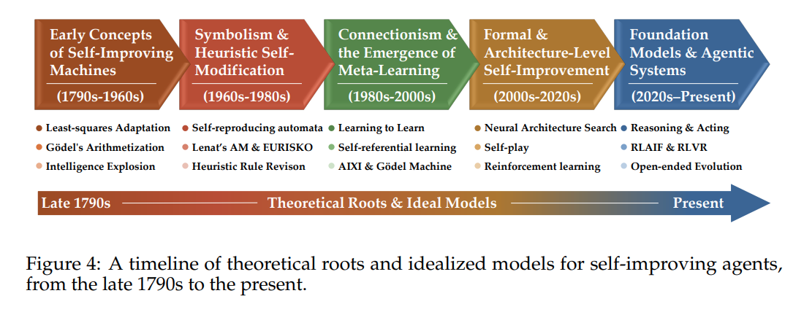
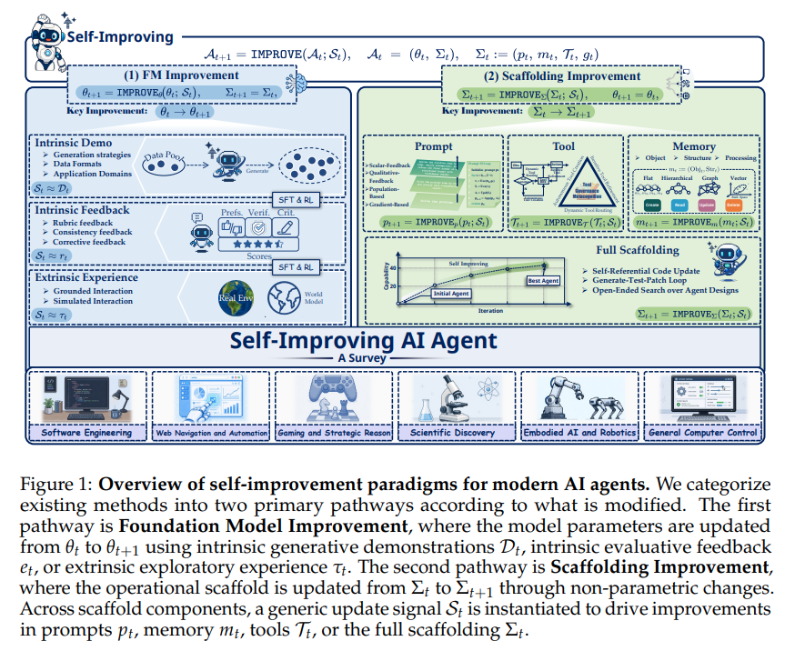
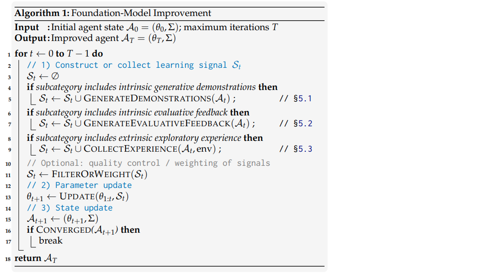
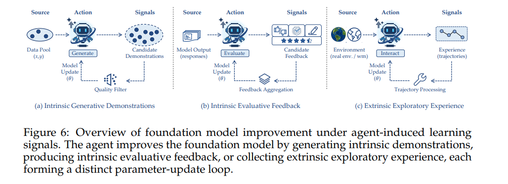

## 목차

* [1. AI Agent 개념의 역사](#1-ai-agent-개념의-역사)
* [2. 용어 정의 및 접근 방법](#2-용어-정의-및-접근-방법)
  * [2-1. 2가지 접근 방법 (Foundation Model Improvement, Scaffolding Improvement)](#2-1-2가지-접근-방법-foundation-model-improvement-scaffolding-improvement) 
* [3. Foundation Model Improvement](#3-foundation-model-improvement)
  * [3-1. Intrinsic Generative Demonstrations](#3-1-intrinsic-generative-demonstrations)
  * [3-2. Intrinsic Evaluative Feedback](#3-2-intrinsic-evaluative-feedback)
  * [3-3. Extrinsic Exploratory Experience](#3-3-extrinsic-exploratory-experience)
* [4. Scaffolding Improvement](#4-scaffolding-improvement)
  * [4-1. Prompt (프롬프트)](#4-1-prompt-프롬프트)
  * [4-2. Memory (메모리)](#4-2-memory-메모리)
  * [4-3. Tool (도구)](#4-3-tool-도구)
* [5. 응용 분야](#5-응용-분야)
* [6. 평가 방법 및 벤치마크](#6-평가-방법-및-벤치마크)
* [7. 논의 사항](#7-논의-사항)

## 논문 소개

* Zhe Ren and Yimeng Chen et al., "Self-Improvements in Modern Agentic Systems: A Survey", 2026
* [arXiv Link](https://arxiv.org/pdf/2607.13104)

## 1. AI Agent 개념의 역사

[(출처)](https://arxiv.org/pdf/2607.13104) : Zhe Ren and Yimeng Chen et al., "Self-Improvements in Modern Agentic Systems: A Survey"

* AI Agent 관련 개념의 역사는 다음과 같다.

| 연도         | 주요 개념                                                                                            |
|------------|--------------------------------------------------------------------------------------------------|
| 1931년      | 계산 기반 AI가 갖는 근본적 한계                                                                              |
| 1948년      | closed-loop 시스템에서의 적응적 행동에 대한 feedback 관점                                                        |
| 1948~1950년 | 앨런 튜링의 'child machine' **(내부 설정이 학습 및 외부 보상, 처벌 등 피드백에 따라 달라질 수 있음)**                            |
| 1952년      | 외부 변화에서의 생존을 위한 내부 상태 변경                                                                         |
| 1958~1959년 | performance에 대한 피드백에 따른 미래 행동 변화                                                                 |      
| 1964~1966년 | 엄밀한 framework 에서의 self-reproduction                                                              |
| 1966년      | 지능 폭발 이론 (기계가 더 능력 있는 후계자를 설계하는 능력을 갖게 됨)                                                        |
| 1984년      | Automated Mathematician (AM) 시스템 **(개념을 제안, 확장, 평가하는 휴리스틱)**                                     |
| 1987년      | **self-referential learning framework** ('진화하는 프로세스'는 후보 솔루션뿐만 아니라 **이를 생성하는 학습 프로세스까지 최적화** 가능) |
| 1994년      | **RL (강화학습) 기계** 는 **self-improving agent** 에 해당 (학습 전략을 수정할 수 있는)                               |
| 2010년      | 기술적 특이점에 대한 우려 시작                                                                                |

## 2. 용어 정의 및 접근 방법

이 논문에서 정의되는 용어 및 각종 term 들은 다음과 같다.

| 용어                            | 설명                                                              |
|-------------------------------|-----------------------------------------------------------------|
| foundation-model-based agents | 핵심 엔진으로 **거대한 foundation model (LLM, VLM 등)** 을 사용하는 AI 에이전트    |
| Self-improvement              | execution phase (실행 단계) 와 update phase (업데이트 단계) 로 formal 하게 구분 |
| SI-FMA                        | self-improvement in foundation-model-based agents               |

| annotation                             | 설명                                                                      | 수식                                                                 |
|----------------------------------------|-------------------------------------------------------------------------|--------------------------------------------------------------------|
| $A_t$                                  | foundation-model-based agent 의 time $t$ 에서의 설정값                         | $A_t = (\theta_t, \Sigma_t)$                                       |
| $\theta_t$                             | foundation model의 파라미터                                                  |                                                                    |
| $\Sigma_t$                             | agent의 dynamic operational scaffold (foundation model의 외부 세계와의 연결 방식 등) | $\Sigma_t = (p_t, m_t, T_t, g_t)$                                  |
| $p_t$                                  | system instruction 또는 프롬프트                                              |                                                                    |
| $m_t$                                  | 메모리 메커니즘 및 retrieval, update 정책                                         |                                                                    |
| $T_t$                                  | 외부 도구들의 집합                                                              |                                                                    |
| $g_t$                                  | 추가적인 control logic (routing, scheduling, 안전성 등)                         |                                                                    |
| $\pi_{\theta_t, \Sigma_t}(A_t \| X_t)$ | foundation model에 기반한 agent의 정책                                         |                                                                    | 
| $X_t$                                  | 현재 진행 중인 상호 작용에 대한 transit context (행동에 즉시 영향을 미칠 수 있지만 일시적임)           |                                                                    |
| $A_{t+1} = ...$                        | **self-inprovement step** 을 **실행 단계와 업데이트 단계** 로 구분한 수식                 | $A_{t+1} = U(A_{1:t}, E(\pi_{\theta_t, \Sigma_t}; \Sigma_t, C_t))$ |
| $U$                                    | Self-induced operator                                                   |                                                                    |
| $E$                                    | learning signal 을 생성하는 agent-executed 과정 (상호 작용 경로 등)                   |                                                                    |
| $C_t$                                  | task context (task distribution, 사용자 상호 작용 시스템 등)                       |                                                                    |

### 2-1. 2가지 접근 방법 (Foundation Model Improvement, Scaffolding Improvement)

[(출처)](https://arxiv.org/pdf/2607.13104) : Zhe Ren and Yimeng Chen et al., "Self-Improvements in Modern Agentic Systems: A Survey"

현대 AI 에이전트에 대한 2가지 접근 방법은 다음과 같다.

| 접근 방법                        | 설명                                                             | 세부 분류                                                                                                          |
|------------------------------|----------------------------------------------------------------|----------------------------------------------------------------------------------------------------------------|
| Foundation Model Improvement | Foundation Model 자체의 파라미터를 업데이트 (실험, 피드백 등)                    | - Intrinsic Generative Demonstrations - Intrinsic Evaluative Feedback - Extrinsic Exploratory Experience |
| Scaffolding Improvement      | operational scaffold (Foundation Model의 외부 세계와의 연결 방식, 즉 도구 등) | - Prompt (프롬프트) - Memory (메모리) - Tool (도구)                                                               |

## 3. Foundation Model Improvement

**Foundation Model Improvement** 는 **Foundation Model 자체의 파라미터를 업데이트** 하는 방식이다. 이때 **Agent-level scaffold 는 그대로 둔다.**

* $\theta_{t+1} = IMPROVE_\theta (\theta_{1:t};S_t)$
* $\Sigma_{t+1} = \Sigma_{t}$

이 방법은 **self-induced signal $S_t$** 에 따라 다음과 같이 분류할 수 있다.

| 분류                                  | 설명                                                                |
|-------------------------------------|-------------------------------------------------------------------|
| Intrinsic Generative Demonstrations | AI Agent가 **학습 가능한 객체 (dataset 등) 를 합성 (synthesize)** 한다.         |
| Intrinsic Evaluative Feedback       | AI Agent가 **signal을 구성** 한다. (reward, preference pair, 최적화 가이드 등) |
| Extrinsic Exploratory Experience    | AI Agent가 **실행 중 생성된 결과물, 상호 작용 결과물** 등으로부터 학습한다.                 |

[(출처)](https://arxiv.org/pdf/2607.13104) : Zhe Ren and Yimeng Chen et al., "Self-Improvements in Modern Agentic Systems: A Survey"

[(출처)](https://arxiv.org/pdf/2607.13104) : Zhe Ren and Yimeng Chen et al., "Self-Improvements in Modern Agentic Systems: A Survey"

### 3-1. Intrinsic Generative Demonstrations

**Intrinsic Generative Demonstrations** 는 다음과 같은 과정으로 동작한다.

* generative demonstration 을 **learning signal** 이라고 하자.
* 다음을 $t$ 회 반복한다.
  * $A_t = (\theta_t, \Sigma_t)$ 에 대해 **generative distribution $P_{gen}(x, y | A_t)$** 이 유도된다.
  * 이 generative distribution 으로부터 **intrinsic dataset $D_{gen}^t$** 을 샘플링한다.
  * **quality-control operator (QC)** 가 이 데이터셋의 example 등을 **필터링 또는 가중치 부여** 한다.
  * 최종 데이터셋은 $D_t = D_t^{base} \cup QC(D_t^{gen})$ 으로 한다.
  * 파라미터를 업데이트한다.
    * $\theta_{t+1} = IMPROVE_\theta(\theta_{1:t}; D_t)$

Intrinsic Generative Demonstration 의 전략 **self-improvement loop의 품질 측면에서 크리티컬하며**, 구체적으로는 다음과 같다.

| 전략                                 | 설명                                                                        |
|------------------------------------|---------------------------------------------------------------------------|
| Evol-Instruct                      | LLM을 이용하여 instruction 재작성, 점차적으로 instruction 난이도 향상                       |
| (Singh et al. (2024))              | 모델의 시도 중 **정확한 solution 만 선택** (unit test 등을 이용)                          |
| (Simonds & Yoshiyama (2025))       | 복잡한 문제를 간단한 sub-problem 으로 분해하여 **학습 커리큘럼** 생성                            |
| Test-Time Self-Improvement (TT-SI) | generation 을 massive offline generation 에서 **샘플 효율적인 on-the-fly 방법으로 전환** |

### 3-2. Intrinsic Evaluative Feedback

**Intrinsic Evaluative Feedback** 은 다음과 같은 과정으로 동작한다.

* **현재의 agent 설정값 $A_t = (\theta_t, \Sigma_t)$** 에 대해, 입력 또는 task context 에 해당하는 $x$ 가 주어진다.
  * agent는 해당 $x$ 로부터 **candidate output 을 샘플링** 한다.
* **내부 evaluator $\pi_t$** 가 다음 항목들을 **evaluative signal 로 mapping 시킨다.** 이를 통해 **feedback $e_t$ 를 생성** 한다.
  * task
  * candidates
  * 평가 기준 $kappa_t$
* 이때, $\pi_t$ 는 **업데이트 대상이 아닌, 피드백의 source** 에 해당한다.
* 이 feedback을 update signal로 한다. 즉 다음과 같다.
  * update signal $S_t = e_t$
  * $\theta_{t+1} = IMPROVE_\theta (\theta_{1:t}; e_t)$

Intrinsic Evaluative Feedback 의 가능한 학습 방법은 다음과 같다.

* Reinforcement Learning
* Preference Optimization (선호 최적화)
* reward-model 학습
* 지도학습 기반 Fine-Tuning (Supervised Fine-Tuning)

여기서 Feedback 의 종류는 다음과 같다.

| Feedback 종류          | 설명                                                                                                              |
|----------------------|-----------------------------------------------------------------------------------------------------------------|
| Rubric Feedback      | 명확한 기준에 근거하여, **모델이 candidate output을 판단** 하여 평가 피드백 생성                                                         |
| Consistency Feedback | - Foundation Model 들의 **확률적 특성을 이용하여 피드백 시그널 도출** - 이렇게 도출된 피드백을 이용하여 **self-improvement** 실시                |
| Corrective Feedback  | - 자연어로 된 비판 또는 수정 피드백을 **핵심 출력** 으로 간주 - 오류 수정 피드백은 **모델이 후보 출력의 단점들을 검증하고 수정을 제안** 해야 하므로, **비판적인 피드백** 이다. | 

### 3-3. Extrinsic Exploratory Experience

**Extrinsic Exploratory Experience** 는 다음과 같은 과정으로 진행된다.

* learning signal 을 **기존의 Experience 로 초기화 ( $S_t = \tau_t$ )** 한다.
  * 여기서 $\tau_t$ 는 정책 $\pi_{\theta_t \Sigma_t}$ 을 실행했을 때의 trajectory 를 의미한다.
* 파라미터는 다음과 같이 업데이트된다.
  * $\theta_{t+1} = IMPROVE_\theta (\theta_{1:t};\tau_t)$ 
  * $\Sigma_{t+1} = \Sigma_t$ (Agent-level scaffold 는 그대로 유지)

여기서 trajectory 는 **웹 페이지, 스크린샷, 코드 로그** 등이 될 수 있다.

## 4. Scaffolding Improvement

**Scaffolding Improvement** 는 **Agent 내부의 Foundation Model의 파라미터를 고정** 한 채로, **Agent의 Operational Scaffold (외부와의 상호 작용 체계) 를 수정** 하는 것이다.

* 즉, 수식으로 나타내면 다음과 같다.
  * $\theta_{t+1} = \theta_t$
  * $\Sigma_{t+1} = IMPROVE_\Sigma (\Sigma_{1:t};S_t)$

Scaffolding improvement 는 다음과 같이 4가지로 구성된다.

| Scaffolding improvement 방법   | 설명                                                                            | 수식                                                |
|------------------------------|-------------------------------------------------------------------------------|---------------------------------------------------|
| Prompt-based improvement     | Agent의 **prompt를 최적화** 하는 것으로, **입력 및 instruction layer** 를 타겟팅함              | $p_{t+1} = IMPROVE_p(p_{1:t};S_t)$                |
| Memory-based improvement     | Agent의 **과거 경험 기록을 저장, pruning, retrieving** 하여, Agent의 내부 인지를 발전시킴           | $m_{t+1} = IMPROVE_m(m_{1:t};S_t)$                |
| Tool-based improvement       | Agent가 호출할 수 있는 **모듈 (도구) 의 집합을 관리** 하여, Agent의 실행 인터페이스를 강화                  | $T_{t+1} = IMPROVE_T(T_{1:t};S_t)$                |
| Full scaffolding improvement | 모든 코드베이스 및 운영 로직을 수정 가능한 상태로 간주하여, **Agent는 인지, 추론, 실행 로직을 dynamic 하게 수정 가능** | $\Sigma_{t+1} = IMPROVE_\Sigma(\Sigma_{1:t};S_t)$ |

### 4-1. Prompt (프롬프트)

### 4-2. Memory (메모리)

### 4-3. Tool (도구)

## 5. 응용 분야

## 6. 평가 방법 및 벤치마크

## 7. 논의 사항

