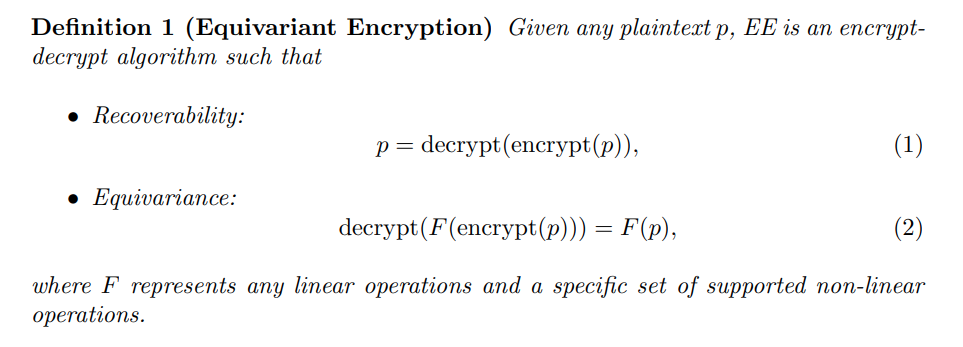
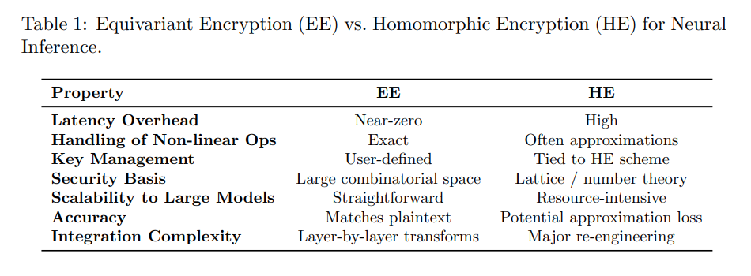
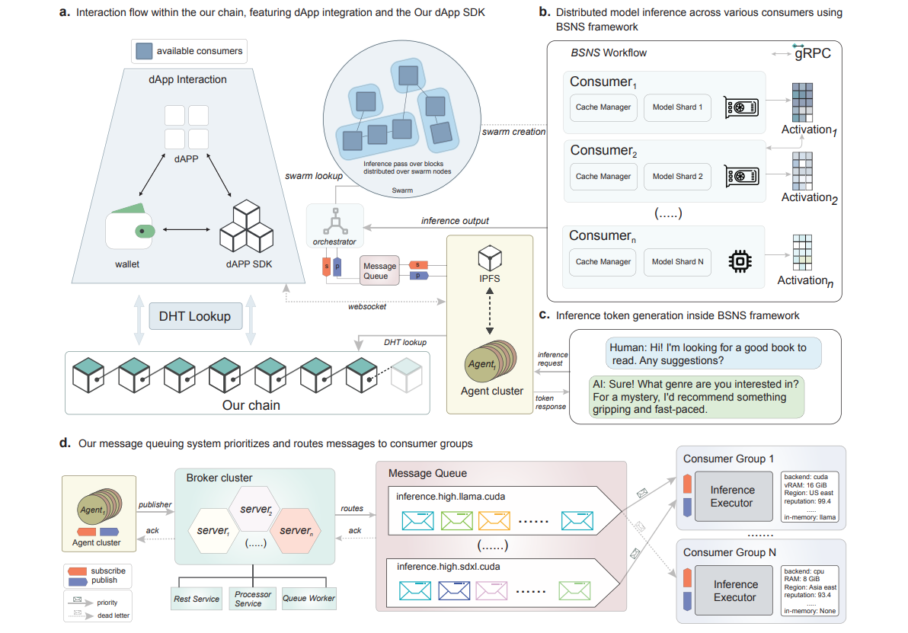
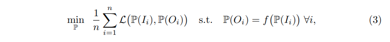

## 목차

* [1. 논문 개요](#1-논문-개요)
* [2. 배경 지식](#2-배경-지식)
  * [2-1. Differential Privacy (차분 프라이버시, DP)](#2-1-differential-privacy-차분-프라이버시-dp) 
  * [2-2. Secure Multi-Party Computation (다자간 보안 컴퓨팅, SMPC)](#2-2-secure-multi-party-computation-다자간-보안-컴퓨팅-smpc)
  * [2-3. Homomorphic Encryption (동형암호, HE)](#2-3-homomorphic-encryption-동형암호-he)
* [3. Equivalent Encryption (등가 암호화)](#3-equivalent-encryption-등가-암호화)
  * [3-1. 등가 암호화의 정의](#3-1-등가-암호화의-정의) 
  * [3-2. 동형암호와의 비교](#3-2-동형암호와의-비교)
  * [3-3. 활용 사례](#3-3-활용-사례)
* [4. 위험 분석 및 공격 모델](#4-위험-분석-및-공격-모델)
  * [4-1. 잠재적 공격 및 공격 벡터](#4-1-잠재적-공격-및-공격-벡터)
  * [4-2. 공격을 위한 Loss Function 및 Optimizer](#4-2-공격을-위한-loss-function-및-optimizer)
* [5. 언어 모델을 위한 Fidelity Score 벤치마킹](#5-언어-모델을-위한-fidelity-score-벤치마킹)

## 논문 소개

* James Buban, Hongyang Zhang et al., "Encrypted Large Model Inference: The Equivariant Encryption Paradigm", 2025
* [arXiv Link](https://arxiv.org/pdf/2502.01013)

## 1. 논문 개요

이 논문에서는 다음과 같은 내용을 다룬다.

* 딥러닝 파이프라인에서 데이터 기밀성을 유지하기 위한 새로운 파이프라인으로 **Equivalent Encryption (등가 암호화)** 를 제시한다.
* 등가 암호화가 **신뢰할 수 없는 node의 쿼리 및 출력을 어떻게 보호** 하는지에 대한 예시를 소개한다.

## 2. 배경 지식

### 2-1. Differential Privacy (차분 프라이버시, DP)

**Differential Privacy (차분 프라이버시, DP)** 는 데이터셋의 각 record를 **집계, 분석을 가능하게 하면서도** 보호하기 위한 통계적 프레임워크 중 하나이다.

* $D$ 와 $D'$ 가 **record 하나만 서로 다른** 2개의 이웃한 데이터셋일 때, 다음 조건을 만족시키면 **랜덤 알고리즘 $M$ 은 $(\epsilon, \delta)-DP$ 하다** 고 한다.
  * 이때 $S$ 는 **임의의 측정 가능한 데이터셋** 이다.

$Pr[M(D) \in S] \le e^\epsilon Pr[M(D') \in S] + \delta$

* 직관적으로는, **데이터셋에서 1개의 record (row) 를 변경** 하더라도, 이것이 **알고리즘의 출력에는 크게 영향 없음 → 프라이버시 우려가 낮다** 고 이해하면 된다.

다음과 같은 메커니즘이 차분 프라이버시를 보장하는 것으로 알려져 있다.

| 메커니즘                  | 설명                             |
|-----------------------|--------------------------------|
| Laplace Mechanism     | **라플라스 분포** 로부터 생성된 노이즈 주입     |
| Gaussian Mechanism    | 출력값의 차원이 클 때 **가우시안 노이즈** 를 추가 |
| Exponential Mechanism | 효용 함수에 따른 확률적 출력 선택            |

### 2-2. Secure Multi-Party Computation (다자간 보안 컴퓨팅, SMPC)

**Secure Multi-Party Computation (다자간 보안 컴퓨팅, SMPC)** 은 **각자 private input 을 가진 여러 명이, 그 입력을 공개하지 않으면서 joint function에 그 값을 입력하여 함숫값을 계산** 하게 할 수 있는 암호학적 접근 방법이다.

* 일반적으로 다음과 같이 구성된다.
  * n명의 멤버 $P_1, P_2, ..., P_n$ 이 있고,
  * 각자가 가진 private input $x_1, x_2, ..., x_n$ 이 있을 때,
  * 함숫값 $f(x_1, x_2, ..., x_n) = y$ 를 **각자가 가진 $x_1, x_2, ..., x_n$ 을 비공개하면서** 계산하고자 하는 문제이다.

* 관련 개념

| 개념                             | 설명                                                                                                                               |
|--------------------------------|----------------------------------------------------------------------------------------------------------------------------------|
| Secret-Sharing Protocols (BGW) | 각 입력을 **각자에게 일정 부분만큼 분배** 하는 형태의 프로토콜                                                                                            |
| Additive Sharing               | 'ring' $Z_q$ 에 있는 비공개 값 $x$ 가 **n개의 share $x_1, x_2, ..., x_n$ 으로 나누어짐** - 이때, $\displaystyle x = \Sigma_{i=1}^n x_i (mod q)$ |

### 2-3. Homomorphic Encryption (동형암호, HE)

**Homomorphic Encryption (동형암호, HE)** 은 **데이터에 대해 의미 있는 계산이 여전히 가능** 하게 하면서도, **데이터를 암호화 상태로 유지하는 암호화 프레임워크** 이다.

* 동형암호의 기본적인 메커니즘
  * **신뢰할 수 없는 서버** 를 거쳐야 하는 **private data $m \in M$** 이 있다.
  * $m$ 을 plain text로 보내기보다는, **$c = E(m)$ (단, $E: M → C$) 를 통해 먼저 암호화** 할 것이다.

* 동형암호는 **Homomorphic 속성** 을 통해 다음을 보장한다.
  * 즉, **암호화된 데이터 $c_1, c_2, ...$ 를 서버 연산 후 복호화** 한 결과가, **원래 데이터에 대한 평문 연산** 결과와 동일하다.
  * 따라서, 서버는 **암호화된 데이터의 암호화를 유지한 채로 (그 내용을 모른 채로), 사용자가 의도한 결과를 반환하는 연산을 할 수 있다. (중요)**

$D(f'(c_1, c_2, ...)) = f(D(c_1), D(c_2), ...)$

| $D$                      | $f'$            | $f$                    |
|--------------------------|-----------------|------------------------|
| 대응되는 복호화 (decryption) 함수 | 암호문에 대한 서버 측 연산 | plain text에 대한 서버 측 연산 |

* 동형암호 시스템의 분류
  * 일반적으로 **암호화된 텍스트에 대해 지원하는 연산의 범위** 를 기준으로 분류한다.

| 분류                     | 설명                                                                                                                                                          |
|------------------------|-------------------------------------------------------------------------------------------------------------------------------------------------------------|
| Partial HE (PHE)       | 덧셈, 곱셈과 같은 단일 연산 실행 시 **권한 (허가) 필요**                                                                                                                        |
| Somewhat or Leveled HE | noise management 하에서 **덧셈과 곱셈을 정해진 depth 만큼** 까지 지원                                                                                                         |
| Fully HE (FHE)         | 덧셈, 곱셈 등 연산을 **무제한 허용** - 최근의 FHE 시스템은 계산 효율성을 위해 **다항식 ring** 을 사용한다. - cyclotomic polynomial ring 은 $R = Z_q[x]/<x^N + 1>$ 을 plain-text space 로 한다. |

* Equivalent Encryption (등가 암호화) 과의 연결성
  * 등가 암호화는 plain-text에 대한 **복잡하거나 노이즈에 민감한 연산을 제한** 함으로써, **동형암호의 오버헤드를 감소** 시킨다. 

## 3. Equivalent Encryption (등가 암호화)

**Equivalent Encryption (등가 암호화)** 는 **딥러닝 추론에서의 암호화 기술** 중 하나로, 다음과 같은 특징을 갖는다.

* Fully HE (FHE) 의 오버헤드 회피 가능
* 신뢰 가능한 실행 환경 (Trusted Execution Environments, TEE) 및 차분 프라이버시 (DP) 의 한계 극복
* **추가적인 latency 거의 없이** 도, **입력/출력의 기밀성을 유지** 할 수 있음 → **거대 모델 또는 time-critical 앱에 적합**

등기 암호화의 핵심은 다음과 같다.

* **성능 페널티 없이, Blind AI** 로 만들기
  * 등가 암호화는 HE, TEE, DP 의 다음과 같은 한계점을 극복하기 위해, **layer-specific 한 변환** 에 집중한다.
  * 이 과정에서 **데이터의 기밀성 + 최소한의 오버헤드** 가 유지된다.

| 방법론                | 한계점                                                       |
|--------------------|-----------------------------------------------------------|
| HE (동형암호)          | - **non-linear layer** 처리 어려움 - **런타임 실행 시간** 대폭 증가 가능 |
| TEE (신뢰 가능한 실행 환경) | - 하드웨어의 신뢰성에 의존                                           |
| DP (차분 프라이버시)      | - 공격 서버로부터의 **중간 activation에 대한 공격** 을 방어하지 못함            |

등가 암호화의 특징은 다음과 같다.

| 등가 암호화 특징            | 설명                                                           |
|----------------------|--------------------------------------------------------------|
| 완벽한 Server Blindness | 원본 데이터, 쿼리, 중간 activation 등은 **plain text에 절대 나타나지 않음**      |
| 낮은 latency           | Fully HE 의 일반적인 성능 저하를 회피                                    |
| 범용성                  | CNN, LLM 등 **다양한 종류의 모델에 적용 가능**                             |
| 비용 효율성               | TEE에서 사용하는 특화 하드웨어, HE의 복잡한 파라미터 설정 등 불필요                    |
| RAG (검색 증강 생성) 등 활용성 | RAG workflow 역시 **처음부터 끝까지 암호화된 상태** 로 유지 가능                 |
| 간단한 integration      | EE는 **코드 수정이 간단함** - 예: 특정 레이어 연산을 encrypted 로 대체하기만 하면 됨 |

[(출처)](https://arxiv.org/pdf/2502.01013) : James Buban, Hongyang Zhang et al., "Encrypted Large Model Inference: The Equivariant Encryption Paradigm"

### 3-1. 등가 암호화의 정의

**등가 암호화 (EE)** 는 다음과 같은 성질을 만족시키는 **암호화-복호화 알고리즘** 으로 정의된다.

[(출처)](https://arxiv.org/pdf/2502.01013) : James Buban, Hongyang Zhang et al., "Encrypted Large Model Inference: The Equivariant Encryption Paradigm"

* 본 논문에서 제안한 등가 암호화는 다음과 같은 연산을 지원한다.
  * [ReLU](../../AI%20Basics/Deep%20Learning%20Basics/딥러닝_기초_활성화_함수.md#2-2-relu-함수), GeLU, [SiLU](../../AI%20Basics/Deep%20Learning%20Basics/딥러닝_기초_활성화_함수.md#2-6-silu-swish-함수) 활성화 함수
  * RMS Normalization
  * [Layer Normalization](../../AI%20Basics/Deep%20Learning%20Basics/딥러닝_기초_Regularization.md#4-2-layer-normalization)

### 3-2. 동형암호와의 비교

* 동형암호와 등가 암호화는 모두 **암호화된 데이터에 대한 연산을 지원** 한다는 공통점이 있다.
* 그러나, 다음과 같이, 특히 **오버헤드 및 유연성** 측면에서 큰 차이점이 있다.

[(출처)](https://arxiv.org/pdf/2502.01013) : James Buban, Hongyang Zhang et al., "Encrypted Large Model Inference: The Equivariant Encryption Paradigm"

### 3-3. 활용 사례

* 거대 모델과 관련된 **탈중앙화된 inference flow** 의 예시는 다음과 같다.

[(출처)](https://arxiv.org/pdf/2502.01013) : James Buban, Hongyang Zhang et al., "Encrypted Large Model Inference: The Equivariant Encryption Paradigm"

| 영역                     | 설명                                                                 |
|------------------------|--------------------------------------------------------------------|
| **(a)** 상호 작용 흐름       | `dApp`, `wallet` 이 `DHT` (distributed hash table) 과 상호작용한다.        |
| **(b)**                | 거대 모델을 여러 개의 shard 로 나누어서 **병렬 처리** - `gRPC` 를 통한 activation 전달 |
| **(c)** 텍스트 생성 쿼리 Demo | Agent가 chain transaction 확인 후, `dApp` 에 결과 반환                      |
| **(d)** 메시지 큐 시스템      | 서로 다른 고객 그룹에 요청을 할당 - 자원 제약, reputation score, 모델 요구 사항 등에 기반   |

## 4. 위험 분석 및 공격 모델

**등가 암호화 (Equivalent Encryption)** 에서 발생할 수 있는 잠재적 위협은 다음과 같다.

* 공격자가 등가 암호화를 어떻게 복호화 또는 회피할 수 있는지를 중점적으로 다룬다.

### 4-1. 잠재적 공격 및 공격 벡터

* 가정
  * 요청과 응답이 **HTTP 방식** 으로 송수신된다.
  * 이때 암호화 방식은 **대칭이 보장되는 방식** 이다.
  * LLM의 입력/출력 토큰이 **알 수 없는 mapping을 통해 조합, 변환** 된다.
  * 공격자는 **암호화된 token ID** 을 획득하여, **변환된 sequence에만 접근** 할 수 있다.

* 공격 방법
  * 공격자는 **입출력 쌍 $(I_i, O_i)$ 을 획득** 하며, 이 입출력 쌍은 **등가 암호화를 통해 scramble 된 token ID sequence** 로 표현된다.
  * 공격자의 목표는 **원래의 plain text token을 추정 또는 재구성** 하는 것이다.

**[ 잠재적 공격 분석 ]**

* LLM에는 **사전 $V$ 에 있는 token-sequence 입력을 token-sequence 출력으로 mapping 하는 함수 $f$** 가 있다고 가정한다.
* 공격자는 등가 암호화에 의해 암호화된 입출력 $I_i, O_i \in C$ 에 대한 입출력 순서 $\{(I_i, O_i)\}_{i=1}^n$ 를 관측한다.
* 공격자의 상황
  * vocabulary set $V$ 를 알고 있음
  * plain-text 로 복원하기 위한 조합 또는 mapping $P$ 는 모르고 있음
* 공격자의 목표
  * 위 상황에 따라서, **공격자는 $P(O_i) \sim f(P(I_i))$ 를 만족시키는 $P : V → V$ 를 찾아야 함**
  * 또한, 복호화된 sequence **$(P(I_i), P(O_i))$ 는 유의미한 질문-답변 쌍** 이어야 함 

따라서 공격자의 목표를 달성하기 위한 문제를 다음과 같은 수식으로 정의할 수 있다.

* $L$ 은 loss function 으로, **복호화된 쌍이 유의미한 자연어 / 모델의 유의미한 응답에 가깝도록 유도** 한다.

[(출처)](https://arxiv.org/pdf/2502.01013) : James Buban, Hongyang Zhang et al., "Encrypted Large Model Inference: The Equivariant Encryption Paradigm"

### 4-2. 공격을 위한 Loss Function 및 Optimizer

공격자가 공격을 위해 사용할 수 있는 Loss Function 및 Optimizer 는 다음과 같다.

* Loss Function

| Loss Function 또는 방법         | 설명                                                                                                                 |
|-----------------------------|--------------------------------------------------------------------------------------------------------------------|
| LLM-as-a-Judge              | 복호화된 출력 $P(O_i)$ 이 입력 $P(I_i)$ 와 얼마나 consistent 한지 점수화 요청 - 해당 조합이 유효한지를 **거대 언어 모델의 이해** 에 따라 판단하도록 하는 효과적인 방법 |
| Linguistic Domain Knowledge | token, 문법 등에 따른 **휴리스틱 Loss Function** 적용                                                                          |

* Optimizer
  * 잘 정의된 Loss Function $L$ 에 대해서도, **Global / Local Minimum을 찾기 위한 휴리스틱 방법** 이 필요하다.

| Optimizer       | 설명                                                                                                                                                    |
|-----------------|-------------------------------------------------------------------------------------------------------------------------------------------------------|
| Brute Force     | 사전 $V$ 안에서 **가능한 모든 조합을 전수 조사** - 일반적으로 **매우 작은 사전** 에 대해서만 사용 가능                                                                                  |
| Random Sampling | 전체 공간에서 **$M$ 개의 조합을 랜덤 샘플링** - 공격자는 Loss function $L$ 의 값이 **가장 작은 후보** 를 선택 - 유전 알고리즘 등 기법 사용 가능                                              |
| Hill Climbing   | 랜덤/휴리스틱한 조합에서 시작하여, **2개의 token mapping을 swap** 하여 local improvement 되는 부분을 찾음 - 해당 swap이 $L$의 값을 감소시키면, 조합이 해당 조합으로 업데이트됨 - local minima 도달 가능 |

## 5. 언어 모델을 위한 Fidelity Score 벤치마킹
