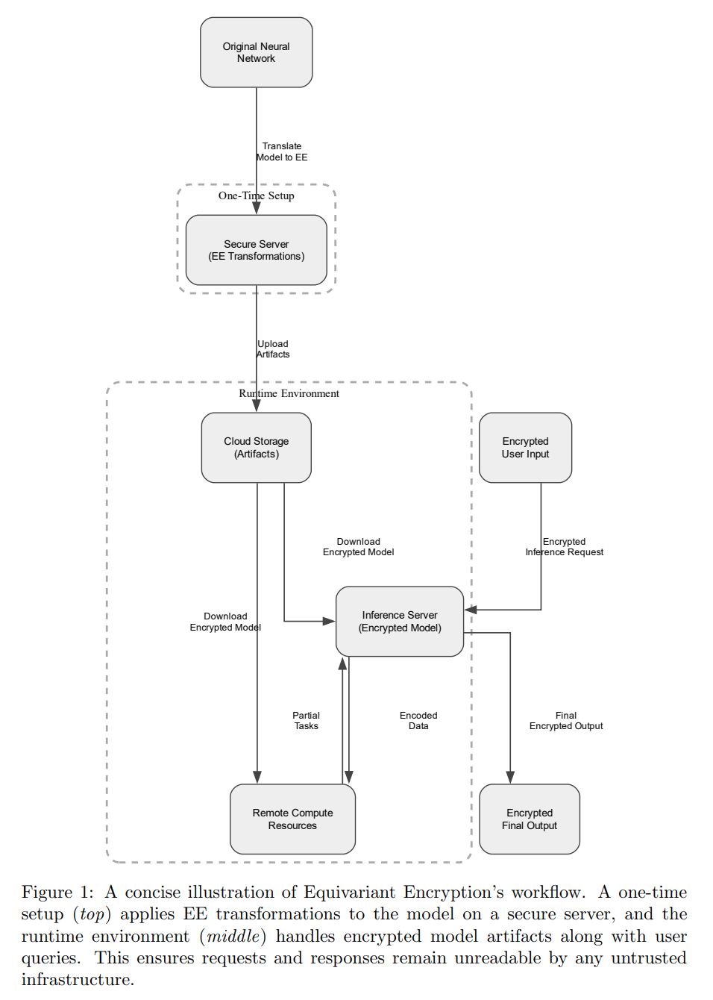

## 목차

* [1. 논문 개요](#1-논문-개요)
* [2. 배경 지식](#2-배경-지식)
  * [2-1. Differential Privacy (차분 프라이버시, DP)](#2-1-differential-privacy-차분-프라이버시-dp) 
  * [2-2. Secure Multi-Party Computation (다자간 보안 컴퓨팅, SMPC)](#2-2-secure-multi-party-computation-다자간-보안-컴퓨팅-smpc)
  * [2-3. Homomorphic Encryption (동형암호, HE)](#2-3-homomorphic-encryption-동형암호-he)
* [3. Equivalent Encryption (등가 암호화)](#3-equivalent-encryption-등가-암호화)
  * [3-1. 동형암호와의 비교](#3-1-동형암호와의-비교) 
* [4. 위험 분석 및 공격 모델](#4-위험-분석-및-공격-모델)
  * [4-1. 잠재적 공격 및 공격 벡터](#4-1-잠재적-공격-및-공격-벡터)
  * [4-2. 공격을 위한 Loss Function 및 Optimizer](#4-2-공격을-위한-loss-function-및-optimizer)
* [5. 언어 모델을 위한 Fidelity Score 벤치마킹](#5-언어-모델을-위한-fidelity-score-벤치마킹)

## 논문 소개

* James Buban, Hongyang Zhang et al., "Encrypted Large Model Inference: The Equivariant Encryption Paradigm", 2025
* [arXiv Link](https://arxiv.org/pdf/2502.01013)

## 1. 논문 개요

이 논문에서는 다음과 같은 내용을 다룬다.

* 딥러닝 파이프라인에서 데이터 기밀성을 유지하기 위한 새로운 파이프라인으로 **Equivalent Encryption (등가 암호화)** 를 제시한다.
* 등가 암호화가 **신뢰할 수 없는 node의 쿼리 및 출력을 어떻게 보호** 하는지에 대한 예시를 소개한다.

## 2. 배경 지식

### 2-1. Differential Privacy (차분 프라이버시, DP)

**Differential Privacy (차분 프라이버시, DP)** 는 데이터셋의 각 record를 **집계, 분석을 가능하게 하면서도** 보호하기 위한 통계적 프레임워크 중 하나이다.

* $D$ 와 $D'$ 가 **record 하나만 서로 다른** 2개의 이웃한 데이터셋일 때, 다음 조건을 만족시키면 **랜덤 알고리즘 $M$ 은 $(\epsilon, \delta)-DP$ 하다** 고 한다.
  * 이때 $S$ 는 **임의의 측정 가능한 데이터셋** 이다.

$Pr[M(D) \in S] \le e^\epsilon Pr[M(D') \in S] + \delta$

* 직관적으로는, **데이터셋에서 1개의 record (row) 를 변경** 하더라도, 이것이 **알고리즘의 출력에는 크게 영향 없음 → 프라이버시 우려가 낮다** 고 이해하면 된다.

다음과 같은 메커니즘이 차분 프라이버시를 보장하는 것으로 알려져 있다.

| 메커니즘                  | 설명                             |
|-----------------------|--------------------------------|
| Laplace Mechanism     | **라플라스 분포** 로부터 생성된 노이즈 주입     |
| Gaussian Mechanism    | 출력값의 차원이 클 때 **가우시안 노이즈** 를 추가 |
| Exponential Mechanism | 효용 함수에 따른 확률적 출력 선택            |

### 2-2. Secure Multi-Party Computation (다자간 보안 컴퓨팅, SMPC)

**Secure Multi-Party Computation (다자간 보안 컴퓨팅, SMPC)** 은 **각자 private input 을 가진 여러 명이, 그 입력을 공개하지 않으면서 joint function에 그 값을 입력하여 함숫값을 계산** 하게 할 수 있는 암호학적 접근 방법이다.

* 일반적으로 다음과 같이 구성된다.
  * n명의 멤버 $P_1, P_2, ..., P_n$ 이 있고,
  * 각자가 가진 private input $x_1, x_2, ..., x_n$ 이 있을 때,
  * 함숫값 $f(x_1, x_2, ..., x_n) = y$ 를 **각자가 가진 $x_1, x_2, ..., x_n$ 을 비공개하면서** 계산하고자 하는 문제이다.

* 관련 개념

| 개념                             | 설명                                                                                                                               |
|--------------------------------|----------------------------------------------------------------------------------------------------------------------------------|
| Secret-Sharing Protocols (BGW) | 각 입력을 **각자에게 일정 부분만큼 분배** 하는 형태의 프로토콜                                                                                            |
| Additive Sharing               | 'ring' $Z_q$ 에 있는 비공개 값 $x$ 가 **n개의 share $x_1, x_2, ..., x_n$ 으로 나누어짐** - 이때, $\displaystyle x = \Sigma_{i=1}^n x_i (mod q)$ |

### 2-3. Homomorphic Encryption (동형암호, HE)

**Homomorphic Encryption (동형암호, HE)** 은 **데이터에 대해 의미 있는 계산이 여전히 가능** 하게 하면서도, **데이터를 암호화 상태로 유지하는 암호화 프레임워크** 이다.

* 동형암호의 기본적인 메커니즘
  * **신뢰할 수 없는 서버** 를 거쳐야 하는 **private data $m \in M$** 이 있다.
  * $m$ 을 plain text로 보내기보다는, **$c = E(m)$ (단, $E: M → C$) 를 통해 먼저 암호화** 할 것이다.

* 동형암호는 **Homomorphic 속성** 을 통해 다음을 보장한다.
  * 즉, **암호화된 데이터 $c_1, c_2, ...$ 를 서버 연산 후 복호화** 한 결과가, **원래 데이터에 대한 평문 연산** 결과와 동일하다.
  * 따라서, 서버는 **암호화된 데이터의 암호화를 유지한 채로 (그 내용을 모른 채로), 사용자가 의도한 결과를 반환하는 연산을 할 수 있다. (중요)**

$D(f'(c_1, c_2, ...)) = f(D(c_1), D(c_2), ...)$

| $D$                      | $f'$            | $f$                    |
|--------------------------|-----------------|------------------------|
| 대응되는 복호화 (decryption) 함수 | 암호문에 대한 서버 측 연산 | plain text에 대한 서버 측 연산 |

* 동형암호 시스템의 분류
  * 일반적으로 **암호화된 텍스트에 대해 지원하는 연산의 범위** 를 기준으로 분류한다.

| 분류                     | 설명                                                                                                                                                          |
|------------------------|-------------------------------------------------------------------------------------------------------------------------------------------------------------|
| Partial HE (PHE)       | 덧셈, 곱셈과 같은 단일 연산 실행 시 **권한 (허가) 필요**                                                                                                                        |
| Somewhat or Leveled HE | noise management 하에서 **덧셈과 곱셈을 정해진 depth 만큼** 까지 지원                                                                                                         |
| Fully HE (FHE)         | 덧셈, 곱셈 등 연산을 **무제한 허용** - 최근의 FHE 시스템은 계산 효율성을 위해 **다항식 ring** 을 사용한다. - cyclotomic polynomial ring 은 $R = Z_q[x]/<x^N + 1>$ 을 plain-text space 로 한다. |

* Equivalent Encryption (등가 암호화) 과의 연결성
  * 등가 암호화는 plain-text에 대한 **복잡하거나 노이즈에 민감한 연산을 제한** 함으로써, **동형암호의 오버헤드를 감소** 시킨다. 

## 3. Equivalent Encryption (등가 암호화)

**Equivalent Encryption (등가 암호화)** 는 **딥러닝 추론에서의 암호화 기술** 중 하나로, 다음과 같은 특징을 갖는다.

* Fully HE (FHE) 의 오버헤드 회피 가능
* 신뢰 가능한 실행 환경 (Trusted Execution Environments, TEE) 및 차분 프라이버시 (DP) 의 한계 극복
* **추가적인 latency 거의 없이** 도, **입력/출력의 기밀성을 유지** 할 수 있음 → **거대 모델 또는 time-critical 앱에 적합**

등기 암호화의 핵심은 다음과 같다.

* **성능 페널티 없이, Blind AI** 로 만들기
  * 등가 암호화는 HE, TEE, DP 의 다음과 같은 한계점을 극복하기 위해, **layer-specific 한 변환** 에 집중한다.
  * 이 과정에서 **데이터의 기밀성 + 최소한의 오버헤드** 가 유지된다.

| 방법론                | 한계점                                                       |
|--------------------|-----------------------------------------------------------|
| HE (동형암호)          | - **non-linear layer** 처리 어려움 - **런타임 실행 시간** 대폭 증가 가능 |
| TEE (신뢰 가능한 실행 환경) | - 하드웨어의 신뢰성에 의존                                           |
| DP (차분 프라이버시)      | - 공격 서버로부터의 **중간 activation에 대한 공격** 을 방어하지 못함            |

등가 암호화의 특징은 다음과 같다.

| 등가 암호화 특징            | 설명                                                           |
|----------------------|--------------------------------------------------------------|
| 완벽한 Server Blindness | 원본 데이터, 쿼리, 중간 activation 등은 **plain text에 절대 나타나지 않음**      |
| 낮은 latency           | Fully HE 의 일반적인 성능 저하를 회피                                    |
| 범용성                  | CNN, LLM 등 **다양한 종류의 모델에 적용 가능**                             |
| 비용 효율성               | TEE에서 사용하는 특화 하드웨어, HE의 복잡한 파라미터 설정 등 불필요                    |
| RAG (검색 증강 생성) 등 활용성 | RAG workflow 역시 **처음부터 끝까지 암호화된 상태** 로 유지 가능                 |
| 간단한 integration      | EE는 **코드 수정이 간단함** - 예: 특정 레이어 연산을 encrypted 로 대체하기만 하면 됨 |

[(출처)](https://arxiv.org/pdf/2502.01013) : James Buban, Hongyang Zhang et al., "Encrypted Large Model Inference: The Equivariant Encryption Paradigm"

### 3-1. 동형암호와의 비교

## 4. 위험 분석 및 공격 모델

### 4-1. 잠재적 공격 및 공격 벡터

### 4-2. 공격을 위한 Loss Function 및 Optimizer

## 5. 언어 모델을 위한 Fidelity Score 벤치마킹
