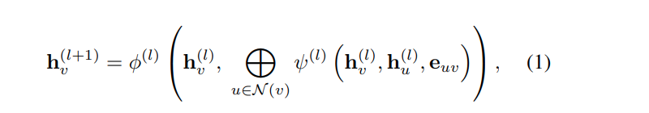
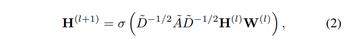
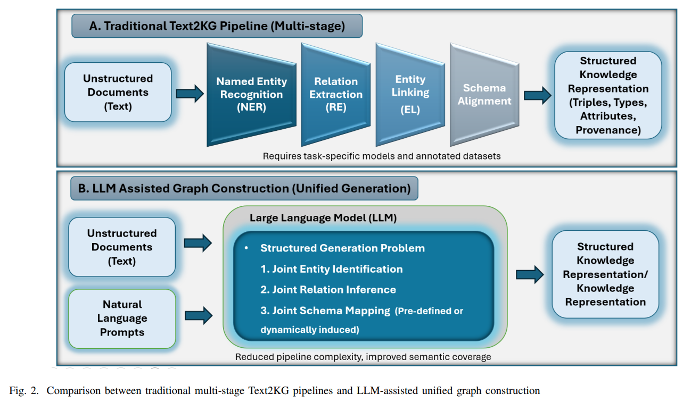
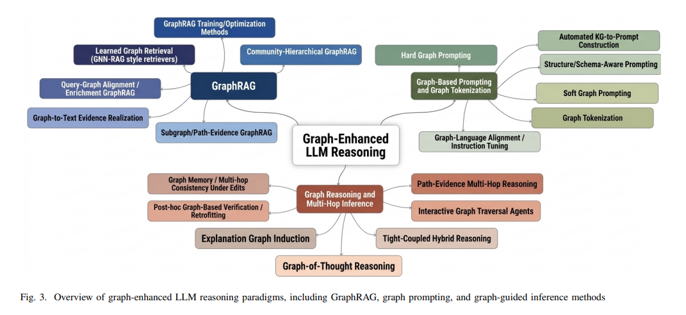
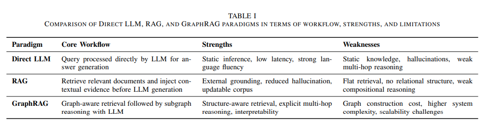
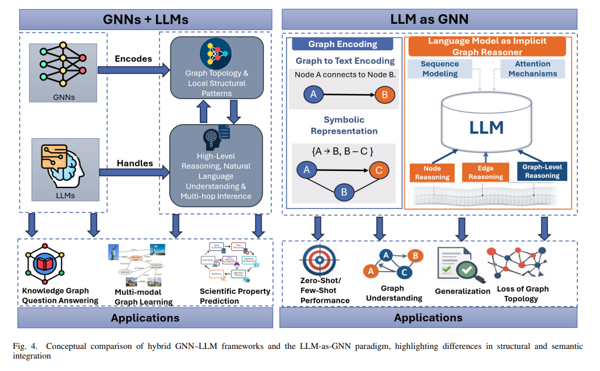
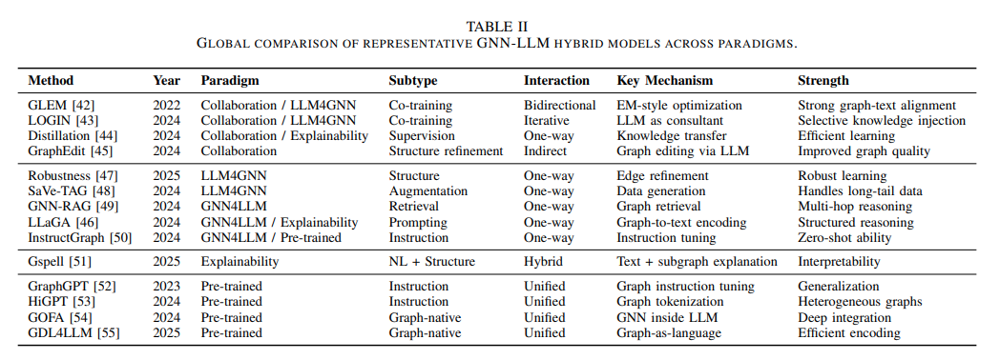
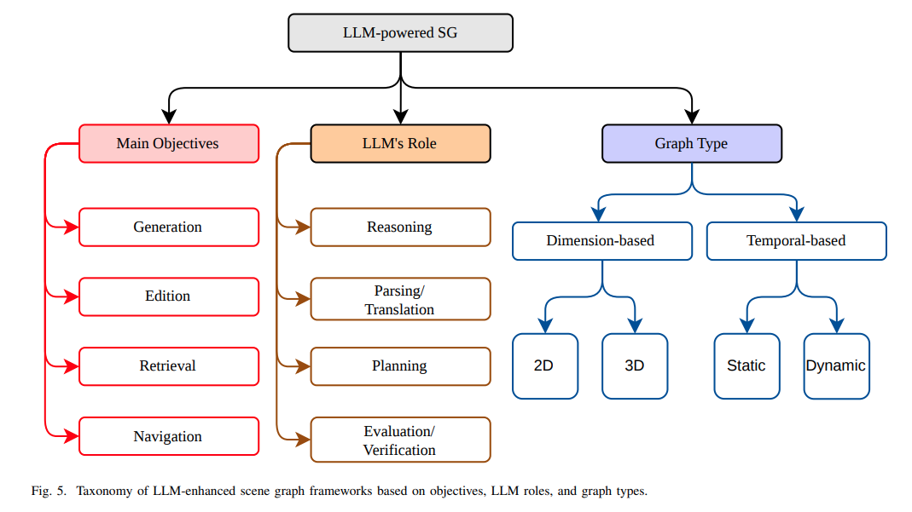

## 목차

* [1. 논문 개요](#1-논문-개요)
* [2. 배경 지식: GNN (Graph Neural Networks)](#2-배경-지식-gnn-graph-neural-networks)
  * [2-1. Graph Convolutional Network (GCN)](#2-1-graph-convolutional-network-gcn) 
* [3. LLM 기반 그래프 생성](#3-llm-기반-그래프-생성)
  * [3-1. 텍스트로부터 지식 그래프 추출](#3-1-텍스트로부터-지식-그래프-추출)
  * [3-2. LLM 기반 그래프 추출 패러다임](#3-2-llm-기반-그래프-추출-패러다임)
  * [3-3. 온톨로지 엔지니어링 & 스키마 생성](#3-3-온톨로지-엔지니어링--스키마-생성)
  * [3-4. Zero-shot 그래프 구성](#3-4-zero-shot-그래프-구성)
* [4. Graph-Enhanced LLM 추론](#4-graph-enhanced-llm-추론)
  * [4-1. GraphRAG](#4-1-graphrag) 
* [5. Hybrid GNN-LLM 모델](#5-hybrid-gnn-llm-모델)
* [6. 지식 그래프 기반 Question Answering (KGQA)](#6-지식-그래프-기반-question-answering-kgqa)
* [7. LLM과 Scene Graph](#7-llm과-scene-graph)
* [8. GNN-LLM의 응용](#8-gnn-llm의-응용)

## 논문 소개

* Hamed Jelodar, Samita Bai et al., "Integrating Graphs, Large Language Models, and Agents: Reasoning and Retrieval", 2026
* [arXiv Link](https://arxiv.org/pdf/2604.15951)

## 1. 논문 개요

이 논문에서 다루는 것은 다음과 같다.

* 그래프 신경망과 LLM의 다양한 결합 방법
  * Graph Modality 등
* 각 응용 도메인 별 다양한 방법론, 각 방법론의 장점, 한계점, 적합한 task 등
* 환각 현상, 해석 가능성 등 이슈 사항

## 2. 배경 지식: GNN (Graph Neural Networks)

**GNN (Graph Neural Network)** 은 **그래프 자료구조를 위한 인공신경망 구조** 이다.

* 각 개체는 node, 각 개체 간의 관계는 edge 로 표현한다.
* 각 node가 가지고 있는 정보를 **그래프 토폴로지를 따라 주변으로 전파** 함으로써, **상호 의존성 및 구조적 패턴** 을 파악한다.
* 이를 통해, 다음과 같은 **Structured Reasoning 등의 task에 효과적으로 적용 가능** 하다.
  * 소셜 네트워크 분석
  * 추천 시스템

GNN의 핵심 메커니즘은 **message passing** 이다.

* message passing 에서, 각 node는 **이웃한 node 들로부터 정보를 반복적으로 aggregate** 하여 자신에 대한 표현을 갱신한다.
* **layer $l$ 에서의 node $v \in V$** 의 표현은 $h_v^{(l)}$ 로 표현한다.

[(출처)](https://arxiv.org/pdf/2502.01013) : Hamed Jelodar, Samita Bai et al., "Integrating Graphs, Large Language Models, and Agents: Reasoning and Retrieval"

| notation        | 설명                                                                             |
|-----------------|--------------------------------------------------------------------------------|
| $N(v)$          | node $v$의 이웃한 node                                                             |
| $\psi^{(l)}(·)$ | message funtion ($v$ 의 hidden state 업데이트를 위한 message 를 얻기 위한, **주변 정보 집계** 함수) |
| $\bigoplus$     | **조합 순서에 따라 결과가 불변** 하는 aggregation 연산자 (덧셈, 평균, 최댓값 등)                        |
| $\pi(·)$        | update function                                                                |

* 즉, **다음 레이어 $(l + 1)$ 의 hidden state** 는 이전 레이어 $(l)$ 의 hidden state와 **이웃한 node 들에 대한 레이어 $(l)$ 의 hidden state** 의 조합이다.

### 2-1. Graph Convolutional Network (GCN)

**Graph Convolutional Network (GCN)** 은 Vision 분야에서 사용하는 CNN의 이웃 node 개념을 **그래프에서의 이웃 node 로 변형** 하여 적용한 것이다.

[(출처)](https://arxiv.org/pdf/2502.01013) : Hamed Jelodar, Samita Bai et al., "Integrating Graphs, Large Language Models, and Agents: Reasoning and Retrieval"

| notation    | 설명                                              |
|-------------|-------------------------------------------------|
| $\tilde{D}$ | degree matrix                                   |
| $\tilde{A}$ | $\tilde{A} = A + I$ 로, self-loop 를 포함한 그래프 인접행렬 |
| $W^{(l)}$   | 학습 가능한 weight matrix                            |
| $\sigma(·)$ | 비선형 활성화 함수 (sigmoid 등)                          |

* 여기서 $\tilde{D}^{-1/2} \tilde{A} \tilde{D}^{-1/2}$ 는, **서로 인접한 node 또는 동일한 node** 를 나타내는 경우에만 0이 아니고, 나머지 경우에는 0임을 알 수 있다.
* 따라서, **다음 레이어 $(l + 1)$ 의 hidden state** 는 마찬가지로 **해당 node + 이웃한 node 의 정보를 통해 업데이트** 됨을 알 수 있다.

## 3. LLM 기반 그래프 생성

여기서는 **구조화되지 않았거나 semi-structured 구조** 인 데이터를 **LLM을 이용하여 그래프 형태의 표현으로 구조화** 하는 방법을 알아본다.

* 고품질의 그래프 구조를 만드는 것은 **LLM과 Graph 간 연동을 위해 필수적** 이다.
* LLM 기반 그래프 구성 방법과 전통적인 multi-stage 파이프라인의 차이는 다음 그림과 같다.

[(출처)](https://arxiv.org/pdf/2502.01013) : Hamed Jelodar, Samita Bai et al., "Integrating Graphs, Large Language Models, and Agents: Reasoning and Retrieval"

### 3-1. 텍스트로부터 지식 그래프 추출

텍스트로부터 지식 그래프 (Knowledge Graph) 를 추출하는 것, 즉 **Text2KG** 는 다음을 목표로 한다.

* 구조화되어 있지 않거나 semi-structured 문서 구조를,
* **구조화된 Knowledge Representation** 으로 변환한다. (일반적으로 entity-relation-entity 형태)
  * 경우에 따라 **유형, 각종 속성, 출처** 등 다른 정보를 포함할 수 있다.

지식 그래프 추출에서 LLM의 역할은 다음과 같다.

* 각 entity 를 식별하고, 각 entity 들 간의 **관계를 추론**
* 이 전략은 **semantic coverage 를 향상** 시킴과 동시에 **파이프라인 복잡도를 감소** 시킨다.
  * 특히 암시적 관계 (implicit relation), 고차원 추상화 된 경우에 유용하다.

### 3-2. LLM 기반 그래프 추출 패러다임

LLM 기반 그래프 추출 패러다임의 구체적인 접근법은 다음과 같다.

| 접근법                       | 설명                                                                                                                    |
|---------------------------|-----------------------------------------------------------------------------------------------------------------------|
| 프롬프트 기반 추출                | LLM이 **entity 정보와 entity 간 관계** 를 **구조적 포맷 (JSON, RDF 등)** 으로 출력                                                      |
| 하이브리드 파이프라인               | LLM이 생성한 후보들을 **결정적인 validation step 을 통해 검증** - 스키마 제약 조건, 중복 제거 등                                                |
| Retrieval-Augmented 접근 방법 | 관련된 스키마 정의, 외부 지식, exemplar triples (주어-서술어-목적어 단위의 데이터) 등을 **Retrieve 한 후, inference time 에 결합** - 이를 통해 환각 현상 감소 |

* 더 강력한 시스템의 경우, **Agentic 또는 Multi-step workflow** 를 적용할 수도 있다.

### 3-3. 온톨로지 엔지니어링 & 스키마 생성

**온톨로지 엔지니어링 (Ontology Engineering)** 은 LLM과 그래프를 연결하기 위한 또 다른 방법이다.

* 사용된 기술/방법은 예를 들어 다음과 같다.
  * **RAG (Retrieval-Augmented Generation)**
  * GPT-3.5, GPT-4 등을 이용한 지식 그래프 생성 & 관리
  * 온톨로지에 대한 **Modular Information** (객체에 대한 개념, 특징을 독립적 지식 단위인 모듈로 캡슐화하여 관리) 을 이용하여, LLM의 Alignment Rule 생성에 적용

### 3-4. Zero-shot 그래프 구성

Zero-shot 그래프 구성에 대한 주요 연구는 다음과 같다.

| 연구                                                                                                                                              | 설명                                                                                                                                                                 |
|-------------------------------------------------------------------------------------------------------------------------------------------------|--------------------------------------------------------------------------------------------------------------------------------------------------------------------|
| S. Carta, and A. Giuliani et al., "Iterative zero-shot llm prompting for knowledge graph construction" (2023)                                   | Zero-shot 설정된 LLM을 이용하여, 자동으로 지식 그래프 생성 - annotation 된 데이터 또는 사전 정의된 온톨로지 없음                                                                                    |
| H. Sansford, and N. Richardson et al., "Grapheval: A knowledge-graph based llm hallucination evaluation framework" (2024)                       | LLM의 답변을 지식 그래프 구조로 변환 후, 해당 그래프의 **각 부분을 알려진 맥락과 비교하여 환각 현상 탐지**                                                                                                  |
| L.-P. Meyer, and J. Frey, K et al., "Developing a scalable benchmark for assessing large language models in knowledge graph engineering" (2023) | LLM의 **지식 그래프 엔지니어링 (KGE)** 와 관련된 task 수행 역량 평가 벤치마크 개발 - 해당 벤치마크 이름은 **LLM-KG-Bench** - 결론적으로 LLM은 유용한 도구이지만, **Zero-shot 기준으로는 지식 그래프 생성하기에 충분히 효율적이지 않음** |

## 4. Graph-Enhanced LLM 추론

**Graph-Enhanced LLM 추론 (Reasoning)** 은 **그래프 구조가 inference pipeline에 직접 연동** 되는 구조이다.

* 이를 통해 **multi-hop 추론** 이 가능하다.
* 또한 **실제 사실과의 일치성** 을 더욱 높일 수 있다.

[(출처)](https://arxiv.org/pdf/2502.01013) : Hamed Jelodar, Samita Bai et al., "Integrating Graphs, Large Language Models, and Agents: Reasoning and Retrieval"

### 4-1. GraphRAG

**Graph Retrieval-Augmented Generation (GraphRAG)** 은 LLM을 그냥 사용할 때의 다음과 같은 문제점을 극복하기 위한 것이다.

* 환각 현상 발생 (특히 **여러 가지 서로 연관된 사실** 을 기반으로 한 답변 시)
* Reasoning chain 이 불안정하고 신뢰하기 어려움
* 투명성의 부족

이를 Graph RAG은 다음과 같이 해결한다.

* 추가적인 Retrieval Step 포함
* 즉, corpus에서 **사용자 질의와 관련된 문서 또는 text chunk를 retrieve** 하여, LLM에게 맥락 지식으로 제공

[(출처)](https://arxiv.org/pdf/2502.01013) : Hamed Jelodar, Samita Bai et al., "Integrating Graphs, Large Language Models, and Agents: Reasoning and Retrieval"

## 5. Hybrid GNN-LLM 모델

**Hybrid GNN-LLM** 은 **LLM과 GNN (Graph Neural Network) 을 결합** 하는 것이다.

* 현재의 패러다임은 다음과 같다.

| 패러다임                            | 설명                                                                                                                                                                                                             |
|---------------------------------|----------------------------------------------------------------------------------------------------------------------------------------------------------------------------------------------------------------|
| Collaboration Frameworks        | LLM과 GNN 간의 **양방향 소통** 을 가능하게 하는 반복적, 협력적 메커니즘                                                                                                                                                                 |
| Directional Integrations        | **LLM4GNN** 과 **GNN4LLM** 으로 분류 - LLM4GNN: LLM이 Graph Learning에 도움을 줌 (feature augmentation, psuedo-labeling, 그래프 구조 개선 등) - GNN4LLM: 그래프 구조가 LLM의 추론에 도움을 줌 (graph retrieval, graph-guided prompting 등) |
| Explainability-enhanced Hybrids | **그래프 추론과 자연어 설명을 결합** 하여 해석 가능성 향상                                                                                                                                                                            |
| Pre-trained Hybrid Architecture | 그래프, 텍스트 데이터에 대한 **일반적인 목적의 표현 (representation)** 을 학습하는 것을 목표로 함                                                                                                                                              |

* GNN-LLM 협업 방식과 LLM-as-GNN 패러다임의 비교

[(출처)](https://arxiv.org/pdf/2502.01013) : Hamed Jelodar, Samita Bai et al., "Integrating Graphs, Large Language Models, and Agents: Reasoning and Retrieval"

* 각 패러다임의 대표적인 방법론들

[(출처)](https://arxiv.org/pdf/2502.01013) : Hamed Jelodar, Samita Bai et al., "Integrating Graphs, Large Language Models, and Agents: Reasoning and Retrieval"

## 6. 지식 그래프 기반 Question Answering (KGQA)

**Knowledge Graph Question Answering (KGQA)** 은 **구조화된 지식 그래프 기반으로 자연어 쿼리에 대해 답변** 하는 기술이다.

* **Graph-LLM 결합의 핵심 응용 사례** 이다.

KGQA 의 방법론은 다음과 같다.

| 방법론                                 | 목표                                               | 특징                                                                                                                   |
|-------------------------------------|--------------------------------------------------|----------------------------------------------------------------------------------------------------------------------|
| Training-free and low-resource KGQA | 거대한 annotation dataset 및 Fine-Tuning 에 대한 의존성 감소 | - 프롬프트 기반 reasoning, symbolic 그래프 탐색 등을 활용 - 또는, **최소한의 지도 학습을 통해 Question Answering** 이 가능하도록 경량의 adaption 기술 사용 |
| LLM-augmented KGQA frameworks       | semantic parsing, 후보 답변 생성, 논리적 추론 역량 향상         | - LLM을 추론 파이프라인과 결합 - LLM은 **그래프 탐색, 실행 가능한 쿼리 생성** 등을 위한 **추론 에이전트** 로 기능하기도 함                                   |

## 7. LLM과 Scene Graph

**Scene Graph (SG)** 는 **특정 장면 (Scene) 에 있는 물체, 관계, 속성 등을 표현** 하는 그래프이다.

* LLM은 Scene Graph를 이용하는 다양한 task (생성, 편집 등) 를 위한 도구로 사용될 수 있다.

LLM과 Scene Graph 결합에 있어서 고려해야 할 사항은 다음과 같다.

| 고려 사항   | 설명                                                                                                                                                                |
|---------|-------------------------------------------------------------------------------------------------------------------------------------------------------------------|
| 핵심 목표   | 생성, 편집, 추출 (Retrieval), 탐색 (Navigation) 등                                                                                                                         |
| LLM의 역할 | 추론, 계획, 평가 등                                                                                                                                                      |
| 그래프 종류  | - Dimension-based (spatial dimensionality 기준) : **2D (단순 이미지 평면), 3D (depth 또는 기하학적 물체 정보 포함)** - Temporal-based : **Static (1회 관찰, 고정된 장면), Dynamic (여러 장면)** |

[(출처)](https://arxiv.org/pdf/2502.01013) : Hamed Jelodar, Samita Bai et al., "Integrating Graphs, Large Language Models, and Agents: Reasoning and Retrieval"

## 8. GNN-LLM의 응용

GNN-LLM은 다음과 같은 분야에서 응용할 수 있다.

| 응용 분야              | 설명                                                                                                                             |
|--------------------|--------------------------------------------------------------------------------------------------------------------------------|
| Graph-Agent-LLM 결합 | 예를 들어 다음과 같은 component를 포함한 **구조화된 LLM 에이전트 파이프라인** 으로 응용 가능 - coarse/fine-grained planner - DAG optimizer - answerer |
| 보안 및 멀웨어 탐지        | **Control-Flow 그래프, Call 그래프, 의존성 그래프** 등을 통해, **난독화하기 어려운** 관계 구조 파악                                                          |
| 의료 및 헬스케어          | 데이터 이질성, 도메인에서의 특성, 해석 가능성 등의 pain point 해결                                                                                    |
| 추천 시스템             | 전통적인 협업 필터링, 딥러닝 기반 접근 방법의 한계 극복                                                                                               |
