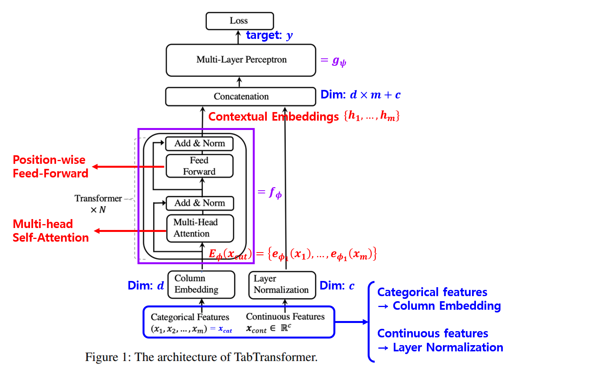

## 목차

* [1. TabTransformer 의 핵심 아이디어](#1-tabtransformer-의-핵심-아이디어)
* [2. TabTransformer 의 구조](#2-tabtransformer-의-구조)
  * [2-1. 트랜스포머 (Transformer)](#2-1-트랜스포머-transformer)
  * [2-2. 컬럼 임베딩](#2-2-컬럼-임베딩)
  * [2-3. 임베딩에 대한 Pre-training](#2-3-임베딩에-대한-pre-training)
* [3. 실험 설정](#3-실험-설정)
* [4. 실험 결과](#4-실험-결과)
  * [4-1. 트랜스포머 레이어의 효율성](#4-1-트랜스포머-레이어의-효율성)
  * [4-2. TabTransformer의 Robustness](#4-2-tabtransformer의-robustness)
  * [4-3. Supervised Learning](#4-3-supervised-learning)
  * [4-4. Semi-supervised Learning](#4-4-semi-supervised-learning)

## 논문 소개

* Xin Huang and Ashish Khetan et al., "TabTransformer: Tabular Data Modeling Using Contextual Embeddings", 2020
* [arXiv Link](https://arxiv.org/pdf/2012.06678)

## 1. TabTransformer 의 핵심 아이디어

* 핵심 아이디어
  * **Categorical** Feature 에 대한 **Contextual Embedding** 추출
  * 노이즈 및 [missing data](../../AI%20Basics/Data%20Science%20Basics/데이터_사이언스_기초_Missing_Value.md) 에 대해 robust 함
* TabTransformer의 특징
  * baseline MLP 및 최근의 Tabular Data 처리용 딥러닝보다 성능이 좋음

## 2. TabTransformer 의 구조

[(출처)](https://arxiv.org/pdf/2012.06678) : Xin Huang and Ashish Khetan et al., "TabTransformer: Tabular Data Modeling Using Contextual Embeddings"

* **1.** input feature $x$ 를 **$x_{cat}$ (categorical features), $x_{cont}$ (continuous features)** 로 구분
  * $x_{cat} = \lbrace x_1, ..., x_m \rbrace$ 에서, 각각의 $x_1$, ..., $x_m$ 이 categorical feature 를 의미
* **2.** 각각의 categorical feature $x_i$ 를 **Column Embedding** 을 이용하여 임베딩
* **3.** 각각의 임베딩된 **Column Embedding** 을 Transformer (= $f_\theta$) 에 입력
* **4.** Transformer 출력과 Layer Normalize 된 Continuous Feature 입력을 concatenate
* **5.** 마지막으로 Multi-Layer Perceptron (= $g_\psi$) 에 통과시켜서 최종 출력

Loss Function은 다음과 같다. ($H$ : categorical feature 에 대한 **cross entropy**, continuous feature 에 대한 **Mean-Squared Error**)

[(출처)](https://arxiv.org/pdf/2012.06678) : Xin Huang and Ashish Khetan et al., "TabTransformer: Tabular Data Modeling Using Contextual Embeddings"

### 2-1. 트랜스포머 (Transformer)

### 2-2. 컬럼 임베딩

### 2-3. 임베딩에 대한 Pre-training

## 3. 실험 설정

## 4. 실험 결과

### 4-1. 트랜스포머 레이어의 효율성

### 4-2. TabTransformer의 Robustness

### 4-3. Supervised Learning

### 4-4. Semi-supervised Learning

