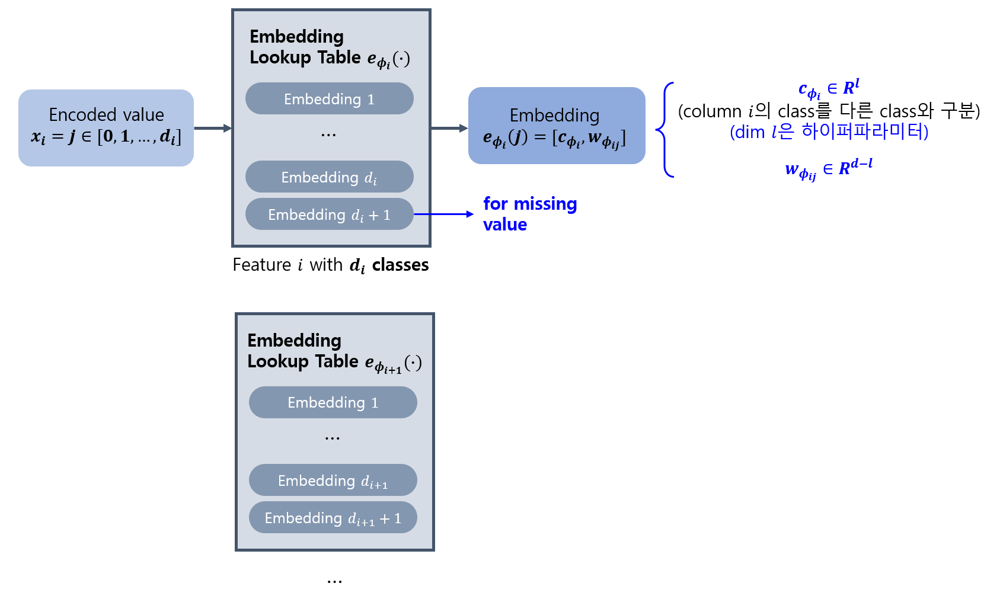
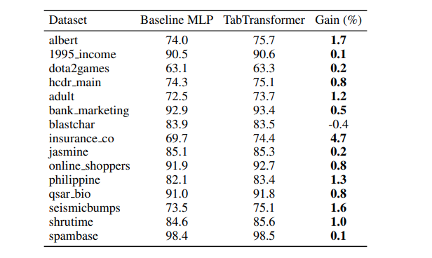
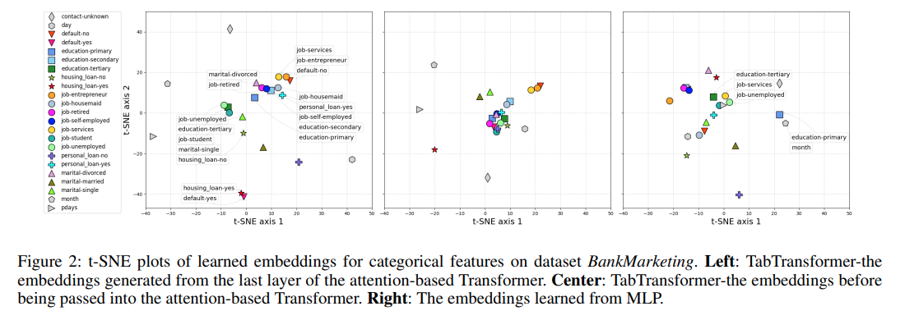
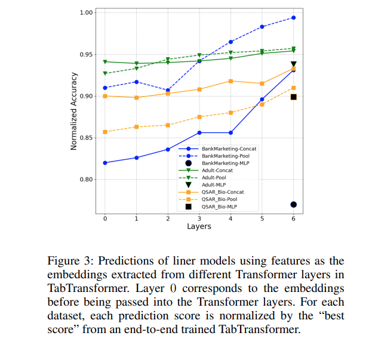
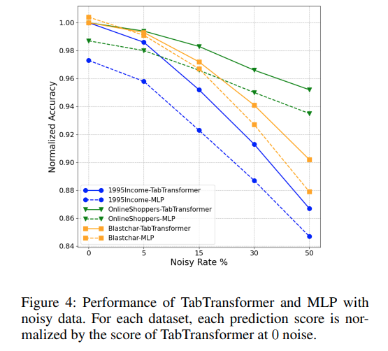
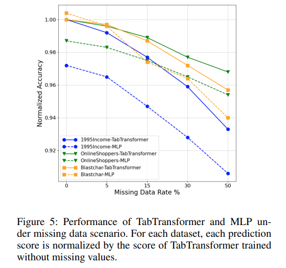
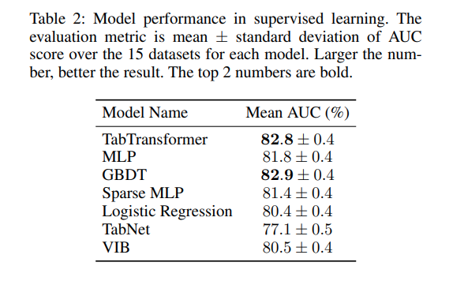
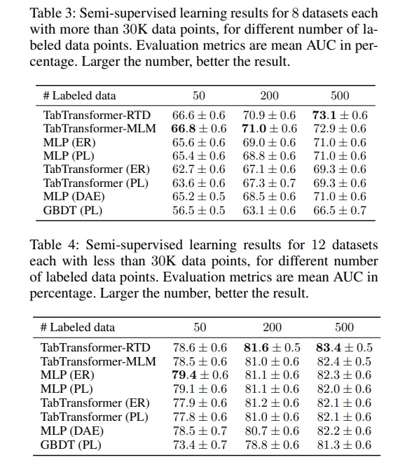

## 목차

* [1. TabTransformer 의 핵심 아이디어](#1-tabtransformer-의-핵심-아이디어)
* [2. TabTransformer 의 구조](#2-tabtransformer-의-구조)
  * [2-1. 트랜스포머 (Transformer)](#2-1-트랜스포머-transformer)
  * [2-2. 컬럼 임베딩](#2-2-컬럼-임베딩)
  * [2-3. 임베딩에 대한 Pre-training](#2-3-임베딩에-대한-pre-training)
* [3. 실험 설정](#3-실험-설정)
* [4. 실험 결과](#4-실험-결과)
  * [4-1. 트랜스포머 레이어의 효율성](#4-1-트랜스포머-레이어의-효율성)
  * [4-2. TabTransformer의 Robustness](#4-2-tabtransformer의-robustness)
  * [4-3. Supervised Learning](#4-3-supervised-learning)
  * [4-4. Semi-supervised Learning](#4-4-semi-supervised-learning)

## 논문 소개

* Xin Huang and Ashish Khetan et al., "TabTransformer: Tabular Data Modeling Using Contextual Embeddings", 2020
* [arXiv Link](https://arxiv.org/pdf/2012.06678)

## 1. TabTransformer 의 핵심 아이디어

* 핵심 아이디어
  * **Categorical** Feature 에 대한 **Contextual Embedding** 추출
  * 노이즈 및 [missing data](../../AI%20Basics/Data%20Science%20Basics/데이터_사이언스_기초_Missing_Value.md) 에 대해 robust 함
* TabTransformer의 특징
  * baseline MLP 및 최근의 Tabular Data 처리용 딥러닝보다 성능이 좋음

## 2. TabTransformer 의 구조

[(출처)](https://arxiv.org/pdf/2012.06678) : Xin Huang and Ashish Khetan et al., "TabTransformer: Tabular Data Modeling Using Contextual Embeddings"

* **1.** input feature $x$ 를 **$x_{cat}$ (categorical features), $x_{cont}$ (continuous features)** 로 구분
  * $x_{cat} = \lbrace x_1, ..., x_m \rbrace$ 에서, 각각의 $x_1$, ..., $x_m$ 이 categorical feature 를 의미
* **2.** 각각의 categorical feature $x_i$ 를 **Column Embedding** 을 이용하여 임베딩
* **3.** 각각의 임베딩된 **Column Embedding** 을 Transformer (= $f_\theta$) 에 입력
* **4.** Transformer 출력과 [Layer Normalize](../../AI%20Basics/Deep%20Learning%20Basics/딥러닝_기초_Regularization.md#4-2-layer-normalization) 된 Continuous Feature 입력을 concatenate
* **5.** 마지막으로 Multi-Layer Perceptron (= $g_\psi$) 에 통과시켜서 최종 출력

Loss Function은 다음과 같다. ($H$ : categorical feature 에 대한 **cross entropy**, continuous feature 에 대한 **Mean-Squared Error**)

[(출처)](https://arxiv.org/pdf/2012.06678) : Xin Huang and Ashish Khetan et al., "TabTransformer: Tabular Data Modeling Using Contextual Embeddings"

### 2-1. 트랜스포머 (Transformer)

* [Transformer (트랜스포머)](../../Natural%20Language%20Processing/Basics_트랜스포머%20모델.md) 구조는 GPT 시리즈 등 현대의 LLM 및 [ViT (Vision Transformer)](../../Image%20Processing/Basics_Vision_Transformer_ViT.md) 에 널리 쓰이는 구조이다.
  * **Multi-Head Self-Attention** 구조 이후에 **Feed-Forward** 구조 적용
  * **Key, Query, Value** 행렬 적용 ($m, k, v$ : 각각 embedding 개수, key/value 벡터의 차원)

| Key (K)                | Query (Q)              | Value (V)              |
|------------------------|------------------------|------------------------|
| $K \in R^{m \times k}$ | $Q \in R^{m \times k}$ | $V \in R^{m \times v}$ |

* $Attention(K, Q, V) = A · V$
* $\displaystyle A = softmax(\frac{(QK^T)}{\sqrt(K)})$
* $A \in R^{m \times m}$

### 2-2. 컬럼 임베딩

* 각각의 categorical feature (column) $i$ 에 대해, 위와 같이 **embedding lookup table** 을 이용한다.
  * 해당 feature의 class 개수가 $d_i$ 개이면, embedding table의 임베딩 개수는 **$d_i + 1$ 개 (마지막 임베딩은 missing value 용)** 이다. 
* **인코딩된 값 $x_i = j$** 에 대한 임베딩은 $e_{\phi_i}(j) = [c_{\phi_i}, w_{\phi_{ij}}]$ 이다.

| notation        | 설명                                                                                |
|-----------------|-----------------------------------------------------------------------------------|
| $c_{\phi_i}$    | column $i$ 에 대한 class를 **다른 column에 대한 class와 구분** - dimension $l$ 은 하이퍼파라미터 값 |
| $w_{\phi_{ij}}$ | -                                                                                 |

* 참고
  * Tabular data에는 **feature order가 없기** 때문에, positional encoding 을 사용하지 않는다.

### 2-3. 임베딩에 대한 Pre-training

* TabTransformer에서는 다음과 같은 2가지 방법을 이용하여 임베딩을 Pre-train 한다.

| 방법                             | 설명                                                                              |
|--------------------------------|---------------------------------------------------------------------------------|
| masked language modeling (MLM) | index $1$ 에서 $m$ 까지의 feature 중 $k$ % 의 feature 들을 랜덤하게 선택 후, **missing** 이라고 표시 |
| replaced token detection (RTD) | 원래의 feature 값을 해당 feature가 가질 수 있는 **random value 로 대체**                        |

* 2가지 방법의 Embedding Pre-train 을 적용한 TabTransformer를 각각 **TabTransformer-MLM, TabTransformer-RTD** 라고 한다.
* 본 실험에서 $k$ (MLM 에서 $k$ %의 feature들을 랜덤하게 선택) 의 값은 30으로 한다.

## 3. 실험 설정

**1. 학습 및 평가 데이터셋**

* 데이터 출처
  * UCI repository
  * the AutoML Challenge
  * Kaggle
* 데이터 분류
  * Supervised Learning (지도학습)
  * Semi-supervised Learning (반지도학습)
* 학습 설정
  * Cross-validation을 위해 **데이터를 5개의 부분으로 나눔**
  * train : valid : test 비율은 **65% : 15% : 20%** 로 설정
* categorical feature 개수는 각 데이터셋 별로 **최소 2개 ~ 최대 136개**

[(출처)](https://arxiv.org/pdf/2012.06678) : Xin Huang and Ashish Khetan et al., "TabTransformer: Tabular Data Modeling Using Contextual Embeddings"

**2. 실험 설정**

| 실험 설정 또는 하이퍼파라미터                      | 설정값                                                         |
|---------------------------------------|-------------------------------------------------------------|
| hidden dimension (embedding)          | 32                                                          |
| layer 개수                              | 6                                                           |
| attention head 개수                     | 8                                                           |
| MLP 레이어 크기                            | $\lbrace 4 \times l, 2 \times l \rbrace$ ($l$ : input size) |
| HPO (Hyper-param optimization) rounds | 각 Cross-Validation split 당 20 개의 HPO rounds                 |

## 4. 실험 결과

* 실험 결과 요약

| 실험                         | 결과 요약                                                                    |
|----------------------------|--------------------------------------------------------------------------|
| 트랜스포머 레이어의 효율성             | categorical feature 에 대한 임베딩 능력 및 예측 정확도는 **TabTransformer 가 MLP 보다 우수** |
| TabTransformer의 Robustness | TabTransformer는 **Noisy Data와 Missing Value가 있는 데이터에 대해 robust** 함       |
| Supervised Learning        | **TabTransformer 와 GBDT** 가 우수한 성능                                       |
| Semi-supervised Learning   | **TabTransformer 가 다른 모델과 결합되어 사용** 된 것이 MLP, GBDT보다 전체적으로 우수한 성능        |

### 4-1. 트랜스포머 레이어의 효율성

**1. feature class 간 특성의 임베딩 능력**

* 다음 그림은 **BankMarketing** 데이터셋에 대해, **categorical feature에 대한 학습된 임베딩을 t-SNE 처리하여 표시** 한 것이다.
* **Transformer** 에 의한 임베딩의 경우, **회색 표시 (non client-based) 와 컬러 표시 (client-based) 간 구분이 비교적 뚜렷** 하다.

[(출처)](https://arxiv.org/pdf/2012.06678) : Xin Huang and Ashish Khetan et al., "TabTransformer: Tabular Data Modeling Using Contextual Embeddings"

| 그림 위치  | 설명                                                                  |
|--------|---------------------------------------------------------------------|
| 왼쪽 그림  | TabTransformer의 Attention-based Transformer의 **마지막 레이어** 에서 생성된 임베딩 |
| 가운데 그림 | TabTransformer에서 Attention-based Transformer로 **입력되기 전의** 임베딩       |
| 오른쪽 그림 | **MLP 로부터 학습된** 임베딩                                                 |

**2. 예측 정확도 (Prediction Accuracy)**

* 다음 그림은 **BankMarketing, Adult, QSAR_Bio** 데이터셋에 대한 예측 정확도 측정 실험 결과이다.
* 실험 설명
  * **서로 다른 레이어** 에서의 예측 정확도 비교
  * 각 데이터셋에 대해, prediction score는 **end-to-end trained TabTransformer의 best score 기준으로 정규화** 됨
* 실험 결과
  * **단순 MLP 모델** 을 이용했을 때의 embedding에서 **가장 낮은 성능** 이 나왔다.

[(출처)](https://arxiv.org/pdf/2012.06678) : Xin Huang and Ashish Khetan et al., "TabTransformer: Tabular Data Modeling Using Contextual Embeddings"

### 4-2. TabTransformer의 Robustness

* 결론적으로, **TabTransformer는 Noisy Data와 Missing Value가 있는 데이터에서 robust** 하다.

| 구분                    | 실험 설정                                                 | 실험 결과                                    |
|-----------------------|-------------------------------------------------------|------------------------------------------|
| Noisy Data            | 특정 컬럼 (feature) 에 대해, **특정 개수만큼의 값을 랜덤하게 생성된 값으로 교체** |  |
| Missing Value가 있는 데이터 | 일정 개수의 값을 **missing data** 로 처리한 후, 이 데이터셋으로 학습       |  |

[(실험 결과 이미지 출처)](https://arxiv.org/pdf/2012.06678) : Xin Huang and Ashish Khetan et al., "TabTransformer: Tabular Data Modeling Using Contextual Embeddings"

### 4-3. Supervised Learning

여기서는 TabTransformer 의 성능을 다음 4가지 방법과 비교하여 측정한다.

* Logistic Regression & GBDT
* MLP & Sparse MLP
* Arik and Pfister의 TabNet 모델 (2019년)
* Variational Information Bottleneck (VBI) 모델 (2017년)

**15개 데이터셋 전체** 에 대해 실험한 결과, 다음과 같이 **TabTransformer 와 GBDT** 가 우수한 성능을 보였다.

[(출처)](https://arxiv.org/pdf/2012.06678) : Xin Huang and Ashish Khetan et al., "TabTransformer: Tabular Data Modeling Using Contextual Embeddings"

### 4-4. Semi-supervised Learning

여기서는 TabTransformer 를 **Pre-train 한 다음 Fine-Tuning** 하고, 이 모델을 여러 가지 Semi-Supervised (반지도학습) 모델과 비교한다.

**각각 8개, 12개 데이터셋** 에 대해 실험한 결과, **TabTransformer 가 다른 모델과 결합되어 사용** 된 것이 MLP, GBDT보다 전체적으로 우수한 성능을 보였다.

[(출처)](https://arxiv.org/pdf/2012.06678) : Xin Huang and Ashish Khetan et al., "TabTransformer: Tabular Data Modeling Using Contextual Embeddings"
