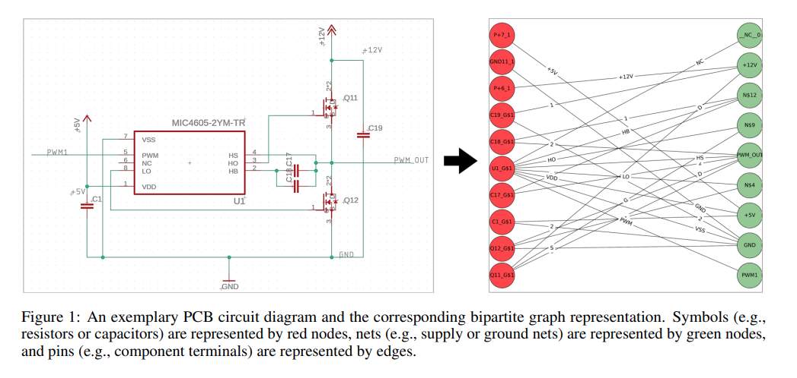
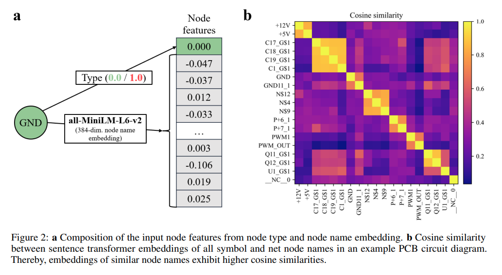

## 목차

* [1. 논문 개요](#1-논문-개요)
* [2. 관련 분야](#2-관련-분야)
* [3. PCB Schematics (회로도) 의 그래프 표현](#3-pcb-schematics-회로도-의-그래프-표현)
* [4. 회로도 컴포넌트 추가를 위한 Node Pair 예측](#4-회로도-컴포넌트-추가를-위한-node-pair-예측)
* [5. 실험 및 그 결과](#5-실험-및-그-결과)
  * [5-1. 데이터셋, 모델, 기타 실험 설정](#5-1-데이터셋-모델-기타-실험-설정)
  * [5-2. (실험 1) Pull-Up, Pull-Down 레지스터 추가](#5-2-실험-1-pull-up-pull-down-레지스터-추가)
  * [5-3. (실험 2) RC 필터 추가](#5-3-실험-2-rc-필터-추가)
  * [5-4. (실험 3) Decoupling Capacitor (고주파 노이즈 제거 부품) 추가](#5-4-실험-3-decoupling-capacitor-고주파-노이즈-제거-부품-추가)
* [6. 논문 결론](#6-논문-결론)

## 논문 소개

* Pascal Plettenberg and André Alcalde et al., "Graph Neural Networks for Automatic Addition of Optimizing Components in Printed Circuit Board Schematics", 2025
* [arXiv Link](https://arxiv.org/pdf/2506.10577)

## 1. 논문 개요

이 논문에서는 다음과 같은 내용을 다룬다.

* PCB schematics (회로도) 에 대한 **bipartite graph (이분 그래프)** 표현
* 회로도에 **컴포넌트를 적절한 위치에 추가** 하는 task를 최적화하기 위한, **GNN 기반 node-pair-level 예측 모델**
* 실제 데이터셋 기반 실험
  * GNN을 통해, 신규 컴포넌트의 추가 위치를 **높은 정확도로 예측 가능** 함을 실증

## 2. 관련 분야

이 논문의 관련 분야는 다음과 같다.

| 관련 분야                                     | 설명                                                                                                                                         |
|-------------------------------------------|--------------------------------------------------------------------------------------------------------------------------------------------|
| 전자 설계 자동화를 위한 머신러닝                        | - 디지털 회로 설계 (logic synthesis, 라우팅 등) - 회로 토폴로지 최적화 등을 위한 강화학습, 아날로그 회로 사이징에 머신러닝 활용 등 - 이러한 연구들은 **전자 회로의 그래프 구조를 활용하지 못한다는 것이 한계점** |
| 전자 설계 자동화를 위한 그래프 학습                      | - 일부 전자 회로는 **그래프 형태로 표현 가능** - 대부분의 연구는 전자 설계 자동화를 디지털로 실시 - 아날로그 전자 설계 자동화를 위한 GNN 기반 접근 방식 (ParaGraph 등) 존재                       |
| 회로 설계를 완성하기 위한 GNN (Graph Neural Network) | **일부분만 설계된 아날로그 회로의 설계를 완성** 하기 위해 GNN을 사용하는 연구가, 본 논문의 연구와 가장 가까운 컨셉에 해당                                                                  |

## 3. PCB Schematics (회로도) 의 그래프 표현

* 회로도는 일반적으로 **2개의 서로 다른 종류의 node** 로 이루어진 **bipartite graph** 로 구성된다.
  * **Net node끼리, 혹은 Symbol node끼리 연결되는 일은 없다.**

| node 종류      | 설명                    | 특징                            |
|--------------|-----------------------|-------------------------------|
| Net nodes    | ground, supply nets 등 | symbol node (레지스터 등) 와 항상 연결됨 |
| Symbol nodes | 레지스터 등을 나타내는 node     | Net nodes 와 항상 연결됨            |

* 회로도의 Node, Edge attribute 들은 다음과 같다.
  * 여기서는 Node Attribute 의 이름 임베딩에 `all-MiniLM-L6-v2` 모델을 사용했다.  
  * 이 방법은 **유연성이 높고 전처리 비용이 적게 든다.**

| 구분              | 설명                                                                                                                                                                                                                                      |
|-----------------|-----------------------------------------------------------------------------------------------------------------------------------------------------------------------------------------------------------------------------------------|
| Node Attributes | 노드에 대한 정보는 **type, name 정보** 로 구성된다. - Type 정보는 **net node는 0, symbol node는 1** 로 표현된다. (binary variable) - Name 정보는 원본 schematics 파일에 **string 형태로 저장** 된다. (`GND`, `C1_G$1` 등) - Name 정보는 **사전 학습된 언어 모델을 이용하여 벡터로 임베딩** 된다. |
| Edge Attributes | Node name과 마찬가지로, **사전학습된 Sentence Transformer 임베딩 모델** 을 이용하여 **384차원 벡터로 임베딩** 된다. - 이때, 평행한 여러 edge들은 **개별 pin name에 대한 임베딩을 합산 → edge 개수를 나타내는 표현과 concatenate** 하여 single edge로 합친다.                                            |

* 예시 회로도의 그래프 표현

[(출처)](https://arxiv.org/pdf/2502.01013) : Pascal Plettenberg and André Alcalde et al., "Graph Neural Networks for Automatic Addition of Optimizing Components in Printed Circuit Board Schematics"

* Node Type & Node Name 임베딩 + Cosine Similarity 비교

[(출처)](https://arxiv.org/pdf/2502.01013) : Pascal Plettenberg and André Alcalde et al., "Graph Neural Networks for Automatic Addition of Optimizing Components in Printed Circuit Board Schematics"

## 4. 회로도 컴포넌트 추가를 위한 Node Pair 예측

## 5. 실험 및 그 결과

### 5-1. 데이터셋, 모델, 기타 실험 설정

### 5-2. (실험 1) Pull-Up, Pull-Down 레지스터 추가

### 5-3. (실험 2) RC 필터 추가

### 5-4. (실험 3) Decoupling Capacitor (고주파 노이즈 제거 부품) 추가

## 6. 논문 결론
