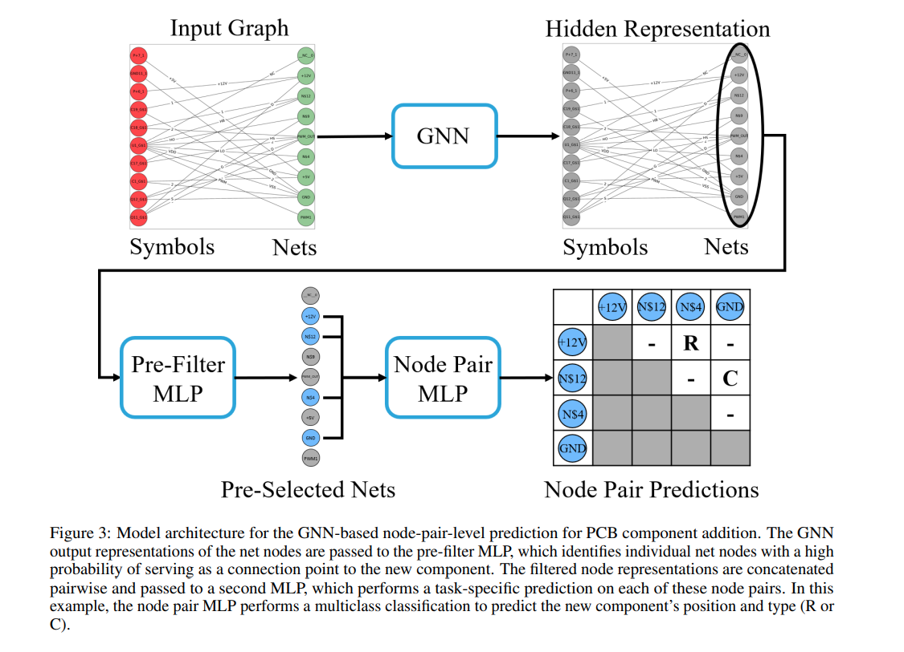
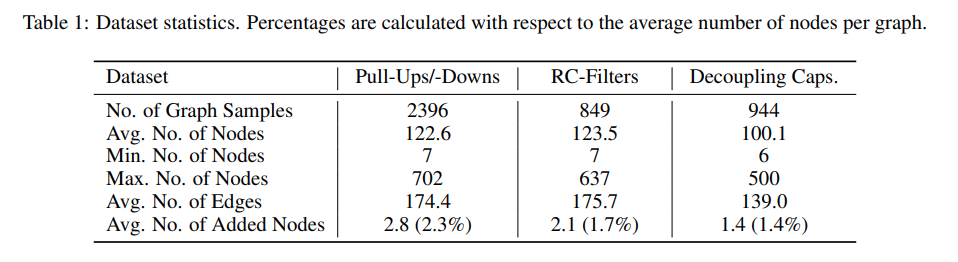
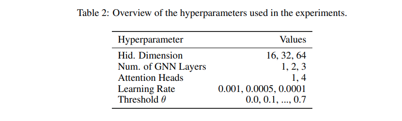
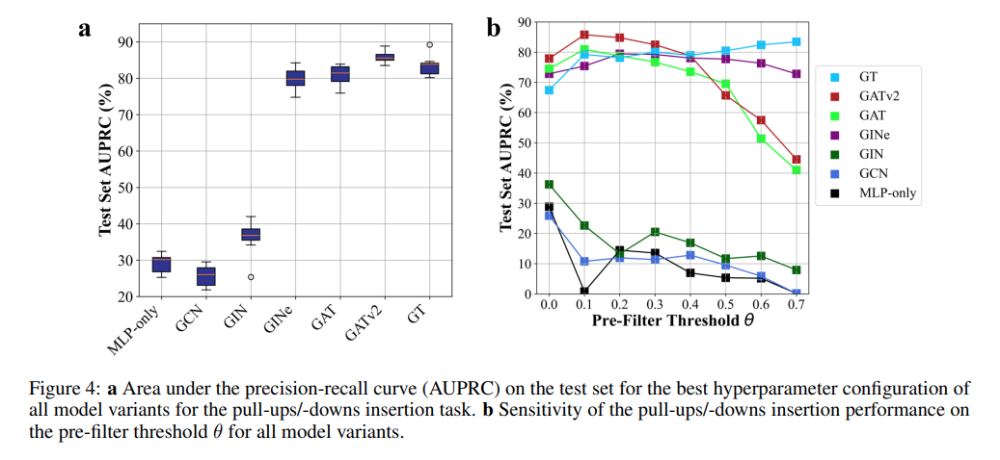
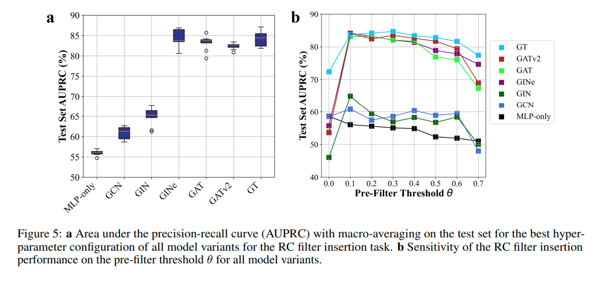
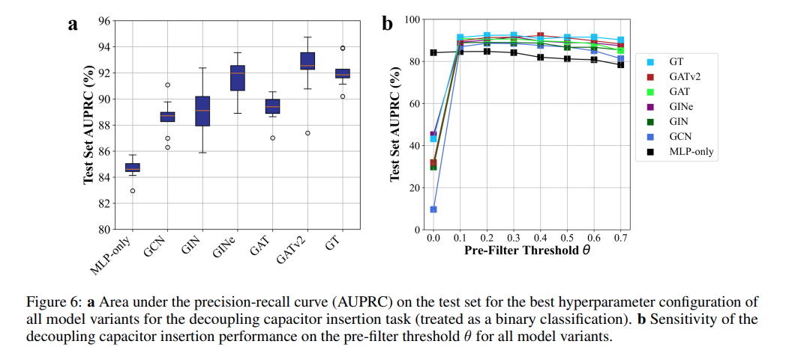
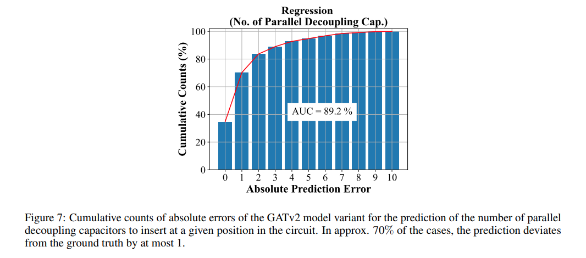

## 목차

* [1. 논문 개요](#1-논문-개요)
* [2. 관련 분야](#2-관련-분야)
* [3. PCB Schematics (회로도) 의 그래프 표현](#3-pcb-schematics-회로도-의-그래프-표현)
* [4. 회로도 컴포넌트 추가를 위한 Node Pair 예측](#4-회로도-컴포넌트-추가를-위한-node-pair-예측)
  * [4-1. 모델 구조](#4-1-모델-구조) 
* [5. 실험 및 그 결과](#5-실험-및-그-결과)
  * [5-1. 데이터셋, 모델, 기타 실험 설정](#5-1-데이터셋-모델-기타-실험-설정)
  * [5-2. (실험 1) Pull-Up, Pull-Down 레지스터 추가](#5-2-실험-1-pull-up-pull-down-레지스터-추가)
  * [5-3. (실험 2) RC 필터 추가](#5-3-실험-2-rc-필터-추가)
  * [5-4. (실험 3) Decoupling Capacitor (고주파 노이즈 제거 부품) 추가](#5-4-실험-3-decoupling-capacitor-고주파-노이즈-제거-부품-추가)
* [6. 논문 결론](#6-논문-결론)

## 논문 소개

* Pascal Plettenberg and André Alcalde et al., "Graph Neural Networks for Automatic Addition of Optimizing Components in Printed Circuit Board Schematics", 2025
* [arXiv Link](https://arxiv.org/pdf/2506.10577)

## 1. 논문 개요

이 논문에서는 다음과 같은 내용을 다룬다.

* PCB schematics (회로도) 에 대한 **bipartite graph (이분 그래프)** 표현
* 회로도에 **컴포넌트를 적절한 위치에 추가** 하는 task를 최적화하기 위한, **GNN 기반 node-pair-level 예측 모델**
* 실제 데이터셋 기반 실험
  * GNN을 통해, 신규 컴포넌트의 추가 위치를 **높은 정확도로 예측 가능** 함을 실증

## 2. 관련 분야

이 논문의 관련 분야는 다음과 같다.

| 관련 분야                                     | 설명                                                                                                                                         |
|-------------------------------------------|--------------------------------------------------------------------------------------------------------------------------------------------|
| 전자 설계 자동화를 위한 머신러닝                        | - 디지털 회로 설계 (logic synthesis, 라우팅 등) - 회로 토폴로지 최적화 등을 위한 강화학습, 아날로그 회로 사이징에 머신러닝 활용 등 - 이러한 연구들은 **전자 회로의 그래프 구조를 활용하지 못한다는 것이 한계점** |
| 전자 설계 자동화를 위한 그래프 학습                      | - 일부 전자 회로는 **그래프 형태로 표현 가능** - 대부분의 연구는 전자 설계 자동화를 디지털로 실시 - 아날로그 전자 설계 자동화를 위한 GNN 기반 접근 방식 (ParaGraph 등) 존재                       |
| 회로 설계를 완성하기 위한 GNN (Graph Neural Network) | **일부분만 설계된 아날로그 회로의 설계를 완성** 하기 위해 GNN을 사용하는 연구가, 본 논문의 연구와 가장 가까운 컨셉에 해당                                                                  |

## 3. PCB Schematics (회로도) 의 그래프 표현

* 회로도는 일반적으로 **2개의 서로 다른 종류의 node** 로 이루어진 **bipartite graph** 로 구성된다.
  * **Net node끼리, 혹은 Symbol node끼리 연결되는 일은 없다.**

| node 종류      | 설명                    | 특징                            |
|--------------|-----------------------|-------------------------------|
| Net nodes    | ground, supply nets 등 | symbol node (레지스터 등) 와 항상 연결됨 |
| Symbol nodes | 레지스터 등을 나타내는 node     | Net nodes 와 항상 연결됨            |

* 회로도의 Node, Edge attribute 들은 다음과 같다.
  * 여기서는 Node Attribute 의 이름 임베딩에 `all-MiniLM-L6-v2` 모델을 사용했다.  
  * 이 방법은 **유연성이 높고 전처리 비용이 적게 든다.**

| 구분              | 설명                                                                                                                                                                                                                                      |
|-----------------|-----------------------------------------------------------------------------------------------------------------------------------------------------------------------------------------------------------------------------------------|
| Node Attributes | 노드에 대한 정보는 **type, name 정보** 로 구성된다. - Type 정보는 **net node는 0, symbol node는 1** 로 표현된다. (binary variable) - Name 정보는 원본 schematics 파일에 **string 형태로 저장** 된다. (`GND`, `C1_G$1` 등) - Name 정보는 **사전 학습된 언어 모델을 이용하여 벡터로 임베딩** 된다. |
| Edge Attributes | Node name과 마찬가지로, **사전학습된 Sentence Transformer 임베딩 모델** 을 이용하여 **384차원 벡터로 임베딩** 된다. - 이때, 평행한 여러 edge들은 **개별 pin name에 대한 임베딩을 합산 → edge 개수를 나타내는 표현과 concatenate** 하여 single edge로 합친다.                                            |

* 예시 회로도의 그래프 표현

[(출처)](https://arxiv.org/pdf/2502.01013) : Pascal Plettenberg and André Alcalde et al., "Graph Neural Networks for Automatic Addition of Optimizing Components in Printed Circuit Board Schematics"

* Node Type & Node Name 임베딩 + Cosine Similarity 비교

[(출처)](https://arxiv.org/pdf/2502.01013) : Pascal Plettenberg and André Alcalde et al., "Graph Neural Networks for Automatic Addition of Optimizing Components in Printed Circuit Board Schematics"

## 4. 회로도 컴포넌트 추가를 위한 Node Pair 예측

* 핵심 Task 개요
  * 이 논문의 목표는 **새로운 컴포넌트를 회로도에 추가하고, 회로도에서 그 컴포넌트의 위치를 정확히 예측 (최적화)** 하는 것이다.
  * 대부분의 경우에, **신규 컴포넌트는 레지스터 또는 capacitor** 이고, **정확히 2개의 node에 연결** 되어야 한다.
  * 따라서, task는 **새로운 컴포넌트를 그 사이에 끼워 넣을, 2개의 Net node 쌍을 예측** 하는 것이 된다.

* Node에 대한 Pre-filtering
  * 흔히 다음과 같은 방법을 생각할 수 있지만, 이 방법은 **수백 개 이상의 node로 구성된 거대한 회로도에서는 계산 복잡도가 너무 크다.**
    * `GNN을 이용한 node representation 계산 → 각 net node 쌍에 대한 확률 값 계산`
  * 따라서 다음과 같이 **확인해야 할 node pair 개수를 줄이는** 방법을 사용한다.
    * symbol node (다른 symbol node와 **직접 연결 불가** 함) 를 추가한다는 점을 고려하여 **검색 범위 제한**
    * 새로운 컴포넌트의 connection point가 되기 **어렵다고 판단되는 Net node를 제거**

### 4-1. 모델 구조

[(출처)](https://arxiv.org/pdf/2502.01013) : Pascal Plettenberg and André Alcalde et al., "Graph Neural Networks for Automatic Addition of Optimizing Components in Printed Circuit Board Schematics"

* 입력 데이터
  * node type, node name의 조합
  * pin name embedding 을 포함한 edge attributes

* 모델 동작 프로세스
  * **1.** 임의의 GNN을 이용하여, **그래프의 hidden node representation** 계산
  * **2.** 최종적으로 계산된 node representation을 **Pre-Filter MLP** 에 전달
    * Pre-filtering MLP는 **각 Net Node 표현에 대해 확률 값** 부여 
  * **3. 확률 값이 일정 threshold $\theta$ 이상** 인 net node 만을 node pair prediction module 로 전달
  * **4.** node pair prediction module 은 **MLP 형태** 로, **2개의 node representation 의 concatenation** 에 대해 **최종 결과값 (점수)** 예측

* 최종 출력값
  * node pair prediction 모듈의 최종 결과값 (출력값) 은 다음과 같이 **학습 task의 종류에 따라 서로 다르다.**

| 학습 task 종류                 | 최종 출력값                                                    |
|----------------------------|-----------------------------------------------------------|
| binary classification      | 새로운 컴포넌트의 **종류가 이미 알려졌을** 때                               |
| Multi-class classification | 컴포넌트의 **가능한 종류가 여러 가지** 일 때                               |
| Regression                 | 특정 node pair 사이에 삽입할 **평행한 컴포넌트의 개수를 예측** 하는 task 에 대해 사용 |

## 5. 실험 및 그 결과

* 실험 결과 요약

| 실험 Task                                 | 최고 AUROC 값 | AUROC 최고 case 일 때의 모델 및 하이퍼파라미터                                                                                                                                                       |
|-----------------------------------------|------------|---------------------------------------------------------------------------------------------------------------------------------------------------------------------------------------|
| Pull-Up & Pull-Down 레지스터 추가             | 약 85.8 %   | `GATv2` with Pre-filter Threshold $\theta = 0.1$                                                                                                                                      |
| RC 필터 추가                                | 약 84 %     | - `GATv2` with Pre-filter Threshold $\theta = 0.1$ - `GT` with Pre-filter Threshold $\theta = 0.3$                                                                                 |
| Decoupling Capacitor (고주파 노이즈 제거 부품) 추가 | 약 92 %     | - `GATv2` with Pre-filter Threshold $\theta = 0.4$ - `GT` with Pre-filter Threshold $\theta = 0.2$ or $\theta = 0.3$ - Decoupling Capacitor 의 정확한 개수 예측은 **1개 이내로 틀린 것이 약 70%** |

### 5-1. 데이터셋, 모델, 기타 실험 설정

* 데이터셋
  * 3개의 각 task 에 대해 1개씩, 총 3개의 **라벨링 된 회로도 데이터셋** (대규모 데이터)
  * 각 회로에 있는 net node pair 는 **task의 종류에 따라 label $\hat{y}_{pair}$ 부여**
  * 각 net node에 대해, **connection point 로 기능하는지** 여부를 나타내는 binary label $\hat{y}_{node}$ 부여
    * 해당 label은 **Pre-filter MLP** 에 사용 

[(출처)](https://arxiv.org/pdf/2502.01013) : Pascal Plettenberg and André Alcalde et al., "Graph Neural Networks for Automatic Addition of Optimizing Components in Printed Circuit Board Schematics"

* GNN 모델
  * 서로 다른 GNN backbone 모델 사용

| GNN backbone 모델         | 설명                                                                                        |
|-------------------------|-------------------------------------------------------------------------------------------|
| `GCN`                   | Graph Convolutional Network                                                               |
| `GIN`                   | Graph Isomorphism Network (vertex, edge 연결 구조의 동일성 기반)                                    |
| `GINe`                  | GIN + **Edge Attributes**                                                                 |
| `GAT`                   | Graph Attention Network (**Attention 메커니즘** 적용, 즉 각 이웃 node들이 **서로 다른 weight** 을 가질 수 있음) |
| `GATv2`                 | -                                                                                         |
| `GT (GraphTransformer)` | Graph의 Sparse한 특성을 다루기 위해, **이웃 노드끼리만 Attention 메커니즘 적용**                                 |

* Loss Function

$$L = BCE(y_{node}, \hat{y}_{node}) + L_{Task}(y_{pair}, \hat{y}_{pair})$$

* 각 Task 별 $L_{Task}$ 수식
  * $z_{pair}$ 의 값은, $y_{pair} \ge 1$ 이면 1, 그렇지 않으면 0
  * (BCE $z$ part) = $BCE(z_{pair}, \hat{z}_{pair})$
  * (MSE $y$ part) = $MSE(y_{pair}, \hat{y}_{pair})$

| Task                                    | $L_{Task}$ 수식                                                            | 수식 의미                                                                                                                                  |
|-----------------------------------------|--------------------------------------------------------------------------|----------------------------------------------------------------------------------------------------------------------------------------|
| Pull-Up & Pull-Down 레지스터 추가             | $L_{Task} = BCE(y_{pair}, \hat{y}_{pair})$                               | Pull-Up, Pull-Down 레지스터를 **서로 구분하지 않고 동일한 경우로 간주**                                                                                     |
| RC 필터 추가                                | $L_{Task} = CEL(y_{pair}, \hat{y}_{pair})$ (CEL = Cross-Entropy Loss) | RC filter의 배치를 **Multi-Class 분류 task** 로 간주                                                                                            |
| Decoupling Capacitor (고주파 노이즈 제거 부품) 추가 | $L_{Task}$ = (BCE $z$ part) + $\alpha \times$ (MSE $y$ part)             | - 최소 1개의 decoupling capacitors 가 추가되어야 하는지 검사 (label $z_{pair}$) - capacitor 의 **정확한 개수 예측** - weight $\alpha$ 를 이용하여 학습 프로세스 조정 |

* 하이퍼파라미터

[(출처)](https://arxiv.org/pdf/2502.01013) : Pascal Plettenberg and André Alcalde et al., "Graph Neural Networks for Automatic Addition of Optimizing Components in Printed Circuit Board Schematics"

### 5-2. (실험 1) Pull-Up, Pull-Down 레지스터 추가

[(출처)](https://arxiv.org/pdf/2502.01013) : Pascal Plettenberg and André Alcalde et al., "Graph Neural Networks for Automatic Addition of Optimizing Components in Printed Circuit Board Schematics"

* `GINe` `GAT` `GATv2` `GT` 모델의 성능이 좋음
* 특히, `GATv2` 에 대해 Pre-filter Threshold $\theta = 0.1$ 일 때 성능이 가장 좋음 **(AUROC 약 85.8%)**

### 5-3. (실험 2) RC 필터 추가

[(출처)](https://arxiv.org/pdf/2502.01013) : Pascal Plettenberg and André Alcalde et al., "Graph Neural Networks for Automatic Addition of Optimizing Components in Printed Circuit Board Schematics"

* `GINe` `GAT` `GATv2` `GT` 모델의 성능이 좋음
* 특히, 다음과 같은 경우 성능이 가장 좋음 **(AUROC 약 84%)**
  * `GATv2` 에 대해 Pre-filter Threshold $\theta = 0.1$ 일 때
  * `GT` 에 대해 Pre-filter Threshold $\theta = 0.3$ 일 때

### 5-4. (실험 3) Decoupling Capacitor (고주파 노이즈 제거 부품) 추가

**1. Binary Classification 결과**

[(출처)](https://arxiv.org/pdf/2502.01013) : Pascal Plettenberg and André Alcalde et al., "Graph Neural Networks for Automatic Addition of Optimizing Components in Printed Circuit Board Schematics"

* `GINe` `GATv2` `GT` 모델의 성능이 좋음
* 특히, 다음과 같은 경우 성능이 가장 좋음 **(AUROC 약 92%)**
  * `GATv2` 에 대해 Pre-filter Threshold $\theta = 0.4$ 일 때
  * `GT` 에 대해 Pre-filter Threshold $\theta = 0.2$ 또는 $\theta = 0.3$ 일 때

**2. Regression 결과 (Decoupling Capacitor 추가 개수 예측)**

[(출처)](https://arxiv.org/pdf/2502.01013) : Pascal Plettenberg and André Alcalde et al., "Graph Neural Networks for Automatic Addition of Optimizing Components in Printed Circuit Board Schematics"

* `GATv2` 모델, $\alpha = 0.1$ 기준
* 추가해야 할 Decoupling Capacitor 개수를 정확히 맞힌 테스트 케이스 비율 약 35%, **1개 이내로 틀린** 테스트 케이스의 비율이 전체의 **약 70%**
* AUC = **89.2%**

## 6. 논문 결론
