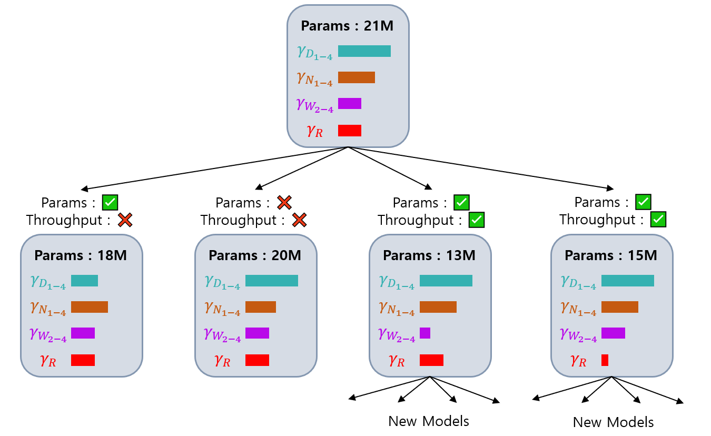

## 목차

* [1. 핵심 아이디어](#1-핵심-아이디어)
* [2. Fast Pre-training Distillation](#2-fast-pre-training-distillation)
  * [2-1. 해결하려는 문제 및 그 해결 방법](#2-1-해결하려는-문제-및-그-해결-방법) 
  * [2-2. 수학적 원리](#2-2-수학적-원리)
  * [2-3. Soft Labels](#2-3-soft-labels) 
  * [2-4. Data Augmentation Encoding](#2-4-data-augmentation-encoding)
* [3. 모델 상세 구조](#3-모델-상세-구조)
  * [3-1. 계층적인 Vision Transformer](#3-1-계층적인-vision-transformer) 
  * [3-2. Contraction Factors](#3-2-contraction-factors)
  * [3-3. 모델 설정값 (하이퍼파라미터 등)](#3-3-모델-설정값-하이퍼파라미터-등)
* [4. 모델에 대한 질문거리](#4-모델에-대한-질문거리)
  * [4-1. 작은 모델이 큰 데이터를 학습하기 어려운 원인은?](#4-1-작은-모델이-큰-데이터를-학습하기-어려운-원인은)
  * [4-2. Distillation 은 이것을 어떻게 극복하는가?](#4-2-distillation-은-이것을-어떻게-극복하는가)
* [5. 실험 결과](#5-실험-결과)
  * [5-1. Ablation Study](#5-1-ablation-study)
  * [5-2. ImageNet 분류 실험 결과](#5-2-imagenet-분류-실험-결과)
  * [5-3. Object Detection 실험 결과](#5-3-object-detection-실험-결과)

## 논문 소개

* Kan Wu and Jinnian Zhang et al., TinyViT: Fast Pretraining Distillation for Small Vision Transformers
* [Arxiv Link](https://arxiv.org/pdf/2207.10666v1)

## 1. 핵심 아이디어

TinyViT 의 핵심 아이디어는 다음과 같다.

* 큰 데이터에 대한 **Fast Pre-training Distillation** 을 통한, [작은 모델의 Pre-training](../../AI%20Basics/Deep%20Learning%20Basics/딥러닝_기초_Transfer_Learning.md#3-1-사전-학습-pre-training)
  * Distillation 과정에서 **Data augmentation 및 Teacher 모델의 예측 정보를 미리 저장** 한 후 빠르게 사용
  * 이를 통해 Teacher Model 의 연산량 및 메모리 사용량 감소
* 큰 모델에서 시작하여 다음을 여러 차례 반복 (**constrained local search** 의 일종)
  * 현재 모델에서 contraction factor 값을 조정하여 **작은 크기의 후보 모델** 을 여러 개 생성
  * 이들 중 **파라미터 개수 및 throughput 조건을 만족시키는** 것들을 선택


[(출처)](https://arxiv.org/pdf/2207.10666v1) : Kan Wu and Jinnian Zhang et al., "TinyViT: Fast Pretraining Distillation for Small Vision Transformers"

## 2. Fast Pre-training Distillation

다음과 같은 문제를 해결하기 위해 Fast Pre-training Distillation 을 이용한다.

| 구분    | 설명                                                                                                                                                                                                          |
|-------|-------------------------------------------------------------------------------------------------------------------------------------------------------------------------------------------------------------|
| 문제점   | - 작은 모델을 거대한 데이터로 직접 Pre-training 하는 것은 **큰 효과가 없음**<br>- [Knowledge Distillation](../../AI%20Basics/Deep%20Learning%20Basics/딥러닝_기초_Knowledge_Distillation.md) 을 이용하는 Pre-training 은 **효율적이지 않고 자원 소비가 큼** |
| 해결 방법 | - Fast Training Distillation<br>- Distillation 과정에서 **Data Augmentation 및 Teacher 모델의 예측 등 정보를 저장하고 이를 재사용**                                                                                                |

### 2-1. 해결하려는 문제 및 그 해결 방법

**1. 작은 모델을 거대한 데이터로 직접 Pre-training 하는 것은 큰 효과가 없음**

* 다음 그래프에서 TinyViT w/ pretrain 은 TinyViT w/o pretrain 에 비해 **성능의 큰 향상이 없다.**


[(출처)](https://arxiv.org/pdf/2207.10666v1) : Kan Wu and Jinnian Zhang et al., "TinyViT: Fast Pretraining Distillation for Small Vision Transformers"

**2. [Knowledge Distillation](../../AI%20Basics/Deep%20Learning%20Basics/딥러닝_기초_Knowledge_Distillation.md) 을 이용하는 Pre-training 은 효율적이지 않고 자원 소비가 큼**

* 이는 Distillation 을 위해서는 Teacher Model 로 학습 데이터를 입력하여 그 출력까지 확인해야 하는데, 이때의 **자원 소비가 Student Model 만을 학습시킬 때에 비해 훨씬 크기** 때문이다.
* 또한, 이때 **GPU 메모리 역시 많이 소비** 되기 때문이다.

**3. 해결 방법: Fast Training Distillation**

* 다음과 같은 정보를 저장한 후, **학습 중 필요할 때마다 재사용** 한다. 이를 통해 Distillation 과정에서 **연산량 및 메모리 사용량을 감소** 시킬 수 있다.
  * Data Augmentation 에 대한 정보
  * Teacher model 의 예측
* 이 방법론의 핵심 요소는 다음과 같다.
  * [Soft Labels](#2-3-soft-labels)
  * [Data Augmentation Encoding](#2-4-data-augmentation-encoding)

### 2-2. 수학적 원리

* 입력 이미지 $x$ 와 Data Augmentation 방법 $A$ 에 대해서, 다음을 저장할 수 있다.
  * Data Augmentation 방법 $A$
  * Teacher 모델의 예측 $\hat{y} = T(A(x))$
  * 이때, **Data Augmentation 의 Randomness** 가 있기 때문에, $(A, \hat{y})$ 가 **각 이미지 별, 매번 실행 시마다** 저장되어야 한다. 
* 학습 시의 Loss $L$ 은 다음과 같이 계산한다. 
  * $L = CE(\hat{y}, S(A(x)))$ (단, $S$ 는 Student Model)
  * 이때 $CE$ 는 [Cross Entropy Loss](../../AI%20Basics/Deep%20Learning%20Basics/딥러닝_기초_Loss_function.md#2-5-categorical-cross-entropy-loss) 를 의미한다.
* 이때, **Fast Training Distillation 을 통해서는 아래와 같이 Soft Label 을 생성** 하므로, **Ground-truth Label 에 대한 정보는 불필요** 하다.

### 2-3. Soft Labels

Soft Labels 는 **이미지 분류 모델은 기본적으로 Class 의 개수 (1,000 개 이상일 수도 있음) 만큼의 logit 을 생성하지만, 여기서는 그 중 중요한 몇 개만 저장** 하는 아이디어이다.

* logit 의 값들 중 **상위 K 개의 값들 ($\hat{y}_{I(k)}, k=1,2,...,K$) 만 저장** 한다.
* 나머지의 경우는 상위 K 개의 logit 까지 포함한 전체 logit 값의 합이 1이 되도록 모두 동일한 확률 값을 할당한다.

이를 수식으로 표현하면 다음과 같다.


[(출처)](https://arxiv.org/pdf/2207.10666v1) : Kan Wu and Jinnian Zhang et al., "TinyViT: Fast Pretraining Distillation for Small Vision Transformers"

### 2-4. Data Augmentation Encoding

**Data Augmentation Encoding** 은 말 그대로 **Data Augmentation 의 파라미터를 인코딩-디코딩** 하는 것으로, 핵심 아이디어는 다음과 같다.

* Data Augmentation 방법론을 실제 적용할 때 사용하는 파라미터의 집합 $d$ 를 **하나의 파라미터 $d_0 = E(d)$ 로 인코딩** 한다.
  * 이는 $d$ 의 파라미터의 값이 **매 이미지마다, 매 학습 iteration 마다 서로 다르기** 때문이다.
* $d = E^{-1}(d_0)$ 을 이용한 디코딩으로, Data Augmentation 을 정확히 표현할 수 있다.

## 3. 모델 상세 구조

모델 생성의 핵심 아이디어는 **Progressive Model Contraction Approach** 라는 일종의 **constrained local search** 로, 다음과 같다.

* 큰 모델 (논문에서는 21M 크기) 에서 시작하여, 다음을 여러 차례 반복
  * 현재 모델에서 contraction factor 값을 조정하여 **작은 크기의 후보 모델** 을 여러 개 생성
  * 이들 중 **파라미터 개수 및 throughput 조건을 만족시키는** 것들을 선택



또한, Detection 과 같은 Dense Prediction 문제에 편리하게 적용할 수 있도록, **계층적인 [Vision Transformer](../../Image%20Processing/Basics_Vision_Transformer_ViT.md) 구조** 를 적용한다.

### 3-1. 계층적인 Vision Transformer

TinyViT 에 적용되는 **계층적인 Vision Transformer 구조** 는 다음과 같다.

* Swin, LeViT 과 같은 **점차적으로 Resolution 을 줄이는 구조** 의 단계를 **총 4단계의 stage** 로 구현

**1. 각 stage 설명**

| stage                 | 설명                                                                                  |
|-----------------------|-------------------------------------------------------------------------------------|
| Patch Embedding Block | 다음과 같이 구성<br>- 2 개의 Conv. Layer<br>- Kernel Size = 3 x 3 & Stride = 2 & Padding = 1 |
| 첫 번째 stage            | **MBConvs** 라는 Convolution 적용<br>- **Low-level representation** 을 효율적으로 학습하기 위함     |
| 이후 3개의 stage          | **Transformer Block** 으로 구성<br>- 이때, Window Attention 을 적용하여 연산량 감소                 |


(Patch 이미지 출처 : ChatGPT DALL-E)

**2. 추가 구성 요소**

| 구성 요소                        | 위치                 | 설명                      |
|------------------------------|--------------------|-------------------------|
| Attention Bias               |                    | Local information 학습 목적 |
| 3 x 3 Depth-wise Convolution | Attention 과 MLP 사이 | Local information 학습 목적 |
| Residual Connection          | Stage 1 의 각 Block  |                         |

* Depth-wise Convolution : 기존 CNN과 달리 **각 Channel 별 독립적으로 Conv. 실시** 를 통해 **Vision 모델을 경량화** 하는 기법

### 3-2. Contraction Factors

모델 생성에 사용되는 Contraction Factor 는 다음과 같다.

| Contraction Factor | 설명                                                 | 감소 시 효과                                              | 초기 모델 설정값                                                                                                                          |
|--------------------|----------------------------------------------------|------------------------------------------------------|------------------------------------------------------------------------------------------------------------------------------------|
| $\gamma_{D_{1-4}}$ | 각 stage 의 Embedding Dimension                      | - Multi-Head Self-Attention 의 Head 개수 감소             | - ```{96, 192, 384, 576}``` (TinyViT-21M)<br>- ```{64, 128, 256, 448}``` (TinyViT-11M)<br>- ```{64, 128, 160, 320}``` (TinyViT-5M) |
| $\gamma_{N_{1-4}}$ | 각 stage 의 Block 개수                                 | - 모델의 Depth (딥러닝의 Deep 이 의미하는 깊이) 감소                 | ```{2, 2, 6, 2}```                                                                                                                 |
| $\gamma_{W_{2-4}}$ | 마지막 3개 stage 의 window size                         | - 모델의 파라미터 개수 감소<br>- 모델의 throughput 증가              | ```{7, 14, 7}```                                                                                                                   |
| $\gamma_R$         | MBConv Block 의 Channel Expansion Ratio             | - 모델의 파라미터 개수 감소                                     | ```4```                                                                                                                            |
| $\gamma_M$         | 모든 Transformer Block 의 MLP Layer 의 Expansion Ratio | - MLP Layer 의 Hidden Layer Dimension 감소              | ```4```                                                                                                                            |
| $\gamma_E$         | Multi-Head Attention 의 각 head 의 Dimension          | - Multi-Head Self-Attention 의 Head 개수 증가<br>- 연산량 감소 | ```32```                                                                                                                           |

### 3-3. 모델 설정값 (하이퍼파라미터 등)

| 하이퍼파라미터                                                                                                 | ImageNet-21k 사전 학습 설정값                                                                                                                                                                                                                                                                           | ImageNet-1k 미세 조정 설정값                                                                                  |
|---------------------------------------------------------------------------------------------------------|--------------------------------------------------------------------------------------------------------------------------------------------------------------------------------------------------------------------------------------------------------------------------------------------------|--------------------------------------------------------------------------------------------------------|
| epochs                                                                                                  | 90 epochs                                                                                                                                                                                                                                                                                        | 30 epochs                                                                                              |
| [Optimizer](../../AI%20Basics/Deep%20Learning%20Basics/딥러닝_기초_Optimizer.md)                             | [AdamW](../../AI%20Basics/Deep%20Learning%20Basics/딥러닝_기초_Optimizer.md#2-3-adamw)                                                                                                                                                                                                                |                                                                                                        |
| 초기 [Learning Rate](../../AI%20Basics/Deep%20Learning%20Basics/딥러닝_기초_Learning_Rate.md)                  | 0.002                                                                                                                                                                                                                                                                                            | 0.0005 (= 5e-4)<br>(단, input layer 로 갈수록 **매 레이어 마다 0.8 배로** 감소)                                       |
| [Learning Rate Scheduler](../../AI%20Basics/Deep%20Learning%20Basics/딥러닝_기초_Learning_Rate_Scheduler.md) | [Cosine Scheduler](../../AI%20Basics/Deep%20Learning%20Basics/딥러닝_기초_Learning_Rate_Scheduler.md#2-6-cosine-annealing-scheduler) + 5 epochs for warm-up                                                                                                                                           | 좌동                                                                                                     |
| [Weight Decay](../../AI%20Basics/Deep%20Learning%20Basics/딥러닝_기초_Optimizer.md#1-1-중요-개념-weight-decay)   | 0.01                                                                                                                                                                                                                                                                                             | 1e-8                                                                                                   |
| Batch Size                                                                                              | 4,096                                                                                                                                                                                                                                                                                            | 1,024                                                                                                  |
| Gradient Clipping                                                                                       | Max Norm (5.0)                                                                                                                                                                                                                                                                                   |                                                                                                        |
| [Data Augmentation](../../Image%20Processing/Basics_Image_Augmentation.md) 방법                           | - Random Resize & Crop<br>- Horizontal Flip<br>- Color Jittering<br>- [Random Erasing (논문)](https://arxiv.org/pdf/1708.04896)<br>- [RandAugment (논문)](https://arxiv.org/pdf/1909.13719)<br>- [Mixup (논문)](https://arxiv.org/pdf/1710.09412)<br>- [Cutmix (논문)](https://arxiv.org/pdf/1905.04899) | - Random Resize & Crop<br>- Horizontal Flip<br>- Color Jittering<br> - Random Erasing<br>- RandAugment |

## 4. 모델에 대한 질문거리

### 4-1. 작은 모델이 큰 데이터를 학습하기 어려운 원인은?

### 4-2. Distillation 은 이것을 어떻게 극복하는가?

## 5. 실험 결과

### 5-1. Ablation Study

### 5-2. ImageNet 분류 실험 결과

### 5-3. Object Detection 실험 결과