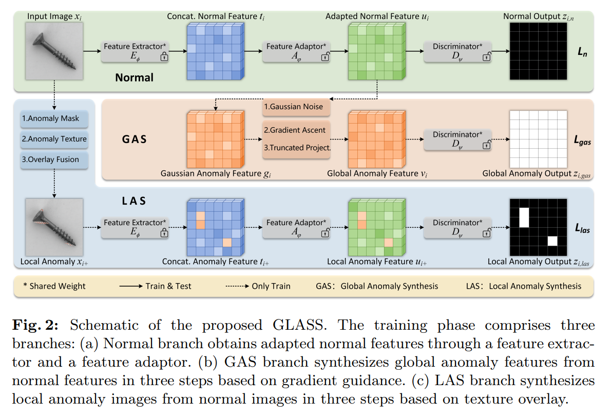

## 목차

* [1. 핵심 아이디어](#1-핵심-아이디어)
* [2. Normal, GAS, LAS branch](#2-normal-gas-las-branch)
  * [2-1. Normal branch](#2-1-normal-branch)
  * [2-2. GAS branch](#2-2-gas-branch)
  * [2-3. LAS branch](#2-3-las-branch)
* [3. Feature Extractor & Adaptor](#3-feature-extractor--adaptor)
* [4. Global Anomaly Synthesis](#4-global-anomaly-synthesis)
  * [4-1. Normal Feature Point 의 분포](#4-1-normal-feature-point-의-분포) 
  * [4-2. Truncated Projection (Manifold)](#4-2-truncated-projection-manifold)
  * [4-3. Truncated Projection (Hypersphere)](#4-3-truncated-projection-hypersphere)
* [5. Local Anomaly Synthesis (Image-Level)](#5-local-anomaly-synthesis-image-level)
* [6. Loss Function](#6-loss-function)
* [7. Inference & Anomaly Scoring](#7-inference--anomaly-scoring)
* [8. 실험 설정 및 결과](#8-실험-설정-및-결과)
  * [8-1. 실험 설정 및 성능지표](#8-1-실험-설정-및-성능지표)
  * [8-2. 실험 결과](#8-2-실험-결과)

## 논문 소개

* Qiyu Chen and Huiyuan Luo et al., "A Unified Anomaly Synthesis Strategy with Gradient Ascent for Industrial Anomaly Detection and Localization", 2024
* [Arxiv Link](https://arxiv.org/pdf/2407.09359v1)

## 1. 핵심 아이디어

GLASS 의 전체 구조 및 핵심 아이디어는 다음과 같다.

[(출처)](https://arxiv.org/pdf/2407.09359v1) : Qiyu Chen and Huiyuan Luo et al., "A Unified Anomaly Synthesis Strategy with Gradient Ascent for Industrial Anomaly Detection and Localization"

* 학습 과정
  * **Normal / Local Anomaly / Global Anomaly Feature** 추출
    * 먼저 **Normal Image** 를 Feature Adaptor 에 입력시켜 **normal feature 를 추출** 한다. (Normal Branch)
    * 그 다음으로, Adapted Normal Feature 를 입력받은 GAS branch 의 gradient guidance 를 통해, **Global Anomaly Feature 를 추출** 한다.
    * 한편, 원본 이미지로부터 생성된 Local Anomaly 가 있는 이미지의 **Local Anomaly Feature** 를 LAS branch 를 통해 추출한다.
  * 이들 3개의 feature 는 **Discriminator 로 입력되고, 이를 통해 Normal / Abnormal 여부를 판정** 한다.

* 참고 사항
  * **학습 과정에서는 Normal Image 만 입력** 된다. (다른 Anomaly Detection 모델들처럼)
  * 본 모델은 Test (inference) 단계에서는 **Normal Branch** 만이 사용된다.
  * 각 branch 는 **Feature Extractor, Feature Adaptor, Discriminator 를 공유** 한다.
    * 즉 각 branch 별로 이들 프로세스가 있는 것이 아니라, 전체 모델에서 **Feature Extractor, Feature Adaptor, Discriminator 는 각각 1개씩** 이다.

## 2. Normal, GAS, LAS branch

### 2-1. Normal branch

### 2-2. GAS branch

### 2-3. LAS branch

## 3. Feature Extractor & Adaptor

## 4. Global Anomaly Synthesis

### 4-1. Normal Feature Point 의 분포

### 4-2. Truncated Projection (Manifold)

### 4-3. Truncated Projection (Hypersphere)

## 5. Local Anomaly Synthesis (Image-Level)

## 6. Loss Function

## 7. Inference & Anomaly Scoring

## 8. 실험 설정 및 결과

### 8-1. 실험 설정 및 성능지표

### 8-2. 실험 결과