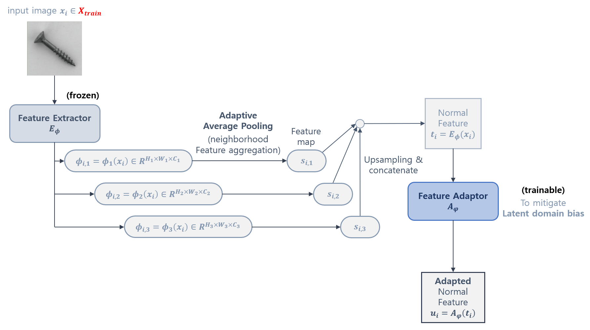
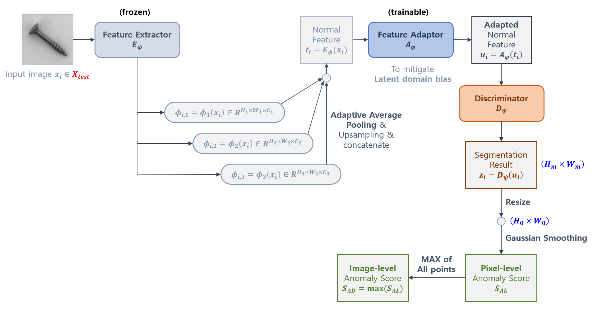

## 목차

* [1. 핵심 아이디어](#1-핵심-아이디어)
* [2. Normal, GAS, LAS branch](#2-normal-gas-las-branch)
* [3. Feature Extractor & Adaptor](#3-feature-extractor--adaptor)
* [4. Global Anomaly Synthesis](#4-global-anomaly-synthesis)
  * [4-1. Normal Feature Point 의 분포](#4-1-normal-feature-point-의-분포)
  * [4-2. Abnormal Feature 로의 변환](#4-2-abnormal-feature-로의-변환)
  * [4-3. Truncated Projection (Manifold)](#4-3-truncated-projection)
* [5. Local Anomaly Synthesis (Image-Level)](#5-local-anomaly-synthesis-image-level)
* [6. Loss Function](#6-loss-function)
* [7. Inference & Anomaly Scoring](#7-inference--anomaly-scoring)
* [8. 실험 설정 및 결과](#8-실험-설정-및-결과)
  * [8-1. 실험 설정 및 성능지표](#8-1-실험-설정-및-성능지표)
  * [8-2. 실험 결과](#8-2-실험-결과)

## 논문 소개

* Qiyu Chen and Huiyuan Luo et al., "A Unified Anomaly Synthesis Strategy with Gradient Ascent for Industrial Anomaly Detection and Localization", 2024
* [Arxiv Link](https://arxiv.org/pdf/2407.09359v1)

## 1. 핵심 아이디어

GLASS 의 전체 구조 및 핵심 아이디어는 다음과 같다.

[(출처)](https://arxiv.org/pdf/2407.09359v1) : Qiyu Chen and Huiyuan Luo et al., "A Unified Anomaly Synthesis Strategy with Gradient Ascent for Industrial Anomaly Detection and Localization"

* 학습 과정
  * **Normal / Local Anomaly / Global Anomaly Feature** 추출
    * 먼저 **Normal Image** 를 Feature Adaptor 에 입력시켜 **normal feature 를 추출** 한다. (Normal Branch)
    * 그 다음으로, Adapted Normal Feature 를 입력받은 GAS branch 의 gradient guidance 를 통해, **Global Anomaly Feature 를 추출** 한다.
    * 한편, 원본 이미지로부터 생성된 Local Anomaly 가 있는 이미지의 **Local Anomaly Feature** 를 LAS branch 를 통해 추출한다.
  * 이들 3개의 feature 는 **Discriminator 로 입력되고, 이를 통해 Normal / Abnormal 여부를 판정** 한다.

* 참고 사항
  * **학습 과정에서는 Normal Image 만 입력** 된다. (다른 Anomaly Detection 모델들처럼)
  * 본 모델은 Test (inference) 단계에서는 **Normal Branch** 만이 사용된다.
  * 각 branch 는 **Feature Extractor, Feature Adaptor, Discriminator 를 공유** 한다.
    * 즉 각 branch 별로 이들 프로세스가 있는 것이 아니라, 전체 모델에서 **Feature Extractor, Feature Adaptor, Discriminator 는 각각 1개씩** 이다.

* 각 구성 요소의 학습 가능 여부

| Feature Extractor | Feature Adaptor | Discriminator |
|-------------------|-----------------|---------------|
| Frozen            | Trainable       | Trainable     |

## 2. Normal, GAS, LAS branch

각 branch 에 대한 기본 사항은 다음과 같다.

| Branch                                | 입력 이미지                                                 | Discriminator 에 입력되는 Feature                                                  | 포함 Process                                                                    |
|---------------------------------------|--------------------------------------------------------|-------------------------------------------------------------------------------|-------------------------------------------------------------------------------|
| Normal Branch                         | **Normal 이미지**                                         | Feature Adaptor 처리된 **Adapted Normal Feature**                                | - Feature Extractor - Feature Adaptor - Discriminator                   |
| GAS (Global Anomaly Synthesis) Branch | Adapted Normal Feature + Gaussian Anomaly 추가된 Feature  | Gaussian Anomaly Feature 가 추가 처리된 **Global Anomaly Feature**                  | - **Gaussian Noise + Gradient Ascent + Truncated Project** - Discriminator |
| LAS (Local Anomaly Synthesis) Branch  | Normal 이미지에 임의로 Anomaly 를 추가한 **Locally Abnormal 이미지** | Local Anomaly Feature 가 Feature Adaptor 처리된 **Adapted Local Anomaly Feature** | - Feature Extractor - Feature Adaptor - Discriminator                   |

* GAS 에서의 Gaussian Anomaly 는 **현실의 Anomaly 를 시뮬레이션** 하기 위해 사용된다.
* GAS 에서 사용되는 것과 같은 Gradient Ascent 는 **Anomaly 를 Synthesize 하는 가장 효과적인 방법** 중 하나이다.
* Truncated Projection 은 **Abnomral feature 가 Normal feature 가 매우 가깝거나 멀게 되는 것을 방지** 하는 방법이다.

## 3. Feature Extractor & Adaptor

**Feature Extractor** 와 **Feature Adaptor** 의 역할은 다음과 같다.

| 구성 요소             | 학습 가능 여부  | 역할                                                                                                |
|-------------------|-----------|---------------------------------------------------------------------------------------------------|
| Feature Extractor | Frozen    | input image 의 feature 를 **여러 level 에서 각각 추출 후, 이를 Upsampling & Concatenate** 하여 Normal Feature 추출 |
| Feature Adaptor   | Trainable | 추가 학습 불가능한 (frozen) Feature Extractor 로부터 추출된 feature 에 대한 **Latent Domain Bias** 를 줄인다.          |

[(input image 출처)](https://arxiv.org/pdf/2407.09359v1) : Qiyu Chen and Huiyuan Luo et al., "A Unified Anomaly Synthesis Strategy with Gradient Ascent for Industrial Anomaly Detection and Localization"

## 4. Global Anomaly Synthesis

**GAS (Global Anomaly Synthesis)** 의 핵심 아이디어는 다음과 같다.

* Normal Feature point 들의 분포에 대한 가정
  * 아래와 같이 **Manifold 또는 Hyper-sphere 의 형태** 로 분포할 것으로 간주한다.
* Normal Feature 를 Abnormal Feature 로 변환하기 위해 다음과 같은 방법을 사용한다.
  * Abnormal Feature 로 합성하기 위해, 먼저 **Gaussian Noise 를 추가** 한다.
  * **Gradient Ascent** 를 이용하여, Abnormality 를 증가시키는 방향으로 Feature 를 추가 변환한다.
    * 이때 Anomaly Feature 로의 변환 시 **적당한 수준의 Abnormality 를 갖게 하기** 위해, **Truncated Projection** 을 이용한다.
    * 이를 통해 Gradient Ascent 의 **최소 ~ 최대 범위를 제한** 한다. 

[(출처)](https://arxiv.org/pdf/2407.09359v1) : Qiyu Chen and Huiyuan Luo et al., "A Unified Anomaly Synthesis Strategy with Gradient Ascent for Industrial Anomaly Detection and Localization"

* 'Global'의 의미는 다음과 같다.
  * 위와 같은 방법으로의 Anomaly 합성이 **Feature map 의 모든 Feature point 에 대해** 이루어진다.

### 4-1. Normal Feature Point 의 분포

여기서는 다음과 같은 2가지의 Normal Feature Point 의 분포에 대한 이론이 있다.

| 이론                                  | 기본 가정                                                                                                                      | Abnormality 판정 (거리가 클수록 Abnormal)                     |
|-------------------------------------|----------------------------------------------------------------------------------------------------------------------------|----------------------------------------------------------|
| Manifold Hypothesis                 | - 모든 Normal Feature Point $u_i^{h,w}$ 가 저차원의 선형 Manifold 분포를 이루고 있을 것이다. - 저차원 Embedding 의 선형 결합은 전체적인 비선형 분포를 나타낼 것이다. | Normal feature point 들이 이루는 Manifold 의 중심선과의 거리를 이용하여 판정 |
| Hypersphere Distribution Hypothesis | - 모든 Normal Feature Point $u_i^{h,w}$ 의 집합은 hyper-sphere 를 이룰 것이다.                                                         | 이 hyper-sphere 의 중심과의 거리를 이용하여 판정                        |

### 4-2. Abnormal Feature 로의 변환

Abnormal Feature 로의 변환 방법에는 **Gaussian Noise** 와 **Gradient Ascent** 가 있다.

| 변환 방법           | 설명                                                                           | 수식                                                                                                                                                      |
|-----------------|------------------------------------------------------------------------------|---------------------------------------------------------------------------------------------------------------------------------------------------------|
| Gaussian Noise  | - Anomaly 의 분포를 모르기 때문에, 이를 시뮬레이션하기 위해서는 Gaussian Noise 가 그나마 최선임            | $\epsilon_i^{h,w} ~ N(\mu_g, \sigma_g^2)$ $g_i^{h,w} = u_i^{h,w} + \epsilon_i^{h,w}$                                                                 |
| Gradient Ascent | - Anomaly 를 Synthesize 하는 가장 효과적인 방법 중 하나 - GAS Loss 에 의한 Gradient 정보를 이용 | $\displaystyle \widetilde{g}_i^{h,w} = g_i^{h,w} + \eta \frac{\nabla L(g_i^{h,w})}{\vert \vert \nabla L(g_i^{h,w}) \vert \vert}$ (단, $L$ 은 GAS Loss) |

### 4-3. Truncated Projection

Truncated Projection 은 **Gradient Ascent 를 이용하여 Normal Feature 를 변환할 때, Normal Feature 와 매우 가까워지거나 매우 멀어지는 것을 방지** 하기 위한 일종의 규제이다.

**1. Manifold Hypothesis**

* **Manifold Hypothesis** 에서, Gradient Ascent Distance 는 다음과 같이 계산한다.
  * $\widetilde{\epsilon}_i^{h,w} = \widetilde{g}_i^{h,w} - u_i^{h,w}$
* 이 Distance 를 나타내는 $\widetilde{g}_i^{h,w}$ 를 $r_1 < \vert \vert \widetilde{g}_i^{h,w} - u_i^{h,w} \vert \vert_2 < r_2$ 의 거리가 되게 하기 위해, 다음과 같이 **Truncated Distance 인 $\hat{\epsilon}_i^{h,w}$ 를 이용한다.**

[(출처)](https://arxiv.org/pdf/2407.09359v1) : Qiyu Chen and Huiyuan Luo et al., "A Unified Anomaly Synthesis Strategy with Gradient Ascent for Industrial Anomaly Detection and Localization"

**2. Hyper-sphere Distribution Hypothesis**

* **Hyper-sphere Distribution Hypothesis** 에서는 다음과 같이 위 그림과 유사한 방법으로 Global Anomaly Feature $\widetilde{v}_i^{h,w}$ 를 계산한다.
  * $N'_p = \lbrace \widetilde{g}_i^{h,w} \vert r'_1 < \vert \vert \widetilde{g}_i^{h,w} - c \vert \vert_2 < r'_2 \rbrace$
* LAS (Local Anomaly Synthesis) 에서 추출한 Local Anomaly Feature $\widetilde{u}_a^{h,w}$ 는 다음과 같이 Projection 된다.
  * $N''_p = \lbrace \widetilde{u}_a^{h,w} \vert r'_2 < \vert \vert \widetilde{u}_a^{h,w} - c \vert \vert_2 < r'_3 \rbrace$
  * 이는 $\widetilde{u}_a^{h,w}$ 는 보통 $\widetilde{v}_i^{h,w}$ 보다 Normal Feature $u_i^{h,w}$ 에서 멀기 때문이다.
* 각 distance threshold $r'_1$, $r'_2$, $r'_3$ 는 다음을 의미한다.

| distance threshold | 의미                                                                  |
|--------------------|---------------------------------------------------------------------|
| $r'_1$             | Lower Bound Threshold = **Hyper-sphere Radius**                     |
| $r'_2$             | Global Anomaly Feature 와 Local Anomaly Feature 의 Boundary Threshold |
| $r'_3$             | Local Anomaly Feature 의 Upper Bound Threshold                       |

**3. 각 Distance Threshold 의 관계**

| Hypothesis                           | Distance Threshold 의 관계                                 |
|--------------------------------------|---------------------------------------------------------|
| Manifold Hypothesis                  | $r_1 < r_2$  - 일반적으로 $r_2 = 2r_1$                    |
| Hyper-sphere Distribution Hypothesis | $r'_1 < r'_2 < r'_3$  - 일반적으로 $r'_3 = 2r'_2 = 4r'_1$ |

## 5. Local Anomaly Synthesis (Image-Level)

Local Anomaly Synthesis 에서는 다음과 같이 Anomaly 를 생성하는 방법을 사용한다.

* Anomaly Detection 에서 자주 사용되는 방법론인 **DTD texture + Perlin mask** 에 기반한 **image-level LAS** 를 이용한다.
* 요약하자면, **image-level LAS = Anomaly Mask + Anomaly Texture + Overlay Fusion** 이다.
  * Overlay Fusion 은 **Anomaly 를 더욱 Detail 하게 탐지하기 위한 weak defect 를 시뮬레이션** 하기 위해 사용한다.

| Anomaly 생성 방법   | 설명                                                                                                                                                                                                                                                                            |
|-----------------|-------------------------------------------------------------------------------------------------------------------------------------------------------------------------------------------------------------------------------------------------------------------------------|
| Anomaly Mask    | - 먼저, Perlin Noise 에 의한 binary mask $m_1$, $m_2$ 를 각각 생성한다. - Binarization 을 이용하여 foreground mask $m_f$ 를 생성한다. - **이미지에서의 Anomaly 의 발생 지역을 다양하게 하기** 위해, 최종 mask 를 생성할 때 $(m_1 \wedge m_2) \wedge m_f$, $(m_1 \vee m_2) \wedge m_f$, $m_1 \wedge m_f$ 중 하나를 랜덤으로 적용한다. |
| Anomaly Texture | - 먼저, DTD 라는 texture dataset 에서 임의로 1장의 이미지 $x'_i$ 를 선택한다. - RandAugment 와 유사하게, 9가지의 Augmentation 방법 중 랜덤하게 3가지를 선택한다. (이를 $T_R$ 이라 하자.) - 최종 Anomaly Texture 이미지는 $x''_i = T_R(x'_i)$ 이다.                                                                             |
| Overlay Fusion  | 원본 이미지 $x_i$ 의 Synthetic 이미지에서의 투명도를 나타내기 위한 파라미터 $\beta ~ N(\mu_m, \sigma_m^2)$ 를 이용한다. - $x_{i+} = x_i \odot \overline{m}_i + (1 - \beta)x''_i \odot m_i + \beta x_i \odot m_i$ 여기서 $\overline{m}_i$ 는 anomaly mask $m_i$ 를 invert 처리한 것이다.                           |

## 6. Loss Function

GLASS 의 Loss Function 은 다음과 같이 구성된다.

* 핵심 아이디어
  * **GLASS 의 2가지 핵심 기능에 대한 Loss + Local Anomaly Feature 분류의 [Data Imbalance](../../AI%20Basics/Data%20Science%20Basics/데이터_사이언스_기초_데이터_불균형.md) 해결을 위한 Loss의 합산**
  * Loss Component
    * Normal Feature 예측 Loss
    * Global Anomaly Synthesis (GAS) 에 대한 Loss
    * Local Anomaly Feature 에 대한 Binary Classification 의 Imbalance 해결을 위한 Loss
* 수식
  * $L = L_n + L_{gas} + f_{ohem}(L_las)$

[(출처)](https://arxiv.org/pdf/2407.09359v1) : Qiyu Chen and Huiyuan Luo et al., "A Unified Anomaly Synthesis Strategy with Gradient Ascent for Industrial Anomaly Detection and Localization"

각 Loss Component $L_n$, $L_{gas}$, $f_{ohem}(L_las)$ 에 대한 설명은 다음과 같다.

| Loss Component    | 설명                                                                                                                                                                                                                                                                                                                                |
|-------------------|-----------------------------------------------------------------------------------------------------------------------------------------------------------------------------------------------------------------------------------------------------------------------------------------------------------------------------------|
| $L_n$             | **Normal Feature 예측에 대한 Loss** - Normal Feature 에 대한 Discrimination $z_{i,n}$ 과 Full-size Feature map **(Normal)** 의 Ground Truth 간의 [Binary Cross-Entropy (BCE Loss)](../../AI%20Basics/Deep%20Learning%20Basics/딥러닝_기초_Loss_function.md#2-4-binary-cross-entropy-loss) - $\Sigma_{x_i \in X_{train}} f_{BCE}(z_{i,n}, 0)$ | 
| $L_{gas}$         | **Global Anomaly Synthesis 에 대한 Loss** - Global Anomaly Feature 에 대한 Discrimination $z_{i,gas} = D_\psi (v_i)$ 와, Full-size Feature map **(Abnormal)** 의 Ground Truth 간의 BCE Loss - $\Sigma_{x_i \in X_{train}} f_{BCE}(z_{i,gas}, 1)$                                                                                      |
| $f_{ohem}(L_las)$ | **Local Anomaly Feature 에 대한 Binary Classification 의 Imbalance 해결을 위한 Loss** - Local Anomaly Feature 에 대한 Discrimination $z_{i,las}= D_\psi (u_{i+})$ 와 Anomaly Mask 의 Ground Truth 간의 Focal Loss - $L_{las} = \Sigma_{x_i \in X_{train}} f_{Focal}(z_{i,las}, m_i)$                                                        |

* $f_{ohem}$
  * Online Hard Example Mining (OHEM) 함수
  * 전체 sample 중 **weak defect 와 같은 핵심/고난이도 sample** 을 선정하는 함수 
* Focal Loss
  * [Cross Entropy 계열 Loss Function](../../AI%20Basics/Deep%20Learning%20Basics/딥러닝_기초_Loss_function.md#2-5-categorical-cross-entropy-loss) 에 **난이도가 낮은 sample 에 대한 Loss 의 가중치를 줄이는** $(1-p)^\gamma$ 항을 추가한 Loss Function

## 7. Inference & Anomaly Scoring

Inference 단계에서는 **GAS 와 LAS 를 제외한 Normal Branch** 만을 사용하여 **Anomaly Scoring 을 실시** 한다. 그 수식은 다음과 같다.

* 핵심 아이디어
  * Discriminator 에 의한 Segmentation Result 를 **Resize + Smoothing** 하여 **각 Pixel 의 Anomaly Score 를 계산** 한다.
  * 이들 각 Pixel 의 Anomaly Score 의 **최댓값을 Image 단위의 Anomaly Score 로** 한다.
* 수식 
  * (**Pixel Level** Anomaly Score) $S_{AL} = f_{smooth}(f_{resize}^{H_0, W_0}(z_i))$
  * (**Image Level** Anomaly Score) $S_{AD} = max(S_{AL})$
* 수식 설명
  * $z_i = D_\psi (u_i) \in R^{H_m, W_m}$
  * $u_i = A_\varphi (E_\phi (x_i))$
  * $x_i \in X_{test}$

[(input image 출처)](https://arxiv.org/pdf/2407.09359v1) : Qiyu Chen and Huiyuan Luo et al., "A Unified Anomaly Synthesis Strategy with Gradient Ascent for Industrial Anomaly Detection and Localization"

## 8. 실험 설정 및 결과

### 8-1. 실험 설정 및 성능지표

### 8-2. 실험 결과
