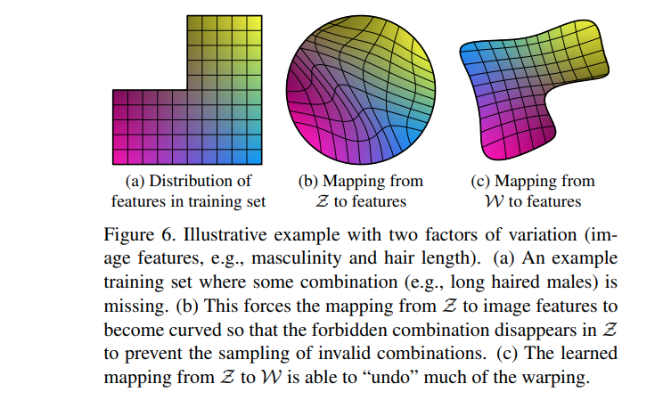

## 목차

* [1. 핵심 아이디어](#1-핵심-아이디어)
* [2. StyleGAN 의 구조](#2-stylegan-의-구조)
  * [2-1. Mapping Network](#2-1-mapping-network) 
  * [2-2. Synthesis Network](#2-2-synthesis-network)
  * [2-3. AdaIN Operation](#2-3-adain-operation)
* [3. StyleGAN 의 특징](#3-stylegan-의-특징)
  * [3-1. Style Mixing (Mixing Regularization)](#3-1-style-mixing-mixing-regularization)
  * [3-2. Stochastic variation](#3-2-stochastic-variation)
  * [3-3. Global Effects 와 Stochasticity 의 분리](#3-3-global-effects-와-stochasticity-의-분리)
* [4. intermediate latent space 사용 이유](#4-intermediate-latent-space-사용-이유)
  * [4-1. Feature 로의 Mapping 비교](#4-1-feature-로의-mapping-비교)
  * [4-2. Perceptual Path Length](#4-2-perceptual-path-length)
* [5. 실험 결과](#5-실험-결과)

## 논문 소개

* Tero Karras and Samuli Laine et al., "A Style-Based Generator Architecture for Generative Adversarial Networks", 2018
* [arXiv Link](https://arxiv.org/pdf/1812.04948)

## 1. 핵심 아이디어

* [GAN (Generative Adversarial Network)](../../Generative%20AI/Basics_GAN.md) 의 Generator 에서 이미지를 합성할 때, **Generator 의 각 Conv. Layer 에서 이미지의 '스타일'을 조정** 한다.
  * 이를 통해 **서로 다른 scale 의 feature 들의 강도를 직접 제어** 한다.
  * 신경망에 추가되는 noise 와 합성되어, **high-level 속성 (얼굴 표정 등) 들을 stochastic variation (머리카락 위치 등) 과 분리** 한다.
* 이때, Discriminator, Loss Function 등은 기존의 GAN 에서 수정하지 않는다.

## 2. StyleGAN 의 구조

[(출처)](https://arxiv.org/pdf/1812.04948) : Tero Karras and Samuli Laine et al., "A Style-Based Generator Architecture for Generative Adversarial Networks"

StyleGAN 은 위와 같이 **Style-Based Generator** 를 이용한다. 그 구조는 다음과 같다.

| 구조                                        | 설명                                                                                                                                                                                                                                    |
|-------------------------------------------|---------------------------------------------------------------------------------------------------------------------------------------------------------------------------------------------------------------------------------------|
| Mapping Network                           | input latent vector $z \in Z$ 로부터 intermediate latent vector $w \in W$ 를 생성                                                                                                                                                           |
| Synthesis Network                         | intermediate latent vector $w \in W$ 로부터 Upsampling 을 통해 이미지 생성                                                                                                                                                                       |
| AdaIN Operation (in Synthesis Network) | AdaIN = **Adaptive Instance Normalization** - 'Style' 과 [Gaussian Normalization](../../AI%20Basics/Data%20Science%20Basics/데이터_사이언스_기초_Normalization.md#2-2-standarization-z-score-normalization) 을 통해 Generator 의 이미지 생성 프로세스를 조정 |

### 2-1. Mapping Network

Mapping Network 는 **Non-linear** 이며, **input latent vector $z \in Z$ 로부터 intermediate latent vector $w \in W$ 를 mapping (생성)** 한다.

* 총 8개의 Fully-Connected Layer 로 구성된다.

### 2-2. Synthesis Network

Synthesis Network 는 **intermediate latent vector $w \in W$ 로부터 이미지를 생성** 하는 신경망이다.

* 각 레이어는 다음과 같은 단계로 구성
  * Upsampling
  * (3 x 3 Conv. → scaling factor 가 적용된 **noise (B)** 추가 → **style (A)** 을 이용한 AdaIN Operation) 의 2회 반복
* 또한, feature map 에 noise input 을 추가하여 stochastic detail (머리카락 위치 등) 을 생성한다.
  * 이 noise image 는 **모든 feature map 에 추가** 된다. 
* 총 18개의 레이어로 구성된다.

### 2-3. AdaIN Operation

Synthesis Network 에서 일어나는 **AdaIN (Adaptive Instance Normalization) Operation** 은 **Style 과 Gaussian Normalization 을 이용하여 이미지 생성 과정을 조정** 하는 역할을 한다.

* 수식
  * $\displaystyle AdaIN(x_i, y) = y_{s,i} \times \frac{x_i - \mu(x_i)}{\sigma(x_i)} + y_{b,i}$
* 수식 설명
  * $x_i$ : feature map
  * $y$ : style 을 나타내는 값 ($y_s$ : scaling factor, $y_b$ : bias)
  * $\mu(x_i)$, $\sigma(x_i)$ : Gaussian Normalization 을 위한 평균 및 표준편차

## 3. StyleGAN 의 특징

StyleGAN 의 주요 특징은 다음과 같다.

| 특징                                   | 설명                                                                                                                                                                                  |
|--------------------------------------|-------------------------------------------------------------------------------------------------------------------------------------------------------------------------------------|
| Style Mixing (Mixing Regularization) | 학습 중에는, 일정 비율의 이미지는 **1개가 아닌 2개의 Random Latent Vector 로부터 생성** 된다. - 이때, 1개의 latent vector 를 다른 latent vector 로 **단순히 switch** 한다.                                               |
| Stochastic Variation                 | 머리카락의 위치와 같은 **stochastic variation** 은 noise 의 영향을 받는다.                                                                                                                            |
| Global Effects 와 Stochasticity 의 분리  | 신경망이 noise 를 이용하여 stochastic variation 이 아닌 **Global Effect (pose 등) 를 조정** 하면 **어색한 이미지가 생성** 될 수 있다. - 이를 **Discriminator가 탐지** 하므로, StyleGAN 은 **자체적으로도 이를 방지하는 방향** 으로 학습된다. |

### 3-1. Style Mixing (Mixing Regularization)

**핵심 아이디어**

* 학습 시, 일정 비율의 이미지는 **1개가 아닌 2개의 Random Latent Vector 로부터 생성** 된다.
  * 이는 **Synthesis Network 의 랜덤하게 선택된 지점** 에서 이루어진다.
* 이때, 1개의 latent vector 를 단순히 다른 latent vector 로 switch 하기만 하면 된다.

**상세 과정**

* $z_1, z_2$ 로부터 Mapping Network 를 거쳐 $w_1, w_2$ 를 각각 생성한다.
* $w_1$ 은 crossover point **이전에** 적용한다.
* $w_2$ 는 crossover point **이후에** 적용한다.

### 3-2. Stochastic variation

**핵심 아이디어**

* stochatic variation 은 noise 의 영향을 받는다.
* 이때, noise 의 영향 범위는 **Stochastic Aspects (머리카락의 정확한 위치 등)** 이고, 전반적인 얼굴 표정 등에는 영향이 거의 없다.

**상세 설명**

[(출처)](https://arxiv.org/pdf/1812.04948) : Tero Karras and Samuli Laine et al., "A Style-Based Generator Architecture for Generative Adversarial Networks"

* 위 사진에서 input noise 를 서로 다르게 했을 때, 위 이미지의 **(b)** 와 같이 **머리카락의 정확한 위치** 정도만 달라진다.
* 위 이미지의 **(c)** 는 **어느 부분이 input noise 의 영향을 받는지를 hightlight 한 것** (각 픽셀 값의 Standard Deviation) 을 나타낸 것이다.
  * 위와 같이 **머리카락, 실루엣, 배경** 정도가 noise의 영향을 받는다.

### 3-3. Global Effects 와 Stochasticity 의 분리

**핵심 아이디어**

* 신경망이 **noise 를 이용하여 Pose 와 같은 Global Effect 를 조정** 하려고 하면, 그 결과물인 **어색한 이미지** 는 **Discriminator 에 의해 탐지** 된다.
* 따라서, StyleGAN 자체적으로도 **이를 방지하기 위해 noise 로는 Stochastic Variation 을 조정** 하도록 학습된다. 

**상세 설명**

| Style                            | Noise                               |
|----------------------------------|-------------------------------------|
| 생성되는 이미지 전체 (Global Effect) 에 영향 | 각 픽셀 별 독립적, Stochastic Variation 조정 |

* StyleGAN 의 'Style' 은 생성되는 이미지 전체에 영향을 끼친다.
  * 이는 **전체 feature map** 이 동일한 Style 값으로 Scaling 되기 때문이다. 
  * 따라서 이로 인해 **Global Effect (Pose 등) 가 조정** 된다.
* 한편, Noise 는 **각 픽셀에 독립적으로 생성** 되므로, Stochastic Variation 을 조정하는 데 적합하다.
* 따라서, **Noise 를 이용하여 Global Effect 를 조정하려고 하면 그 생성된 결과물은 어색할 수 있다.**

## 4. intermediate latent space 사용 이유

StyleGAN 에서 **intermediate latent space** 를 사용하는 이유는 다음과 같다.

* latent vector $z$ 로부터 mapping 된 $w$ 가 **학습 데이터셋의 분포를 더 잘 표현** 하기 때문이다.
* 즉, sampling density 가 **학습된** mapping 인 $w = f(z)$ 를 통해 유도된다.

### 4-1. Feature 로의 Mapping 비교

[(출처)](https://arxiv.org/pdf/1812.04948) : Tero Karras and Samuli Laine et al., "A Style-Based Generator Architecture for Generative Adversarial Networks"

* input latent vector $Z$ **(b)**
  * input latent vector 의 집합인 $Z$ 를 학습 데이터 feature 로 mapping 시키면 **Hypersphere 에서 자체적으로 Curve 가 생성되기 때문에** 어색한 조합 (long haired male) 에 대한 이미지 생성이 방지된다.
* intermediate latent vector $W$ **(c)**
  * intermediate latent vector 의 집합인 $W$ 를 마찬가지로 mapping 시키면 **이러한 'wrapping' 을 되돌려서, 원래 학습 feature 와 유사한 분포를 생성** 할 수 있다. 

### 4-2. Perceptual Path Length

**Perceptual Path Length** 는 **latent vector ($z$ 또는 $w$) 를 interpolation 할 때 이미지가 얼마나 많이 바뀌는지** 를 나타내기 위한 개념이다.

* 이때 interpolation 은 **slerp (spherical interpolation)** 또는 **lerp (linear interpolation)** 을 가정한다.
* spherical interpolation 은 **구면을 따라 움직이는 interpolation** 의 개념이다.

결론적으로 다음과 같다.

* intermediate latent vector $w$ 에 대한 Perceptual Path Length $l_W$ 보다 **input latent vector $z$ 에 대한 Length $l_Z$ 가 더 빠르게 증가한다.**
* 이는 **input latent space 가 GAN 에서 멋대로 구성될 수 있음** 을 보여준다.

| latent vector 집합                   | interpolation                       | Perceptual Path Length                                                                             |
|------------------------------------|-------------------------------------|----------------------------------------------------------------------------------------------------|
| **input** latent vector $Z$        | **slerp** (spherical interpolation) | $l_Z = E[\frac{1}{\epsilon^2} d(G(slerp(z_1, z_2; t)), G(slerp(z_1, z_2; t+\epsilon)))]$           |
| **intermediate** latent vector $W$ | **lerp** (linear interpolation)     | $l_W = E[\frac{1}{\epsilon^2} d(G(lerp(f(z_1), f(z_2); t)), G(lerp(f(z_1), f(z_2); t+\epsilon)))]$ |

## 5. 실험 결과

