## 목차

* [1. Conditional StyleGAN 의 핵심 아이디어](#1-conditional-stylegan-의-핵심-아이디어)
* [2. Condition Space 선택 및 분석](#2-condition-space-선택-및-분석)
  * [2-1. Condition Space 선택](#2-1-condition-space-선택)
  * [2-2. Condition 분석](#2-2-condition-분석)
  * [2-3. Class 간의 유사도 분석](#2-3-class-간의-유사도-분석)
  * [2-4. Condition Space 실험 결과](#2-4-condition-space-실험-결과)
  * [2-5. Inverted Image 예측](#2-5-inverted-image-예측)
* [3. Conditional StyleGAN 의 기술적 특징](#3-conditional-stylegan-의-기술적-특징)
  * [3-1. Truncation Trick](#3-1-truncation-trick)
  * [3-2. Conditional Truncation](#3-2-conditional-truncation)
  * [3-3. Condition-based 벡터 연산](#3-3-condition-based-벡터-연산)
* [4. Multi-Conditional StyleGAN](#4-multi-conditional-stylegan)
  * [4-1. Multi-Conditional 조건 벡터 생성](#4-1-multi-conditional-조건-벡터-생성)
  * [4-2. Wildcard Generation](#4-2-wildcard-generation)
* [5. 실험 설정 및 결과](#5-실험-설정-및-결과)
  * [5-1. 실험 설정 및 Metric](#5-1-실험-설정-및-metric)
  * [5-2. 실험 결과](#5-2-실험-결과)

## 논문 소개

* Konstantin Dobler, Florian Hubscher et al., "Art Creation with Multi-Conditional StyleGANs", 2022
* [arXiv Link](https://arxiv.org/pdf/2202.11777)

## 1. Conditional StyleGAN 의 핵심 아이디어

Conditional StyleGAN 의 핵심 아이디어는 다음 그림과 같이 **latent space $Z$ 와 함께 condition $C$ 를 입력하여 mapping** 시키는 것이다.

* 즉, $Z → W$ 가 아닌 $Z, C → W$ 가 되는 것이다.
* 이때는 기존 StyleGAN 의 latent code $w \in W$ 대신 **Condition $c$ 가 붙은** latent code 인 $w_c \in W$ 로 mapping 된다.

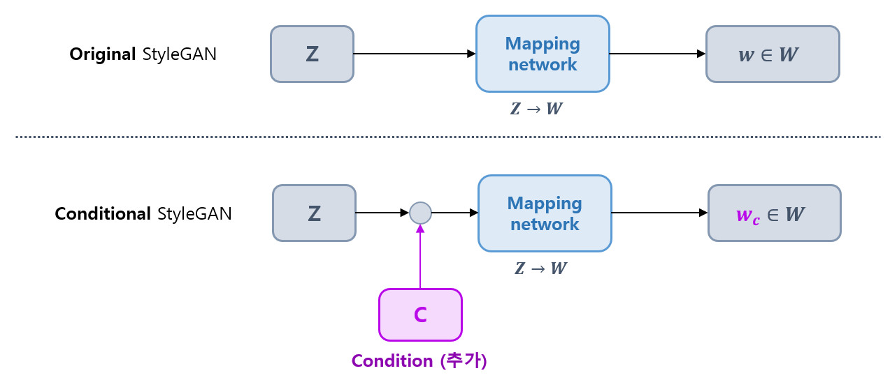

## 2. Condition Space 선택 및 분석

* Conditional StyleGAN 에서는 **Synthesis Network (Generator) 이전의 Condition Space 를 생각할 필요** 가 있다.
  * 이는 $Z → W (또는 C,W)$ 의 mapping network 는 StyleGAN 의 latent space 뿐만 아니라 **Condition space 를 임베딩** 할 수도 있기 때문이다.
* 또한, 해당 Condition Space 는 **비용 효율적으로 분석** 할 수 있다.
  * 이는 해당 부분이 **Generator 이전 부분** 에 해당하기 때문이다.

**세부 내용 요약**

| 내용                 | 설명                                                                                                                                                                                |
|--------------------|-----------------------------------------------------------------------------------------------------------------------------------------------------------------------------------|
| Condition Space 선택 | - W space, **P space**, $P_N$ space 등                                                                                                                                             |
| Condition 분석       | - P space 로부터 sample 을 추출하여 확률밀도함수를 만들고, 그 확률밀도함수로부터 condition 값을 예측하는 방법 적용<br>- 이 방법을 통해 **condition 값을 정확히 assign** 할 수 있었음<br>- 결국, **서로 다른 condition 을 나타내는 분포는 서로 다름** 을 확인 |
| Condition 간 유사도 분석 | - Frechet Distance 및 PCA 차원 축소를 이용하여, 각 Condition 값에 대한 이미지 분포 간 유사도 측정<br>- 그 결과는 **실제 미술사적 관점에서의 유사도와 비교할 때 합리적임**                                                              |
| Inverted image 예측  | - 이미지로부터 latent vector 를 예측하는 것도 **가능**<br>- 단, **많은 자원** 이 필요할 수 있음                                                                                                              |

### 2-1. Condition Space 선택

Condition Space 의 선택에는 다음과 같은 아이디어가 있다.

| Condition Space       | 설명                                                                                                                                                                                                                                                                                | 관련 논문                                                                                                  |
|-----------------------|-----------------------------------------------------------------------------------------------------------------------------------------------------------------------------------------------------------------------------------------------------------------------------------|--------------------------------------------------------------------------------------------------------|
| W space               | mapping network 의 출력값                                                                                                                                                                                                                                                             |                                                                                                        |
| P space & $P_N$ space | - W space 에 **[LeakyReLU](../../AI%20Basics/Deep%20Learning%20Basics/딥러닝_기초_활성화_함수.md#2-3-relu-파생-함수들) 의 역함수** 를 적용하여 P space 를 도출<br>- P space 에 **[PCA (Principal Component Analysis)](../../AI%20Basics/Machine%20Learning%20Models/머신러닝_모델_PCA.md) 를 적용** 하여 $P_N$ space 를 도출 | [Improved StyleGAN Embedding: Where are the Good Latents? (2020.12)](https://arxiv.org/pdf/2012.09036) |

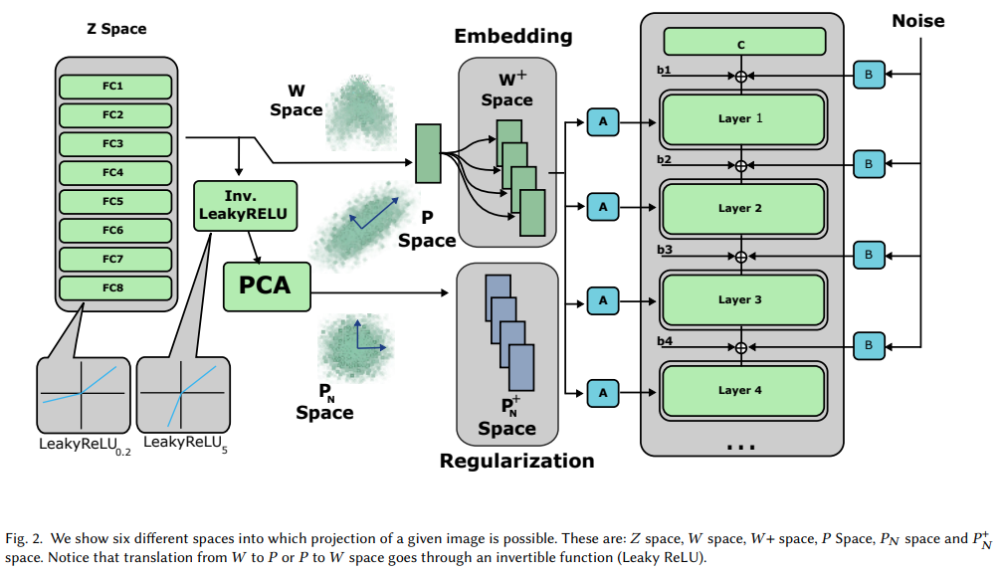

[(출처)](https://arxiv.org/pdf/2012.09036) : Peihao Zhu, Rameen Abdal et al. "Improved StyleGAN Embedding: Where are the Good Latents?"

**1. W space**

* 직관적으로는 mapping layer 로부터 바로 생성된 $W$ space 를 이용하는 방법을 생각할 수 있다.
* 그러나, [해당 논문](https://arxiv.org/pdf/2012.09036) 에서는 $W$ space 는 **분명한 패턴을 따르지 않으며, 크게 왜곡되어 있다** 고 주장한다. 

**2. P space**

* **P space** 는 위 그림과 같이 W space 에 **mapping layer 의 마지막 부분에 있는 LeakyReLU 활성화 함수의 역함수** 를 적용하여 얻을 수 있다.
* StyleGAN 에서 이 LeakyReLU 함수는 $slope = 0.2$ 이므로, 그 inverse transformation 은 다음과 같이 **$slope = 5.0$ 인 LeakyReLU 함수** 이다.
  * $x = LeakyReLU_{5.0}(w)$
  * $w$, $x$ 는 각각 $W$ space, $P$ space 의 벡터

**3. $P_N$ space**

* **$P_N$ space** 는 P space 에 [PCA (Principal Component Analysis)](../../AI%20Basics/Machine%20Learning%20Models/머신러닝_모델_PCA.md) 를 적용하여 변환한 Condition space
  * 변환 수식
    * $\hat{v} = Λ^{-0.5} \times U^T (x - \mu)$
  * 수식 설명
    * Λ : singular value 에 대한 diagonal matrix
    * $U$ : PCA direction 에 수직인 orthogonal matrix
    * $\mu$ : mean vector
* [논문](https://arxiv.org/pdf/2202.11777) 에서는 P space 의 분포가 **이미 Gaussian Distribution 에 가까우므로, $P_N$ Space 는 불필요** 하다고 주장
  * PCA 를 이용하여 추가적으로 정규화할 필요는 없음 

### 2-2. Condition 분석

**1. 실험 내용**

* **P space** 에서 10,000 개의 point 를 추출 ($X_c \in R^{10^4 \times n}$)
  * 이때, P space는 **W space** 와 차원이 동일하므로 $n = 512$
* **각 condition** 에 대해,
  * **P space** 에서, $X_c$ 에 대해 그 평균 $\mu_c \in R^n$ 과 covariance matrix $\Sigma_c$ 계산 
  * **P space** 에서 100,000 개의 point 를 추가 추출 ($Y_c \in R^{10^5 \times n}$)
* condition $\hat{c}$ 를 **$\mu_c$, $\Sigma_c$ 에 기반한 확률밀도함수에서 확률 값이 가장 높은** condition 으로 지정

**2. 실험 결과**

* 실험 데이터셋
  * EnrichedArtEmis 데이터셋
* 실험 결과
  * StyleGAN 을 위 데이터셋으로 학습한 결과, **모든 벡터 $x \in Y_c$ 를 알맞은 라벨 $c$ 에 assign** 할 수 있었음
  * 이는 **서로 다른 condition 에 대한 distribution 은 결국 서로 다름** 을 증명하는 사례

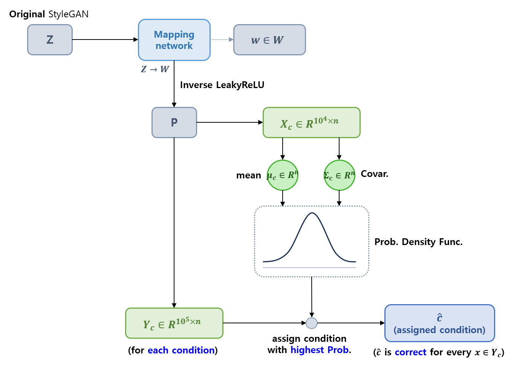

**3. 관련 수식**

* 확률밀도함수 $p(x; \mu, \Sigma)$

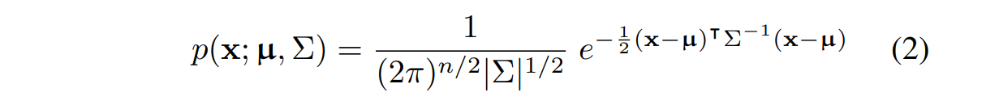

* condition assignment $\hat{c}$

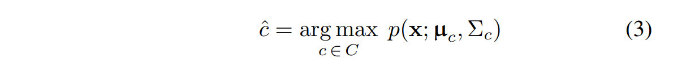

* [(수식 출처)](https://arxiv.org/pdf/2202.11777) : Konstantin Dobler, Florian Hubscher et al., "Art Creation with Multi-Conditional StyleGANs"

### 2-3. Class 간의 유사도 분석

**1. 기본 컨셉**

* 서로 다른 condition 값에 대해 **P space** 의 분포가 다르므로, 이를 분석하여 **각 condition (class) 간의 유사도를 분석** 할 수 있다.
* 유사도 분석을 위해, **Multivariate normal distribution** 을 비교할 수 있다.
* 이를 위해, 다음과 같은 **Frechet distance (FD)** 를 이용한다.
  * **FD 값이 작을수록 2개의 distribution 이 유사** 하고, 이는 결국 **2개의 condition 이 유사** 함을 의미 

**2. Frechet distance 수식 및 설명**

* 수식
  * $FD^2 = ||\mu_{c_1} - \mu_{c_2}||^2 + Tr(\Sigma_{c_1} + \Sigma_{c_2} - 2 \times \sqrt{\Sigma_{c_1}\Sigma_{c_2}})$ 
* 수식 설명 
  * $X_{c_1} \sim N(\mu_{c_1}, \Sigma_{c_1})$
  * $X_{c_2} \sim N(\mu_{c_2}, \Sigma_{c_2})$
  * $c_1, c_2 \in C$

### 2-4. Condition Space 실험 결과

**1. Conditional StyleGAN 으로 생성된 이미지 예시**

* 모든 이미지는 **identical random noise $z$** 로부터 생성

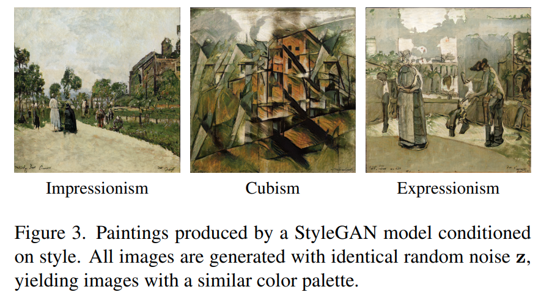

* [(출처)](https://arxiv.org/pdf/2202.11777) : Konstantin Dobler, Florian Hubscher et al., "Art Creation with Multi-Conditional StyleGANs"

**2. 각 화풍 Condition 에 대한 Similarity 값**

* Baroque 와 Rococo 간, Minimalism 과 Color Field Painting 간 가장 유사
* 미술사적 관점에서 유사도가 이렇게 나타나는 것은 합리적임

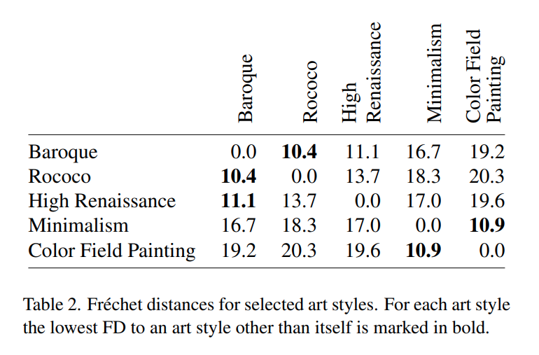

* [(출처)](https://arxiv.org/pdf/2202.11777) : Konstantin Dobler, Florian Hubscher et al., "Art Creation with Multi-Conditional StyleGANs"

**3. P space 에서 PCA 를 이용한 차원 축소 결과**

* Frechet Distance 를 이용하여 계산된 유사도 및 Cluster 분포와 유사하게 나타남
* Baroque 는 Renaissance 와 Rococo 의 중간으로 나타났는데, 실제 미술사적으로도 합리적인 결과

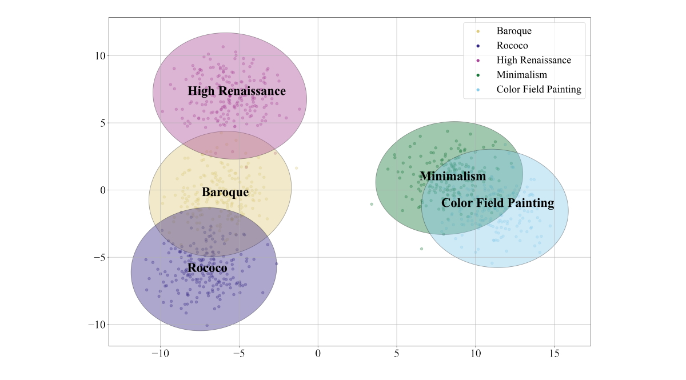

* [(출처)](https://arxiv.org/pdf/2202.11777) : Konstantin Dobler, Florian Hubscher et al., "Art Creation with Multi-Conditional StyleGANs"

### 2-5. Inverted Image 예측

* latent space $Z$ 로부터 latent vector 를 예측할 수 있으나, **여기서 더 나아가, GAN inversion 을 통해 latent space 를 깊이 분석** 할 수 있음
* [앞에서 언급한 Condition 분석](#2-2-condition-분석) 방법을 응용하여, **실제 이미지에 대해 latent vector 를 예측** 할 수 있을 것으로 예상
  * 단, 이 방법 실행에 **많은 자원이 필요** 할 수 있음

## 3. Conditional StyleGAN 의 기술적 특징

* Conditional StyleGAN 에서는 $f: Z → W$ 가 아닌, **$f_c: Z,C → W$ 라는 mapping function** 을 만들려고 한다.
* 이를 위해 **Conditional Truncation** 이라는 방법이 사용된다.

| 방법<br>(Conditional StyleGAN 사용 여부) | 단계       | 설명                                                                                                                                                                                                          |
|------------------------------------|----------|-------------------------------------------------------------------------------------------------------------------------------------------------------------------------------------------------------------|
| Truncation trick (❌)               | 학습 **중** | - $w \in W$ 를 $W$ space 의 무게중심으로 이동<br>- 이를 통해 학습된 분포에 가까운 정도 **(fidelity)** 와 이미지의 다양성 **(diversity)** 간 **trade-off 조정**<br>- 단, **Conditional Retention** Problem, Global Center 에서 생성된 이미지의 어색함 등 단점 존재 |
| Conditional Truncation (✅)         | 학습 **중** | - 서로 다른 condition 의 이미지들은 서로 다른 무게중심 $\overline{w}_c$ 를 가짐<br>- $w \in W$ 를 이번에는 **Truncation trick 에서의 $\overline{w}$ 대신 $\overline{w}_c$ 쪽으로** 이동                                                         |
| Condition-based 벡터 연산 (✅)          | 학습 **후** | - condition 값만 바꾸는 transformation vector $t_{c_1, c_2}$ 를 계산할 수 있다.<br>- 이때, $W$ space 에서 **서로 같은 $z$ 벡터, 서로 다른 condition** 으로 샘플링하고, 이들 벡터의 **차이 계산** 을 반복 시행하는 방법을 사용한다.                                  |

### 3-1. Truncation Trick

**Truncation trick** 의 핵심 아이디어는 다음과 같다.

* 이미지 생성 시 **학습된 분포에 가까운 정도 (fidelity)** 와 **이미지의 다양성 (diversity)** 간의 trade-off 를 조정한다.
* 샘플링된 vector $w \in W$ 를 **$W$ space 의 무게중심 (Global Center) $\overline{w}$ 쪽으로 일정 비율만큼 점차 이동** 시킨다.

**1. 수식 및 설명**

* Truncation trick 수식
  * $\overline{w} = E_{z \sim P(z)} [f(z)]$
  * $w' = \overline{w} + \psi(w - \overline{w})$
* 수식 설명
  * $\overline{w}$ : $W$ space 에 대한 global center (무게중심)
  * $w'$ : 샘플링된 벡터 $w$ 를 global center 쪽으로 이동시킨 후의 벡터
  * $\psi$ : 1 에 가까울수록 $w$ 가 global center $\overline{w}$ 쪽으로 **조금** 이동함 ($\psi < 1$)

**2. Global Center 쪽으로 이동시키는 것의 단점**

| 단점                                                          | 설명                                                                                                                                                                                   |
|-------------------------------------------------------------|--------------------------------------------------------------------------------------------------------------------------------------------------------------------------------------|
| Condition retention problem                                 | - Truncation trick 을 적용함에 따라, **이미지의 condition 값이 점차적으로 사라짐 (lost)**                                                                                                                 |
| Global Center 자체가 high-fidelity 이미지 (고품질 이미지) 와는 **거리가 있음** | - **구조적으로 다양한 형태의 sample** 이 있는 학습 데이터의 경우 이런 경향이 심함<br>- 이는 Global Center 에서는 **의도하지 않은 이미지가 생성됨** 을 의미 (일종의 [환각 현상](../../AI%20Basics/LLM%20Basics/LLM_기초_환각_현상.md))<br>- 아래 그림 참고 |

* 아래 그림에서, Global Center 에서는 **왼쪽의 사람 얼굴은 잘 생성** 된 반면, **오른쪽의 미술 작품은 비교적 어색하게 생성** 되었다.

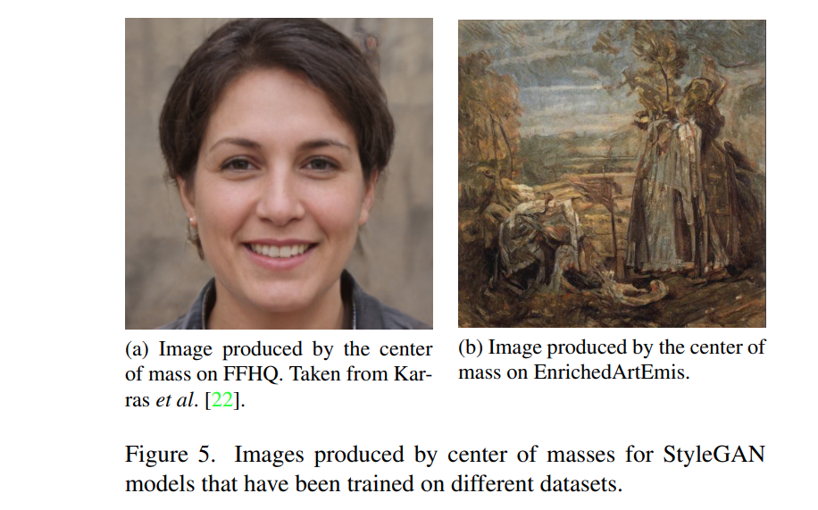

* [(출처)](https://arxiv.org/pdf/2202.11777) : Konstantin Dobler, Florian Hubscher et al., "Art Creation with Multi-Conditional StyleGANs"

### 3-2. Conditional Truncation

**Conditional Truncation** 의 핵심 아이디어는 다음과 같다.

* 서로 다른 condition 은 $W$ space 에서 **서로 다른 무게중심 (center)** 을 갖는다.
* 샘플링된 vector $w \in W$ 를 **global center 대신, 해당 condition 의 무게중심 $\overline{w}_c$ 쪽으로 일정 비율만큼 점차 이동** 시킨다.

**1. 수식 및 설명**

* Conditional Truncation 수식
  * $\overline{w_c} = E_{z \sim P(z)} [f_c(z, c)]$
  * $w' = \overline{w}_c + \psi(w - \overline{w}_c)$
* 수식 설명
  * $\overline{w}_c$ 계산은 **$Z, C → W$ mapping network** 에서만 이루어지고, **synthesis network (Generator)** 에서는 이루어지지 않는다. 
  * 이를 통해, 추론 시 주어진 condition $c$ 에 대해 $\overline{w}_c$ 를 **on-the-fly 로 계산** 할 수 있다.

**2. 실험 결과**

* $\psi$ 가 0에 가까워질수록 다음과 같이 나타난다.
  * $\psi$ 가 0에 가까워진다는 것은 **$w$ 가 global center $\overline{w}$ 쪽으로 빠르게 이동** 함을 의미한다.

| 구분                 | 기존 Truncation Trick | Conditional Truncation |
|--------------------|---------------------|------------------------|
| Condition Loss     | 비교적 **많음**          | 비교적 **적음**             |
| Low-fidelity image | 비교적 **많이 발생**       | 비교적 **조금 발생**          |


* [(출처)](https://arxiv.org/pdf/2202.11777) : Konstantin Dobler, Florian Hubscher et al., "Art Creation with Multi-Conditional StyleGANs"

### 3-3. Condition-based 벡터 연산

* **학습 완료된 StyleGAN** 에서, condition $c_1$, $c_2$ 에 대해 다음이 성립한다.
  * condition 값만 바꾸기 위한 **transformation vector** $t_{c_1,c_2}$ 를 계산할 수 있다.
    * $w_{c_1} + t_{c_1,c_2} = w_{c_2}$
  * transformation vector 의 성질은 다음과 같다.
    * $t_{c_1,c_2} = -t_{c_2, c_1}$ 

* transformation vector $t_{c_1, c_2}$ 계산 방법
  * 핵심 아이디어
    * $W$ space 에서 **벡터를 샘플링** 하고, 이들 벡터의 **차이 계산**
      * **서로 같은 random noise** $z$, **서로 다른 condition** $c_1$, $c_2$ 로부터,
      * $w_{c_1}$ 과 $w_{c_2}$ 를 $W$ space 에서 샘플링하고 그 차이를 계산한다.
      * 이 과정을 **수천 번, 수만 번 반복** 시행한다.
    * 이 차이의 평균값이 transformation vector $t_{c_1, c_2}$ 이다.
  * 수식
    * $f_c(z, c_k) = w_{c_k} (k=1,2)$

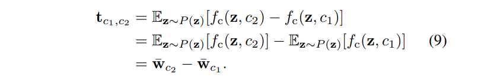

* [(출처)](https://arxiv.org/pdf/2202.11777) : Konstantin Dobler, Florian Hubscher et al., "Art Creation with Multi-Conditional StyleGANs"

## 4. Multi-Conditional StyleGAN

* 배경
  * [Oh-LoRA 👱‍♀️ (오로라) 초기 프로젝트 (25.04.08 - 25.04.25)](https://github.com/WannaBeSuperteur/AI_Projects/tree/main/2025_04_08_OhLoRA) 에서의 ```eyes (눈을 뜬 정도)```, ```mouth (입을 벌린 정도)```, ```pose (고개 돌림)``` 과 같이 **여러 개의 Condition 을 이용하여 이미지를 생성** 하는 task 가 있을 수 있다. 
  * Conditional StyleGAN 을 이렇듯 **여러 개의 조건에 최적화** 된 **Multi-Conditional StyleGAN** 으로 만들 수 있다.
* Condition Vector
  * $S$ : 개별 condition 의 집합
  * $\zeta$ : 여러 개의 sub-condition 값 $c_s, s \in S$ 로 구성된 multi-condition
* 상세 설명

| 적용 사항                      | 설명                                                                             |
|----------------------------|--------------------------------------------------------------------------------|
| Multi-Conditional 조건 벡터 생성 | 각 sub-condition $c_s$ 를 나타내는 벡터 표현을 찾고, 이들을 concatenate 한다.                    |
| Wildcard Generation        | 지정된 조건 외의 다른 sub-condition 은 **zero-vector 로 대체** 하는 **Wildcard Mask** 를 적용한다. |

### 4-1. Multi-Conditional 조건 벡터 생성

**1. 핵심 아이디어**

* **학습 도중에 Multi-condition $\zeta$ 를 사용** 하는 것을 목표로 한다.
* 핵심 아이디어
  * 각 sub-condition $c_s, s \in S$ 에 대한 **vector representation (individual representation)** 을 찾는다.
  * 이들 individual vector representation 을 concatenate 한다.

**2. 예시: EnrichedArtEmis 데이터셋에서의 설정**

| Condition 값<br>([오로라 프로젝트]((https://github.com/WannaBeSuperteur/AI_Projects/tree/main/2025_04_08_OhLoRA)) 의 '핵심 속성 값'에 해당) | 설명                                   |
|----------------------------------------------------------------------------------------------------------------------------|--------------------------------------|
| Emotion (감정)                                                                                                               | 9가지의 각 감정에 대한 percentage 값 (총 9개의 값) |
| Painter (화가)                                                                                                               | Categorical (one-hot encoded)        |
| Style (스타일)                                                                                                                | Categorical (one-hot encoded)        |
| Genre (장르)                                                                                                                 | Categorical (one-hot encoded)        |
| 텍스트 설명<br>(Content tag, explanation 등)                                                                                     | Pre-trained TinyBERT 를 이용하여 임베딩      |

**3. Multi-condition 에 따라 생성된 이미지 예시**

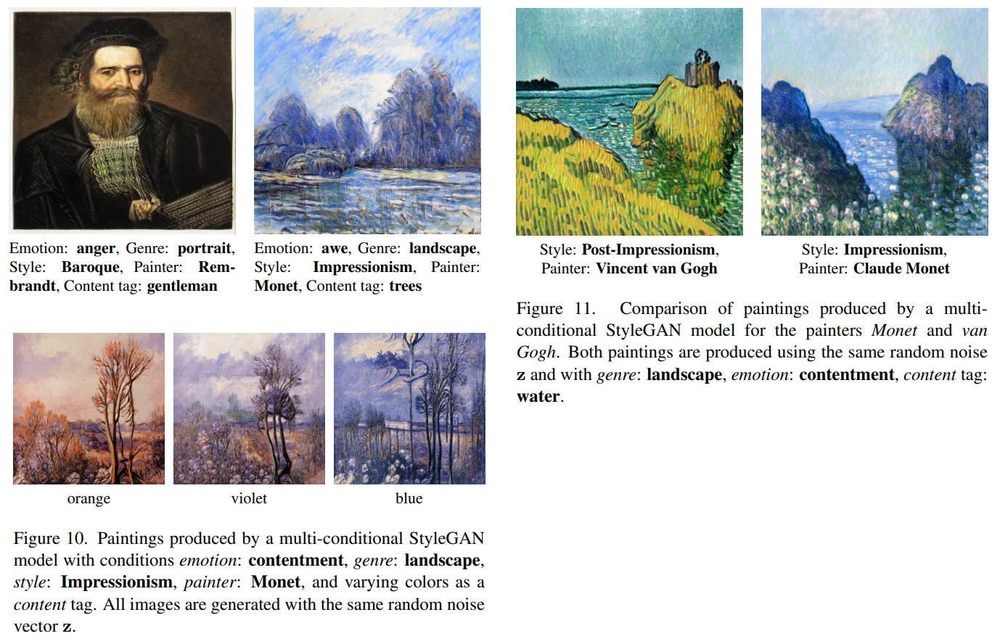

* [(출처)](https://arxiv.org/pdf/2202.11777) : Konstantin Dobler, Florian Hubscher et al., "Art Creation with Multi-Conditional StyleGANs"

### 4-2. Wildcard Generation

**1. 핵심 아이디어**

* Multi-Conditional StyleGAN 의 여러 조건들은 생성된 이미지에 강력한 영향을 미치지만, **이러한 강력한 영향이 오히려 짐이 될 수 있다.**
  * 즉, 이미지를 생성하기 위해, **학습에 사용된 모든 sub-condition 을 명시** 해야 한다. 
* 이를 위해 **zero-vector 를 이용** 하여 **지정된 condition 외의 다른 condition 값은 바뀌지 않도록 (wildcard mask)** 할 수 있다.
  * 즉, 바뀌지 않는 다른 condition 값들은 **zero-vector 로 대체** 한다.

**2. 생성된 이미지 예시**

* **Wildcard mask** 를 적용한 결과, 마찬가지로 아래와 같이 ```landscape painting with mountains``` 라는 조건에 맞는 이미지가 생성된다.
* 이들 이미지 간에는 **Wildcard mask 에 의한 구조적 유사성 (스타일, 화가, 감정 등)** 이 있다.

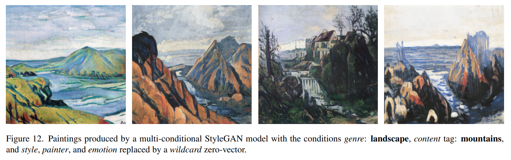

* [(출처)](https://arxiv.org/pdf/2202.11777) : Konstantin Dobler, Florian Hubscher et al., "Art Creation with Multi-Conditional StyleGANs"

## 5. 실험 설정 및 결과

* 실험 설정 및 Metric 요약
  * EnrichedArtEmis 데이터셋
  * 학습된 조건이 서로 다른 3개의 모델 $GAN_T$, $GAN_{ESG}$, $GAN_{ESGPT}$ 를 이용하여 실험
* 실험 결과 요약
  * 조건의 개수가 많을수록, **정량 평가 결과는 우리 눈으로 판단하는 정성 평가 결과와 불일치** 
  * StyleGAN 으로 생성한 이미지는 **학습 데이터의 복사본과는 다른 새로운 이미지** 임

### 5-1. 실험 설정 및 Metric

**1. 실험 설정**

| 설정  | 상세 설명                                                                                                                                                                                           |
|-----|-------------------------------------------------------------------------------------------------------------------------------------------------------------------------------------------------|
| 데이터 | EnrichedArtEmis 데이터셋, 512 x 512 resolution                                                                                                                                                      |
| 모델  | - $GAN_T$ : ```content tag``` 조건으로 학습된 모델<br>- $GAN_{ESG}$ : ```emotion``` ```style``` ```genre``` 조건으로 학습된 모델<br>- $GAN_{ESGPT}$ : $GAN_T$ 의 조건 + $GAN_{ESG}$ 의 조건 + ```painter``` 조건으로 학습된 모델 |

**2. Evaluation Metric 요약**

| Evaluation Metric                        | 유형             | 설명                                                                                                                             | 특징                 |
|------------------------------------------|----------------|--------------------------------------------------------------------------------------------------------------------------------|--------------------|
| Qualitative Evaluation ($e_{qual}$)      | **정성** 평가      | 생성된 이미지가 각 조건에 맞는지를 0.0 ~ 1.0 으로 나타낸 점수<br>- **각 이미지 별로, 각 조건 별** 일치 여부 판단                                                     | 값이 **클수록** 성능이 좋음  |
| Frechet Inception Distance (FID)         | **정량** 평가      | [Frechet Distance](#2-3-class-간의-유사도-분석) 를 이용하여 정의한 $\mu$, $\Sigma$ 를 이용, **실제 이미지와 생성된 이미지의 유사도** 계산                          | 값이 **작을수록** 성능이 좋음 |
| Frechet Joint Distance (FJD)             | **정량** 평가      | **Image 와 그 Condition 값** 에 따른 Frechet Distance                                                                                | 값이 **작을수록** 성능이 좋음 |
| Intra-Frechet Inception Distance (I-FID) | **정량** 평가      | **개별 조건** (individual condition) 의 영향을 고려한 Frechet Distance                                                                    | 값이 **작을수록** 성능이 좋음 |
| Hybrid Evaluation Metric ($e_{art}$)     | **정성 + 정량** 평가 | Qualitative Evaluation, FID, I-FID 의 3가지 평가 지표를 결합<br>- $\displaystyle e_{art} = \frac{e_{I-FID} + e_{FID}}{2} (2 - e_{qual})$ | 값이 **작을수록** 성능이 좋음 |

### 5-2. 실험 결과

**1. 전반적인 경향성**

* 정량 평가 지표 (FID, FJD, I-FID) 는 실제 각 조건의 일치 여부를 평가하는 Qualitative Evaluation (정성 평가) 과 유사하게 나타남
* 조건의 개수가 늘어나면, **정성 평가 지표, 정량 평가 지표 사이의 경향성 차이** 가 생기기 시작함
* 이것은 **정량 평가 결과가 우리가 눈으로 판단하는 이미지의 품질과 (특히 조건이 많을 때) 완전히 일치하지 않는다** 는 것을 의미

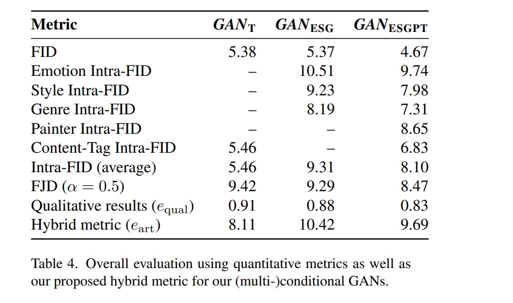

* [(출처)](https://arxiv.org/pdf/2202.11777) : Konstantin Dobler, Florian Hubscher et al., "Art Creation with Multi-Conditional StyleGANs"

**2. 생성된 이미지의 최근접 이웃**

* 생성된 이미지에 대해, perceptual similarity 를 이용하여 **학습 데이터 중 최근접 이웃** 탐색
* 아래와 같이, **StyleGAN 으로 생성한 이미지는 학습 데이터셋의 복사본과는 다른, 어떤 새로운 이미지임** 이 확인됨

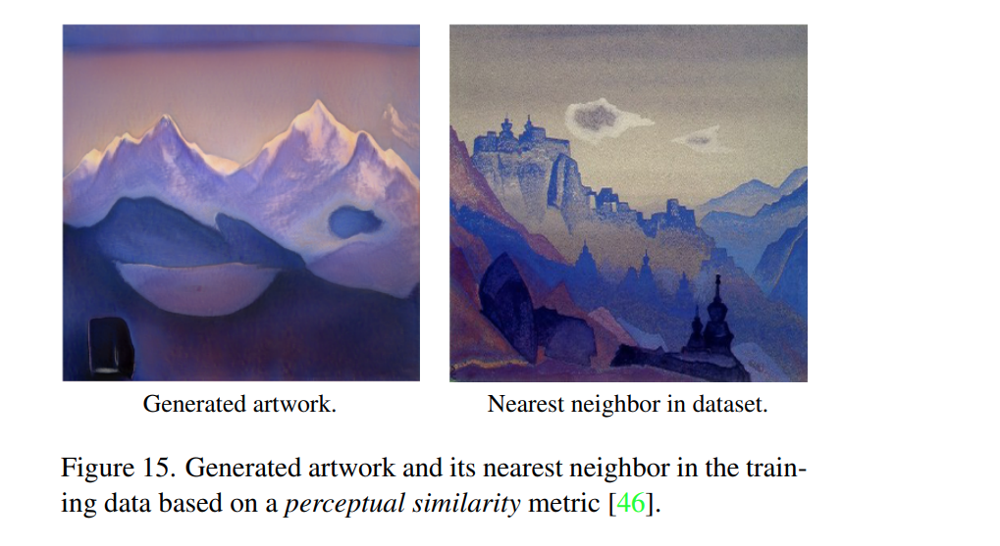

* [(출처)](https://arxiv.org/pdf/2202.11777) : Konstantin Dobler, Florian Hubscher et al., "Art Creation with Multi-Conditional StyleGANs"
