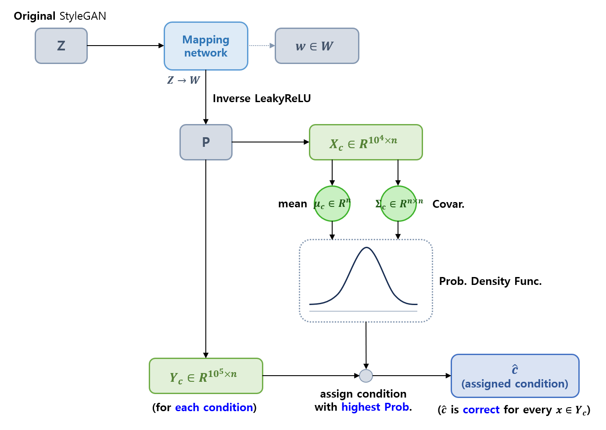

## 목차

* [1. Conditional StyleGAN 의 핵심 아이디어](#1-conditional-stylegan-의-핵심-아이디어)
* [2. Condition Space 선택 및 분석](#2-condition-space-선택-및-분석)
  * [2-1. Condition Space 선택](#2-1-condition-space-선택)
  * [2-2. Condition 분석](#2-2-condition-분석)
  * [2-3. Class 간의 유사도 분석](#2-3-class-간의-유사도-분석)
  * [2-4. Condition Space 의 사용 사례](#2-4-condition-space-의-사용-사례)
  * [2-5. Inverted Image 예측](#2-5-inverted-image-예측)
* [3. Conditional StyleGAN 의 기술적 특징](#3-conditional-stylegan-의-기술적-특징)
  * [3-1. Conditional Truncation](#3-1-conditional-truncation)
  * [3-2. Condition-based 벡터 연산](#3-2-condition-based-벡터-연산)
* [4. Multi-Conditional StyleGAN](#4-multi-conditional-stylegan)
  * [4-1. Multi-Conditional 조건 벡터 생성](#4-1-multi-conditional-조건-벡터-생성)
  * [4-2. Wildcard Generation](#4-2-wildcard-generation)
* [5. 실험 설정 및 결과](#5-실험-설정-및-결과)
  * [5-1. 실험 설정 및 Metric](#5-1-실험-설정-및-metric)
  * [5-2. 실험 결과](#5-2-실험-결과)

## 논문 소개

* Konstantin Dobler, Florian Hubscher et al., "Art Creation with Multi-Conditional StyleGANs", 2022
* [arXiv Link](https://arxiv.org/pdf/2202.11777)

## 1. Conditional StyleGAN 의 핵심 아이디어

Conditional StyleGAN 의 핵심 아이디어는 다음 그림과 같이 **latent space $Z$ 와 함께 condition $C$ 를 입력하여 mapping** 시키는 것이다.

* 즉, $Z → W$ 가 아닌 $Z, C → W$ 가 되는 것이다.
* 이때는 기존 StyleGAN 의 latent code $w \in W$ 대신 **Condition $c$ 가 붙은** latent code 인 $w_c \in W$ 로 mapping 된다.

## 2. Condition Space 선택 및 분석

* Conditional StyleGAN 에서는 **Synthesis Network (Generator) 이전의 Condition Space 를 생각할 필요** 가 있다.
  * 이는 $Z → W (또는 C,W)$ 의 mapping network 는 StyleGAN 의 latent space 뿐만 아니라 **Condition space 를 임베딩** 할 수도 있기 때문이다.
* 또한, 해당 Condition Space 는 **비용 효율적으로 분석** 할 수 있다.
  * 이는 해당 부분이 **Generator 이전 부분** 에 해당하기 때문이다.

**세부 내용 요약**

| 내용                 | 설명                              |
|--------------------|---------------------------------|
| Condition Space 선택 | W space, P space, $P_N$ space 등 |

### 2-1. Condition Space 선택

Condition Space 의 선택에는 다음과 같은 아이디어가 있다.

| Condition Space       | 설명                                                                                                                                                                                                                                                                                | 관련 논문                                                                                                  |
|-----------------------|-----------------------------------------------------------------------------------------------------------------------------------------------------------------------------------------------------------------------------------------------------------------------------------|--------------------------------------------------------------------------------------------------------|
| W space               | mapping network 의 출력값                                                                                                                                                                                                                                                             |                                                                                                        |
| P space & $P_N$ space | - W space 에 **[LeakyReLU](../../AI%20Basics/Deep%20Learning%20Basics/딥러닝_기초_활성화_함수.md#2-3-relu-파생-함수들) 의 역함수** 를 적용하여 P space 를 도출 - P space 에 **[PCA (Principal Component Analysis)](../../AI%20Basics/Machine%20Learning%20Models/머신러닝_모델_PCA.md) 를 적용** 하여 $P_N$ space 를 도출 | [Improved StyleGAN Embedding: Where are the Good Latents? (2020.12)](https://arxiv.org/pdf/2012.09036) |

[(출처)](https://arxiv.org/pdf/2012.09036) : Peihao Zhu, Rameen Abdal et al. "Improved StyleGAN Embedding: Where are the Good Latents?"

**1. W space**

* 직관적으로는 mapping layer 로부터 바로 생성된 $W$ space 를 이용하는 방법을 생각할 수 있다.
* 그러나, [해당 논문](https://arxiv.org/pdf/2012.09036) 에서는 $W$ space 는 **분명한 패턴을 따르지 않으며, 크게 왜곡되어 있다** 고 주장한다. 

**2. P space**

* **P space** 는 위 그림과 같이 W space 에 **mapping layer 의 마지막 부분에 있는 LeakyReLU 활성화 함수의 역함수** 를 적용하여 얻을 수 있다.
* StyleGAN 에서 이 LeakyReLU 함수는 $slope = 0.2$ 이므로, 그 inverse transformation 은 다음과 같이 **$slope = 5.0$ 인 LeakyReLU 함수** 이다.
  * $x = LeakyReLU_{5.0}(w)$
  * $w$, $x$ 는 각각 $W$ space, $P$ space 의 벡터

**3. $P_N$ space**

* **$P_N$ space** 는 P space 에 [PCA (Principal Component Analysis)](../../AI%20Basics/Machine%20Learning%20Models/머신러닝_모델_PCA.md) 를 적용하여 변환한 Condition space
  * 변환 수식
    * $\hat{v} = Λ^{-0.5} \times U^T (x - \mu)$
  * 수식 설명
    * Λ : singular value 에 대한 diagonal matrix
    * $U$ : PCA direction 에 수직인 orthogonal matrix
    * $\mu$ : mean vector
* [논문](https://arxiv.org/pdf/2202.11777) 에서는 P space 의 분포가 **이미 Gaussian Distribution 에 가까우므로, $P_N$ Space 는 불필요** 하다고 주장
  * PCA 를 이용하여 추가적으로 정규화할 필요는 없음 

### 2-2. Condition 분석

**1. 실험 내용**

* **P space** 에서 10,000 개의 point 를 추출 ($X_c \in R^{10^4 \times n}$)
  * 이때, P space는 **W space** 와 차원이 동일하므로 $n = 512$
* **각 condition** 에 대해,
  * **P space** 에서, $X_c$ 에 대해 그 평균 $\mu_c \in R^n$ 과 covariance matrix $\Sigma_c$ 계산 
  * **P space** 에서 100,000 개의 point 를 추가 추출 ($Y_c \in R^{10^5 \times n}$)
* condition $\hat{c}$ 를 **$\mu_c$, $\Sigma_c$ 에 기반한 확률밀도함수에서 확률 값이 가장 높은** condition 으로 지정

**2. 실험 결과**

* 실험 데이터셋
  * EnrichedArtEmis 데이터셋
* 실험 결과
  * StyleGAN 을 위 데이터셋으로 학습한 결과, **모든 벡터 $x \in Y_c$ 를 알맞은 라벨 $c$ 에 assign** 할 수 있었음
  * 이는 **서로 다른 condition 에 대한 distribution 은 결국 서로 다름** 을 증명하는 사례

**3. 관련 수식**

* 확률밀도함수 $p(x; \mu, \Sigma)$

* condition assignment $\hat{c}$

* [(수식 출처)](https://arxiv.org/pdf/2202.11777) : Konstantin Dobler, Florian Hubscher et al., "Art Creation with Multi-Conditional StyleGANs"

### 2-3. Class 간의 유사도 분석

### 2-4. Condition Space 의 사용 사례

### 2-5. Inverted Image 예측

## 3. Conditional StyleGAN 의 기술적 특징

### 3-1. Conditional Truncation

### 3-2. Condition-based 벡터 연산

## 4. Multi-Conditional StyleGAN

### 4-1. Multi-Conditional 조건 벡터 생성

### 4-2. Wildcard Generation

## 5. 실험 설정 및 결과

### 5-1. 실험 설정 및 Metric

### 5-2. 실험 결과
