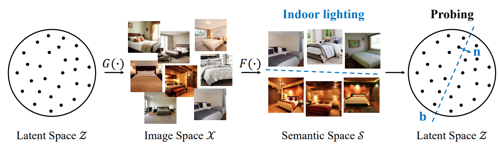
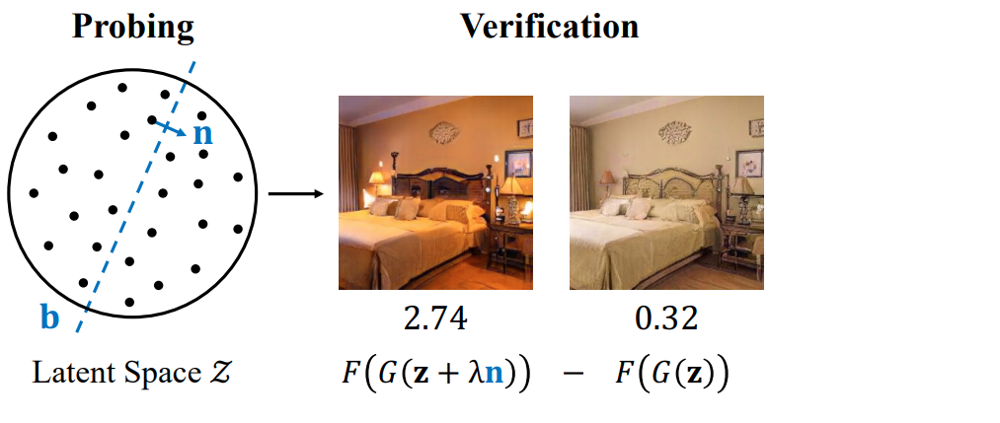
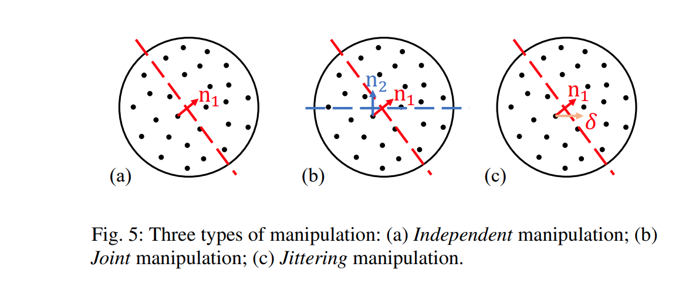

## 목차

* [1. Generative Representation](#1-generative-representation)
  * [1-1. Multi-level Semantics](#1-1-multi-level-semantics)
  * [1-2. Layer-wise Generative Representations](#1-2-layer-wise-generative-representations)
* [2. Label 을 나타내는 벡터 (Emergent Variation Factors) 찾기](#2-label-을-나타내는-벡터-emergent-variation-factors-찾기)
  * [2-1. Latent Space 에서 찾을 수 있음 (Probing)](#2-1-latent-space-에서-찾을-수-있음-probing)
  * [2-2. Label 을 나타내는 Vector 계산](#2-2-label-을-나타내는-vector-계산)
  * [2-3. 해당 Vector 를 이용한 Label 값 변경](#2-3-해당-vector-를-이용한-label-값-변경)
* [3. 실험 설정 및 결과](#3-실험-설정-및-결과)
  * [3-1. 실험 설정](#3-1-실험-설정)
  * [3-2. 실험 결과](#3-2-실험-결과)

## 논문 소개

* Ceyuan Yang, Yujun Shen et al., "Semantic Hierarchy Emerges in Deep Generative Representations for Scene Synthesis", 2019
* [arXiv Link](https://arxiv.org/pdf/1911.09267)

## 1. Generative Representation

* GAN 역시 사람처럼 **각 레이어를 통해 단계적인 과정을 거쳐** 이미지를 생성한다.
  * 예를 들어, Generator Network 의 중간에 해당하는 레이어에서 **category 에 맞는 object** 를 생성한다.

### 1-1. Multi-level Semantics

* 주어진 이미지에 대해서 다음과 같이 **여러 단계의 Attribute** 를 생각할 수 있다.
* 이와 같이 GAN 역시 **이미지를 생성하기 위해 end-to-end 방식으로 학습** 한다.


[(출처)](https://arxiv.org/pdf/2012.09036) : Ceyuan Yang, Yujun Shen et al., "Semantic Hierarchy Emerges in Deep Generative Representations for Scene Synthesis"

### 1-2. Layer-wise Generative Representations

* 사람이 그림을 그릴 때처럼, **GAN 역시 Multi-level abstraction hierarchy** 를 이용하여 이미지를 생성한다.
* 즉, GAN은 다음과 같이 이미지를 생성한다.

| 단계           | 이미지 생성                           |
|--------------|----------------------------------|
| Early Stage  | 대략적인 레이아웃 (spatial layout) 생성    |
| Middle Stage | **특정 category 에 해당하는 object** 생성 |
| Later Stage  | 이미지의 세부적인 부분 및 색상 등을 렌더링하듯이 생성   |

## 2. Label 을 나타내는 벡터 (Emergent Variation Factors) 찾기

* 여기서는 **Label (Condition) 을 나타내는 벡터 (Emergent Variation Factors)**, 즉 **이미지 형태는 그대로 두고, Label (Condition) 에 해당하는 부분만을 조정** 하기 위한 벡터를 찾는 방법에 대해 알아본다.
  * 해당 벡터를 latent vector $z$ 에 (경우에 따라 가중치를 적용하여) 더하거나 뺌으로써, **Label (Condition) 에 해당하는 부분만을 조정** 할 수 있다.
* Label (Condition) 은 [Oh-LoRA 👱‍♀️ (오로라) 초기 프로젝트 (25.04.08 - 25.04.25)](https://github.com/WannaBeSuperteur/AI_Projects/tree/main/2025_04_08_OhLoRA) 에서의 ```eyes (눈을 뜬 정도)```, ```mouth (입을 벌린 정도)```, ```pose (고개 돌림)``` 등의 **핵심 속성 값** 에 해당한다.

### 2-1. Latent Space 에서 찾을 수 있음 (Probing)

**1. 핵심 아이디어**

* Label (Condition) 을 나타내는 벡터는 다음과 같이 **Latent Space 로부터 찾아낼 수 있다.**
* 과정 요약
  * 먼저, latent space $Z$ 로부터 **Classifier $F$** 를 이용하여 **Semantic Information** 을 얻는다.
  * **이진 분류** 문제처럼 간주하여, 해당 semantic information 에 대한 **Decision Boundary** 를 찾는다.
  * 해당 Decision Boundary 와 수직인 벡터 $n_i$ 중 **$F$ 의 출력값에 가장 크게 영향을 미치는** 것을 최종 채택한다.



[(출처)](https://arxiv.org/pdf/2012.09036) : Ceyuan Yang, Yujun Shen et al., "Semantic Hierarchy Emerges in Deep Generative Representations for Scene Synthesis"

**2. Latent Space 에서 Label (Condition) 벡터 찾기**

* Latent Space $Z$ 로부터 Semantic Information 찾기
  * GAN 에 의해 생성된 이미지 $x = G(z)$ 를 이용한다.
  * (경우에 따라 Pre-train 된) Image Classifier 를 이용하여, 각 **latent code $z \in Z$** 에 대해 **Semantic Score 를 mapping** 시킨다.
* Semantic Information 에 대한 Decision Boundary 찾기
  * Semantic space $S$ 에 대해, 위 과정을 통해 얻은 $Z → S$ 로의 **one-by-one mapping** 을 이용한다.
  * 이 mapping 을 이용하여, 해당 Semantic information 에 대한 **Decision Boundary (이진 분류 문제로 간주하여 얻은)** 를 얻는다.

### 2-2. Label 을 나타내는 Vector 계산

**1. 핵심 아이디어**

* [Latent Space 에서 찾은 Decision Boundary 벡터](#2-1-latent-space-에서-찾을-수-있음-probing) 와 수직인 벡터, 즉 $n$ 은 **여러 개가 있다.**
* 이 중 최종 후보를 선정하기 위해, **(경우에 따라 Pre-train 된) Image Classifier $F$ 의 출력값에 가장 많이 영향을 미치는 벡터** 를 찾는다.



[(출처)](https://arxiv.org/pdf/2012.09036) : Ceyuan Yang, Yujun Shen et al., "Semantic Hierarchy Emerges in Deep Generative Representations for Scene Synthesis"

**2. Label 벡터 계산 상세**

* 다음과 같이, Decision Boundary 벡터와 수직인 각 벡터 $n_i$ 에 대해 **Image Classifier $F$ 의 출력값의 변화 정도 $CHANGE$** 에 대한 **모든 sample 에 대한 평균값 $∆s_i$** 를 계산한다.
  * 최종 선정 벡터는 **$∆s_i$ 의 값이 가장 큰 $n_i$** 이다.
  * 이때, 모든 후보 벡터 $n$ 은 **fixed norm = 1 로 정규화** 된다.
* 수식
  * $\displaystyle ∆s_i = \frac{1}{K} \Sigma_{k=1}^K max(CHANGE_k, 0)$ 
  * $CHANGE_k = F_i(G(z^k + \lambda n_i)) - F_i(G(z^k))$
* 수식 설명
  * $K$ : 전체 샘플 개수
  * $n_i$ : Decision Boundary 와 수직인 각 벡터 $n$, 즉 최종 벡터 후보 
  * $\lambda$ : Fixed moving step

### 2-3. 해당 Vector 를 이용한 Label 값 변경

최종적으로 채택한 벡터 $n$ 을 이용하여 **이미지의 Label (Condition) 에 해당하는 부분만 변경** 할 때, 다음과 같은 3가지 방법이 사용된다.

| 방법                           | 설명                                                                                                                                          |
|------------------------------|---------------------------------------------------------------------------------------------------------------------------------------------|
| **Independent** Manipulation | - $z$ 대신 $z + \lambda n$ 을 latent code 로 이용하여 이미지 생성                                                                                        |
| **Joint** Manipulation       | - 여러 개의 variation factor (예: $n_1$, $n_2$) 를 Joint 하게 적용<br>- 즉 $z$ 대신 $z + \lambda_1 n_1 + \lambda_2 n_2$ 를 latent code 로 이용하여 이미지 생성      |
| **Jittering** Manipulation   | - Independent Manipulation + **Random Noise** 의 아이디어<br>- $z$ 대신 $z + \lambda n + \delta (\delta \sim N(0, 1))$ 을 latent code 로 이용하여 이미지 생성 |



[(출처)](https://arxiv.org/pdf/2012.09036) : Ceyuan Yang, Yujun Shen et al., "Semantic Hierarchy Emerges in Deep Generative Representations for Scene Synthesis"

## 3. 실험 설정 및 결과

### 3-1. 실험 설정

### 3-2. 실험 결과