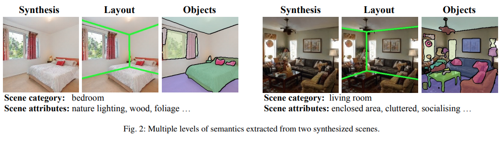

## 목차

* [1. Generative Representation](#1-generative-representation)
  * [1-1. Multi-level Semantics](#1-1-multi-level-semantics)
  * [1-2. Layer-wise Generative Representations](#1-2-layer-wise-generative-representations)
* [2. Label 을 나타내는 벡터 (Emergent Variation Factors) 찾기](#2-label-을-나타내는-벡터-emergent-variation-factors-찾기)
  * [2-1. Latent Space 에서 찾을 수 있음](#2-1-latent-space-에서-찾을-수-있음)
  * [2-2. Label 을 나타내는 Vector 계산](#2-2-label-을-나타내는-vector-계산)
  * [2-3. 해당 Vector 를 이용한 Label 값 변경](#2-3-해당-vector-를-이용한-label-값-변경)
* [3. 실험 설정 및 결과](#3-실험-설정-및-결과)
  * [3-1. 실험 설정](#3-1-실험-설정)
  * [3-2. 실험 결과](#3-2-실험-결과)

## 논문 소개

* Ceyuan Yang, Yujun Shen et al., "Semantic Hierarchy Emerges in Deep Generative Representations for Scene Synthesis", 2019
* [arXiv Link](https://arxiv.org/pdf/1911.09267)

## 1. Generative Representation

* GAN 역시 사람처럼 **각 레이어를 통해 단계적인 과정을 거쳐** 이미지를 생성한다.
  * 예를 들어, Generator Network 의 중간에 해당하는 레이어에서 **category 에 맞는 object** 를 생성한다.

### 1-1. Multi-level Semantics

* 주어진 이미지에 대해서 다음과 같이 **여러 단계의 Attribute** 를 생각할 수 있다.
* 이와 같이 GAN 역시 **이미지를 생성하기 위해 end-to-end 방식으로 학습** 한다.

[(출처)](https://arxiv.org/pdf/2012.09036) : Ceyuan Yang, Yujun Shen et al., "Semantic Hierarchy Emerges in Deep Generative Representations for Scene Synthesis"

### 1-2. Layer-wise Generative Representations

* 사람이 그림을 그릴 때처럼, **GAN 역시 Multi-level abstraction hierarchy** 를 이용하여 이미지를 생성한다.
* 즉, GAN은 다음과 같이 이미지를 생성한다.

| 단계           | 이미지 생성                           |
|--------------|----------------------------------|
| Early Stage  | 대략적인 레이아웃 (spatial layout) 생성    |
| Middle Stage | **특정 category 에 해당하는 object** 생성 |
| Later Stage  | 이미지의 세부적인 부분 및 색상 등을 렌더링하듯이 생성   |

## 2. Label 을 나타내는 벡터 (Emergent Variation Factors) 찾기

### 2-1. Latent Space 에서 찾을 수 있음

### 2-2. Label 을 나타내는 Vector 계산

### 2-3. 해당 Vector 를 이용한 Label 값 변경

## 3. 실험 설정 및 결과

### 3-1. 실험 설정

### 3-2. 실험 결과