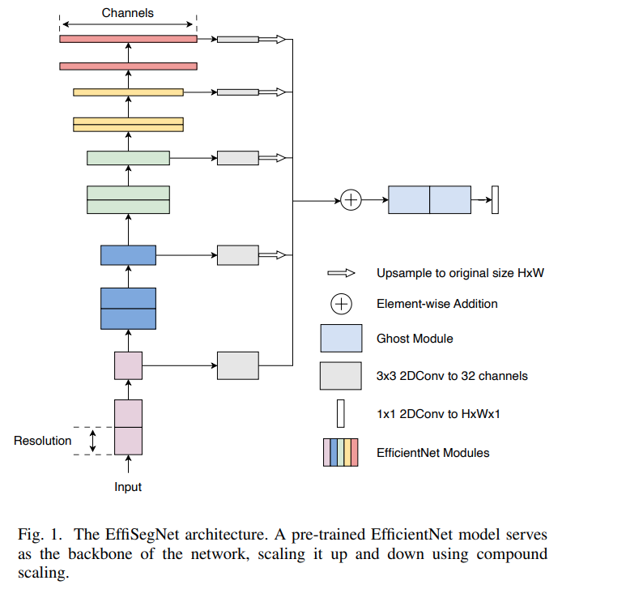
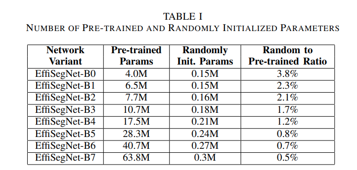
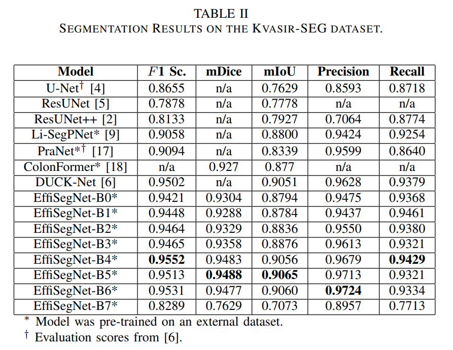
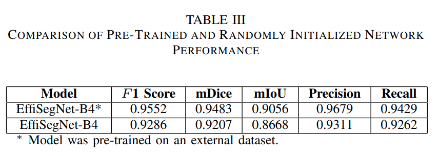

## 목차

* [1. EffiSegNet 의 구조](#1-effisegnet-의-구조)
  * [1-1. typical U-Net 구조의 문제점](#1-1-typical-u-net-구조의-문제점) 
  * [1-2. EffiSegNet 에서의 문제 해결 방법](#1-2-effisegnet-에서의-문제-해결-방법)
  * [1-3. Loss Function](#1-3-loss-function)
* [2. 실험 설정 및 결과](#2-실험-설정-및-결과)
  * [2-1. 실험 설정](#2-1-실험-설정)
  * [2-2. 각 모델 별 지원하는 이미지 크기 (해상도)](#2-2-각-모델-별-지원하는-이미지-크기-해상도)
  * [2-3. 실험 결과](#2-3-실험-결과)

## 논문 소개

* Ioannis A. Vezakis and Konstantinos Georgas et al., "EffiSegNet: Gastrointestinal Polyp Segmentation through a Pre-Trained EfficientNet-based Network with a Simplified Decoder", 2024
* [arXiv Link](https://arxiv.org/pdf/2407.16298v1)

## 1. EffiSegNet 의 구조

**1. 핵심 아이디어**

* EfficientNet image classifier 를 backbone (encoder) 으로 사용
* [U-Net](../../Image%20Processing/Model_U-Net.md) 에서 아이디어를 얻음
* **pre-trained parameter 의 비중이 최대한 높아지도록** 모델 구조 설계 → **computational overhead 감소**

**2. 모델 구조**



[(출처)](https://arxiv.org/pdf/2407.16298v1) : Ioannis A. Vezakis and Konstantinos Georgas et al., "EffiSegNet: Gastrointestinal Polyp Segmentation through a Pre-Trained EfficientNet-based Network with a Simplified Decoder"

| 구성 요소                        | 상태          | 설명                                                                                                                                                                                     |
|------------------------------|-------------|----------------------------------------------------------------------------------------------------------------------------------------------------------------------------------------|
| EfficientNet Modules         | Pre-trained | - backbone network<br>- end 로 갈수록 resolution 이 작아지고 channel 이 많아짐<br>- 각 모듈에서 출력된 정보를 **element-wise 하게 add 하여 Ghost Module 로 전달**                                                     |
| Ghost Module                 |             | - **feature fusion** 용으로 사용<br>- **제한된 숫자의** 파라미터 및 연산을 통해 **많은 feature map 을 효과적으로 생성** → **non-pretrained params 를 줄이는** 데 기여                                                        |
| 3x3 2D Conv (to 32 channels) |             | - [U-Net 의 메모리 및 계산량 감소 목적](#1-2-effisegnet-에서의-문제-해결-방법)                                                                                                                              |
| 1x1 2D Conv (to H x W x 1)   |             | - 최종 레이어에 해당<br>- 직후의 [활성화 함수](../../AI%20Basics/Deep%20Learning%20Basics/딥러닝_기초_활성화_함수.md) 는 [Sigmoid](../../AI%20Basics/Deep%20Learning%20Basics/딥러닝_기초_활성화_함수.md#2-1-sigmoid-함수) 함수 |

**3. EffiSegNet 모델 별 파라미터 개수**

* B0 에서 B7 로 갈수록 전체 파라미터 수가 늘어난다.
* 이때 **Pre-trained params 가 더 빠른 속도로** 늘어나므로, **Random init params 의 비율은 감소 추세** 가 된다.



[(출처)](https://arxiv.org/pdf/2407.16298v1) : Ioannis A. Vezakis and Konstantinos Georgas et al., "EffiSegNet: Gastrointestinal Polyp Segmentation through a Pre-Trained EfficientNet-based Network with a Simplified Decoder"

### 1-1. typical U-Net 구조의 문제점

**1. [U-Net](../../Image%20Processing/Model_U-Net.md) 의 프로세스**

* U-Net 프로세스
  * 먼저 **feature map 이 channel dimension 에 맞게 upsample → concatenate** 되고,
  * 이렇게 합쳐진 feature map 들은 **이어지는 Conv. Layer 에서 refine** 된다.
* 수식
  * $\overline{x}(s) = F_s(concat(x_s, up(x_{s+1})))$
* 수식 설명

| notation       | 설명                                                                                       |
|----------------|------------------------------------------------------------------------------------------|
| $s$ (stage)    | feature map 의 신경망에서의 위치를 나타내는 'level'<br>- EffiSegNet 구조 그림에서 각 EfficientNet Module 에 해당 |
| $x_s$          | stage $s$ 의 output feature map                                                           |
| $x_{s+1}$      | 다음 stage 의 output feature map                                                            |
| $F_s(·)$       | **여러 개의 Convolutional Layer 의 stack 을 하나의 module 로 나타낸 것**                               |
| $up(·)$        | upsampling (dimension 을 2배로 증가)                                                          |
| $concat(·, ·)$ | concatenation (2개의 feature map 에 대한)                                                     |

**2. U-Net 프로세스의 문제점**

* 위 수식과 같은 feature fusion 은 **메모리 및 계산량이 많다.**

### 1-2. EffiSegNet 에서의 문제 해결 방법

**1. U-Net 문제점 해결 방법 요약**

* 여러 개의 연속된 Conv. Layer 대신 **1개의 Simple Conv. Layer** → [Batch Normalization](../../AI%20Basics/Deep%20Learning%20Basics/딥러닝_기초_Regularization.md#4-1-batch-normalization) → Nearest Neighbor (NN) interpolation 을 통한 upsampling
* 최적의 channel 개수는 32
* EffiSegNet 구조 그림의 **3x3 2D Conv. to 32 channels** 에 해당

**2. 수식 및 그 설명**

* 수식
  * $\displaystyle \overline{x}(s) = \Sigma_{s=1}^n up(F_s(x_s)) + F_0(x_0)$ 
* 수식 설명

| notation | 설명                                                             |
|----------|----------------------------------------------------------------|
| $n$      | network depth ($n = 5$ for EfficientNet)                       |
| $F_s(·)$ | **3x3 2D Convolution layer, to 32 channels (1개의 Conv. Layer)** |
| $up(·)$  | upsampling (dimension 을 2배로 증가)                                |

### 1-3. Loss Function

* [Dice Loss](../../AI%20Basics/Deep%20Learning%20Basics/딥러닝_기초_Loss_function.md#2-7-dice-loss) 와 [Cross-Entropy Loss](../../AI%20Basics/Deep%20Learning%20Basics/딥러닝_기초_Loss_function.md#2-5-categorical-cross-entropy-loss) 의 평균값을 이용
  * 즉 **이 2가지의 Loss 를 모두 고려한 종합적인 Loss Function** 을 사용
* 각 Loss Term 의 용도

| Loss Term          | 용도                                                                                           |
|--------------------|----------------------------------------------------------------------------------------------|
| Dice Loss          | - binary value 로 주어지는 Segmentation 영역의 정답 레이블에 대한 정확도 향상<br>- 즉, **Segmentation 영역의 정확한 도출** |
| Cross-Entropy Loss | - Multi-Class Segmentation 에서, **주어진 픽셀을 알맞은 Class 로 분류** 하는 정확도 향상                          |

## 2. 실험 설정 및 결과

### 2-1. 실험 설정

* 데이터셋

| 구분                                                                                                       | 설명                                                                            |
|----------------------------------------------------------------------------------------------------------|-------------------------------------------------------------------------------|
| 데이터셋                                                                                                     | **Kvasir-SEG** 데이터셋<br>- 위장관 용종 이미지 1,000 장 및 해당 용종에 대한 ground truth label 정보 |
| [Train / Valid / Test split](../../AI%20Basics/Machine%20Learning%20Models/머신러닝_방법론_Train_Valid_Test.md) | Train : Valid : Test = **80% : 10% : 10%**                                    |
| 원본 이미지 크기 (해상도)                                                                                          | **332 x 487** (픽셀) 부터 **1920 x 1072** (픽셀) 까지                                 |
| 모델에 맞도록 resize 하는 방법                                                                                     | **Lanczos Interpolation**                                                     |

* 학습 설정

| 구분                                                                                                      | 설명                                                                                                                                                                                                                                                                                                                                                                         |
|---------------------------------------------------------------------------------------------------------|----------------------------------------------------------------------------------------------------------------------------------------------------------------------------------------------------------------------------------------------------------------------------------------------------------------------------------------------------------------------------|
| Batch Size                                                                                              | **8** (단, CUDA OOM 등 메모리 부족 시 binary search 로 최적의 값 탐색)                                                                                                                                                                                                                                                                                                                    |
| Epochs                                                                                                  | **300**                                                                                                                                                                                                                                                                                                                                                                    |
| [Optimizer](../../AI%20Basics/Deep%20Learning%20Basics/딥러닝_기초_Optimizer.md)                             | [**Adam** Optimizer](../../AI%20Basics/Deep%20Learning%20Basics/딥러닝_기초_Optimizer.md#2-2-adam) (with decoupled [weight decay](../../AI%20Basics/Deep%20Learning%20Basics/딥러닝_기초_Optimizer.md#1-1-중요-개념-weight-decay) [regularization](../../AI%20Basics/Deep%20Learning%20Basics/딥러닝_기초_Regularization.md))                                                                 |
| [Learning Rate](../../AI%20Basics/Deep%20Learning%20Basics/딥러닝_기초_Learning_Rate.md)                     | **0.0001 (= 1e-4)** → gradually reduced to **0.00001 (= 1e-5)**                                                                                                                                                                                                                                                                                                            |                                                                                                                                                                                                                                                                                                                                        |
| [Learning Rate Scheduler](../../AI%20Basics/Deep%20Learning%20Basics/딥러닝_기초_Learning_Rate_Scheduler.md) | [Cosine Annealing](../../AI%20Basics/Deep%20Learning%20Basics/딥러닝_기초_Learning_Rate_Scheduler.md#2-6-cosine-annealing-scheduler) scheduler                                                                                                                                                                                                                                  |                                                                                                                                                                                                                                           
| [Image Augmentation](../../Image%20Processing/Basics_Image_Augmentation_Methods.md)                     | - Random horizontal / vertical flip<br>- brightness **0.6 - 1.6**, contrast factor **0.2**, saturation factor **0.1**, hue factor **0.01**<br>- scale **0.5 - 1.5 (uniform)**<br>- translation **0.0 % - 12.5 %** of image height & width<br>- rotation **-90 - +90 degrees**<br>- Elastic deformation (Gaussian filter, **sigma = 50, alpha = 1**, Lanczos interpolation) |
| Image Normalization                                                                                     | same as **ImageNet mean & std**<br>- mean : ```[0.485, 0.456, 0.406]```<br>- std : ```[0.229, 0.224, 0.225]```                                                                                                                                                                                                                                                             |

### 2-2. 각 모델 별 지원하는 이미지 크기 (해상도)

| 모델             | 이미지 크기 (해상도) |
|----------------|--------------|
| EfficientNetB0 | 224 x 224    |
| EfficientNetB1 | 240 x 240    |
| EfficientNetB2 | 260 x 260    |
| EfficientNetB3 | 300 x 300    |
| EfficientNetB4 | 380 x 380    |
| EfficientNetB5 | 456 x 456    |
| EfficientNetB6 | 528 x 528    |
| EfficientNetB7 | 600 x 600    |

### 2-3. 실험 결과

**1. Kvasir-SEG 데이터셋에 대한 각 모델 별 실험 결과**

* DUCK-Net 등 성능이 우수한 다른 모델이 있음
* 그러나, **모든 각 성능지표에서 최우수 모델은 EffiSegNet 시리즈 모델이 차지** 함



[(출처)](https://arxiv.org/pdf/2407.16298v1) : Ioannis A. Vezakis and Konstantinos Georgas et al., "EffiSegNet: Gastrointestinal Polyp Segmentation through a Pre-Trained EfficientNet-based Network with a Simplified Decoder"

**2. Pre-trained vs. Randomly-initialized EffiSegNet**

* 외부 데이터셋으로 **Pre-train 된 모델** 이 **모든 성능지표** 에서 Randomly-initialized 된 모델보다 우수함



[(출처)](https://arxiv.org/pdf/2407.16298v1) : Ioannis A. Vezakis and Konstantinos Georgas et al., "EffiSegNet: Gastrointestinal Polyp Segmentation through a Pre-Trained EfficientNet-based Network with a Simplified Decoder"
